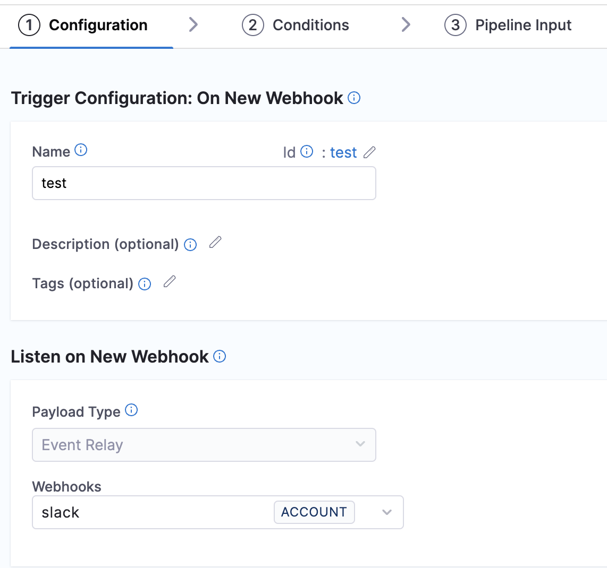

Trigger Pipelines Using Slack Events

You can trigger pipelines in response to Slack messages or events that match specific payload conditions you set up in a Harness trigger. For example, when a specific message is posted in a Slack channel or a particular event occurs, and your trigger settings match the payload conditions, a CI or CD pipeline can run.

Triggers enable event-driven CI/CD and support practices like building and/or deploying with every relevant Slack interaction.

:::important note

Currently this feature is behing the Feature Flag `CDS_EVENT_BRIDGE_WEBHOOK`. Please contact [Harness Support](mailto:support@harness.io) to enable this feature. 

:::

## Add a trigger to a pipeline

First, let’s configure a Slack webhook to create a trigger.

### Configure a webhook

Steps to Create a Slack Webhook

1. Go to **Account**/**Project** settings and click on **Webhook** under Resources.
2. Click on **New Webhook**.
3. Enter a **Name** for the webhook.
4. Select the type of the webhook. In this case, **Slack**.
5. For Auth type, we have two options
   **No Auth** if you have authentication to your source. no additional configuration is reqired.
   **HMAC** for Hash-Based Message Authentication Code authentication

Now, click on **Add** to save webhook.

The webhook is now created, click on the webhook you created earlier and copy the **Webhook URL** provided.

### Configure a trigger

To link this webhook to trigger your pipeline, navigate to the pipeline for which this webhook will be used.

1. Select **Triggers** in the top right corner of the page.
2. Click on **New Trigger** and select **Event Bridge**.

3. On the configurations page, provide a **Name** for the webhook.
4. Under **Listen on New Webhook**, **Event Bridge** is selected by default for **Payload Type**. When selecting Webhooks, a pop-up page will display all the configured Generic and Slack webhooks.

Select the Slack webhook you created earlier.

Click on **Continue**.

5. In the **Conditions** page, give the approproate **Header Conditions** and **Payload Conditions**.
Click on **Continue**.

6. In the **Pipeline Input** page, you can provide any Pipeline input variables as per your requirement.
Click on **Create Trigger**

### Configure Slack with the Webhook

This section explains how to configure Slack with your webhook to enable real-time notifications. Follow these steps to integrate the webhook and set it up for bot events in your chosen channel

1. Navigate to your Slack account.
2. Under Settings, go to **Event Subscriptions**. 
3. Turn on **Enable Events**
4. In the **Webhook URL** field, paste the webhook URL you configured earlier. The URL will be auto-verified to ensure it's valid. 
5. After the URL is verified, configure the webhook under the **Subscribe to Bot Events** section.
6. Add the desired channel.

Now that Slack is configured, any relevant Slack event in the configured channel will trigger the pipeline.