import Variables from '/docs/platform/shared/variables-not-supported.md'

You can trigger pipelines in response to Git events that match specific payload conditions you set up in a Harness trigger. For example, when a pull request or push event occurs on a Git repo and your trigger settings match the payload conditions, a CI or CD pipeline can run.

Triggers enable event-driven CI/CD and support the practice of every commit building and/or deploying to a target environment.

This topic demonstrates how to create a trigger for GitHub payload conditions. It shows how to use **Conditions** settings to create a highly-specific trigger; however **Conditions** are optional, and you can create simple triggers that respond to, for example, any Pull Request activity on a certain repo. For information about triggers settings, go to the [Triggers reference](./triggers-reference.md). For information about the Harness Git Experience, go to the [Harness Git Experience Overview](../git-experience/git-experience-overview.md)

:::info

Currently, Harness supports Git-based triggers for the most common Git providers. You can use a [Custom Trigger](./trigger-deployments-using-custom-triggers.md) for other repo providers.

:::

:::info

With [Harness RBAC](../role-based-access-control/rbac-in-harness.md), you can control who can create and use triggers _within Harness_, but you must use your Git provider's RBAC to control who can initiate the Git events that start your Harness Git event triggers.

:::

<Variables />

<details>
<summary>Video summary</summary>

Here's a two minute video showing you how to create and run a Trigger in response to Git events.

<!-- Video:
https://www.youtube.com/watch?v=y8s351IJLXw-->
<DocVideo src="https://www.youtube.com/watch?v=y8s351IJLXw" />

</details>

## Add a trigger to a pipeline

These steps assume you're familiar with [creating CD pipelines](/docs/continuous-delivery/deploy-srv-diff-platforms/kubernetes/kubernetes-cd-quickstart) or [creating CI pipelines](../../continuous-integration/use-ci/prep-ci-pipeline-components.md). Your pipeline must have a [default codebase](/docs/continuous-integration/use-ci/codebase-configuration/create-and-configure-a-codebase/#configure-the-default-codebase) for the trigger to listen on.

1. Go to your pipeline in Harness.
2. Select **Triggers** in the Pipeline Studio header.
3. Select **New Trigger**.
4. Choose the trigger type for your SCM provider. For unsupported Git providers, you can [create a Custom trigger](./trigger-deployments-using-custom-triggers.md).

### Configure the trigger

:::warning

All triggers in a Harness account have the same URL: `https://app.harness.io/gateway/ng/api/webhook?accountIdentifier=ACCOUNT_ID`. This means that you must set up your trigger conditions carefully to ensure that triggers start pipelines for relevant events only.

:::

1. On the trigger's **Configuration** tab, enter a **Name** and **Description**.
2. **Payload Type** is automatically populated based on the selected SCM provider.
3. For **Connector**, select a [code repo connector](/docs/category/code-repo-connectors) for your SCM provider.

   - A connector is required for all Git trigger types except **Custom** and **Harness Code**. In the connector's **Credentials** settings, make sure API access is enabled and that the token has the [required permissions](#code-repo-connector-permissions-for-webhook-triggers).
   - For **Custom** triggers, you must set up the external tool to send payloads to to the trigger URL. Refer to your tool's documentation for instructions on sending payloads.

4. For **Event**, select a [Git event type](./triggers-reference.md#event-and-actions), and, if required, select one or more **Actions**.
5. Configure additional settings, such as **Auto-abort Previous Execution**, **Configure Secret**, and **Polling Frequency**, according to your desired trigger configuration.

For details on trigger settings, go to the [Triggers reference](./triggers-reference.md).

#### Code repo connector permissions for webhook triggers

Git event webhook triggers require specific permissions in the connector:

- The user account you use to create the token must have the permission to configure repo webhooks in your Git provider.
- The personal access token used for [code repo connector authentication](/docs/platform/connectors/code-repositories/connect-to-code-repo/#code-repo-connector-permissions-and-access) must have the appropriate permissions scopes depending on the Git provider.

For example, for GitHub, you must be a repo admin and the GitHub personal access token used in the [GitHub connector's credentials](/docs/platform/connectors/code-repositories/ref-source-repo-provider/git-hub-connector-settings-reference/#credentials-settings) must have all `repo`, `user`, and `admin:repo_hook` scopes.

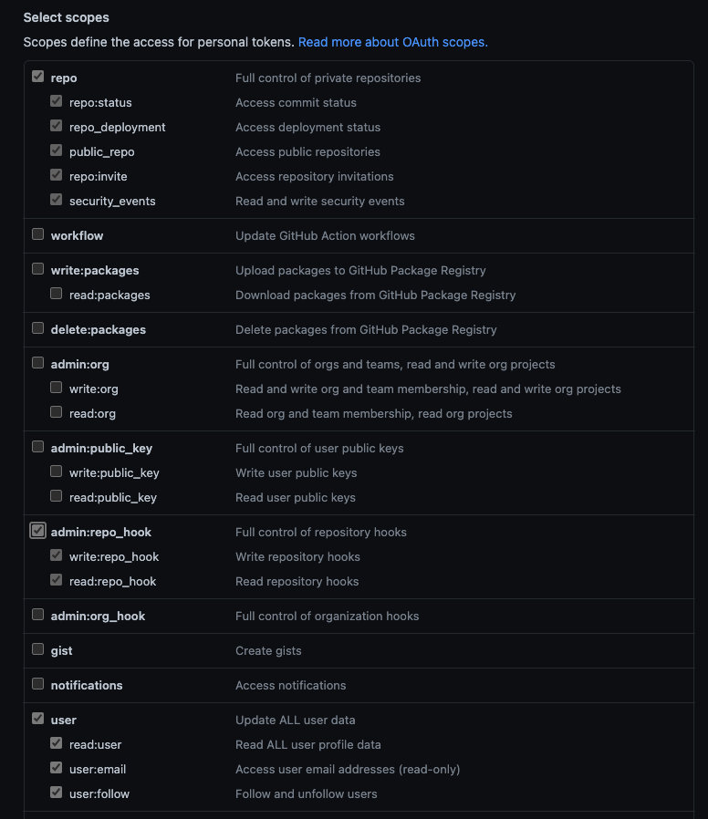

For information about other provider's token scopes, go to:

- [GitLab - Personal access token scopes](https://docs.gitlab.com/ee/user/profile/personal_access_tokens.html#personal-access-token-scopes)
- [Bitbucket Cloud - Repository access token permissions](https://support.atlassian.com/bitbucket-cloud/docs/repository-access-token-permissions/)
- [AWS - Permissions for actions on triggers](https://docs.aws.amazon.com/codecommit/latest/userguide/auth-and-access-control-permissions-reference.html#aa-triggers)

### Set trigger conditions

**Conditions** specify additional trigger criteria beyond the **Event** and **Actions**. Conditions are optional, but they are necessary if you want to create specific, limited-scope triggers. Conditions can use Harness built-in expressions for accessing trigger settings, Git payload data, and headers.

Here are some examples of trigger conditions:

- Trigger a pipeline when a specific value is passed in the source payload.
- Trigger a pipeline when there's a change in a specific file or a pull request.
- Trigger a pipeline based on a specific artifact tag convention.
- Trigger a pipeline if the source or target branch in the Git event matches a specified pattern.
- Trigger a pipeline if there are file changes in specific directories in the Git repo (This is useful when working with a mono-repository; it ensures that pipelines only run in response to certain changes, rather than every change).

:::info Conditions are cumulative

Triggers are like complex filters in which the **Conditions** are `AND`-ed together. To execute a trigger, the event payload must match _all_ trigger conditions.

For example, the configuration in the following image requires that the event match all conditions for **Source Branch**, **Target Branch**, **Changed Files**, **Header Conditions**, **Payload Conditions**, and **JEXL Condition** to activate the trigger.

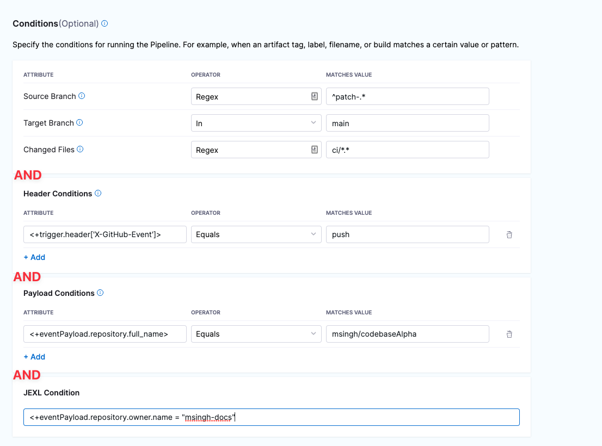

If you want a trigger that uses `OR`, `NOT`, or other operators across the payload, define only a **JEXL Condition** and leave the other conditions empty (unless you want to `AND` them to your JEXL condition).

:::

Some information about **Conditions** is provided in the following sections. For much more detail on **Conditions**, including **Operators**, go to the [Triggers reference](./triggers-reference.md).

<details>
<summary>Branches and Changed Files</summary>

You can configure triggers based on the source branches, target branches, and changed files involved in a Git event.

If you want to specify multiple paths, use the **Regex** operator. You can also use a Regex to specify all files in a parent folder, such as `ci/.*`. This is shown in the **Changed Files** row in the following screenshot.

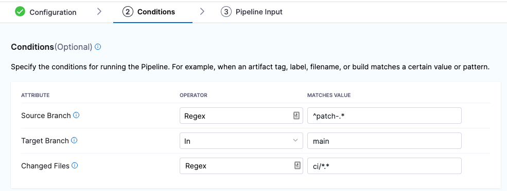

For more information about **Attributes**, **Operators**, **Matching Values**, and **Conditions**, go to the [Triggers reference](./triggers-reference.md).

</details>

<details>
<summary>Header Conditions</summary>

In **Header Conditions**, define attributes for Git webhook header data and corresponding values to match.

In the **Attribute** field, the header expression format is `<+trigger.header['key-name']>`, such as `<+trigger.header['X-GitHub-Event']>`.

For more information about **Attributes**, **Operators**, **Matching Values**, and **Header Conditions**, go to the [Triggers reference](./triggers-reference.md).

</details>

<details>
<summary>Payload Conditions</summary>

CThese conditions are based on the values of the webhook's JSON payload. Harness treats the JSON payload as a data model and parses the payload and listens for events on a JSON payload key.

To reference payload values, you use `<+eventPayload.[path-to-key-name]`, for example `<+eventPayload.repository.full_name>`.

For more information about **Attributes**, **Operators**, **Matching Values**, and **Payload Conditions**, go to the [Triggers reference](./triggers-reference.md).

</details>

<details>
<summary>JEXL Condition</summary>

You can refer to payload data and headers using [JEXL expressions](https://commons.apache.org/proper/commons-jexl/reference/syntax.html). That includes all constants, methods, and operators in [JexlOperator](https://commons.apache.org/proper/commons-jexl/apidocs/org/apache/commons/jexl3/JexlOperator.html).

Be careful when you combine Harness variables and JEXL expressions:

- **Invalid expression format:** `<+pipeline.variables.MAGIC.toLowerCase()>`
  - This expression is ambiguous. It could be evaluated as a Harness variable (return the value of variable `pipeline.variables.MAGIC.toLowerCase()`) or as a JEXL operation (return the lowercase of literal string `pipeline.variables.MAGIC`).
- **Valid expression format:** `<+<+pipeline.variables.MAGIC>.toLowerCase()>`
  - First, this expression gets the value of the variable `pipeline.variables.MAGIC`, and then it returns the value converted to all lowercase.

Here are some examples of valid combined JEXL and Harness expressions:

- `<+trigger.payload.pull_request.diff_url>.contains("triggerNgDemo")`
- `<+trigger.payload.pull_request.diff_url>.contains("triggerNgDemo") || <+trigger.payload.repository.owner.name> == "wings-software"`
- `<+trigger.payload.pull_request.diff_url>.contains("triggerNgDemo") && (<+trigger.payload.repository.owner.name> == "wings-software" || <+trigger.payload.repository.owner.name> == "harness")`

For more information about **Attributes**, **Operators**, **Matching Values**, and **JEXL Conditions**, go to the [Triggers reference](./triggers-reference.md).

</details>

### Set pipeline input

Pipelines often have [runtime inputs](../variables-and-expressions/runtime-inputs.md), such as codebase branch names or artifact versions and tags.

1. Provide values for the inputs or use [input sets](../pipelines/input-sets.md).

   Any time you change the settings that require runtime input in the pipeline, you must also update the pipeline inputs in the trigger. If the trigger doesn't have a value for a runtime input, then the pipeline can fail due to the missing value.

2. Select **Create Trigger** to save your trigger.

The trigger is added to the triggers page. The last step in trigger set up is [webhook registration](#register-the-webhook-in-the-git-provider).

### Register the webhook in the Git provider

For all Git providers supported by Harness, non-custom webhooks are automatically created in the repo. For details about automatically-registered Git events, go to the [Triggers reference](./triggers-reference.md).

However, if [automatic registration fails](#common-causes-of-webhook-registration-failure) or you created a custom webhook, you must manually copy the webhook URL and add it to your repo webhooks.

1. Go to your pipeline in Harness and select **Triggers**.
2. Select your custom webhook.
3. Select the link icon to copy the webhook URL.

   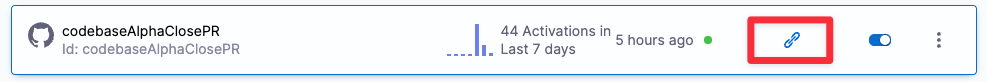

4. Log in to your repo in your SCM provider and navigate to the repo's webhook settings.
5. Create a new webhook and paste the webhook URL you copied from Harness.
6. Make sure that the content type for outbound requests is **Application/json**.
7. Make sure that **Enable verification** is enabled.
8. Select the events that you would like to trigger this webhook. The following example selected **Just the push event**, which means that this webhook is only triggered if there is a push event.
9. Select **Update webhook**.

   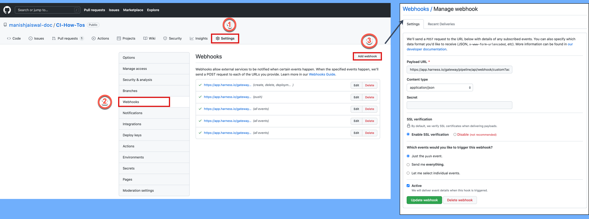

For more information about manual webhook registration, go to the [Triggers reference](./triggers-reference.md).

:::info

In general, ensure that multiple webhooks are not registered for the same event type for the same repo. This can trigger multiple builds or deployments for a single occurrence of an event.

For GitLab repos, ensure that no more than 20 webhooks are registered for a single GitLab repo to prevent multiple pipeline executions. Otherwise, Harness registers a webhook each time a GitLab trigger is updated or created with that repository, and it can result in redundant pipeline executions.

:::

### Test the trigger

To test the trigger, make (and push) a change in your repo. If you created a Pull Request (or similar) trigger, you'll also need to create a Pull Request.

In your Git repo, you can see that the request and response were successful.

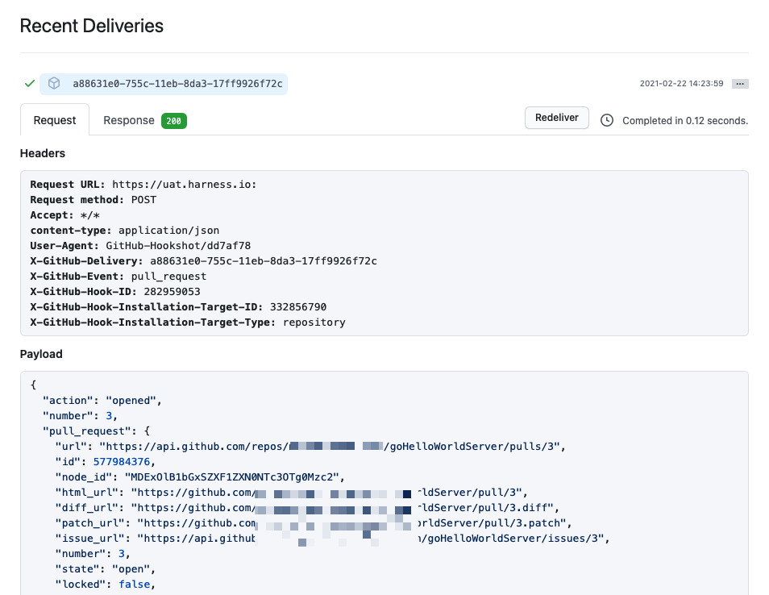

Note that if you specified [Conditions](#set-trigger-conditions) the payload data must match your conditions to activate the trigger.

In Harness, view the **Pipeline execution**. In Harness CI, click **Builds** (1). You can see the source branch (2), target branch (3), and the pull request comment and number (4).

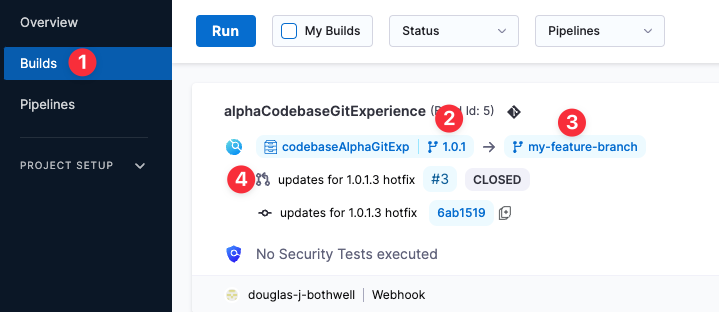

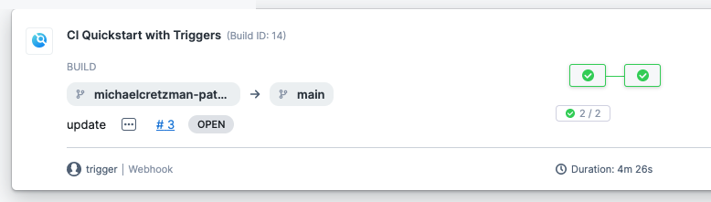

Select the pull request number to go to your repo at the pull request event.

On the list of triggers for a pipeline, you can see when each trigger was last activated.

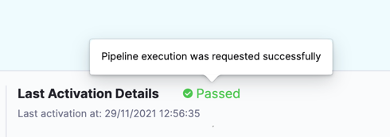

**Activation** means the trigger was able to _request_ pipeline execution; it doesn't mean that the webhook didn't work.

**Failed** usually means the pipeline has a configuration issue that prevented the trigger from initiating a pipeline.

## Trigger type expression

You can use the Harness expression `<+pipeline.triggerType>` to get information about how a pipeline was executed or to create conditional execution conditions that react to specific trigger types.

### Echo the trigger type

To echo the expression in step logs, use a command like:

```
echo "pipeline.triggerType: " <+pipeline.triggerType>
```

If the pipeline was run manually, the `<+pipeline.triggerType>` expression resolves to `MANUAL`. If the pipeline was run by a webhook trigger, the expression resolves to `WEBHOOK`. For example:

```
pipeline.triggerType:  WEBHOOK
```

### Null comparisons

You can create JEXL comparisons with trigger expressions.

For example, here's an example that uses the `?` ternary operator in a JEXL expression. This ternary operator takes three operands: a Boolean expression and two values or expressions that are evaluated based on the Boolean expression.

:::info

The ternary operator is also known as the conditional operator because it evaluates a Boolean expression and returns one of two possible values, depending on whether the expression is true or false.

:::

In the following example, the `<+pipeline.triggerType>` expression is used to determine how the pipeline run started. Then, if the expression evaluates to `WEBHOOK` (`true`), Harness resolves the expression `<+trigger.commitSha>` to print the commit SHA that initiated the trigger. If the `triggerType` expression isn't `WEBHOOK` (`false`), Harness resolves the expression `<+pipeline.executionId` to print the pipeline execution identifier instead.

```
echo <+<+pipeline.triggerType> == "WEBHOOK" ? <+trigger.commitSha>:<+pipeline.executionId>>
```

Similarly, you can create logic for the `MANUAL` trigger type value:

```
echo <+<+pipeline.triggerType> == "MANUAL" ? <+pipeline.executionId>:<+trigger.commitSha>>
```

<details>
<summary>YAML example: Pipeline with trigger expressions comparisons</summary>

This pipeline demonstrates usage of JEXL comparisons with trigger type expressions.

```yaml
pipeline:
  name: Trigger
  identifier: Trigger
  projectIdentifier: CD_Docs
  orgIdentifier: default
  tags: {}
  stages:
    - stage:
        name: Custom
        identifier: Custom
        description: ""
        type: Custom
        spec:
          execution:
            steps:
              - step:
                  type: ShellScript
                  name: Echo
                  identifier: Echo
                  spec:
                    shell: Bash
                    onDelegate: true
                    source:
                      type: Inline
                      spec:
                        script: |-
                          echo "pipeline.triggerType: " <+pipeline.triggerType>
                          echo "pipeline.executionId: " <+pipeline.executionId>
                          echo "trigger.commitSha: " <+trigger.commitSha>
                    environmentVariables: []
                    outputVariables: []
                  timeout: 10m
              - step:
                  type: ShellScript
                  name: Triggered by WEBHOOK
                  identifier: Comparison_2
                  spec:
                    shell: Bash
                    onDelegate: true
                    source:
                      type: Inline
                      spec:
                        script: echo <+<+pipeline.triggerType> == "WEBHOOK" ? <+trigger.commitSha>:<+pipeline.executionId>>
                    environmentVariables: []
                    outputVariables: []
                  timeout: 10m
              - step:
                  type: ShellScript
                  name: Triggered by MANUAL
                  identifier: Comparison
                  spec:
                    shell: Bash
                    onDelegate: true
                    source:
                      type: Inline
                      spec:
                        script: echo <+<+pipeline.triggerType> == "MANUAL" ? <+pipeline.executionId>:<+trigger.commitSha>>
                    environmentVariables: []
                    outputVariables: []
                  timeout: 10m
        tags: {}
```

</details>

## GitHub merge queue triggers

[GitHub's merge queue feature](https://github.blog/2023-07-12-github-merge-queue-is-generally-available/) is compatible with Harness webhook triggers. Use the following settings to configure a merge queue trigger:

- Trigger type: GitHub webhook
- [Payload Type](/docs/platform/triggers/triggers-reference/#payload-type): GitHub.
- [Connector](/docs/platform/triggers/triggers-reference/#connector): Your Harness GitHub connector.
- [Event](/docs/platform/triggers/triggers-reference#event-and-actions): Push.
- [Conditions](/docs/platform/triggers/triggers-reference/#conditions-settings): Configure conditions that detect branches with the GitHub temporary merge queue branch name prefix (`gh-readonly-queue`) and a non-empty commit SHA for that branch. The [Harness expression](/docs/platform/triggers/triggers-reference/#reference-payload-fields) `<+trigger.payload.head_commit>` gets the commit SHA from the webhook payload for the temporary merge queue branch push event.
  - [Branch Condition](/docs/platform/triggers/triggers-reference/#branch-and-changed-files-conditions): **Branch Name** **Starts With** `gh-readonly-queue`.
  - [Payload Condition](/docs/platform/triggers/triggers-reference/#payload-conditions): `<+trigger.payload.head_commit>` **Not Equals** `null`.

Here is a YAML example of a webhook trigger configured for the GitHub merge queue:

```yaml
trigger:
  name: merge queue trigger
  identifier: merge_queue_trigger
  enabled: true
  stagesToExecute: []
  description: ""
  tags: {}
  encryptedWebhookSecretIdentifier: ""
  orgIdentifier: default
  projectIdentifier: YOUR_HARNESS_PROJECT
  pipelineIdentifier: YOUR_PIPELINE_TO_TRIGGER
  source:
    type: Webhook
    spec:
      type: Github
      spec:
        type: Push
        spec:
          connectorRef: YOUR_GITHUB_CONNECTOR
          autoAbortPreviousExecutions: false
          payloadConditions:
            - key: targetBranch
              operator: StartsWith
              value: gh-readonly-queue
            - key: <+trigger.payload.head_commit>
              operator: NotEquals
              value: "null"
          headerConditions: []
          repoName: YOUR_GITHUB_REPO
          actions: []
  inputYaml: |
    pipeline:
      identifier: YOUR_PIPELINE_TO_TRIGGER
      properties:
        ci:
          codebase:
            build:
              type: branch
              spec:
                branch: <+trigger.branch>
```

:::info note
For UI to render the branch name at the top of the pipeline executions, we must configure codebase in the pipeline. The codebase is responsible for rendering the branch name, PR message and PR link on the UI. In the UI, the PR link, PR message and branch are displayed for Harness Builds(CI) and it is not applicable for other modules.
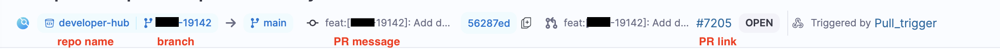
:::

## Executions

:::important note
Currently this feature is behing the Feature Flag `PIPE_FILTER_EXECUTIONS_BY_GIT_EVENTS`. Please contact [Harness Support](mailto:support@harness.io) to enable this feature. 
:::

The **My Executions** filter on the listing page displays both manual executions and those triggered automatically by Git pull requests (PRs) i.e execution executed by their Githib PRs as well as manually execution pipeline execution will appear in the My Execution list. 

### Pre-Requisite 

In order to list the execution triggered by Github PRs, user must be link their Github Provider Account in the User Profile Page.

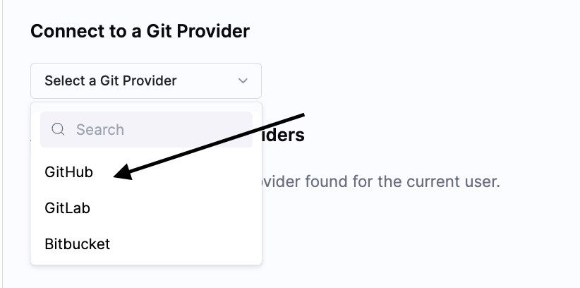

1. Select **Github** and click on the **Connect** button.
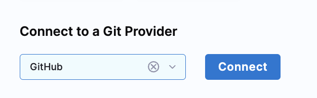
2. When you click on Github it will take you to **Sign In** page of Github.
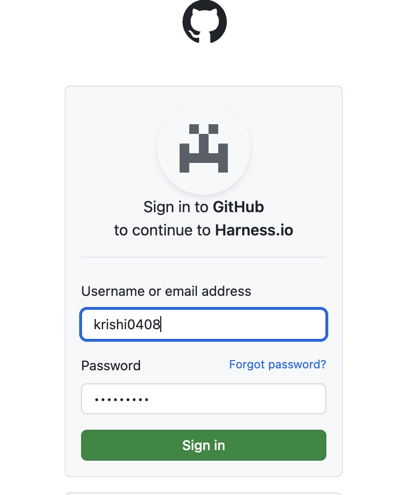
3. Sign in to your Github account and authorize **Harness.io**.
Once done you will see **Oauth Configured successfully** in the profile page along with your Github account username under **Access token for Git Providers**
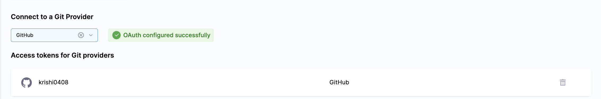

Once done, when you execute your pipeline via a Github trigger that is triggered by Github PR you will see executions listed under **My Execution** in the Execution Page.


## Troubleshoot Git event triggers

### Pipelines don't start after trigger events

If a pipeline doesn't start in response to an incoming event, do the following:

- Check the execution history (select **Execution History** in the top right of the Pipeline Studio).
- Verify that the runtime inputs are correct.
- Check the payloads sent from the Git provider and compare the relevant fields with your trigger conditions. For example, in GitHub you can view the full payload of each event sent from a specific webhook.
- If you are using a self-hosted Git server, check to be sure your server can make HTTPS requests to the Harness Git webhooks URL `https://app.harness.io/gateway/ng/api/webhook`.

### Common causes of Webhook registration failure

[Webhook registration](#register-the-webhook-in-the-git-provider) is immediate but the **Triggers** page in Harness doesn't refresh immediately. First, refresh the page to see if the webhook registered successfully.

If you see **Webhook registration failed**, here are the common causes:

- The specified repository doesn't exist. Check the repository name in the trigger settings or the code repo connector.
- The token in the code repo connector doesn't have the required permissions. Make sure the token has the [required permissions for Git event triggers](#code-repo-connector-permissions-for-webhook-triggers). If you use SAML SSO in your Git provider, make sure the token is authorized for SAML SSO.
- The connector doesn't have API access. Check the connector configuration to confirm that the **Enable API access** option is selected. Use the same token you used for the connector's credentials for API access authentication.

After addressing one or more of the above issues, edit the trigger in Harness, select **Continue** to navigate through the settings, and then select **Update Trigger** to reattempt webhook registration. Then, refresh the **Triggers** page again to verify that the webhook was registered.

If registration fails and none of the above conditions apply, try [manually registering the webhook](#register-the-webhook-in-the-git-provider).

### Pipeline fails with "couldn't find remote ref" when triggered from a Bitbucket forked repo PR

<!-- this section is referenced on triggers-reference.md -->

Currently, CI pipeline webhook triggers don't support PRs that are attempting to merge changes from a Bitbucket forked repo into the original, base repo. This applies only to Bitbucket repos when attempting to merge a fork back into the base repo and the base repo is set as the pipeline's codebase. Although the trigger initiates, the pipeline fails with `couldn't find remote ref`. This issue occurs due to the Bitbucket PR reference URL format.

### Pipeline with a PR Event Trigger and an On Push Trigger fires the pipeline execution twice

You can configure multiple triggers for the same pipeline. By scoping the action events, you can ensure that the pipeline only runs for a particular trigger scenario. The Push trigger and PR trigger can overlap because they listen on similar events. Below are the required events for the PR to ensure there is no overlap with the Push trigger.

**Pull Request Actions**

- Edit
- Open
- ReOpen
- Label
- Unlabel
- Ready for Review

Leave out by the `synchronize` and `close` events from the event selection. These events cause both triggers to execute the pipeline.

### OAuth misconfiguration caused trigger creation failure

When connecting to Git, if your organization has enabled OAuth App access restrictions, then you might receive an error like `Although you appear to have the correct authorization credentials, <your-org> organization has enabled OAuth App access restrictions, meaning that data access to third-parties is limited`. 

If you receive this error, it likely means you have not integrated [OAuth with Git Experience](/docs/platform/git-experience/oauth-integration) in Harness.
For more information, go to [Harness Git Experience Overview](/docs/platform/git-experience/git-experience-overview).


## Skipping CI/CD Pipeline Builds

:::info note
Currently, this functionality is behind the feature flag `CDS_SKIP_WEBHOOK_TRIGGER_EXECUTION_ON_SPECIAL_KEYWORD`. Contact [Harness Support](mailto:support@harness.io) to enable the feature
::: 

You can skip CI/CD pipeline builds based on specified keywords within commit messages. It ensures that builds are triggered only when necessary, enhancing efficiency in development workflows.

### Usage

To skip a build, include one of the following keywords in the commit message:

- [skip ci]
- [ci skip]
- [skip pipeline]
- [pipeline skip]
- [no_ci]

### Text Position

The keywords must appear anywhere within the commit message, even if surrounded by other text. For example, **This is a [ci skip] commit**.

### Supported Platforms

This functionality is applicable across various version control platforms, including:

- GitHub
- GitLab
- Bitbucket

### Events
The skipping mechanism operates for both **push** and **pull request** events in Git repositories.

