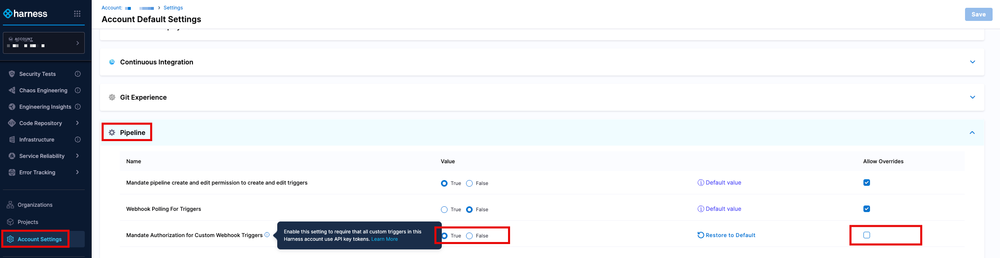
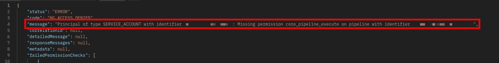
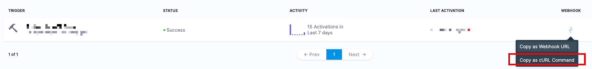

Harness has the capability of adding additional security to triggers by enforcing this security into generated API Tokens.  This topic covers how to add this enforcement to your triggers. Go to <a href="/docs/platform/automation/api/add-and-manage-api-keys">Manage API keys</a> to generate API tokens for users and service accounts.

Users who attempt to access the trigger without an API key declared, will be provided the following error message:

```
{
  "status": "ERROR",
  "code": "INVALID_REQUEST",
  "message": "Invalid request: Authorization is mandatory for custom triggers in px7xd_BFRCi-pfWPYXVjvw:default:Docs. Please add X-Api-Key header in the request",
  "correlationId": "465d6463-152b-4211-8cb5-6bcc2538afa8",
  "detailedMessage": null,
  "responseMessages": [
    {
      "code": "INVALID_REQUEST",
      "level": "ERROR",
      "message": "Invalid request: Authorization is mandatory for custom triggers in px7xd_BFRCi-pfWPYXVjvw:default:Docs. Please add X-Api-Key header in the request",
      "exception": null,
      "failureTypes": []
    }
  ],
  "metadata": null
}
```

## Requirements

Make sure you have:
* An account (service or user) <a href="/docs/platform/automation/api/add-and-manage-api-keys">API key</a>.

## Mandate Authorization in Default Settings
Customers can set the following authorization on the Account, Organization, or Project level. 

1. Go to the appropriate setting for the scope (in this example, **Account Settings**)
2. Click on the **Default Settings** and go to the **Pipeline** section
3. In the section, there is a setting labelled *Mandate Authroization for Custom Webhook Triggers*.  Set this to True.
   
4. When the Allow Overrides box is selected at the account level, Harness users will be able to select a different value for this setting at project level.  For example a project, in Default Settings > Pipeline may have a a different value for Mandate Authorization for Custom Webhook Triggers, when compared to the Account or Organization settings.
Remove the ability to **override** this setting to ensure that the authorization is enforced and cannot be adjusted.


## Set up appropriate RBAC Permissions for the API Key
The account (service or user) must have enough permissions to perform the actions.  If permissions are not set properly, Harness will advise about the lack of access due to missing permissions.  Administrators should generally need to provide  access for the pipeline, the services, and the environment.

Go to <a href="/docs/platform/role-based-access-control/rbac-in-harness">RBAC in Harness</a> to set appropriate permissions.

   

## Set up the appropriate Custom Trigger for the pipeline
Go to <a href="/docs/platform/triggers/trigger-deployments-using-custom-triggers">Trigger deployments using custom triggers</a> to set up your custom trigger.

It is highly recommended that teams test their Custom Trigger settings to ensure the appropriate amount of access has been provided to the accounts in question.  This can be accomplished by cURLing the webhook and utilizing the appropriate API token
   

Pass the API key in the `X-Api-Key` header of the webhook request, as shown in the following example. Replace `{customWebhookToken}` and the identifier values with the values from your copied cURL command, and replace `pat.<YOUR_PAT>` with your API token.

```
curl -X \
curl -X POST \
 -H 'content-type: application/json' \
 -H 'X-Api-Key: pat.<YOUR_PAT>' \
 --url 'https://app.harness.io/gateway/pipeline/api/webhook/custom/{customWebhookToken}/v3?accountIdentifier=px7xd_BFRCi-pfWPYXVjvw&orgIdentifier=default&projectIdentifier=Docs&pipelineIdentifier=Custom&triggerIdentifier=Custom' \
 -d '{"sample_key": "sample_value"}'

Authorization is only supported for `/v3` webhook endpoints. Go to <a href="/docs/platform/triggers/trigger-deployments-using-custom-triggers#custom-trigger-authorization-using-api-keys">Custom trigger authorization using API keys</a> for the full authorization workflow.