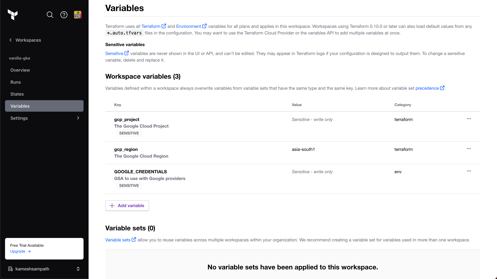
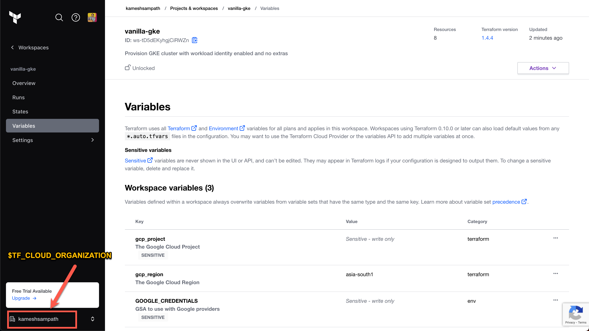
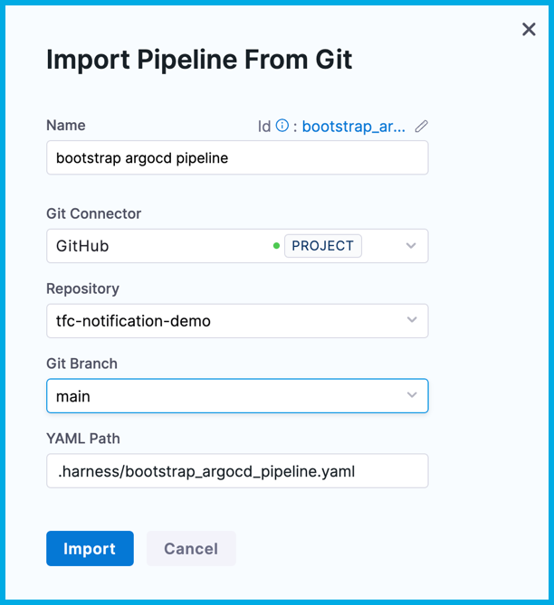
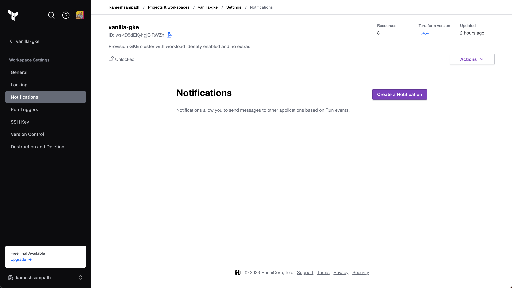
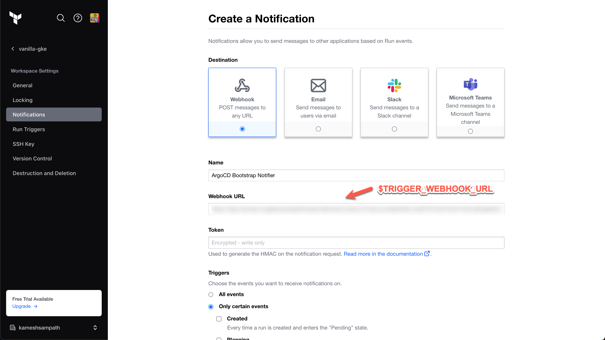

Harness CI/CD pipelines can deploy artifacts to a target infrastructure. Modern day architecture uses automation tools, like [Terraform](https://terraform.io) or [Ansible](https://www.ansible.com/), to provision the target infrastructure. This type of provisioning is called [infrastructure-as-code (IaC)](https://en.wikipedia.org/wiki/Infrastructure_as_code).

Usually CI/CD and IaC don't run in tandem. Often, the CI pipeline is triggered only when the target infrastructure is ready to bootstrap with software components that are required by CI/CD pipelines. This tutorial users a custom trigger to address the following use case:

*As CI/CD user, I want to provision a Kubernetes cluster on Google Cloud Platform (GKE) using Terraform. When the cluster is successfully provisioned, trigger a CI pipeline to start bootstrapping [ArgoCD](https://argo-cd.readthedocs.io/en/stable/) on to GKE.*

<figure>


<figcaption>Architecture diagram of the use case addressed in this tutorial.</figcaption>
</figure>

## Prerequisites

In addition to a Harness account, you need the following accounts for this tutorial:

- A **GitHub account** where you can fork the tutorial repos.
- A [Terraform Cloud account](https://app.terraform.io/public/signup/account).
- A [Google Cloud account](https://cloud.google.com) where you can create a Google Kubernetes Engine (GKE) cluster.

## Clone code repositories

This tutorial uses the following Git repositories. Fork these repos, and then clone them to your local machine.

- IaC [vanilla-gke](https://github.com/harness-apps/vanilla-gke): The Terraform source repository used with Terraform Cloud to provision GKE. Code samples in this tutorial reference this repo by `$TFC_GKE_REPO`.
- Kubernetes manifests [bootstrap-argocd](https://github.com/harness-apps/bootstrap-argocd): This repository holds Kubernetes manifests to bootstrap ArgoCD on to the GKE cluster. Code samples in this tutorial reference this repo by `ARGOCD_BOOTSTRAP_REPO`.
- [tfc-notification-demo](https://github.com/harness-apps/tfc-notification-demo): Contains a sample pipeline for this tutorial. Code samples in this tutorial reference this repo by `$TFC_NOTIFICATION_DEMO`.

<details>
<summary>Fork and clone the tutorial repos</summary>

1. If you don't already have a Git command line tool on your machine, download the [GitHub CLI tool](https://cli.github.com/), and then add `gh` to your `$PATH`.
2. Create a directory for your tutorial repos, for example:

   ```shell
   mkdir -p "$HOME/tfc-notification-demo"
   cd "$HOME/tfc-notification-demo"
   export DEMO_HOME="$PWD"
   ```

3. Clone and fork the `vanilla-gke` repo, for example:

   ```shell
   gh repo clone harness-apps/vanilla-gke
   cd vanilla-gke
   gh repo fork
   export TFC_GKE_REPO="$PWD"
   ```

4. Clone and fork the `bootstrap-argocd` repo, for example:

   ```shell
   cd ..
   gh repo clone harness-apps/bootstrap-argocd
   cd bootstrap-argocd
   gh repo fork
   export ARGOCD_BOOTSTRAP_REPO="$PWD"
   ```

5. Clone and fork the `tfc-notification-demo` repo, for example:

   ```shell
   cd ..
   gh repo clone harness-apps/tfc-notification-demo
   cd tfc-notification-demo
   gh repo fork
   export TFC_NOTIFICATION_DEMO="$PWD"
   ```

</details>

## Create a Harness project

In Harness, create a project named `terraform_integration_demos`, and then go to the **Continuous Integration** module.

<details>
<summary>Create a project</summary>

1. Select **Projects**, select **All Projects**, and then select **New Project**.
2. For **Name**, enter `terraform_integration_demos`.
3. Leave the **Organization** as **default**.
4. Select **Save and Continue**.
5. On **Invite Collaborators**, you can add others to your project, if desired. You don't need to add yourself.
6. Select **Save and Continue**.
7. On the Modules page, select **Continuous Integration**, and then select **Go to Module**.

If the CI pipeline wizard starts after you select **Go to Module**, you'll need to exit the wizard to complete the next step in this tutorial, creating the GitHub connector.

</details>

## Create a GitHub connector

Harness uses connectors to connect to your Git repositories. You need a [GitHub connector](/docs/platform/connectors/code-repositories/ref-source-repo-provider/git-hub-connector-settings-reference) that can pull your forks of the [tutorial repos](#clone-code-repositories).

1. In the GitHub account where you forked the tutorial repos, [create a GitHub personal access token](https://docs.github.com/en/authentication/keeping-your-account-and-data-secure/creating-a-personal-access-token) with all `repo`, `admin:repo_hook`, and `user` scopes.

   For information about the token's purpose in Harness, go to the [GitHub connector settings reference](/docs/platform/connectors/code-repositories/ref-source-repo-provider/git-hub-connector-settings-reference#authentication).

2. Save the token as a [Harness text secret](/docs/platform/secrets/add-use-text-secrets) named `GITHUB_PAT`.
3. In your Harness `terraform_integration_demos` project, go to **Project Setup** and select **Connectors**.
4. Create a **GitHub code repository connector** configured as follows:
   * **Overview:** Enter a **Name** for the connector. **Description** and **Tags** are optional.
   * **Details:**
      * **URL Type:** Select **Account**.
      * **Connection Type:** Select **HTTP**.
      * **GitHub Account URL:** Enter the URL for the GitHub account where you forked the tutorial repos, such as `https://github.com/my-account`.
      * **Test Repository:** Enter the repo name for any repo in your GitHub account, such as `tfc-notification-demos`. This is only used to verify connectivity.

      

   * **Credentials:**
      * **Username:** Enter the username for the GitHub account where you forked the tutorial repos.
      * **Personal Access Token:** Select your `GITHUB_PAT` text secret.
      * **Enable API access:** Select this option and select the same personal access token secret.
   * **Select Connectivity Mode:** Select **Connect through the Harness Platform**.

5. Select **Save and Continue**, wait while Harness tests the connection, and then select **Finish**.

## Create a GSA key

You need Google Service Account (GSA) credentials, in JSON key format, to query your GKE cluster's details and create resources on it.

Run these commands in Cloud Shell. For more information, go to the Google Cloud documentation on [Exporting your Google Cloud resources to Terraform format](https://cloud.google.com/docs/terraform/resource-management/export).

1. Set the environment.

   ```shell
   export GCP_PROJECT=YOUR_GOOGLE_CLOUD_PROJECT_ID_WHERE_YOUR_GKE_CLUSTER_EXISTS
   export GSA_KEY_FILE=PATH/TO/STORE/KEY/FILE
   ```

2. Create the service account.

   ```shell
   gcloud iam service-accounts create gke-user \
     --description "GKE User" \
     --display-name "gke-user"
   ```

3. Configure the IAM policy binding. The service account must be able to provision Kubernetes resources.

   ```shell
   gcloud projects add-iam-policy-binding $GCP_PROJECT \
     --member="serviceAccount:$GSA_NAME@$GCP_PROJECT.iam.gserviceaccount.com" \
     --role="roles/container.admin"
   ```

4. Download and save the GSA key. The Google Cloud user you are using must have the Security Admin role to generate GSA keys.

   ```shell
   gcloud iam service-accounts keys create "${GSA_KEY_FILE}" \
       --iam-account="gke-user@${GCP_PROJECT}.iam.gserviceaccount.com"
   ```

5. In your Harness project, save the GSA key as a [Harness file secret](/docs/platform/secrets/add-file-secrets).

## Create a Terraform workspace

1. In your Terraform Cloud account, create a workspace called `vanilla-gke`.
2. Update the workspace settings to use Version Control and point to `$TFC_GKE_REPO`, which is the `vanilla-gke` [tutorial repo](#fork-and-clone-the-tutorial-repos).

   <!--  -->

   <DocImage path={require('./static/tfc-notif-trigger-3.png')} />

3. Configure the workspace with the following variables:

   | Key                  | Value                  | Category  |
   | -------------------- | ---------------------- | --------- |
   | `gcp_project`        | Sensitive - write only | terraform |
   | `gcp_region`         | Select a region        | terraform |
   | `GOOGLE_CREDENTIALS` | Sensitive - write only | env       |

   <!--  -->

   <DocImage path={require('./static/tfc-notif-trigger-4.png')} />

   `GOOGLE_CREDENTIALS` is a Google Service Account JSON key with permissions to create GKE clusters. Terraform uses this key to create the GKE cluster. When you add the key to your Terraform variables, it must be base64 encoded. For example, the following command encodes `YOUR_GOOGLE_CREDENTIALS_KEY_FILE` in base64 format:

   ```shell
   cat YOUR_GOOGLE_CREDENTIALS_KEY_FILE | tr -d \\n
   ```

   For required roles and permissions, go to the `vanilla-gke` tutorial repo documentation: [Prerequisites](https://github.com/harness-apps/vanilla-gke#pre-requisites).

   For more information, go to the `vanilla-gke` tutorial repo documentation: [Terraform Inputs](https://github.com/harness-apps/vanilla-gke#inputs).

4. Create a variable called `$TF_WORKSPACE` and set the value to the name of your Terraform Cloud organization.

   <!--  -->

   <DocImage path={require('./static/tfc-notif-trigger-5.png')} />

5. In your Terraform Cloud user settings, **Create an API token**. This token is used to pull outputs from Terraform runs.

   <!--  -->

   <DocImage path={require('./static/tfc-notif-trigger-6.png')} />

6. Save the API token to a variable named `$TF_TOKEN_app_terraform_io`. You will refer to this token in your Harness CI pipeline later in this tutorial.

## Create the pipeline

In Harness, import a premade pipeline from one of the [tutorial repos](#clone-code-repositories).

1. In Harness, go to your `terraform_integration_demos` project, and select **Pipelines**.
2. Select **Create a Pipeline**, select **Import From Git**, and complete the **Import Pipeline From Git** fields as follows:
   - **Name:** `bootstrap argocd pipeline`
   - **Git Connector:** Your [GitHub connector](#create-a-github-connector)
   - **Repository:** `tfc-notificaiton-demo`
   - **Git Branch:** `main`
   - **YAML Path:** `.harness/bootstrap_argocd_pipeline.yaml`



3. Select **Import**.

### Add secrets to the pipeline

1. On the list of pipelines, select the **bootstrap argocd pipeline**, and then select the **Bootstrap Argo CD** stage.

   <!--  -->

   <DocImage path={require('./static/tfc-notif-trigger-8.png')} />

2. Select each step to examine its configuration. Notice that the pipeline uses the following secrets, which need to be populated:

   - `google_application_credentials`: The GSA credentials to manipulate GKE
   - `terraform_cloud_api_token`: The value of `$TF_TOKEN_app_terraform_io`
   - `terraform_workspace`: The value of `$TF_WORKSPACE`
   - `terraform_cloud_organization`: The value of `$TF_CLOUD_ORGANIZATION`

3. To populate these values, add [Harness text secrets](/docs/platform/secrets/add-use-text-secrets) for `terraform_cloud_api_token`, `terraform_workspace` and `terraform_cloud_organization`.

   Make sure the secret names are exact, or the pipeline will fail.

   You added the `google_application_credentials` secret earlier in the tutorial.

   <!--  -->

   <DocImage path={require('./static/tfc-notif-trigger-9.png')} />

:::tip

Alternately, you can extract the values for `terraform_workspace` and `terraform_cloud_organization` from the [trigger](#add-the-trigger) webhook payload by replacing their `<+secret>` expressions with the expressions `<+trigger.payload.workspace_name>` and `<+trigger.payload.organization_name>` respectively.

:::

### Add the trigger

For the pipeline to listen for Terraform Cloud events, you must [add a custom webhook trigger](/docs/platform/Triggers/trigger-deployments-using-custom-triggers).

1. In Harness, go to your **bootstrap argocd pipeline**, and then select **Triggers** in the header.
2. Select **Add New Trigger**, and select the **Custom** trigger type under **Webhook**.

   <!--  -->

   <DocImage path={require('./static/tfc-notif-trigger-10.png')} />

3. On the **Configuration** tab, enter `tfc notification` for the **Name**, and then select **Continue**.

   <!--  -->

   <DocImage path={require('./static/tfc-notif-trigger-11.png')} />

4. Don't change the **Conditions** tab. Select **Continue**.
5. On the **Pipeline Input** tab, enter `main` for **Pipeline Reference Branch**.

   This field is required to create the trigger; however, it doesn't have any relevance to this tutorial, because this pipeline manually clones code repos.

   <!--  -->

   <DocImage path={require('./static/tfc-notif-trigger-12.png')} />

6. Select **Create Trigger**.
7. On the list of triggers, select the icon in the **Webhook** column, and then select **Copy as Webhook URL**. This value is referred to as `$TRIGGER_WEBHOOK_URL` in the rest of this tutorial.

   <!--  -->

   <DocImage path={require('./static/tfc-notif-trigger-13.png')} />

8. In your Terraform Cloud workspace, go to the notification settings, and select **Create a Notification**.

   <!--  -->

   <DocImage path={require('./static/tfc-notif-trigger-14.png')} />

9. Configure the notification as follows:

   * **Destination:** Select **Webhook**.
   * **Name:** Enter `ArgoCD Bootstrap Notifier`.
   * **Webhook URL:** Enter your custom webhook trigger URL.
   * **Triggers:** Select **Only certain events**, and then select **Completed**. This ensures the pipeline only runs when events are successfully completed.

   <!--  -->

   <DocImage path={require('./static/tfc-notif-trigger-16.png')} />

10. Select **Create Notification**. Creating the notification triggers a notification event. If the cluster is not ready yet, the pipeline fails. You can select **Send a test** to reattempt the trigger.

   <!--  -->

   <DocImage path={require('./static/tfc-notif-trigger-18.png')} />

## Summary

This pipeline is now configured to listen for notifications of IaC events from Terraform, and the pipeline only runs when it's necessary. Specifically in this pipeline, any changes to the `$TFC_GKE_REPO` trigger a _plan and apply_ on Terraform Cloud. A _completed_ plan triggers the `bootstrap argocd pipeline` to run and apply the manifests from `$BOOTSTRAP_ARGOCD_REPO` on the GKE cluster.

Here's an example of logs from a successful run:

<!--  -->

<DocImage path={require('./static/tfc-notif-trigger-19.png')} />
