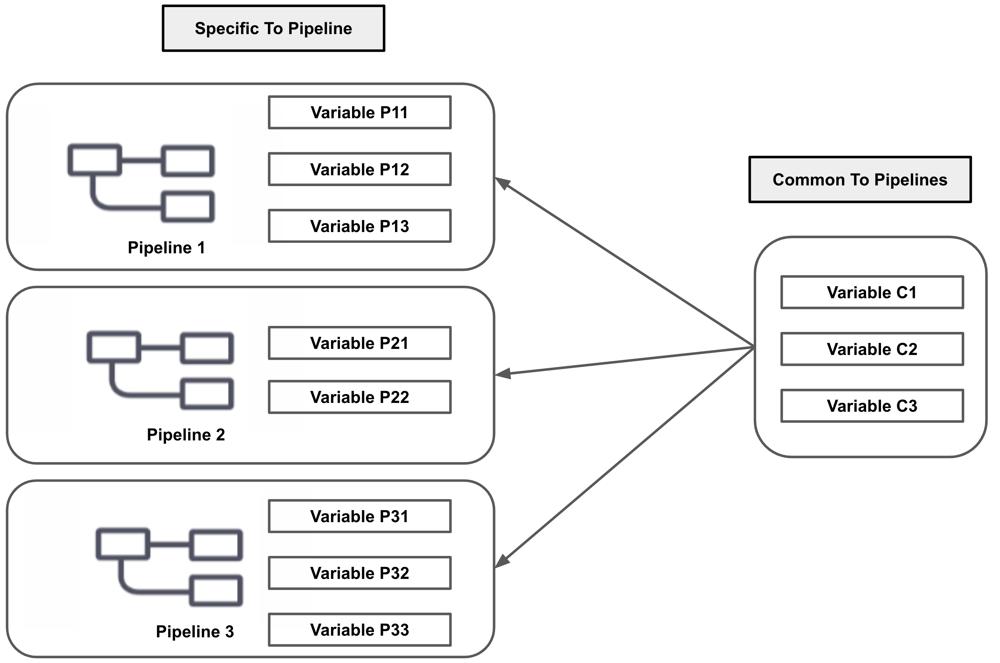
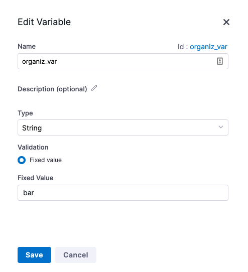
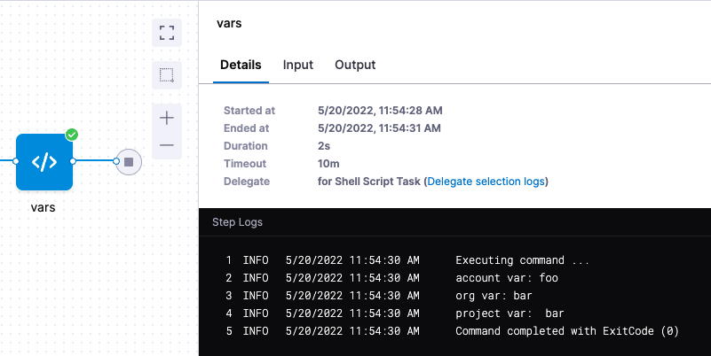
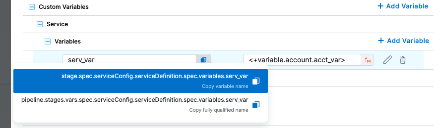
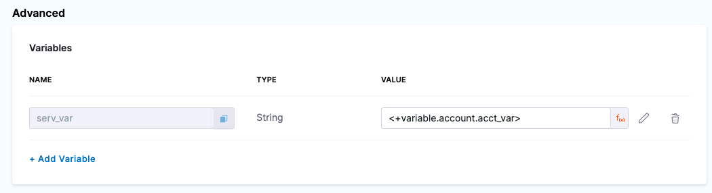
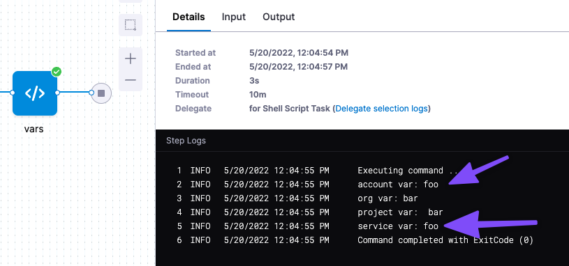
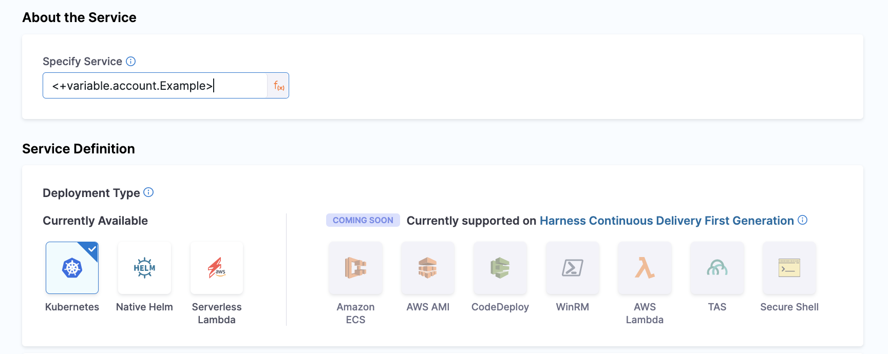

import Tabs from '@theme/Tabs';
import TabItem from '@theme/TabItem';

In addition to Harness' many [built-in variables](./harness-variables.md), you can define custom variables at the account, org, and project [scopes](/docs/platform/role-based-access-control/rbac-in-harness#permissions-hierarchy-scopes), as well as within individual pipelines.

Account, org, and project variables store values that you can share and use across multiple pipelines or in multiple projects.

Pipeline variables include all lower-scope variables, such as variables defined on pipelines, stages, step groups, steps, and Continuous Delivery services and environments. These variables store values for a specific pipeline, and they are limited to the context of that pipeline.

<details>
<summary>Variable scope diagram</summary>

This diagram illustrates the availability of variables based on their scope.

The **Common To Pipelines** variables represent account-, org-, or project-level variables.
The **Specific to Pipeline** variables are pipeline-level variables.



</details>

This topic explains how to define and reference variables in Harness. It assumes you are familiar with [Harness' key concepts](/docs/platform/get-started/key-concepts.md). To manage variables, you need [permission](../role-based-access-control/add-manage-roles) to view, create/edit, and delete variables.

## Custom variable specifications

* Variables can be of type string, secret, or number.
* Number type variables are always treated as doubles (double-precision floating-point).
   * Negative values: `-1.79769313486231E308` to `-4.94065645841247E-324`
   * Positive values: `4.94065645841247E-324` to `1.79769313486232E308`
   * For example, if you have a custom pipeline variable named `double_example` with the type `Number` and the value `10.1`, you can reference it with the expression `<+pipeline.variables.double_example>`. Without using a method or condition to convert it to another type, this expression resolves to `10.1` and it is treated as a double.
   * Number variables can be treated as strings if they are used in fields that expect strings. For example, if you enter `123` in a **Name** field, this is treated as string data because **Name** expects string input. Whereas entering `123` in a count setting, such as **Instances**, causes the value to be treated as a double.
* You can reference secrets as values for pipeline, stage, and service variables.
* Sometimes you can mark variables as required.
   * The **Required** setting is supported for pipeline variables, stage variables, and CD service and environment variables.
   * The **Required** setting is also enforced when the variable is defined in a template and the template is included in a pipeline.

### Naming conventions

Adhere to the following restrictions and considerations for variable names:

* Variable names must start with a letter or underscore (`_`).
* Variable names can contain lowercase and uppercase letters, numbers 0-9, underscores (`_`), periods (`.`), hyphens/dashes (`-`), and dollar signs (`$`). However, periods and hyphens are not recommended.
* Variable names and properties can't contain the following reserved keywords: `or, and, eq, ne, lt, gt, le, ge, div, mod, not, null, true, false, new, var, return, shellScriptProvisioner, class`. For more information, go to [JEXL grammar details](https://people.apache.org/~henrib/jexl-3.0/reference/syntax.html).
* Avoid periods and hyphens in variable names. If you must use them, [period and hyphens require escaping](#use-get-for-variable-names-with-hyphens-and-periods) when referencing those variables in Harness expressions.
* Variable names must be unique within the same scope. For example, you can't have two stage variables in the same stage with the same name.
* Additional variable naming restrictions can apply depending on the platforms and tools you use. For example, Kubernetes doesn't allow underscores. Ensure that your expressions resolve to the allowed values of your target platforms.

### Use get() for variable names with hyphens or periods

Harness recommends not using hyphens/dashes (`-`) in variable names because these characters can cause issues with headers and they aren't allowed in some Linux distributions and deployment-related software.

However, if you need to reference a custom variable that includes a period or hyphen/dash in the name, you must wrap the variable name in double quotes and use the `get()` method in the expression, such as `.get("some-var")`.

For example:

```
<+pipeline.variables.get("pipeline-var")>
<+pipeline.stages.custom.variables.get("stage-var")>
<+pipeline.variables.get("pipeline.var")>
<+pipeline.stages.custom.variables.get("stage.var")>
```

This handling is also required for [matrix dimension names](/docs/platform/pipelines/looping-strategies/looping-strategies-matrix-repeat-and-parallelism) with hyphens.

### Value conventions

* Variable values can be [fixed values, runtime inputs, or expressions](./runtime-inputs).
   * Account, org, and project variables support fixed values only.
   * Variables created at lower levels (such as pipeline, stage, and service variables) support fixed values, runtime inputs, and expressions.
* Pipelines fail if a variable's default value starts with an asterisk (`*`). Instead, you can wrap the asterisk or value in double quotes (`"*"`).
* If a variable is assigned a date value in the format `2002-12-14`, the YAML converter adheres to the YAML convention by converting it into a datetime object. For more information, go to the [YAML specification for tags](https://yaml.org/spec/1.2.2/#3212-tags).

### Variable scope and availability

* Account, org, and project variables are available to all lower scopes. For example, an org variable is available to all projects and pipelines under that org.
* Variables added to pipelines and stages are available to all stages in the pipeline.
* Variables added to services and environments are available in all stages that use those services and environments.
   * For more information, check out the [Harness pipeline, stage, and service variables overview video](https://youtu.be/lqbmO6EVGuU).
   * You can also override service variables at the environment level. For more information, go to [Overriding services at the environment level](/docs/continuous-delivery/x-platform-cd-features/environments/service-overrides).

### Manually remove references to deleted variables

If you delete a variable that is referenced in your pipelines, the [expressions](harness-variables.md) referencing that variable **are not** automatically deleted.

At runtime, when Harness attempts to resolve the expressions, the pipeline can fail or an expression can resolve as `null` if Harness can't find the variable.

**After deleting a variable, you must manually check for and remove expressions referencing deleted variables.**

## Define variables

<Tabs>
<TabItem value="account" label="Account scope" default>

1. In Harness, select **Account Settings**.
2. Select **Account Resources**, and then select **Variables**.
3. Select **New Variable**. The **Add Variable** settings appear.

   <DocImage path={require('./static/add-a-variable-03.png')} width="30%" height="30%" title="Click to view full size image" />

4. Enter a **Name** for your variable.
5. In **Fixed Value**, enter a value for your variable.
6. Select **Save**.

   <DocImage path={require('./static/add-a-variable-04.png')} width="30%" height="30%" title="Click to view full size image" />

</TabItem>
<TabItem value="org" label="Organization scope">

1. Select **Account Settings**.
2. Select **Organizations**.
3. Select an org.
4. In **Organization Resources**, select **Variables**.

   <DocImage path={require('./static/add-a-variable-05.png')} width="60%" height="60%" title="Click to view full size image" />

5. Select **New Variable**.
6. Enter a name, select the variable type, and then enter a value.
7. For example, here's a variable named `organize_var`.

   

8.  Note the Id. That Id is used to reference the variable.
9.  Select **Save**.

</TabItem>
<TabItem value="project" label="Project scope">

At the project scope, you can use API or the Harness Platform to create variables.

<Tabs>
<TabItem value="API" label="API">

Use the [createVariable](https://apidocs.harness.io/tag/Variables#operation/createVariable) API to create a new variable.

Here's an example:

```json
curl -i -X POST \
  'https://app.harness.io/ng/api/variables?accountIdentifier=H5W8iol5TNWc4G9h5A2MXg' \
  -H 'Content-Type: application/json' \
  -H 'x-api-key: HARNESS_API_KEY' \
  -d '{
    "variable": {
      "identifier": "myvar123",
      "name": "myvar123",
      "description": "testvar",
      "orgIdentifier": "default",
      "projectIdentifier": "CD_Docs",
      "type": "String",
      "spec": {
        "valueType": "FIXED",
        "fixedValue": "bar"
      }
    }
  }'
```

</TabItem>
<TabItem value="Harness Manager" label="Harness Manager" default>

1. In a Harness Project, select **Project Setup**, and then select **Variables**.
2. Select **New Variable**.
3. Enter a name, select the variable type, and then enter a value.
4. For example, here's a variable named `proj_var`.

   

5. Note the Id. That Id is used to reference the variable.
6. Select **Save**.

</TabItem>
</Tabs>

</TabItem>
<TabItem value="pipeline" label="Pipeline variables">

To create variables at the pipeline or stage level, go to the pipeline where you want to add the variable, and then use one of the following options to add variables:

* Select **Variables** on the right side of the Pipeline Studio. Here, you can add pipeline, stage, service, step group, and other variables, depending on your pipeline's content.
* Select a specific stage, select the **Overview** tab, and add stage variables in the **Advanced** section.
* Add variables in the YAML editor. The indentation determines whether the variable is a pipeline or stage variable. For stage variables, indent `variables` under `- stage`, aligned with `stage.spec`. For pipeline variables, indent `variables` under `pipeline`, aligned with `pipeline.properties`.

```yaml
  variables:
    - name: sourceToken
      type: Secret
      description: Access token for the source repo.
      required: true
      value: <+input>
```

Similarly, you can add CD service and environment variables within stages that have a service or environment definition. To add a service variable, edit a CD stage with a service definition, select the **Service** tab, expand the **Advanced** section, and select **Add Variable**. Optionally, you can [export service variables as environment variables](/docs/continuous-delivery/x-platform-cd-features/services/export-ser-var-as-env-var).

:::info

**CD environment variables** are variables for your defined CD environments (such as production or development environments). These can be different from pipeline environment variables that define the execution runtime environment.

:::

You can also add variables to step groups.

Additionally, some step types support step-level runtime environment variable or output variables. Usage for these options is in the documentation for those step types.

</TabItem>
</Tabs>

:::Limitation
The `$HOME` variable does not resolve to the home path when creating a directory or file path because the value is being used as a string. You cannot pass any value to the `$HOME` variable using expressions in a pipeline level. 
:::

## Reference variables

Use [expressions](/docs/platform/variables-and-expressions/harness-variables.md) to reference variables in Harness.

You can reference variables where ever expression input is accepted, such as pipeline/stage/step settings or scripts.

For custom variables, the expression you use depends on where you created the variable and from where you are referencing the variable. For example:

* Account variable reference: `<+variable.account.VARIABLE_NAME>`
* Org variable reference: `<+variable.org.VARIABLE_NAME>`
* Project variable reference: `<+variable.VARIABLE_NAME>`
* Pipeline variable reference: `<+pipeline.variables.VARIABLE_NAME>`
* Stage variable reference (within the same stage where you defined it): `<+stage.variables.VARIABLE_NAME>`
* StepGroup variable reference (within the same step group where you defined it): `<+stepGroup.variables.VARIABLE_NAME>`
* Service variable reference: `<+serviceVariables.VARIABLE_NAME>`
* Environment variable reference: `<+env.variables.VARIABLE_NAME>`

If you are referencing lower-level variables (such as stage, step group, and step variables) outside of the scope where you originally defined them, you must include additional relative pathing in your expression. For example, to reference a stage variable in a different stage that the one where you originally defined it, you could use `<+pipeline.stages.originalStageID.variables.variableName>` instead of `<+stage.variables.variableName>`.

To assist with pathing for length expressions, you can [use JSON parser tools](./expression-v2.md).

:::info

Expressions reference custom variables by *variable name*. If the expression is outside the variable's origin scope, you use *identifiers* to reference the stage, step, or other entity where the variable was defined.

For example:

* Reference in variable's origin scope: `<+stage.variables.variableName>`
* Reference outside variable's origin scope: `<+pipeline.stages.originalStageID.variables.variableName>`

:::

### Example: Echo variables

Here's a simple script example that echoes some variables in a pipeline:

1. In Harness, edit a pipeline.

   If you want to reference an account, org, or project variable, the pipeline must be within the account, org, or project where you created that variable.

2. Select a stage and add a step that can run a script, such as a [Run step](/docs/continuous-integration/use-ci/run-step-settings.md) or a [Shell Script step](/docs/continuous-delivery/x-platform-cd-features/cd-steps/utilities/shell-script-step).

3. Add a script to echo your variables, such as:

   ```
   echo "Account var: "<+variable.account.VARIABLE_NAME>
   echo "Org var: "<+variable.org.VARIABLE_NAME>
   echo "Project var: " <+variable.VARIABLE_NAME>
   echo "Pipeline var: " <+pipeline.variables.VARIABLE_NAME>
   echo "Stage var: " <+stage.variables.VARIABLE_NAME>
   ```

4. Run the pipeline and find the echoed variables in the execution logs.

   

### Get variable expressions from the Variables list

After adding pipeline and other types of local variables, you can get the expressions to reference these variables from your pipeline's Variables list.

1. Edit your pipeline and select **Variables** on the right side of the Pipeline Studio.
2. Locate the variable you want to use, and select the **Copy** icon to copy the expression referencing that variable.

   

3. Paste the expression where you want to reference the variable in commands or other settings.

   For example, this command echoes a service variable:

   ```sh
   echo "<+stage.spec.serviceConfig.serviceDefinition.spec.variables.SERVICE_VARIABLE_ID>"
   ```

You can also [copy input and output expressions from execution details after a pipeline runs](/docs/platform/variables-and-expressions/harness-variables.md#get-expressions-for-step-input-and-output).

### Use an account/org/project variable as the value of a pipeline variable

You can use a higher-level variable as the value for pipeline variables (including pipeline, stage, step group, service, and environment variables).

1. [Define a variable](#define-variables) at the account, org, or project scope that you want to use as the value for a lower-level variable.
2. Define a variable in a pipeline, stage, step group, or other entity. For example, to define a service variable, select a stage with a service definition, select the **Service** tab, expand the **Advanced** section, and select **New Variable**.
3. For **Variable Name**, enter a name for your variable.
4. For **Type**, select **String**.
5. For **Value**, enter an expression referencing your account, org, or project variable, such as `<+variable.account.VARIABLE_ID>`.

   

6. After creating the local variable, reference your local variable in your pipeline, such as in a step's command or other setting.

   For example, this command echoes a service variable:

   ```sh
   echo "<+stage.spec.serviceConfig.serviceDefinition.spec.variables.SERVICE_VARIABLE_ID>"
   ```

7. When you run the pipeline, Harness resolves the local variable's value from the reference to the account/org/project variable.

   Here's an example of the logs for a Shell Script step that echoes a service variable that takes its value from an account variable. The account variable and service variable both echo the same value.

   ```
   account var: foo
   service var: foo
   ```

   

### Use account/org/project variables to store pipeline settings

You can use [expressions](/docs/platform/variables-and-expressions/harness-variables.md) to reference variables in most pipeline settings. This is useful for controlling certain pipeline inputs and configurations for which users should select specific values rather than creating their own.

For example, if you have an account variable that stores a service definition, you could use an expression referencing that variable in your CD stage's **Specify Service** setting.



When you run the pipeline, Harness pulls the service definition from the referenced variable.

### Get a list of all pipeline/stage variables

You can use the expression `<+pipeline.variables>` to access all of the pipeline's custom variables as a collection of key-value pairs.

You can use the expression `<+stage.variables>` to access all of the stage's custom variables as a collection of key-value pairs.

## Tutorial: Use variables in a CD pipeline

This tutorial demonstrates how to create and use variables in a Harness CD pipeline.

This tutorial builds upon the pipeline created in the [Deploy using Kubernetes Manifest tutorial](https://developer.harness.io/docs/continuous-delivery/get-started/cd-tutorials/manifest?pipeline=cd-pipeline). If you want to follow along, make sure you have successfully deployed the Guestbook app from that tutorial before proceeding further.

### Use built-in variables

Harness has many built-in variables that you can reference in your pipelines.

1. Log into [app.harness.io](https://app.harness.io/), if you have not already done so.
2. Navigate to **Deployments > Pipelines**, and click into your `guestbook_canary_pipeline`.
3. Select **Edit Pipeline** from the top of the page to enter the Pipeline Studio.
4. Select the `deploy-guestbook` stage, then select **Execution**.
5. Select **Add Step > Add Step**.
6. Scroll to the **Utilities** section, then select **Shell Script**.
7. In the **Name** field, type `Successful Deployment Message`.
8. In the **Script** field, paste the following:

   ```
   echo "<+pipeline.triggeredBy.name> successfully deployed <+service.name> to <+env.name>."
   ```

9. Select **Apply Changes**, then **Save**.
10. Select **Run** and then **Run Pipeline**
11. Wait for the pipeline to complete, then select the **Successful Deployment Message** step.
12. Expand **Step Details** if needed, and verify the step log shows the script message with the variable names appropriately rendered.

### Use account variables

You can create custom variables and use them in your pipelines.

1. Navigate to **Account Settings > Account Resources**. Select **Variables**.
2. Select **New Variable**.
3. Name the variable `account_alias` and set its Fixed Value to your first name or nickname.
4. Click **Save**.

   Variables created at the account, org, or project level support fixed values only. Variables created at the entity level (such as pipelines, stages, and services), support dynamic runtime inputs and expressions.

5. Navigate to **Deployments > Pipelines > guestbook_canary_pipeline**. Select **YAML > Edit YAML**.
6. In the **Successful Deployment Message** step, on the **script:** line, replace `<+pipeline.triggeredBy.name>` with `<+variable.account.account_alias>`.
7. Select **Save** and then **Run > Run Pipeline**.
8. After the pipeline completes, verify that the step log message references the value you set for your account level variable.

### Use pipeline variables with runtime input

Pipeline, stage, step group, and other limited-scope variables can have fixed values or take values from other variables or [runtime input](/docs/platform/variables-and-expressions/runtime-input-usage.md), which allows the user to define a value at runtime.

1. In **Deployments > Pipelines**, select your `guestbook_canary_pipeline`.
2. Select **Edit Pipeline**, then select **Variables** from the right sidebar.
3. Under **Pipeline > Custom Variables**, select **Add Variable**.
4. Name the variable **region**, leave the value blank, then select **Set variable as required during runtime**.
5. Select **Save**, then **Apply Changes**.
6. In the Pipeline Studio, select **YAML**.
7. At the bottom of the YAML, in the **variables** block, replace `value: ""` with `value: <+input>`.
8. In the **Successful Deployment Message** step, modify the **script** line to include the new variable:

   ```
   echo "<+variable.account.account_alias> successfully deployed <+service.name> to <+env.name> in <+pipeline.variables.region>."
   ```

9. Select **Save**.
10. Select **Run**. Note the prompt for a value for the **region** variable. Enter a value of your choosing (e.g. eu, india, usa, etc.).
11. Select **Run Pipeline**.
12. After the pipeline completes, verify that the step log message references the value you set for your account level variable.
