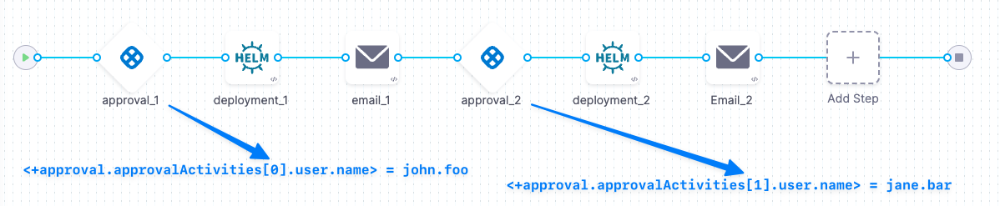
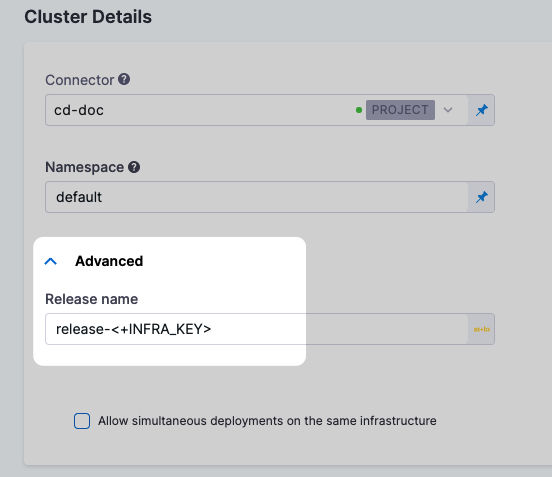
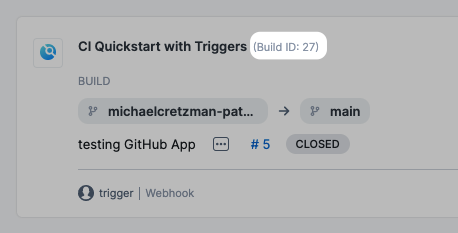
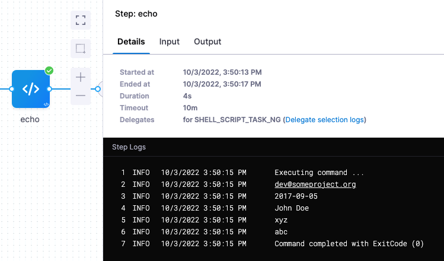
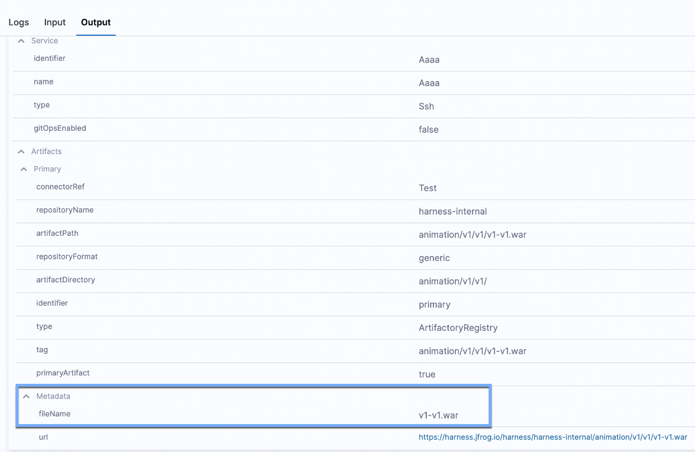
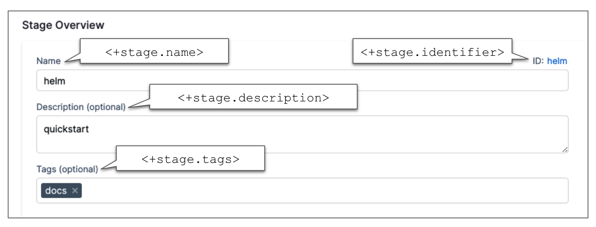
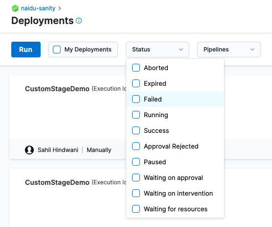
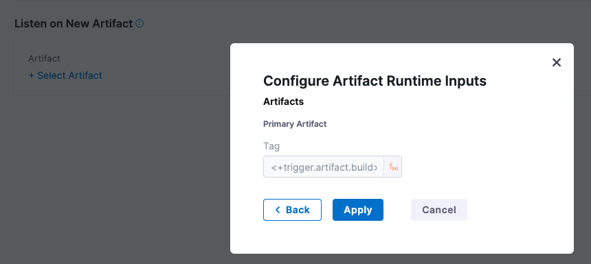

Harness expressions are used to reference stored values in Harness. These can be YAML paths, JSON paths, user-defined variables, settings, secrets, and more.

While you can reference all variables with expressions, not all expressions reference true variables. However, Harness expressions are interchangeably referred to as Harness variables because they references stored values in the same way variables do in code.

This pages describe some [Harness expressions](./harness-variables.md) that you might find useful. Due to the way Harness generates expressions and the potential variations of pipeline, account, org, and project configurations, it is impossible to create an exhaustive list of all expressions.

### Account, org, and project expressions

* `<+account.identifier>`: The [identifier](../references/entity-identifier-reference.md) for your [Harness account](/docs/platform/get-started/subscriptions-licenses/view-account-info-and-subscribe-to-alerts.md).
* `<+account.name>`: Your Harness account name.
* `<+account.companyName>`: The company name associated with your Harness account.
* `<+org.identifier>`: The [identifier](../references/entity-identifier-reference.md) of an organization in your Harness account. The referenced organization depends on the context where you use the expression.
* `<+org.name>`: The name of the organization.
* `<+org.description>`: The description of the organization.
* `<+project.identifier>`: The [identifier](../references/entity-identifier-reference.md) of a Harness project in your Harness account. The referenced project depends on the context where you use the expression.
* `<+project.name>`: The name of the Harness project.
* `<+project.description>`: The description of the Harness project.
* `<+project.tags>`: All [Harness tags](/docs/platform/references/tags-reference) attached to the project.

### Approval expressions

Whenever a user grants an approval in a [Harness Manual Approval step](/docs/platform/approvals/approvals-tutorial), the pipeline maintains the user information of the approver for the rest of the pipeline execution. You can use these variables in notifications after an approval is granted.

:::info

These expressions apply to Harness Manual Approval *steps* only. They don't apply to Approval stages or third-party approval steps (such as Jira or ServiceNow approval steps).

:::

* `<+approval.approvalActivities[0].user.name>`: The Harness username of the approver.
* `<+approval.approvalActivities[0].user.email>`: The email address of the approver.
* `<+approval.approvalActivities[0].comments>`: User comments from the approval, formatted as a single string. This variable is populated from the `comment` output variable generated by the Approval step.

Use the index value to get information from different Approval steps in the same pipeline. For example, if you have a Deploy stage with two Approval steps, the pipeline maintains a separate set of approval variable values for each Approval step. Use the array index in the expressions to access the values for a specific approval.



### CI codebase and environment variables

For information about variables and expressions relevant to Harness CI, go to:

- [CI codebase variables reference](/docs/continuous-integration/use-ci/codebase-configuration/built-in-cie-codebase-variables-reference.md)
- [CI environment variables reference](/docs/continuous-integration/troubleshoot-ci/ci-env-var.md)

### Custom variables

For information about user-defined variables, including naming conventions, special handling, and other usage specifications, go to [Define variables](add-a-variable.md).

### Deployment environment expressions

In Harness CD, environments represent your deployment targets (such as QA, Prod, and so on). Each environment contains one or more **Infrastructure Definitions** that list your target clusters, hosts, namespaces, and so on. You can use expressions to reference environment values, such as `<+env.name>`, in a service's Values YAML file, specs, and config files, for example:

* `<+env.name>`: The name of the environment used in the current stage.
* `<+env.identifier>`: The [entity identifier](../references/entity-identifier-reference.md) of the environment used in the current stage.
* `<+env.description>`: The description of the environment.
* `<+env.type>`: The environment type, such as `Production` or `PreProduction`.
* `<+env.envGroupName>`: The name of the environment group to which the environment belongs, if defined. This expression resolves only if the deployment is done on an environment group.
* `<+env.envGroupRef>`: The environment group reference. This expression resolves only if the deployment is done on an environment group.

<DocImage path={require('./static/harness-variables-45.png')} width="50%" height="50%" title="Click to view full size image" />

:::tip

Environment expressions are useful. For example, you can use them in Service steps, or you can use JEXL to evaluate them in [conditional execution settings](/docs/platform/pipelines/step-skip-condition-settings.md), such as `<+env.type> != "Production"`.

:::

#### Custom environment-level variables

You can [define custom variables](./add-a-variable.md) in your environment and service definitions, and you can use expressions to reference those custom variables.

<DocImage path={require('./static/harness-variables-44.png')} width="50%" height="50%" title="Click to view full size image" />

Currently, there are two versions of [services and environments](/docs/continuous-delivery/get-started/services-and-environments-overview), v1 and v2. Services and environments v1 are being replaced by services and environments v2.

<!-- "The way you reference these custom variables can be different between v1 and v2." It is not clear that there is any difference or if this change is complete. -->

To reference custom environment-level variables, use the expression syntax `<+env.variables.variableName>`.

### Deployment infrastructure expressions

These expressions refer to deployment infrastructure configurations. Infrastructure definitions are associated with a deployment environment and they represent the actual clusters, hosts, etc., where Harness deploys a service.

* `<+infra.name>`: The name of the infrastructure definition used in a pipeline stage.

   <DocImage path={require('./static/harness-variables-46.png')} width="60%" height="60%" title="Click to view full size image" />

* `<+infra.infraIdentifier>`: The ID of the infrastructure definition used in a pipeline stage.
* `<+infra.tags>`: The [tags on a CD stage's infrastructure definition](/docs/continuous-delivery/get-started/services-and-environments-overview/#infrastructure-tags). To reference a specific tag use `<+infra.tags.TAG_KEY>`.
* `<+infra.connectorRef>`: The ID of the Harness connector used in the Deploy stage's infrastructure definition.
* `<+infra.connector.name>`: The name of the Harness connector used in the infrastructure definition.
* `<+infra.namespace>`: The namespace used in the infrastructure definition.
* `<+infra.releaseName>`: The release name used in the infrastructure definition.

#### INFRA_KEY and INFRA_KEY_SHORT_ID

`<+INFRA_KEY>` references the infrastructure key, which is a unique string that identifies a deployment target infrastructure.

The infrastructure key is a combination of `serviceIdentifier`, `environmentIdentifier`, and a set of values unique to each infrastructure definition implementation (Kubernetes cluster, etc.) hashed using `SHA-1`. For example, for a Kubernetes Infrastructure, the infrastructure key is a hash of `serviceIdentifier-environmentIdentifier-connectorRef-namespace`. The format is `sha-1(service.id-env.id-[set of unique infra values])`.

`<+INFRA_KEY_SHORT_ID>` is a shortened form of `<+INFRA_KEY>`. The shortened form is obtained by removing all but the first six characters of the hash of the infrastructure key.

:::warning

These expressions are literally `<+INFRA_KEY>` and `<+INFRA_KEY_SHORT_ID>`. These expressions use capital letters.

:::

Infrastructure keys are typically used in the **Release Name** setting to add labels to release for tracking. For example, in the infrastructure definition of a deploy stage, the `<+INFRA_KEY>` is used in the **Release Name** to give the release a unique name, such as `release-<+INFRA_KEY>`.



When the deployment runs, Harness adds the release name as a label. For example, in a Kubernetes deployment, `release-<+INFRA_KEY` might resolve as `harness.io/release-name=release-2f9eadcc06e2c2225265ab3cbb1160bc5eacfd4f`.

```
...
Pod Template:
  Labels:  app=hello
           deployment=hello
           harness.io/release-name=release-2f9eadcc06e2c2225265ab3cbb1160bc5eacfd4f
  Containers:
   the-container:
    Image:      monopole/hello:1
...
```

With the `INFRA_KEY`, Harness can track the release for comparisons and rollback.

:::info

To resolve issues experienced with Kubernetes and Native Helm deployments when using the long form `release-<+INFRA_KEY>`, Harness now uses `<+INFRA_KEY_SHORT_ID>` in the default expression that Harness uses to generate a release name for the resources in Kubernetes and Native Helm deployments. This means that the **Release name** field, in the **Advanced** section of the **Cluster Details** in the infrastructure definition is now pre-populated with `release-<+INFRA_KEY_SHORT_ID>`.

:::

### Deployment instance expressions

The following instance expressions are supported in [Secure Shell (SSH) deployments](/docs/continuous-delivery/deploy-srv-diff-platforms/traditional/ssh-ng), [WinRM deployments](/docs/continuous-delivery/deploy-srv-diff-platforms/traditional/win-rm-tutorial), and [Custom deployments using Deployment Templates](/docs/continuous-delivery/deploy-srv-diff-platforms/custom/custom-deployment-tutorial).

These deployments can be done on physical data centers, AWS, and Azure. The deployment target determines which expressions you can use.

* For Microsoft Azure, AWS, or any platform-agnostic Physical Data Center (PDC):
   * `<+instance.hostName>`: The host/container/pod name where the microservice/application is deployed.
   * `<+instance.host.instanceName>`: Same as `<+instance.hostName>`.
   * `<+instance.name>`: The name of the instance on which the service is deployed.
* For Microsoft Azure or AWS:
   * `<+instance.host.privateIp>`: The private IP of the host where the service is deployed.
   * `<+instance.host.publicIp>`: The public IP of the host where the service is deployed.

To use instance expressions in pipelines, you must use a [repeat looping strategy](../pipelines/looping-strategies/looping-strategies-matrix-repeat-and-parallelism.md) and identify all the hosts for the stage as the target.

```yaml
repeat:
  items: <+stage.output.hosts>
```

When you use an instance expression in your pipeline, such as in a **Shell Script** step, Harness applies the script to all target instances. You do not need to loop through instances in your script.

For examples, go to [Run a script on multiple target instances](/docs/continuous-delivery/x-platform-cd-features/cd-steps/run-a-script-on-multiple-target-instances).

#### Instance attributes in deployment templates

For Deployment Templates, you can use instance expressions to reference host properties defined in the **Instance Attributes** in the deployment template.


Instances collected by the mandatory **instancename** field can be referenced by the expressions `<+instance.hostName>`, `<+instance.host.instanceName>`, or `<+instance.name>`.

To reference the other properties added to **Instance Attributes**, use the expression syntax `<+instance.host.properties.PROPERTY_NAME>`. For example, if you added a property named `artifact`, you could reference it with the expression `<+instance.host.properties.artifact>`.

### Kubernetes deployment expressions

#### HARNESS_KUBE_CONFIG_PATH

While this doesn't follow the typical Harness expression syntax, `${HARNESS_KUBE_CONFIG_PATH}` is an expression referencing the path to a Harness-generated kubeconfig file containing the credentials you provided to Harness. The credentials can be used by kubectl commands by exporting their value to the KUBECONFIG environment variable.

Harness only generates this kubeconfig file when a delegate is outside of the target cluster and is making a remote connection. When you set up the Kubernetes cluster connector to connect to the cluster, you select the **Specify master URL and credentials** option. The master URL and credentials you supply in the connector are put in the kubeconfig file and used by the remote delegate to connect to the target cluster.

Consequently, you can only use `${HARNESS_KUBE_CONFIG_PATH}` when you are using a delegate outside the target cluster and a Kubernetes cluster connector with the **Specify master URL and credentials** option.

If you are running the script using an in-cluster delegate with the **Use the credentials of a specific Harness Delegate** credentials option, then there are no credentials to store in a kubeconfig file since the delegate is already an in-cluster process.

You can use the `${HARNESS_KUBE_CONFIG_PATH}` expression in a [Shell script](/docs/continuous-delivery/x-platform-cd-features/cd-steps/utilities/shell-script-step) step to set the environment variable at the beginning of your kubectl script, such as `export KUBECONFIG=${HARNESS_KUBE_CONFIG_PATH}`. It cannot be used in other scripts such as a Terraform script.

For example:

```
## Get the pods in the default namespace
export KUBECONFIG=${HARNESS_KUBE_CONFIG_PATH} kubectl get pods -n default

## Restart a deployment object in the Kubernetes cluster
export KUBECONFIG=${HARNESS_KUBE_CONFIG_PATH}
kubectl rollout restart deployment/mysql-deployment
```

#### kubernetes.release.revision

You can use the expression `<+kubernetes.release.revision>` to get the deployment revision number.

This expression requires delegate version 23.04.79106 or later.

You can use this expression:

- In the `values.yaml` file, OpenShift Params, and Kustomize Patches.
- To reference the current Harness release number as part of your manifest.
- To reference versioned ConfigMaps and secrets in custom resources and fields unknown by Harness.

**Important:** Users must update their delegate to version  to use this expression.

### Manifest expressions

Harness has generic manifest expressions and manifest expressions for specific deployment types.

Manifest settings are referenced by the manifest ID, which is located at `service.serviceDefinition.spec.manifests.manifest.identifier` in the Harness Service YAML.

<details>
<summary>Use Service YAML to get manifest expression paths</summary>

Reviewing the Service YAML can help you determine the expressions you can use. For example, you can create the expression `<+manifests.mymanifest.valuesPaths>` using the manifest `identifier` and the `valuesPaths` in the following YAML:

```yaml
...
      manifests:
        - manifest:
            identifier: mymanifest                # <+manifests.MANIFEST_ID.identifier>
            type: K8sManifest                     # <+manifests.MANIFEST_ID.type>
            spec:
              store:                              # <+manifests.MANIFEST_ID.store>
                type: Harness
                spec:
                  files:
                    - account:/Templates
              valuesPaths:
                - account:/values.yaml
              skipResourceVersioning: false
...
```

</details>

Here are some generic manifest expressions:

* `<+manifest.MANIFEST_ID.commitId>`: The commit Id of the manifests used in a service. This is captured in the Deployment step [execution output](#get-inputoutput-expressions-from-execution-details).
* `<+manifests.MANIFEST_ID.identifier>`: Resolves to the manifest `identifier` in Harness. The `MANIFEST_ID` is the same as the resolved value of this expression; however, you could use this to use the manifest ID in a script, for example.
* `<+manifests.MANIFEST_ID.type>`: Resolves to the manifest `type`.
* `<+manifests.MANIFEST_ID.store>`: Resolves to where the manifest is stored. In the following example, the manifest is stored in the [Harness File Store](/docs/continuous-delivery/x-platform-cd-features/services/add-inline-manifests-using-file-store):

  ```yaml
  ...
        manifests:
          - manifest:
              identifier: mymanifest
              type: K8sManifest
              spec:
                store:
                  type: Harness
                  spec:
                    files:
                      - account:/Templates
  ...
  ```

### Helm chart expressions

import HelmManifestExpressions from '/docs/continuous-delivery/shared/helm-manifest-expressions.md';

<HelmManifestExpressions name="helmexpressions" />

### Pipeline expressions

The following expressions reference information about a pipeline run, such as the execution ID or start time. For expressions referencing custom pipeline variables, go to [Custom variables](#custom-variables). For expressions referencing pipeline triggers, go to [Trigger expressions](#trigger-expressions).

* `<+pipeline.identifier>`: The pipeline's [identifier](../references/entity-identifier-reference.md) for the pipeline.
* `<+pipeline.name>`: The name of the current pipeline.
* `<+pipeline.tags>`: The [tags](/docs/platform/references/tags-reference) for a pipeline. To reference a specific tag, use `<+pipeline.tags.TAG_NAME>`.
* `<+pipeline.executionId>`: Every pipeline run (execution) is given a universally unique identifier (UUID). The UUID can be referenced anywhere. The UUID forms the unique execution URL, for example:`https://app.harness.io/ng/#/account/:accountId/cd/orgs/default/projects/:projectId/pipelines/:pipelineId/executions/:executionId/pipeline`.
* `<+pipeline.resumedExecutionId>`: The execution ID of the root or original execution. This value is different from the `executionId` when it is a retry.
* `<+pipeline.sequenceId>`: The incremental sequential Id for the execution of a pipeline.

   While the `<+pipeline.executionId>` is randomly generated for each execution, the `<+pipeline.sequenceId>` increments with each run of the pipeline. The first run of a pipeline receives a sequence Id of 1 and each subsequent execution is incremented by 1.

   For CD pipelines, the Id is named execution. For CI pipelines, the Id is named builds.

      

   You can use `<+pipeline.sequenceId>` to tag a CI build when you push it to a repository, and then use `<+pipeline.sequenceId>` to pull the same build and tag in a subsequent stage. For more information and examples, go to [Build and test on a Kubernetes cluster build infrastructure tutorial](/docs/continuous-integration/use-ci/set-up-build-infrastructure/k8s-build-infrastructure/tutorial-ci-kubernetes-build-infra) and [Integrating CD with other Harness modules](/docs/continuous-delivery/get-started/integrating-cd-other-modules).

* `<+pipeline.executionUrl>`: The execution URL of the pipeline. This is the same URL you see in your browser when you are viewing the pipeline execution.

   :::warning
   Harness has deprecated the version of this expression with an additional period, `<+pipeline.execution.Url>`.
   :::

* `<+pipeline.executionMode>`: This expression describes the pipeline's execution mode:
   * `NORMAL`: A normal execution. It could either have succeeded or failed.
   * `POST_EXECUTION_ROLLBACK`: A [post-deployment rollback](/docs/continuous-delivery/manage-deployments/rollback-deployments.md) execution.
   * `PIPELINE_ROLLBACK`: A [rollback pipeline](/docs/platform/pipelines/failure-handling/define-a-failure-strategy-for-pipelines) execution.

   This expression is useful in [conditional executions](/docs/platform/pipelines/step-skip-condition-settings). For example, you can create a conditional execution to ensure that a step runs only when a post-deployment rollback happens.

* `<+pipeline.startTs>`: The start time of a pipeline execution in [Unix Epoch format](https://www.epoch101.com/).
* `<+pipeline.selectedStages>`: The list of stages selected for execution.
* `<+pipeline.delegateSelectors>`: The pipeline-level [delegate selectors](/docs/platform/delegates/manage-delegates/select-delegates-with-selectors) selected via runtime input.
* `<+pipeline.storeType>`: If the pipeline is stored in Harness, the expression resolves to `inline`. If the pipeline is stored in a Git repository, the expression resolves to `remote`.
* `<+pipeline.repo>`: For remote pipelines, the expression resolves to the Git repository name. For inline pipelines, the expression resolves to `null`.
* `<+pipeline.branch>`: For remote pipelines, the expression resolves to the Git branch where the pipeline exists. For inline pipelines, the expression resolves to `null`.
* `<+pipeline.orgIdentifier`>: The [identifier](../references/entity-identifier-reference.md) of an organization in your Harness account. The referenced organization is the pipeline's organization. 

### Secrets expressions

The primary way to reference secrets is with expressions like `<+secrets.getValue("SECRET_ID")>`.

For information about referencing secrets, go to the [Secrets documentation](/docs/category/secrets).

### Service expressions

Services represent your microservices and other workloads. Each service contains a **Service Definition** that defines your deployment artifacts, manifests or specifications, configuration files, and service-specific variables.

<DocImage path={require('./static/harness-variables-35.png')} width="60%" height="60%" title="Click to view full size image" />

* `<+service.name>`: The name of the service defined in the stage where you use this expression.
* `<+service.description>`: The description of the service.
* `<+service.tags>`: The [tags](/docs/platform/references/tags-reference) on the service. To reference a specific tag use `<+service.tags.TAG_KEY>`.
* `<+service.identifier>`: The [identifier](../references/entity-identifier-reference.md) of the service.
* `<+service.type>`: Resolves to stage service type, such as Kubernetes.

   <DocImage path={require('./static/harness-variables-36.png')} width="60%" height="60%" title="Click to view full size image" />

* `<+service.gitOpsEnabled>`: Resolves to a Boolean value to indicate whether [the GitOps option](/docs/continuous-delivery/gitops/get-started/harness-cd-git-ops-quickstart) is enabled (`true`) or not (`false`).

#### Custom service-level variables

You can [define custom variables](./add-a-variable.md) in your environment and service definitions, and you can use expressions to reference those custom variables.

<DocImage path={require('./static/harness-variables-32.png')} width="60%" height="60%" title="Click to view full size image" />

Currently, there are two versions of [services and environments](/docs/continuous-delivery/get-started/services-and-environments-overview), v1 and v2. Services and environments v1 are being replaced by services and environments v2.

To reference custom v2 service-level variables, use the expression syntax `<+serviceVariables.VARIABLE_NAME>`.

To reference custom v1 service-level variables, use the expression syntax `<+serviceConfig.serviceDefinition.spec.variables.VARIABLE_NAME>`.

:::tip Override service variables

To [override a service variable during the execution of a step group](/docs/continuous-delivery/x-platform-cd-features/cd-steps/step-groups/#override-service-variables-in-step-groups),  use`<+serviceVariableOverrides.VARIABLE_NAME>`.  This provides significant flexibility and control over your pipelines.

:::

### Service artifacts expressions

You can use artifact expressions if you have selected an artifact in the [service definition of a service you are deploying](/docs/continuous-delivery/x-platform-cd-features/services/services-overview). If you have not selected an artifact, or your artifact is configured as runtime input (`<+input>`), you must select an artifact at pipeline runtime.

For more information and artifact expression usage examples, go to [CD artifact sources](/docs/continuous-delivery/x-platform-cd-features/services/artifact-sources).

<details>
<summary>Example: Kubernetes artifacts expressions</summary>

Here are example values for common artifact expressions for a Kubernetes deployment of a Docker image on Docker Hub:

```
<+artifacts.primary.tag>                       # Example value: stable
<+artifacts.primary.image>                     # Example value: index.docker.io/library/nginx:stable
<+artifacts.primary.imagePath>                 # Example value: library/nginx
<+artifacts.primary.imagePullSecret>           # Example value: ****
<+artifacts.primary.dockerConfigJsonSecret>    # Example value: ****
<+artifacts.primary.type>                      # Example value: DockerRegistry
<+artifacts.primary.connectorRef>              # Example value: DockerHub
```

You can also have [rollback artifacts](#rollback-artifacts) and [sidecar artifacts](#sidecar-artifacts).

For a detailed example, go to [Add container images as artifacts for Kubernetes deployments](/docs/continuous-delivery/deploy-srv-diff-platforms/kubernetes/cd-kubernetes-category/add-artifacts-for-kubernetes-deployments.md) and [Add a Kubernetes sidecar container](/docs/continuous-delivery/deploy-srv-diff-platforms/kubernetes/cd-kubernetes-category/add-a-kubernetes-sidecar-container.md)

</details>

#### Primary artifact names and paths

Use `<+artifacts.primary.image>` or `<+artifacts.primary.imagePath>` in your `values.yaml` file when you want to deploy an artifact you have added to the **Artifacts** section of a CD stage service definition.

* `<+artifacts.primary.image>`: The full location path to the Docker image, such as `docker.io/bitnami/nginx:1.22.0-debian-11-r0`.
   * For non-containerized artifacts, use [`<+artifacts.primary.path>`](#artifact-path-filepath) instead.
   * To get the image name only, use `<+artifacts.primary.imagePath>`.
* `<+artifacts.primary.imagePath>`: The image name, such as `nginx`. To get the entire image location path use `<+artifacts.primary.image>`.
* `<+artifacts.primary.path>`: The full path to the non-containerized artifact. This expression is used in non-containerized deployments.
* `<+artifacts.primary.filePath>`: The file name of the non-containerized artifact. This expression is used in non-containerized deployments, such as a .zip file in AWS S3.

For more information, go to [Harness Kubernetes services](/docs/continuous-delivery/deploy-srv-diff-platforms/kubernetes/kubernetes-services.md#artifacts) and [Example Kubernetes Manifests using Go Templating](/docs/continuous-delivery/deploy-srv-diff-platforms/kubernetes/cd-k8s-ref/example-kubernetes-manifests-using-go-templating).

#### Primary artifact ID, tags, and labels

Use these expressions to get artifact identifiers, tags, and labels.

* `<+artifacts.primary.identifier>`: The **Id** of the **Primary** artifact added in a Service's **Artifacts** section.

   <DocImage path={require('./static/harness-variables-41.png')} width="60%" height="60%" title="Click to view full size image" />

* `<+artifacts.primary.tag>`: The tags on the pushed, pulled, or deployed artifact, such as AMI tags. For example, if you deployed the Docker image `nginx:stable-perl`, the `<+artifacts.primary.tag>` is `stable-perl`. This expression has no relationship to [Harness tags](/docs/platform/references/tags-reference.md).

:::info note
GAR(Google Artifact Registry) does not have a tag field but a rather a version which can be fetched using `<+artifacts.primary.version>`
:::

* `<+<+artifacts.primary.label>.get("")>`: This expression uses the `get()` method to extract Docker labels from a Docker image artifact. Specify the label key in `get()`. For example `<+<+artifacts.primary.label>.get("maintainer")>` pulls the maintainer tag, such as `maintainer=dev@someproject.org`.

<details>
<summary>Example: Reference artifact labels</summary>

You can reference labels in Shell Script steps or elsewhere, for example:

```
echo <+<+artifacts.primary.label>.get("maintainer")>
echo <+<+artifacts.primary.label>.get("build_date")>
echo <+<+artifacts.primary.label>.get("multi.author")>
echo <+<+artifacts.primary.label>.get("key-value")>
echo <+<+artifacts.primary.label>.get("multi.key.value")>
```

When you run the pipeline, the expressions resolve to their respective label values in the execution logs.



</details>

#### Primary artifact repo type and connector

* `<+artifacts.primary.type>`: The type of repository used to add this artifact in the service's **Artifacts** section. For example, Docker Hub, ECR, or GCR.
* `<+artifacts.primary.connectorRef>`: The ID of the Harness connector used to connect to the artifact repository.

#### Primary artifact metadata

* `<+artifacts.primary.metadata.SHA>` or `<+artifacts.primary.metadata.SHAV2>`: Digest/SHA256 hash of the Docker image.

   Since Docker image manifest API supports two schema versions, schemaVersion1 and schemaVersion2, there could be SHA values corresponding to each version. For the SHA value of schemaVersion1, use `<+artifacts.primary.metadata.SHA>`. For the SHA value of schemaVersion2, use `<+artifacts.primary.metadata.SHAV2>`.

* `<+artifact.metadata.fileName>` and `<+artifact.metadata.url>`: The artifact metadata file name and metadata file URL. Not applicable to all artifact types. If populated, you can find these values in the execution details for the **Service** step, under the **Output** tab. For more information, go to [CD artifact sources](/docs/continuous-delivery/x-platform-cd-features/services/artifact-sources).

   

#### Artifacts with dockercfg or dockerconfigjson

* `<+artifacts.primary.imagePullSecret>`: If your Kubernetes cluster doesn't have permission to access a private Docker registry, the `values.yaml` file or manifest file in the service definition's **Manifests** section must use the `dockercfg` parameter. Then, if you add the Docker image in the service definition's **Artifacts** section, you can reference it with `dockercfg: <+artifacts.primary.imagePullSecret>`.
* `<+artifacts.primary.dockerConfigJsonSecret>`: If your Kubernetes cluster doesn't have permission to access a private Docker registry, the `values.yaml` file or manifest file in the service definition's **Manifests** section must use the `dockerconfigjson` parameter. Then, if you add the Docker image in the service definition's **Artifacts** section, you can reference it with `dockerconfigjson: <+artifact.dockerConfigJsonSecret>`.

For more information and examples, go to [Pull an Image from a Private Registry for Kubernetes](/docs/continuous-delivery/deploy-srv-diff-platforms/kubernetes/cd-kubernetes-category/pull-an-image-from-a-private-registry-for-kubernetes) and [Harness Kubernetes services](/docs/continuous-delivery/deploy-srv-diff-platforms/kubernetes/kubernetes-services.md#pull-an-image-from-a-private-registry).

#### Rollback artifacts

You can use the syntax `<+rollbackArtifact.ARTIFACT_DEFINITION_ID>` to pull artifact rollback information. For example, use `<+rollbackArtifact.metadata.image>` to pull the metadata of the artifact image used in the last successful deployment.

Harness pulls rollback artifact information from the last successful deployment. If there's no previous successful deployment, then rollback artifact expressions resolve to `null`.

#### Sidecar artifacts

Sidecar artifact expressions include:

- `<+artifacts.sidecars.SIDECAR_IDENTIFIER.imagePath>`
- `<+artifacts.sidecars.SIDECAR_IDENTIFIER.image>`
- `<+artifacts.sidecars.SIDECAR_IDENTIFIER.type>`
- `<+artifacts.sidecars.SIDECAR_IDENTIFIER.tag>`
- `<+artifacts.sidecars.SIDECAR_IDENTIFIER.connectorRef>`

Replace `SIDECAR_IDENTIFIER` with the **Sidecar Identifier/ID** assigned when you added the artifact to Harness.

<DocImage path={require('./static/harness-variables-42.png')} width="60%" height="60%" title="Click to view full size image" />

<DocImage path={require('./static/harness-variables-43.png')} width="60%" height="60%" title="Click to view full size image" />

### Service config files expressions

You can use these expressions to reference files added in a service's **Config Files** section.

- `<+configFile.getAsString("CONFIG_FILE_ID")>`: Get config file contents as plain text.
- `<+configFile.getAsBase64("CONFIG_FILE_ID")>`: Get config file contents with Base64-encoding.

For more information, go to [Use config files in your deployments](/docs/continuous-delivery/x-platform-cd-features/services/cd-services-config-files.md#referencing-and-encoding-config-files).

### Stage expressions

The following expressions reference information for a pipeline stage.



* `<+stage.name>`: The name of the stage. The resolved value depends on the context where you use the expression.
* `<+stage.description>`: The description of the stage.
* `<+stage.tags>`: The [tags](/docs/platform/references/tags-reference) on the stage. To reference a specific tag, use `<+stage.tags.TAG_NAME>`. To reference tags from a stage outside the stage where you use the expression, use `<+pipeline.stages.STAGE_ID.tags.TAG_NAME>`.
* `<+stage.identifier>`: The [identifier](../references/entity-identifier-reference.md) of the stage.
* `<+stage.output.hosts>`: Lists all of the target hosts when deploying to multiple hosts.

   When you are deploying to multiple hosts, such as with an SSH, WinRM, or deployment template stage, you can run the same step on all of the target hosts. To run the step on all hosts, use a [repeat looping strategy](../pipelines/looping-strategies/looping-strategies-matrix-repeat-and-parallelism.md) and identify all the hosts for the stage as the target. For more information and examples, go to [Deployment instance expressions](#deployment-instance-expressions) and [Secure Shell (SSH) deployments](/docs/continuous-delivery/deploy-srv-diff-platforms/traditional/ssh-ng).

* `<+stage.executionUrl>`: The execution URL of the stage. This is the same URL you see in your browser when you are viewing the pipeline execution. To get the execution URL for a specific stage in a pipeline use `<+pipeline.stages.STAGE_ID.executionUrl>`
* `<+stage.delegateSelectors>`: The stage-level [delegate selectors](/docs/platform/delegates/manage-delegates/select-delegates-with-selectors) selected via runtime input.

#### Custom stage variables

For information about custom stage variables, go to [Define variables](./add-a-variable.md).

### Status expressions

Pipeline, stage, and step status values are a Java enum. You can see the list of values in the **Status** filter on the Executions, Builds, or Deployments page:



You can use any status value in a JEXL condition. For example, `<+pipeline.stages.stage1.status> == "FAILED"`.

* `<+pipeline.stages.STAGE_ID.status>`: The status of a stage. You must use the expression after the target stage has executed.
* `<+pipeline.stages.STAGE_ID.spec.execution.steps.STEP_ID.status>`: The status of a step. You must use the expression after the target step has executed.

#### Looping strategy statuses

The statuses of the nodes (stages/steps) using a [matrix/repeat looping strategy](/docs/platform/pipelines/looping-strategies/looping-strategies-matrix-repeat-and-parallelism) can be `RUNNING`, `FAILED`, or `SUCCESS`.

Harness provides the following expressions to retrieve the current status of the node (stage/step) using a looping strategy. The expressions are available in pipelines during execution and rollback.

* `<+strategy.currentStatus>`: The current status of the looping strategy for the node with maximum depth.
   * When this expression is used in a step, Harness will resolve it to the looping strategy current status of the first parent node (stage/step) of the step.
   * In cases where both the step and the stage have the looping strategy configured, the expression will resolve to the looping strategy status of the current step.
   * If the step (or step group) does not have the looping strategy configured, the expression will instead resolve to the looping strategy status of the current stage.
* `<+strategy.node.STRATEGY_NODE_IDENTIFIER.currentStatus>`: The current status of the looping strategy for the node with a specific stage/step identifier, `STRATEGY_NODE_IDENTIFIER`. For example, `echo <+strategy.node.cs1.currentStatus>`.
* `<+<+strategy.node>.get("STRATEGY_NODE_IDENTIFIER").currentStatus>`: The current status of the looping strategy for the node with a specific stage/step identifier, `STRATEGY_NODE_IDENTIFIER`. For example, `echo <+<+strategy.node>.get("ShellScript_1").currentStatus>`.

#### Status, currentStatus, and liveStatus

Pipeline and stage status expressions can reference the `status`, `currentStatus`, or `liveStatus`. These variables track different statuses, and they can resolve differently depending on the success or failure of specific steps or stages.

`status` refers to the running status of a single node. `currentStatus` and `liveStatus` provide the combined statuses of all running steps within a pipeline or stage. The difference between status types is based on how they handle step failures and if the status of steps running in a matrix or strategy is included in the overall status calculation.

* **Status**: `status` expressions (such as `<+pipeline.stages.STAGE_ID.status>`) refer to the current running status of a single node, such as a pipeline, stage, or step. It provides information about the state of that specific node without considering the status of any parent, child, or sibling nodes. It reports the direct status of the target node.
* **Current Status**: `currentStatus` expressions (such as `<+pipeline.stages.STAGE_ID.currentStatus>`) represent the combined status of all the running steps within a pipeline or stage, except steps generated from [matrix/repeat looping strategies](/docs/platform/pipelines/looping-strategies/looping-strategies-matrix-repeat-and-parallelism.md).

   `currentStatus` uses the statuses of all non-matrix steps to determine the overall status. If *any* non-matrix step fails, regardless of the progress or status of other steps, the `currentStatus` of both the pipeline and the stage resolves as `Failed`. This means that the failure of one step can affect the status of the entire pipeline or stage.

   :::info

   `currentStatus` *ignores* steps generated from matrix/repeat looping strategies. This means that if a pipeline includes a step generated from a matrix, and the matrix step fails while all other steps succeed, then the `currentStatus` is `Success` because `currentStatus` ignores the matrix step.

   :::

* **Live Status**: Like `currentStatus`, `liveStatus` expressions (such as `<+pipeline.stages.stage1.liveStatus>`) also provide the combined status of all the running steps within a pipeline or stage; however, it also considers the status of steps generated from [matrix/repeat looping strategies](/docs/platform/pipelines/looping-strategies/looping-strategies-matrix-repeat-and-parallelism.md).

   `liveStatus` considers the statuses of *all* steps to determine the overall status. If *any* step fails, the `liveStatus` of both the pipeline and the stage resolves as `Failed`, regardless of the individual status of running or completed steps.

   :::info

   `liveStatus` *includes* steps generated by matrix/repeat looping strategies. This means that if a pipeline includes a step generated from a matrix, and the matrix step fails while all other steps succeed, then the `liveStatus` is `Failed` because `liveStatus` includes the matrix step.

   :::

<details>
<summary>Example: Status determination</summary>

The following example describes an ongoing execution with three steps named `step1`, `step2`, and `step3` within a stage called `stage1`.

`step1` is executed using a matrix strategy, specifically with two values: `"john"` and `"doe"`.

Assume this pipeline is running and the stage, steps, and matrix instances of `step3` have the following statuses:

- `stage1`: Running
- `step1`: Success
- `step2`: Success
- `step3` (matrix): Running
   - `"john"`: Failed
   - `"doe"`: Success

In this example, the status values for `stage1` are as follows:

- The `status` of `stage1` is `Running`. This is taken directly from the execution status of `stage1`.
- The `currentStatus` of `stage1` is `Success`. This is determined from the statuses of all steps in the stage, excluding the matrix steps generated by `step3`.
- The `liveStatus` of `stage1` is `Failed`. This is determined by considering the statuses of all steps in the stage, including the matrix steps generated by `step3`.

</details>

### Step group expressions

The following expressions are for step groups in pipeline stages.

* `<+stepGroup.variables>`: References a collection of variables within the step group.
* `<+stepGroup.getParentStepGroup>`: References a collection of variables from the parent of the step group.

### Step expressions

The following expressions are for steps in pipeline stages.

* `<+step.name>`: The step name. The resolved value is relative to the context where you use the expression.
* `<+step.identifier>`: The step [identifier](/docs/platform/references/entity-identifier-reference/).
* `<+step.executionUrl>`: The execution URL of the step. This is the same URL you see in your browser when you are viewing the pipeline execution. To get the execution URL for a specific step in a pipeline, use `<+pipeline.stages.STAGE_ID.spec.execution.steps.STEP_ID.executionUrl>`.
* `<+steps.STEP_ID.retryCount>` or `<+execution.steps.STEP_ID.retryCount>`: When you set a [failure strategy](/docs/platform/pipelines/failure-handling/define-a-failure-strategy-on-stages-and-steps) to **Retry Step**, you can specify the retry count for a step or all steps in the stage. The `retryCount` expressions resolve to the total number of times a step was retried.

### Strategy expressions

You can [use Harness expressions to retrieve the current execution status or identifiers for iterations of a matrix or repeat looping strategy](/docs/platform/pipelines/looping-strategies/looping-strategies-matrix-repeat-and-parallelism.md#looping-strategy-expressions).

### Trigger expressions

* General Git trigger and payload expressions: Harness includes built-in expressions for referencing trigger details such as the `<+trigger.type>` or `<+trigger.event>`. For a complete list, go to the [Triggers Reference](../triggers/triggers-reference.md).
* `<+trigger.artifact.build>`: Resolves to the artifact version (such as a Docker Tag) that initiated an [On New Artifact Trigger](../triggers/trigger-on-a-new-artifact.md).

   When you add a new artifact trigger, you select the artifact to listen on, and its **Tag** setting is automatically populated with `<+trigger.artifact.build>`.

   

   The `<+trigger.artifact.build>` used for **Tag** makes sure that the new artifact version that executed the trigger is used for the deployment.

   Adding a new tag to the artifact fires the trigger and executes the pipeline. Harness resolves `<+trigger.artifact.build>` to the tag that fired the trigger. This makes sure that the new tag is used when pulling the artifact and the new artifact version is deployed.

* `<+trigger.artifact.source.connectorRef>`: Resolves to the Harness connector Id for the connector used to monitor the artifact registry that fired the trigger.
* `<+trigger.artifact.source.imagePath>`: Resolves to the image path for the artifact that fired the trigger.
* `<+pipeline.triggeredBy.name>`: The name of the user or the trigger name if the pipeline is triggered using a webhook.
   * For more information, go to [Trigger Pipelines using Git Events](../triggers/triggering-pipelines.md).
   * If a user name is not present in the event payload, the `<+pipeline.triggeredBy.name>` expression will resolve as empty. For example, in the SaaS edition of Bitbucket, a user name is not present.
* `<+pipeline.triggeredBy.email>`: The email of the user who triggered the pipeline. This returns `null` if the pipeline is triggered using a webhook. For more information, go to [Trigger How-tos](/docs/category/triggers).
* `<+pipeline.triggerType>`: The type of trigger. Similar to `<+trigger.type>`.

Here are the possible `<+pipeline.triggerType>` and `<+trigger.type>` values.

| **\<+pipeline.triggerType>** | **\<+trigger.type>** | **Description**                                               |
| :--------------------------- | :------------------- | :------------------------------------------------------------ |
| ARTIFACT                     | Artifact             | New artifact trigger. For example, new Docker Hub image tag   |
| SCHEDULER_CRON               | Scheduled            | Scheduled Cron trigger                                        |
| MANUAL                       | `null`               | Pipeline triggered using the RUN button in the user interface |
| WEBHOOK_CUSTOM               | Custom               | Custom webhook trigger                                        |
| WEBHOOK                      | Webhook              | SCM webhook trigger. For example, GitHub pull request         |

<details>
<summary>Triggers and RBAC</summary>

Harness RBAC is applied to triggers in Harness, but it is not applied to the repositories used by the triggers.

For example, you might have an [On New Artifact Trigger](../triggers/trigger-on-a-new-artifact.md) that is started when a new artifact is added to the artifact repo. Or a [Webhook Trigger](../triggers/triggering-pipelines.md) that is started when a PR is merged.

You can select who can create and use these triggers within Harness. However, you must use your repository's RBAC to control who can add the artifacts or initiate events that start the Harness trigger.

</details>

## Handling Rollback Scenarios with `rollbackSteps`

You can detect and handle rollback scenarios using various built-in expressions. One useful expression for stage-specific rollback handling is `rollbackSteps`, which helps determine if a stage is currently being rolled back, even when the pipeline itself may still be running in normal execution mode.

The rollbackSteps expression lists all steps being executed in rollback mode when the associated stage is being rolled back. It allows you to implement rollback-specific logic in your pipeline.

**Example Use Case**: If you want to apply custom failure handling or rollback logic for a stage in rollback mode, use the rollbackSteps expression in combination with the pipeline execution mode.

### Sample Expression for Rollback Detection

Here are some sample expressions that demonstrate how to use `rollbackSteps` to detect different rollback scenarios:

#### Detecting Stage Rollback

`isStageRollback=<+<+rollbackSteps>!=null && <+pipeline.executionMode> == "NORMAL">`

This expression checks if the current stage is executing rollback steps while the pipeline is running in normal execution mode.

#### Detecting Pipeline Rollback

`isPipelineRollback=<+<+pipeline.executionMode> == "PIPELINE_ROLLBACK">`

This checks if the entire pipeline is in rollback mode.

#### Detecting Post-Execution Rollback

`isPostProdRollback=<+<+pipeline.executionMode> == "POST_EXECUTION_ROLLBACK">`
