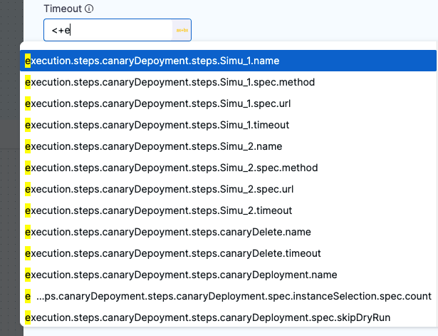
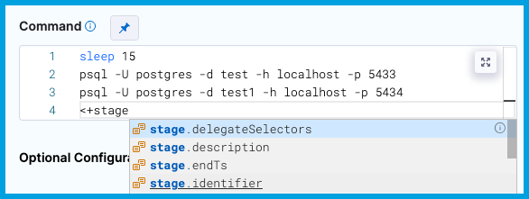
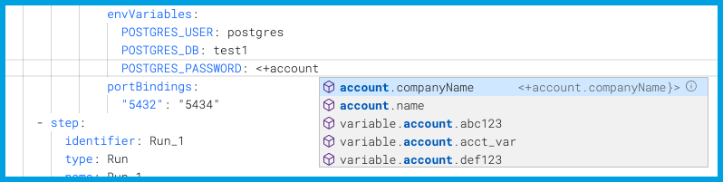
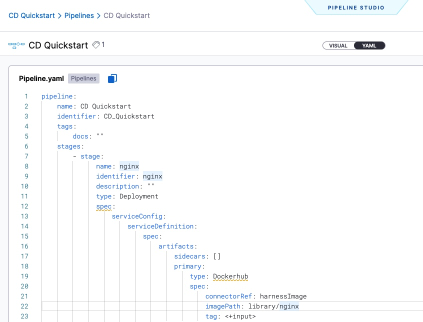
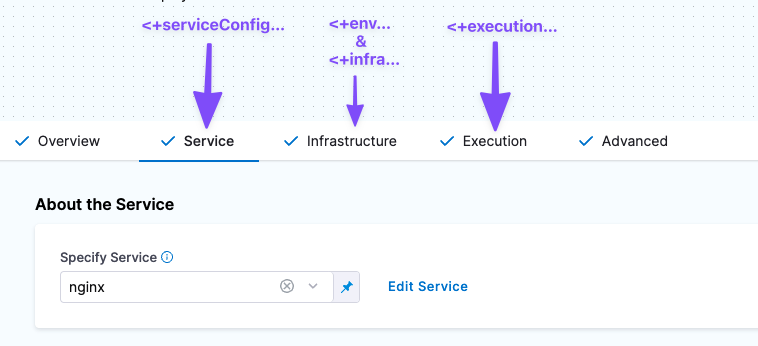
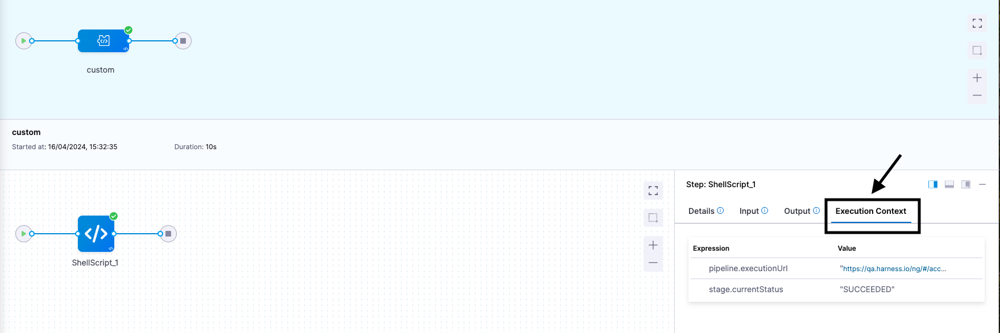
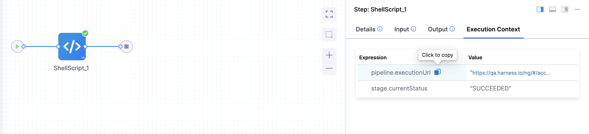
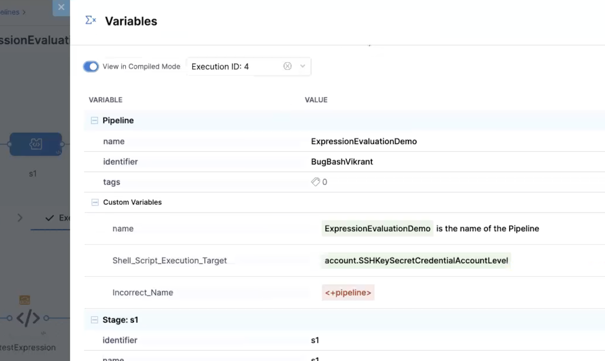

import Tabs from '@theme/Tabs';
import TabItem from '@theme/TabItem';

For most settings in Harness pipelines, you can use [fixed values, runtime inputs, or expressions](./runtime-inputs.md).

You can use expressions (also called Harness expressions, variable expressions, or sometimes Harness variables) to reference Harness input, output, and execution values. These values represent settings, variables, and other data that exist in the pipeline before and during execution. These can include environment variables, secrets, pipeline/stage/step identifiers, and more. You can also [add your own variables](./add-a-variable.md) and use expressions to reference them.

You use Harness expressions to reference stored values in Harness. While you can reference all variables with expressions, not all expressions reference true variables. However, Harness expressions are interchangeably referred to as Harness variables because they references stored values in the same way variables do in code.

This topic explains how Harness expressions work and how to write and use expressions.

Expressions are powerful and offer many options for modification or interaction. For more information about using expressions, go to:

* [Write expressions using any JSON parser tool](./expression-v2.md)
* [Use Java string methods](./expressions-java-methods.md)
* [Define variables](./add-a-variable.md)
* [Harness expressions reference](./harness-expressions-reference.md)

## What is a Harness variable expression?

Harness variable expressions refer to variable values in Harness, such as entity names, configuration settings, custom variables, inputs/outputs, and more. At pipeline runtime, Harness evaluates any expressions present in the pipeline and replaces them with their resolved values.

For example, the expression `<+pipeline.name>` resolves to name of the pipeline where you're using that expression.

**Harness variables are powerful because they enable templatizing of configuration information, pipeline settings, values in scripts, and more. They also enable your pipelines to pass information between stages and settings.**

Harness has many [built-in variables and expressions](/docs/platform/variables-and-expressions/harness-expressions-reference), and you can [define custom variables](./add-a-variable.md) that you can reference with expressions. Custom variables can be broadly scoped (such as account-wide or project-wide variables) or narrowly scoped (such as a variable for a specific pipeline or stage). Custom variables can store values that you need to reuse across many entities, or they can help you configure a specific build, such as runtime flags and environment variables for certain build tools.

Additionally, certain step types, such as [Run steps](/docs/continuous-integration/use-ci/run-step-settings.md) and [Shell Script steps](/docs/continuous-delivery/x-platform-cd-features/cd-steps/utilities/shell-script-step), can utilize and produce input, environment, and output variables that you define in the step settings. You can also reference these with expressions.

## Expression usage

To reference Harness variables, you use expressions consisting of the expression delimiter `<+...>` and a path to the referenced value, such as `<+pipeline.name>` or `<+secrets.getValue("SECRET_ID")>`.

In addition to [Fixed Values and Runtime Inputs](../variables-and-expressions/runtime-inputs.md), you can use Harness expressions in many settings in pipelines and other entities, like connectors and triggers.

<Tabs>
  <TabItem value="Visual" label="Visual">

In the Visual Editor, you can use the **Value type selector** to select **Expression**.


Harness provides suggestions for [built-in expressions](/docs/platform/variables-and-expressions/harness-expressions-reference) as you type. You can manually trigger the suggestions by placing your cursor after `<+` and pressing `ctrl + space`.



In free-text fields, such as **Command**, you can directly enter values using the appropriate syntax without changing the value type.



You can continue typing or select the expression from the list of suggestions.

</TabItem>
  <TabItem value="YAML" label="YAML" default>

When writing pipelines in YAML, enter the expression as the value for a field.

For example, this `connectorRef` setting takes it's value from an expression referencing a [pipeline variable](./add-a-variable.md) named `myConnector`.

```
          connectorRef: <+pipeline.variables.myConnector>
```

When you type `<+`, Harness provides suggestions for [built-in expressions](/docs/platform/variables-and-expressions/harness-expressions-reference) as you type. You can manually trigger the suggestions by placing your cursor after `<+` and pressing `ctrl + space`.



You can continue typing or select the expression from the list of suggestions.

</TabItem>
</Tabs>

:::info

Automated suggestions don't represent all possible expressions.

When Harness automatically suggests expressions, it suggests expressions based on the current context (meaning the setting or place in the YAML where you are entering the expression). While it doesn't suggest expressions that aren't valid in the current context, this doesn't prevent you from entering invalid expressions.

For guidance on building valid expressions, go to [Expression paths](#expression-paths) and [Debugging expressions](#debugging-expressions).

:::

### Expression paths

Harness expressions are references to variables, settings, and other values in Harness. When you use a Harness expression, you provide a path for Harness to follow to resolve the expression's value. Expressions can use [relative paths](#use-relative-paths) or [full paths (also referred to as FQNs)](#use-fqns).

:::tip path discovery

Harness offers several ways to help you build expression paths:

* [Get automated suggestions when typing expressions.](/docs/platform/variables-and-expressions/runtime-inputs.md#expressions)
* [Get input/output expressions from execution details.](#get-inputoutput-expressions-from-execution-details)
* [Get custom variable and input expressions from the Variables list.](#get-custom-variable-and-input-expressions-from-the-variables-list)
* [Use JSON parsing tools to help determine expression paths from complex output or YAML.](./expression-v2.md)

:::

#### Use FQNs

The format and length of an expression's Fully Qualified Name (FQN) depends on the type of entity the expression is referencing and where it is located.

Some expressions have short FQNs, such as `<+account.name>`, which references your Harness account name, or `<+variable.account.accountVariableName>`, which references a [custom account variable](./add-a-variable.md). In contrast, expression referencing specific settings embedded a pipeline's YAML can have much longer FQNs, like this expression for a service variable in a CD stage: `<+pipeline.stages.stageID.spec.serviceConfig.serviceDefinition.spec.variables.serviceVariableName>`.

When referencing values within a pipeline, an expression's FQN is the path to the value you are referencing in the context of your pipeline's YAML. **For values in pipelines, the expression's full path/FQN, starting from `pipeline`, always works as a reference point.**

For example, the FQN for an expression referencing a CD service definition's `imagePath` setting is `<+pipeline.stages.stageID.spec.serviceConfig.serviceDefinition.spec.artifacts.primary.spec.impagePath>`. This reflects the path you would step through in the YAML to locate that value.



#### Use relative paths

To use a relative path, identify the common parent between the step/stage you're referring to and the step/stage where you're using the expression (making the reference), and then use the common parent to start the expression.

For example, to reference a CD service definition's `imagePath` setting in the same stage where that service definition is defined, you could use the relative expression `<+stage.spec.serviceConfig.serviceDefinition.spec.artifacts.primary.spec.impagePath>`.

### Use expressions only after they can be resolved

When Harness encounters an expression during pipeline execution, it tries to resolve the expression with the information it has at that point in the execution. This means that if you try to use an expression before Harness has the necessary information to resolve the expression's value, the expression resolves to `null`, and the pipeline can fail or execute incorrectly.

This requirement applies regardless of how you are using the expression, such as with operators or in scripts. If Harness can't resolve the target value at the point when the pipeline requests the expression, the expression fails to resolve and the pipeline can fail.

:::warning

Your pipelines must use expressions *only* after Harness has the required information to resolve the expression's value.

:::

For example, assume you want to use this expression: `<+pipeline.stages.Stage_2.spec.execution.steps.Step_C.executionUrl>`. This expression calls the `executionUrl` from a step named `Step_C` that is in `Stage_2`. Since this step is in `Stage_2`, you could not use this expression in a previous stage, because the stage containing this expression's value hasn't run yet. Additionally, if there are steps before `Step_C` in `Stage_2`, those steps can't use this expression either, because they run before `Step_C`.

Here are some guidelines to help you successfully use expressions in pipelines:

- Don't refer to a step's expressions within that same step.
- Don't refer to values from a subsequent step/stage in a step/stage that runs before the referenced step/stage.
- Don't refer to step inputs/outputs in a CD stage's **Service** or **Environment** configuration.
   - In a CD stage, steps run after Harness evaluates the service and environment configuration. Consequently, Harness can't get values for expressions referencing step inputs/outputs while it is evaluating the service and environment configuration.
   - Similarly, don't refer to step inputs/output in a CI stage's **Infrastructure** or **Codebase** configuration. These are evaluated before steps run, so they can't use expressions referencing steps.

<details>
<summary>Example: Harness expression resolution throughout a CD stage</summary>

This example demonstrates when and where certain expressions (by prefix) are resolved over the duration of a CD stage, so that you can determine which events need to occur before you can safely reference a certain expression and ensure that it is successfully resolved when the pipeline runs.

<figure>



<figcaption>Different expressions originate from different parts of a stage. </figcaption>
</figure>

Here's when you can reference expressions resolved from information in each of these stage sections:

- **Service expressions** can be resolved only after Harness has progressed through the **Service** section of the pipeline. Consequently, you can use service expressions in the **Infrastructure** and **Execution** sections of the stage.
- **Infrastructure expressions** can be resolved only after Harness has progressed through the **Infrastructure** section of the pipeline.
  - In the **Infrastructure** section, you can reference **Service** settings.
  - Since **Execution** follows **Infrastructure**, you can reference **Infrastructure** expressions in **Execution**.
- **Execution expressions** apply to steps in **Execution**.
  - Each step's **Execution** expressions can be referenced only after Harness has progressed through that step in the **Execution** section.

<DocImage path={require('./static/harness-variables-21.png')} width="80%" height="80%" title="Click to view full size image" />

</details>

### Hyphens and spaces require escaping

Harness recommends not using hyphens/dashes (`-`) or spaces in variable and property names, because these characters can cause issues with headers and they aren't allowed in some Linux distributions and deployment-related software. Spaces may also cause incorrect evaluation of expressions. 

For example, these expressions won't work: `<+execution.steps.httpstep.spec.headers.x-auth>`, `<+execution.steps.get_jira_info.issue.Customer Name>`

If you must include a hyphen in an expression, such as with `x-auth`, you can wrap the property name in double quotes (`""`), such as `<+execution.steps.httpstep.spec.headers["x-auth"]>` and  `<+execution.steps.get_jira_info.issue."Customer Name">`.

This also applies to nested usage, such as:

```
<+execution.steps.httpstep.spec.newHeaders["x-auth"]["nested-hyphen-key"]>
<+execution.steps.httpstep.spec.newHeaders["x-auth"].nonhyphenkey>
```

If when referencing custom variables or matrix dimensions with hyphenated names, you must [use the `get()` method](/docs/platform/variables-and-expressions/add-a-variable.md#use-get-for-variable-names-with-hyphens-or-periods).

## Expression evaluation

Mechanically, Harness passes the content within the delimiter (`<+...>`) to the [Java Expression Language (JEXL)](http://commons.apache.org/proper/commons-jexl/) for evaluation at runtime.

For example, `<+pipeline.name>` evaluates to the name of the pipeline where that expression is used.

Here's an example of a shell script echoing some expressions, along with examples of output from those expressions.

```sh
echo <+pipeline.executionId>        # Output example: 1234-5678-abcd
echo <+pipeline.sequenceId>         # Output example: 16
echo <+stage.name>                  # Output example: dev
echo <+service.name>                # Output example: nginx
echo <+artifacts.primary.image>     # Output example: index.docker.io/library/nginx:stable
echo <+artifacts.primary.imagePath> # Output example: library/nginx
echo <+env.name>                    # Output example: demo
echo <+infra.namespace>             # Output example: default
echo <+infra.releaseName>           # Output example: demo
```

:::warning

Expressions can't resolve correctly if the target value isn't available at the time that Harness evaluates the expression. For more information, go to [Use expressions after they can be resolved](#use-expressions-after-they-can-be-resolved).

Additionally, variable values (after evaluation) are limited to 256 KB. Expressions producing evaluated values larger than this can have truncated values or fail to resolve.

:::

## Expression manipulation

In addition to standard evaluation, expressions can be evaluated and manipulated with Java string methods, JSON parsing, JEXL, interpolation, concatenation, and more.

### Compound expressions and operators require nested delimiters

When forming complex expressions, such as when using operators or methods with expressions, wrap the entire compound expression statement in the expression delimiter (`<+...>`).

For example, with the equals `==` and not equals `!=` operators, wrap the entire operation in the expression delimiter `<+...>`:

```
<+<+pipeline.name> == "pipeline1">
<+<+stage.variables.v1> != "dev">
```

There might be situations when a string needs to be concatenated into a variable to allow it to be utilized as an expression. In these situations, you must add double quotes around the string.

`<+"https://abcdef.com/yoururl/"+<+pipeline.variables.var1>>`

Complex usage can have multiple levels of nesting. For example, the following compound expression concatenates values from two variables into one list, and then uses the `split()` method on the concatenated list. The original expressions, the concatenated list expression, and the method manipulation are all wrapped in expression delimiters:

`<+ <+<+pipeline.variables.listVar1> + "," + <+pipeline.variables.listVar2>>.split(",")>`


### Java string methods

You can [use any Java string method on Harness expressions](./expressions-java-methods.md).

### JEXL

You can [use JEXL to build complex expressions](./expression-v2.md).

For example, the following complex expression uses information from a [webhook trigger](/docs/platform/triggers/triggers-reference.md) payload:

`<+ <+<+trigger.payload.pull_request.diff_url>.contains("triggerNgDemo")> || <+trigger.payload.repository.owner.name> == "wings-software" >`

Notice the use of methods, operators, and nested delimiters (`<+...>`) forming a compound expression. Harness evaluates each individual expression and produces a final value by evaluating the entire JEXL expression.

### Ternary operators

When using ternary conditional operators (`?:`), wrap the entire expression in the expression delimiter `<+...>`, and don't use spaces between the operators and values.

Ternary operators in Harness follow the standard format, but you can't use spaces between the operators and values.

For example:

* Incorrect: `<+condition ? IF_TRUE : IF_FALSE>`
* Correct: `<+condition?IF_TRUE:IF_FALSE>`

<details>
<summary>Pipeline YAML example manipulating expressions with ternary operators</summary>

This pipeline uses a ternary operator to evaluate a stage variable named `myvar` with a value of `1.1`.

In the second `ShellScript` step, named `ternary`, the stage variable is referenced by the expression `<+stage.variables.myvar>` and evaluated with the ternary expression `== "1.1"?"pass":"fail"`. The entire compound expression is `<+ <+stage.variables.myvar> == "1.1"?"pass":"fail" >`.

```yaml
pipeline:
  name: exp
  identifier: exp
  projectIdentifier: CD_Docs
  orgIdentifier: default
  tags: {}
  stages:
    - stage:
        name: ternarydemo
        identifier: ternarydemo
        description: ""
        type: Custom
        spec:
          execution:
            steps:
              - step:
                  type: ShellScript
                  name: ShellScript_1
                  identifier: ShellScript_1
                  spec:
                    shell: Bash
                    onDelegate: true
                    source:
                      type: Inline
                      spec:
                        script: echo <+stage.variables.myvar>
                    environmentVariables: []
                    outputVariables: []
                  timeout: 10m
              - step:
                  type: ShellScript
                  name: ternary
                  identifier: ternary
                  spec:
                    shell: Bash
                    onDelegate: true
                    source:
                      type: Inline
                      spec:
                        script: echo <+ <+stage.variables.myvar> == "1.1"?"pass":"fail" >
                    environmentVariables: []
                    outputVariables: []
                  timeout: 10m
        tags: {}
        variables:
          - name: myvar
            type: String
            description: ""
            required: true
            value: "1.1"
```

</details>

We do not support using a ternary operator with colon as constant in the same expression.

Let's look at the following sample expression:

```
<+ 
   Env name: <+env.name> 
   Service Name: <+<+<+env.name>.contains("dev")>?<+env.name>:"No Env">
>
```

The above expression will not get resolved as colon is used as a constant string with the ternary operator. As a workaround for this expression to work we should create a new variable for ternary expression and use this variable in the original expression.

In the example expression above, we can create a test variable with this expression as value `<+<+<+env.name>.contains("dev")>?<+env.name>:"No Env">` and replace the original expression with the same. Suppose the variable created is at the pipeline level, then our final expression will be as shown below, and it will work.

```
<+ 
   Env name: <+env.name> 
   Service Name: <+pipeline.variables.test>
>
```

For more information about using ternary operators in Harness, go to [Using Ternary Operators with Triggers](https://developer.harness.io/kb/continuous-delivery/articles/ternary-operator/).

### Expressions as strings

If you want to treat an expression as a string, you wrap it in double quotes, with the exception of secrets expressions (such as `<+secrets.getValue()>`) and some JSON usage.

For example, the following command has the expression `<+stage.name>` wrapped in double quotes because it is an element in an array of strings.

`<+<+pipeline.variables.changeType> =~ ["<+stage.name>","All"]>`

When using expressions as strings in JSON, the entire expression must be wrapped in double quotes, if that is required to make the JSON valid.

For example, in the following JSON, the expression `<+pipeline.variables.version>` must be wrapped in quotation marks because it resolves as a string in that part of the JSON. However, the expression `<+<+pipeline.variables.hosts>.split(\",\")>` isn't wrapped in quotation marks because it resolves as a list.

`"{\"a\":[ { \"name\": \"svc1\", \"version\": \"<+pipeline.variables.version>\", \"hosts\": <+<+pipeline.variables.hosts>.split(\",\")> } ]}"`

:::warning secrets as strings

Do not wrap `<+secrets.getValue()>` expressions in double quotes. While the secret ID within the `getValue()` method must be wrapped in double quotes, do not wrap the entire expression in double quotes, even when you want to treat it as a string.

This is because these expressions are resolved by an internal Secret Manager function. The value is not a primitive type string, and it must not be wrapped in double quotes.

For example, in the following complex expression, the `<+secrets.getValue()>` expression is not wrapped in double quotes, despite being used in an operation where another expression would be wrapped in double quotes.

`<+<+<+pipeline.variables.var1>=="secret1">?<+secrets.getValue("secret1")>:<+secrets.getValue("defaultSecret")>>`

:::

### Concatenation and interpolation

Harness supports complex usages of string interpolation, such as:

- Substituting an expression value within a path: `us-west-2/nonprod/eks/eks123/<+env.name>/chat/`
- Using an expression to supply the value of an identifier within another expression:
   - This example uses the index of the looped execution to pick the desired step by ID: `<+stage.spec.execution.steps.s1<+strategy.identifierPostFix>.steps.ShellScript_1.output.outputVariables.v1>`
   - This example would print the status of a stage where the stage name is defined as a stage variable: `<+pipeline.stages.<+pipeline.variables.stageName>.status>`

Harness string variables can be concatenated by default. Each expression can be evaluated and substituted in the string.

Previously, you always used `+` or `concat()` to join multiple expressions together. Now, you can simply list the expressions with spaces between, for example:

```
<+pipeline.name> <+pipeline.executionId>
```

The concatenation operator (`+`) and the `concat()` method also work. Note that these options require you to wrap the entire operation in the expression delimiter (`<+...>`). For example, the following syntax is valid:

```
<+<+pipeline.variables.var1> + "_suffix">
<+<+pipeline.variables.var1>.concat("_suffix")>
```

:::info

When concatenating expressions as strings, each expression must evaluate to a string.

If an expression does not satisfy this condition, use the `toString()` [method](/docs/platform/variables-and-expressions/expressions-java-methods) to convert it to a string.

For example, in `/tmp/spe/<+pipeline.sequenceId>` the variable `sequenceId` evaluates to an integer. When concatenating this with other string expressions, it must be converted to a string, such as: `/tmp/spe/<+pipeline.sequenceId.toString()>`.

:::

## Input and output variables

Your pipelines, stages, and steps can ingest inputs and produce outputs. In general, input variables represent a pipeline's configuration — the settings and values defining how and where an execution runs. Output variables are the results of an execution — such as release numbers, artifact IDs, image tags, user-defined output variables, and so on.

You can use expressions to reference inputs and outputs. For example, you could reference a previous step's output in a subsequent step's command.

The expression to reference an input or output depends on the scope where it was defined and the scope where you're referencing it. Usually, the expression follows the YAML path to the setting, and the full path (starting from `pipeline`) is always a valid reference. For example, to reference the `command` setting for a Run step in a Build stage, you could use an expression like `<+pipeline.stages.BUILD_STAGE_ID.spec.execution.steps.RUN_STEP_ID.spec.command>`. If you were referencing this setting in another step in the same stage, you could use a relative path like `<+execution.steps.RUN_STEP_ID.spec.command>`.

### Get input/output expressions from execution details

In a pipeline's execution details, you can explore inputs and outputs for the pipeline as a whole, as well as for individual steps.

**From the execution details, you can quickly copy the expression to reference any step-level input or output.**

This is useful for determining expression paths, when debugging expressions, or when you're not sure which expression to use for a particular setting or value.

To do this:

1. Go to the execution details page. You can get there by going to your **Executions**, **Builds**, or **Deployments** history and selecting the execution you want to inspect.
2. To inspect step-level inputs and outputs, select a step in the execution tree, and then select the **Input** and **Output** tabs.

   For example, these are some inputs and outputs for a Kubernetes rollout deployment step:

   <DocImage path={require('./static/rolloutdeployment1.png')} width="50%" height="50%" title="Click to view full size image" /> <DocImage path={require('./static/rolloutdeployment3.png')} width="50%" height="50%" title="Click to view full size image" />

3. To get the expression referencing a particular input/output, hover over the **Input/Output Name** and select the **Copy** icon.

   For example, if you want to reference a Run step's **Command** setting, navigate to the Run step's **Input** on the execution details page, locate **command** under **Input Name**, and select the **Copy** icon. Your clipboard now has the expression for this Run step's command, such as `<+pipeline.stages.stageID.spec.execution.steps.RunStepID.spec.command>`.

   <DocImage path={require('./static/copy-run-command-expression.png')} width="80%" height="80%" title="Click to view full size image" />

   This example copies the **podIP** setting for a Kubernetes rollout deployment step, resulting in an expression such as `<+pipeline.stages.STAGE_ID.spec.execution.steps.STEP_ID.deploymentInfoOutcome.serverInstanceInfoList[0].podIP>`.

   <DocImage path={require('./static/name.png')} width="80%" height="80%" title="Click to view full size image" />

4. In the same way, you can copy values tied to specific inputs and output. Copying a value copies the literal value, not the expression. To reference this value by an expression, you need to use the **Copy** option for the **Input/Output Name**.

   <DocImage path={require('./static/value.png')} width="60%" height="60%" title="Click to view full size image" />

### Get custom variable and input expressions from the Variables list

You can get expressions for [custom pipeline variables](./add-a-variable.md) and execution inputs from the **Variables** list in the Pipeline Studio.

<DocImage path={require('./static/2d3f480ea623c75e83c074a1e8a6d90d1fb1eccc1d9c3bcda1184179483ef529.png')} width="60%" height="60%" title="Click to view full size image" />

If the variable is local to a scope within the pipeline, such as a stage or step group, you can copy either the local, relative-path expression (to use the expression in the origin scope) or the full path/FQN expression (to use the expression outside the origin scope, such as in another stage).


### Get input/output expressions used in a from execution context

The **Execution Context** provides information about resolved expressions and their values for each step in the **Step Detail** pane. Its purpose is to aid in debugging previous executions of the pipeline, serving as an additional tool alongside the Input/Output variables listed for each step.

Let's consider the following example:
```yaml
pipeline:
  name: pipeline
  identifier: pipeline
  projectIdentifier: docs_play
  orgIdentifier: default
  tags: {}
  stages:
    - stage:
        name: custom
        identifier: custom
        description: ""
        type: Custom
        spec:
          execution:
            steps:
              - step:
                  type: ShellScript
                  name: ShellScript_1
                  identifier: ShellScript_1
                  spec:
                    shell: Bash
                    executionTarget: {}
                    source:
                      type: Inline
                      spec:
                        script: echo {$executionUrl}
                    environmentVariables:
                      - name: executionUrl
                        type: String
                        value: <+pipeline.executionUrl>
                    outputVariables: []
                  timeout: 10m
        tags: {}
```


**Execution context** is a table of keys and values with keys being the expressions that were referred within the step. In the above example, in the step, **ShellScript_1**, we have defined an input/environment variable, `executionUrl` with an expression type. Once you run the pipeline, click on the **ShellScript_1** step and then select Execution Context in the Step Details pane.

You can also get the expressions for **step level variable** and execution inputs from **Execution Context**.



:::info note
Some important points to note:
1. Secrets are not displayed in the Execution Context.
2. The Execution Context is non-editable, meaning you won't be able to add or remove items from it.
:::

## Troubleshooting expressions

The following sections describe some common issues or troubleshooting scenarios for expressions. For more troubleshooting information, go to the [Harness Knowledge Base](/kb).

### Debugging expressions

In addition to [getting inputs and outputs from execution details](#get-inputoutput-expressions-from-execution-details), you can debug expressions with Compiled Mode in the pipeline's **Variables** list.

Open ***Variables** in the Pipeline Studio, and enable **View in Compiled Mode**.

With Compiled Mode enabled, all variables in the panel are compiled to display their values based on the most recent execution. You can use the dropdown menu to use inputs from a different run.



Harness highlights expressions that are incorrect or can't be evaluated using the selected execution data. Once you identify the expressions that aren't evaluating correctly, you can disable Compiled Mode and correct the expressions or variables as needed.

To test expression that aren't stored in pipeline variables, such as expressions in scripts, you can create a pipeline variable to use for debugging purposes, input the expression as the variable's value, and then use Compiled Mode to debug it.

### String expressions can't use greater than or less than

Greater than and less than operators aren't supported for string type expressions.

String expressions only support equal to and not equal to operators.

### Don't embed scripts in expressions

You *can* use expressions in scripts, and you *can* manipulate expressions with methods and operators; however, **you can't write scripts *within* expressions**.

For example, the following is not valid:

```sh
if ((x * 2) == 5) { <+pipeline.name = abc>; } else { <+pipeline.name = def>; }
```

If your script requires this type of value manipulation, feed the expression into a script-level variable, and then manipulate the script variable to perform the manipulation. For example:

```sh
NAME = <+pipeline.name>

if ((x * 2) == 5) { $NAME = abc; } else { $NAME = def; }
```

### Limit or remove expressions in comments

Harness attempts to resolve all expressions, including expressions in script comments.

Harness recommends removing unneeded expressions from comments so they don't cause unexpected failures or add build time through unnecessary processing.

#### Expressions aren't valid in comments in Values YAML and Kustomize patches

Regardless of their validity, you can't use Harness expressions in comments in:

- Values YAML files (`values.yaml`) in Kubernetes, Helm chart, or Native Helm deployments.
- Kustomize patches files.

For example, the following values.yaml file won't process correctly because it has an expression in the comment.

```yaml
name: test
replicas: 4
image: <+artifacts.primary.image>
dockercfg: <+artifacts.primary.imagePullSecret>
createNamespace: true
namespace: <+infra.namespace>
# using expression <+infra.namespace>
```

### CI stage initialization fails with a "null value" error or timeout

If a Build (`CI`) stage fails at initialization with a "null value" error or timeout, this can indicate that an expression was called before its value could be resolved or that the expression references a nonexistent value. For more information, go to [Initialize step fails with a "null value" error or timeout](https://developer.harness.io/kb/continuous-integration/continuous-integration-faqs#initialize-step-fails-with-a-null-value-error-or-timeout).

### Default values can't start with an asterisk

Pipelines fails if a variable's default value starts with `*`. To avoid this wrap the asterisk or value in quotes, such as `"*"`.

## Migrate FirstGen expressions to NextGen

Use this information if you need to migrate expressions from Harness FirstGen to Harness NextGen.

:::warning

All FirstGen expressions use the delimiter `${...}`, such as `${approvedBy.name}`.

In NextGen, the delimiter is `<+...>`, such as `<+approvedBy.name>`.

:::

For more information about migrating to NextGen, go to:

- [Upgrade guide](/docs/continuous-delivery/get-started/upgrading/upgrade-nextgen-cd.md)
- [FirstGen and NextGen CD parity matrix](/docs/continuous-delivery/get-started/upgrading/feature-parity-matrix/)
- [Harness CD upgrading FAQ](/docs/continuous-delivery/get-started/upgrading/cdng-upgrade-faq/)

<details>
<summary>AMI expressions</summary>

| FirstGen | NextGen |
| -------- | ------- |
| `ami.newAsgName` | Rolling: `pipeline.stages.STAGE_ID.spec.execution.steps.AsgRollingDeployStep.output.asg.autoScalingGroupName`<br/>Blue Green: `pipeline.stages.STAGE_ID.spec.execution.steps.AsgRollingDeployStep.output.prodAsg.autoScalingGroupName`       |
| `ami.oldAsgName`    | Rolling: `pipeline.stages.STAGE_ID.spec.execution.steps.AsgRollingDeployStep.output.asg.autoScalingGroupName`<br/>Blue Green: `pipeline.stages.STAGE_ID.spec.execution.steps.AsgRollingDeployStep.output.stageAsg.autoScalingGroupName`    |

</details>

<details>
<summary>Approvals expressions</summary>

| FirstGen | NextGen |
| -------- | ------- |
| `approvedBy.name`  | `pipeline.stages.STAGE_ID.spec.execution.steps.HarnessApproval.output.approvalActivities[0].user.name`  |
| `approvedBy.email` | `pipeline.stages.STAGE_ID.spec.execution.steps.HarnessApproval.output.approvalActivities[0].user.email ` |

</details>

<details>
<summary>Artifacts expressions</summary>

| FirstGen | NextGen |
| -------- | ------- |
| `artifact.metadata.image`  | `artifact.image`  |
| `artifact.source.dockerconfig` | `artifact.imagePullSecret`  |
| `artifact.metadata.tag`<br/>`artifact.buildNo`<br/>`artifact.revision`  | `artifact.tag`    |
| `artifact.url` | `artifact.metadata.url` |
| `artifact.metadata.image`      | `artifact.imageartifact.image`<br/>Path for sidecar artifact: `artifacts.sidecars.sidecarId.PROPERTY`  |
| `artifact.metadata.KEY`     | `artifact.metadata.KEY` |
| `artifact.key`  | `artifact.metadata.key`   |
| `artifact.source.registryUrl`   | Depends on artifact source type. Check the output of the Service step.   |
| `artifact.source.repositoryName`   | Depends on artifact source type. Check the output of the Service step.   |
| `artifact.metadata.artifactId`      | `artifact.metadata.artifactId` |
| `artifact.bucketName`   | `artifact.metadata.bucketName` |
| `artifact.artifactPath`    | `artifact.metadata.artifactPath`   |
| `artifact.metadata.repositoryName`   | `artifact.metadata.repositoryName`    |
| `artifact.metadata.harness`     | `artifact.metadata.harness`     |
| `artifact.metadata.groupId`      | `artifact.metadata.groupId`     |
| `artifact.fileName`     | `artifact.metadata.fileName`    |
| `artifact.metadata.getSHA()`  | `artifact.metadata.SHA`   |
| Application  | Application (account, org, project)    |
| `app.name`   | `account.name`<br/>`account.companyName`<br/>`org.name`<br/>`project.name`<br/>`projectidentifier`   |
| `app.description`   | `project.description`<br/>`org.description`   |
| `app.accountId`  | `account.identifier`    |
| `app.defaults.[variable_name]`     | `variable.[VARIABLE_ID]`  |
| `artifact.displayName`   |    |
| `artifact.label.label-key`  |    |
| `artifact.buildFullDisplayName`  |       |
| `artifact.label.get("[label-key]")`   |    |
| `artifact.serviceIds`    | Not applicable in NextGen    |
| `artifact.description`   | Not applicable in NextGen   |
| `artifact.source.username`   | Not applicable in NextGen |

</details>

<details>
<summary>CloudFormation expressions</summary>

| FirstGen | NextGen |
| -------- | ------- |
| `cloudformation.OUTPUT_NAME`    | `pipeline.stages.STAGE_ID.spec.execution.steps.CreateStack.output.OUTPUT_NAME`   |
| `cloudformation.region`  | `pipeline.stages.stage1.spec.execution.steps.CreateStack.output.region`    |

</details>

<details>
<summary>CONFIG file and CONFIG path expressions</summary>

Harness NextGen has expressions for CONFIG files. These expressions, listed below, have no equivalent FirstGen expressions. This is not an exhaustive list of all NextGen expressions or NextGen expressions without a FirstGen equivalent.

* `configFile.getAsString("cf_file")`
* `configFile.getAsBase64("cf_file") `
* `configFile.getAsString("cf_secret") `
* `configFile.getAsBase64("cf_secret")`
* `fileStore.getAsString("/folder1/configFileProject")`
* `fileStore.getAsBase64("account:/folder1/folder2/ConfigFile")`

For information about the replacement for the FirstGen KUBE_CONFIG_PATH expression `infra.kubernetes.infraId`, go to [HARNESS_KUBE_CONFIG_PATH](#harness_kube_config_path).

</details>

<details>
<summary>Email step expressions</summary>

| FirstGen | NextGen |
| -------- | ------- |
| `toAddress`  | `pipeline.stages.STAGE_ID.spec.execution.steps.STEP_ID.spec.to`    |
| `ccAddress`   | `pipeline.stages.STAGE_ID.spec.execution.steps.STEP_ID.spec.cc`    |
| `subject`       | `pipeline.stages.STAGE_ID.spec.execution.steps.STEP_ID.spec.subject`     |
| `body`     | `pipeline.stages.STAGE_ID.spec.execution.steps.STEP_ID.spec.body`      |

</details>

<details>
<summary>Environment expressions</summary>

| FirstGen | NextGen |
| -------- | ------- |
| `env.description`    | FQN: `stages.STAGE_ID.spec.infrastructure.environment.name`(Alias: `env.description`)<br/>FQN: `stages.STAGE_ID.spec.infrastructure.environment.description`   |
| `env.environmentType`   | `env.type`     |
| `env.name`   | `env.name`     |
| `env.accountId`    | `account.identifier`    |
| `env.keywordsenvironmentVariable.variable_name`   | `env.variables.var_name`    |

</details>

<details>
<summary>HTTP step expressions</summary>

| FirstGen | NextGen |
| -------- | ------- |
| `httpResponseCode` | `httpResponseCode` |
| `httpResponseBody` | `httpResponseBody` |
| `httpMethod` | `httpMethod` |
| `httpUrl` | `httpUrl` |
| `httpResponseMethod` | `pipeline.stages.HTTP.spec.execution.steps.STEP_ID.output.httpMethod` |
| `httpResponseCode` | `pipeline.stages.HTTP.spec.execution.steps.STEP_ID.output.httpResponseCode` |
| `httpResponseBody` | `pipeline.stages.HTTP.spec.execution.steps.STEP_ID.output.httpResponseBody` |

</details>

<details>
<summary>Infrastructure expressions</summary>

| FirstGen | NextGen |
| -------- | ------- |
| `infra.kubernetes.namespace`   | `infra.namespace`<br/>`infra.releaseName`<br/>FQN: `stages.STAGE_ID.spec.infrastructure.infrastructureDefinition.spec.namespace` |
| `infra.name`   | `infra.name`    |
| `infra.cloudProvider.name`   | `infra.connectorRef`    |
| `infra.route`    |      |
| `infra.tempRoute`   |         |

</details>

<details>
<summary>Instance and host expressions</summary>

All FirstGen `host` expressions are deprecated. Host properties are available using `instance` expressions.

| FirstGen | NextGen |
| -------- | ------- |
| `instance.name`   | `instance.name`     |
| `instance.hostName`   | `instance.hostName`     |
| `instance.host.hostName`     | `instance.host.hostName`     |
| `instance.host.ip`   | `instance.host.privateIp`<br/>`instance.host.publicIp`<br/>`privateIp `and `publicIp` are supported for Azure, AWS, and SSH/WinRM deployments. |
| `instance.EcsContainerDetails.completeDockerId`<br/>`instance.EcsContainerDetails.dockerId`   | `pipeline.stages.STAGE_IDENTIFIER.spec.execution.steps.STEP_IDENTIFIER.steps.STEP_IDENTIFIER.deploymentInfoOutcome.serverInstanceInfoList[x].containers[x].runtimeId`     |
| `instance.ecsContainerDetails.taskId`<br/>`instance.ecsContainerDetails.taskArn`   | `pipeline.stages.STAGE_IDENTIFIER.spec.execution.steps.STEP_IDENTIFIER.steps.STEP_IDENTIFIER.deploymentInfoOutcome.serverInstanceInfoList[x].taskArn` |
| `ECSServiceSetup.serviceName`    | `service.name` (This expression works only if you use it in the service definition manifest as well)<br/>`pipeline.stages.ecs.spec.execution.steps.STEP_ID.output.serviceName`   |
| `ECSServiceSetup.clusterName`  | `infra.cluster`     |
| `instance.dockerId`    | TBD     |
| `[step__name].serviceName`    | Not applicable in NextGen    |
| `instance.host.publicDns`    | Not applicable in NextGen    |

Deprecated `host` expressions (In NextGen, host properties are available using `instance` expressions):
* `host.name`
* `host.ip`
* `host.publicDns`
* `host.ec2Instance.instanceId`
* `host.ec2Instance.instanceType`
* `host.ec2Instance.imageId`
* `host.ec2Instance.architecture`
* `host.ec2Instance.kernelId`
* `host.ec2Instance.keyName`
* `host.ec2Instance.privateDnsName`
* `host.ec2Instance.privateIpAddress`
* `host.ec2Instance.publicDnsName`
* `host.ec2Instance.publicIpAddress`
* `host.ec2Instance.subnetId`
* `host.ec2Instance.vpcId`
* `host.hostName`

</details>

<details>
<summary>Pipeline variables</summary>

| FirstGen | NextGen |
| -------- | ------- |
| `pipeline.name`   | `pipeline.name`  |
| `deploymentUrl`  | `pipeline.executionUrl`     |
| `deploymentTriggeredBy`   | `pipeline.triggeredBy.name`<br/>`pipeline.triggeredBy.email`     |

</details>

<details>
<summary>Rollback artifact variables</summary>

| FirstGen | NextGen |
| -------- | ------- |
| `rollbackArtifact.buildNo`   | `artifact.tagrollback`<br/>`artifact.imagerollback`<br/>`artifact.imagePathrollback`<br/>`artifact.typerollback`<br/>`artifact.connectorRef`<br/>`<+rollbackArtifact.version>`<br/>For sidecar artifact: `rollbackArtifact.sidecars.sidecar_Id`[property]    |
| `rollbackArtifact.metadata.image`    | `rollbackArtifact.image`    |
| `rollbackArtifact.metadata.tag`     | `rollbackArtifact.tag`    |
| `rollbackArtifact.buildFullDisplayName`    |         |
| `rollbackArtifact.ArtifactPath`    |     |
| `rollbackArtifact.description`  |       |
| `rollbackArtifact.displayName`     |      |
| `rollbackArtifact.fileName`    |    |
| `rollbackArtifact.key`     |      |
| `rollbackArtifact.source.registryUrl`       |               |
| `rollbackArtifact.url`   | Not applicable in NextGen   |

</details>

<details>
<summary>Service expressions</summary>

| FirstGen | NextGen |
| -------- | ------- |
| `service.name`   | `service.name`    |
| `service.description`  | `service.description`  |
| `serviceVariable.VAR_NAME`    | `serviceVariables.VAR_NAME`  |
| `service.manifest`  | `manifest.name`   |
| `service.manifest.repoRoot`   | `manifest.repoName`     |

</details>

<details>
<summary>Tanzu application services expressions</summary>

| FirstGen | NextGen |
| -------- | ------- |
| `pcf.finalRoutes`    | `pcf.finalRoutes`. Supported only for Blue Green deployment.  |
| `pcf.oldAppRoutes`    | `pcf.oldAppRoutes`   |
| `pcf.oldAppRoutes[0]`  | `pcf.oldAppRoutes[0]` |
| `pcf.tempRoutes`    | `pcf.tempRoutes`. Supported only for Blue Green deployment   |
| `pcf.newAppRoutes`     | `pcf.newAppRoutes`. Supported only for Basic and Canary deployments.     |
| `pcf.newAppRoutes[0]`   | `pcf.newAppRoutes[0]`  |
| `pcf.newAppGuid`<br/>`host.pcfElement.applicationId`  | `pcf.newAppGuid`   |
| `pcf.newAppName`   | `pcf.newAppName`. Supported only for Basic and Canary deployments.  |
| `pcf.oldAppName` | `pcf.oldAppName`. Supported only for Basic and Canary deployments. |
| `pcf.activeAppName`     | `pcf.activeAppName`. Supported only for Blue Green deployment    |
| `pcf.inActiveAppName`     | `pcf.inActiveAppName`. Supported only for Blue Green deployment   |
| `pcf.oldAppGuid`    | `pcf.oldAppGuid`   |
| `infra.pcf.cloudProvider.name`     | `infra.connector.name`  |
| `infra.pcf.organization`    | `infra.organization`  |
| `infra.pcf.space`     | `infra.space`  |
| `host.pcfElement.displayName`    | Basic or Canary deployment: `pcf.newAppName` <br/>Blue Green deployment: `pcf.inActiveAppName`,    |
| `host.pcfElement.instanceIndex`    |    |

</details>

<details>
<summary>Terraform and Helm expressions</summary>

| FirstGen | NextGen |
| -------- | ------- |
| `terraform.clusterName` | `STEP_ID.output.OUTPUT_NAME`<br/>For example: `pipeline.stages.stage1.spec.execution.steps.TerraformApply.output.clusterName` |
| `terraformPlan.jsonFilePath()`<br/>`terraformPlan.destroy.jsonFilePath()`  | `execution.steps.TERRAFORM_PLAN_STEP_ID.plan.jsonFilePath`<br/>For example: `execution.steps.terraformPlan.plan.jsonFilePath`  |
| `terraformApply.tfplanHumanReadable`<br/>`terraformDestroy.tfplanHumanReadable` | `execution.steps.TERRAFORM_PLAN_STEP_ID.plan.humanReadableFilePath`<br/>For example: `execution.steps.terraformPlan.plan.humanReadableFilePath`   |
| `terraform.OUTPUT_NAME` | `pipeline.stages.STAGE_ID.spec.execution.steps.TerraformApply.output.OUTPUT_NAME`   |
| `terraformApply.tfplan`   |   |
| `terraformDestroy.tfplan` |   |
| `terraformApply.add` |   |
| `terraformApply.change` |   |
| `terraformApply.destroy` |    |
| `terraformDestroy.add` |     |
| `terraformDestroy.change` |   |
| `terraformDestroy.destroy` |    |
| `infra.helm.releaseName.service.name-env.name-infra.helm.shortId`   | `pipeline.stages.STAGE_ID.spec.infrastructure.infrastructureDefinition.spec.output.releaseName`<br/>`pipeline.stages.STAGE_ID.spec.execution.steps.rolloutDeployment.deploymentInfoOutcome.serverInstanceInfoList[2].releaseName`  |
| `helmChart.description`   | `service.description`   |
| `helmChart.displayName`   | `pipeline.stages.STAGE_ID.spec.serviceConfig.output.manifestResults.SERVICE_ID.chartName`   |
| `helmChart.name`       | `pipeline.stages.STAGE_ID.spec.execution.steps.rolloutDeployment.output.releaseName`   |
| `helmChart.version`     | `pipeline.stages.STAGE_ID.spec.serviceConfig.output.manifestResults.SERVICE_ID.helmVersion`    |
| `infra.helm.shortId`   | Not applicable in NextGen   |
| `helmChart.metadata.basePath`    | Not applicable in NextGen |
| `helmChart.metadata.bucketName`    | Not applicable in NextGen |
| `helmChart.metadata.repositoryName`      | Not applicable in NextGen  |
| `helmChart.metadata.url`    | Not applicable in NextGen  |

:::note nested expressions

The way you declare nested expressions has changed in NextGen.

For example, these are nested FirstGen expressions: `secrets.getValue("terraform-aws-env_name-id")`.

To achieve this same result in NextGen, you must declare each expression with separate expression delimiters and concatenate them together, such as:

```
<+secrets.getValue("test_secret_" + <+pipeline.variables.envVar>)>
<+<secrets.getValue("test_secret")>.concat(<+pipeline.variables.envVar>)>
```

:::

</details>

<details>
<summary>Workflow expressions</summary>

| FirstGen | NextGen |
| -------- | ------- |
| `workflow.releaseNo`   | `stage.identifier`     |
| `workflow.displayName`  | `stage.name`<br/>`pipeline.name`   |
| `workflow.description`  | `stage.description`<br/>`pipeline.description`    |
| `workflow.pipelineDeploymentUuid`   | `pipeline.executionId`<br/>`pipeline.sequenceId`   |
| `workflow.startTs`  | `pipeline.startTs`   |
| `workflow.variables.VAR_NAME`    | `pipeline.variables.VAR_NAME`<br/>`stage.variables.VAR_NAME`   |
| `deploymentUrl`  | `pipeline.executionUrl` |
| `deploymentTriggeredBy`  | `pipeline.triggeredBy.name`<br/>`pipeline.triggeredBy.email`      |
| `currentStep.name`   | `step.name`   |
| `timestampId`   | In FirstGen `${timestampId}` is the time when the constant is set on the target host.<br/>NextGen doesn't use setup variables, because Harness has an internal step that creates a temp dir for the execution.<br/>Harness creates a working directory in the Command Init unit on this `%USERPROFILE%` location. |
| `context.published_name.var_name`  |   |
| `workflow.pipelineResumeUuid`   | Not applicable in NextGen |
| `workflow.lastGoodReleaseNo`    | Not applicable in NextGen     |
| `workflow.lastGoodDeploymentDisplayName`     | Not applicable in NextGen    |
| `regex.extract("v[0-9]+.[0-9]+", artifact.fileName)`   | Not applicable in NextGen     |
| `currentStep.type`  | Not applicable in NextGen    |

</details>
