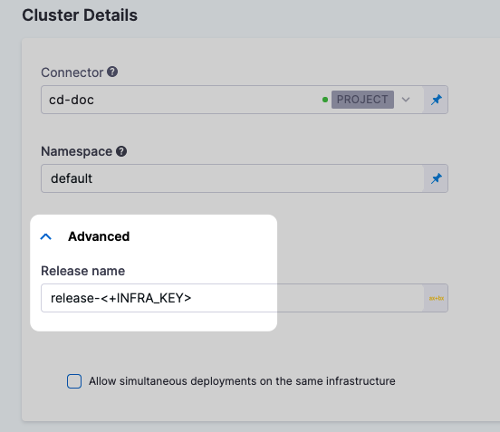
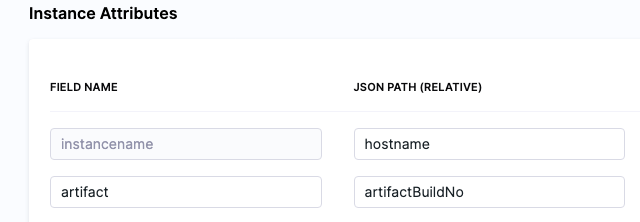
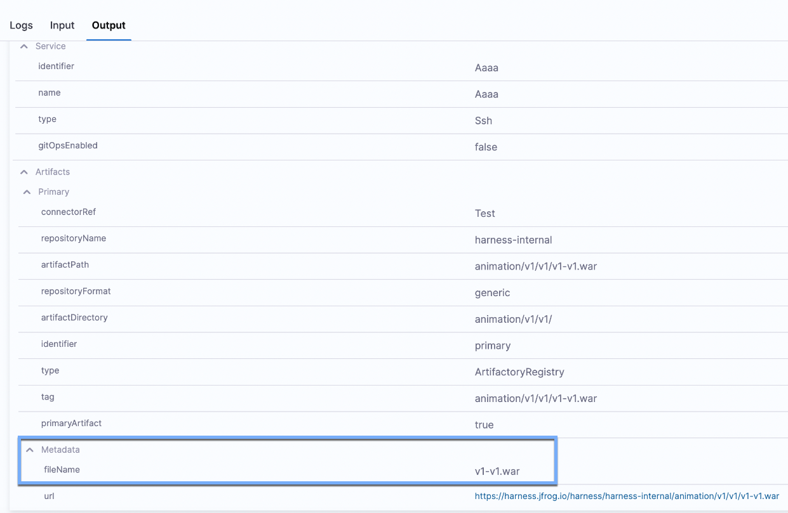
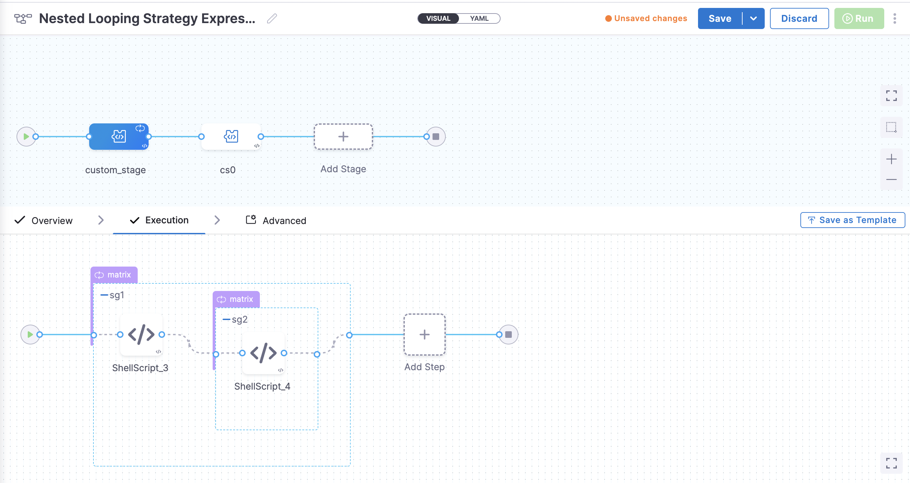

import Tabs from '@theme/Tabs';
import TabItem from '@theme/TabItem';

For most settings in Harness pipelines, you can use [fixed values, runtime inputs, or expressions](./runtime-inputs.md).

You can use expressions (also called Harness expressions, variable expressions, or sometimes Harness variables) to reference Harness input, output, and execution variables. These variables represent settings and values that exist in the pipeline before and during execution. These can include environment variables, secrets, pipeline/stage/step identifiers, and more. You can also [add your own variables](./add-a-variable.md) and use expressions to reference them.

This topic explains how Harness expressions work, how to write and use expressions, some built-in Harness expressions, and some prefixes used to identify user-defined variables.

Expressions are powerful and offer many options for modification or interaction. For more information about using expressions, go to:

* [Write expressions using any JSON parser tool](./expression-v2.md)
* [Use Java string methods](./expressions-java-methods.md)
* [Define variables](./add-a-variable.md)

## What is a Harness variable expression?

Harness variable expressions refer to variable values in Harness, such as entity names, configuration settings, custom variables, inputs/outputs, and more. At pipeline runtime, Harness evaluates any expressions present in the pipeline and replaces them with their resolved values.

For example, the expression `<+pipeline.name>` resolves to name of the pipeline where you're using that expression.

**Harness variables are powerful because they enable templatizing of configuration information, pipeline settings, values in scripts, and more. They also enable your pipelines to pass information between stages and settings.**

Harness has many built-in variables and expressions, and you can [define custom variables](./add-a-variable.md) that you can reference with expressions. Custom variables can be broadly scoped (such as account-wide or project-wide variables) or narrowly scoped (such as a variable for a specific pipeline or stage). Custom variables can store values that you need to reuse across many entities, or they can help you configure a specific build, such as runtime flags and environment variables for certain build tools.

Additionally, certain step types, such as [Run steps](/docs/continuous-integration/use-ci/run-step-settings.md) and [Shell Script steps](/docs/continuous-delivery/x-platform-cd-features/cd-steps/utilities/shell-script-step), can utilize and produce input, environment, and output variables that you define in the step settings. You can also reference these with expressions.

## Expression usage

To reference Harness variables, you use expressions consisting of the expression delimiter `<+...>` and a path to the referenced value, such as `<+pipeline.name>` or `<+secrets.getValue("SECRET_ID")>`.

In addition to [Fixed Values and Runtime Inputs](../variables-and-expressions/runtime-inputs.md), you can use Harness expressions in many settings in pipelines and other entities, like connectors and triggers.

<Tabs>
  <TabItem value="Visual" label="Visual">

In the Visual Editor, you can use the **Value type selector** to select **Expression**.


Harness provides suggestions for built-in expressions as you type. You can manually trigger the suggestions by placing your cursor after `<+` and pressing `ctrl + space`.


In free-text fields, such as **Command**, you can directly enter values using the appropriate syntax without changing the value type.


You can continue typing or select the expression from the list of suggestions.

</TabItem>
  <TabItem value="YAML" label="YAML" default>

When writing pipelines in YAML, enter the expression as the value for a field.

For example, this `connectorRef` setting takes it's value from an expression referencing a [pipeline variable](./add-a-variable.md) named `myConnector`.

```
          connectorRef: <+pipeline.variables.myConnector>
```

When you type `<+`, Harness provides suggestions for built-in expressions as you type. You can manually trigger the suggestions by placing your cursor after `<+` and pressing `ctrl + space`.


You can continue typing or select the expression from the list of suggestions.

</TabItem>
</Tabs>

:::info

Automated suggestions don't represent all possible expressions.

When Harness automatically suggests expressions, it suggests expressions based on the current context (meaning the setting or place in the YAML where you are entering the expression). While it doesn't suggest expressions that aren't valid in the current context, this doesn't prevent you from entering invalid expressions.

For guidance on building valid expressions, go to [Expression paths](#expression-paths) and [Debugging expressions](#debugging-expressions).

:::

### Expression paths

Harness expressions are references to variables, settings, and other values in Harness. When you use a Harness expression, you provide a path for Harness to follow to resolve the expression's value. Expressions can use [relative paths](#use-relative-paths) or [full paths (also referred to as FQNs)](#use-fqns).

:::tip path discovery

Harness offers several ways to help you build expression paths:

* [Get automated suggestions when typing expressions.](/docs/platform/variables-and-expressions/runtime-inputs.md#expressions)
* [Get input/output expressions from execution details.](#get-inputoutput-expressions-from-execution-details)
* [Get custom variable and input expressions from the Variables list.](#get-custom-variable-and-input-expressions-from-the-variables-list)
* [Use JSON parsing tools to help determine expression paths from complex output or YAML.](./expression-v2.md)

:::

#### Use FQNs

The format and length of an expression's Fully-Qualified Name (FQN) depends on the type of entity the expression is referencing and where it is located.

Some expressions have short FQNs, such as `<+account.name>`, which references your Harness account name, or `<+variable.account.accountVariableName>`, which references a [custom account variable](./add-a-variable.md). In contrast, expression referencing specific settings embedded a pipeline's YAML can have much longer FQNs, like this expression for a service variable in a CD stage: `<+pipeline.stages.stageID.spec.serviceConfig.serviceDefinition.spec.variables.serviceVariableName>`.

When referencing values within a pipeline, an expression's FQN is the path to the value you are referencing in the context of your pipeline's YAML. **For values in pipelines, the expression's full path/FQN, starting from `pipeline`, always works as a reference point.**

For example, the FQN for an expression referencing a CD service definition's `imagePath` setting is `<+pipeline.stages.stageID.spec.serviceConfig.serviceDefinition.spec.artifacts.primary.spec.impagePath>`. This reflects the path you would step through in the YAML to locate that value.


#### Use relative paths

To use a relative path, identify the common parent between the step/stage you're referring to and the step/stage where you're using the expression (making the reference), and then use the common parent to start the expression.

For example, to reference a CD service definition's `imagePath` setting in the same stage where that service definition is defined, you could use the relative expression `<+stage.spec.serviceConfig.serviceDefinition.spec.artifacts.primary.spec.impagePath>`.

### Use expressions only after they can be resolved

When Harness encounters an expression during pipeline execution, it tries to resolve the expression with the information it has at that point in the execution. This means that if you try to use an expression before Harness has the necessary information to resolve the expression's value, the expression resolves to `null` and the pipeline can fail or execute incorrectly.

This requirement applies regardless of how you are using the expression, such as with operators or in scripts. If Harness can't resolve the target value at the point when the pipeline requests the expression, the expression fails to resolve and the pipeline can fail.

:::warning

Your pipelines must use expressions *only* after Harness has the required information to resolve the expression's value.

:::

For example, assume you want to use this expression: `<+pipeline.stages.Stage_2.spec.execution.steps.Step_C.executionUrl>`. This expression calls the `executionUrl` from a step named `Step_C` that is in `Stage_2`. Since this step is in `Stage_2`, you could not use this expression in a previous stage, because the stage containing this expression's value hasn't run yet. Additionally, if there are steps before `Step_C` in `Stage_2`, those steps can't use this expression either, because they run before `Step_C`.

Here are some guidelines to help you successfully use expressions in pipelines:

- Don't refer to a step's expressions within that same step.
- Don't refer to values from a subsequent step/stage in a step/stage that runs before the referenced step/stage.
- Don't refer to step inputs/outputs in a CD stage's **Service** or **Environment** configuration.
   - In a CD stage, steps run after Harness evaluates the service and environment configuration. Consequently, Harness can't get values for expressions referencing step inputs/outputs while it is evaluating the service and environment configuration.
   - Similarly, don't refer to step inputs/output in a CI stage's **Infrastructure** or **Codebase** configuration. These are evaluated before steps run, so they can't use expressions referencing steps.

<details>
<summary>Example: Harness expression resolution throughout a CD stage</summary>

This example demonstrates when and where certain expressions (by prefix) are resolved over the duration of a CD stage, so that you can determine which events need to occur before you can safely reference a certain expression and ensure that it is successfully resolved when the pipeline runs.

<figure>


<figcaption>Different expressions originate from different parts of a stage. </figcaption>
</figure>

Here's when you can reference expressions resolved from information in each of these stage sections:

- **Service expressions** can be resolved only after Harness has progressed through the **Service** section of the pipeline. Consequently, you can use service expressions in the **Infrastructure** and **Execution** sections of the stage.
- **Infrastructure expressions** can be resolved only after Harness has progressed through the **Infrastructure** section of the pipeline.
  - In the **Infrastructure** section, you can reference **Service** settings.
  - Since **Execution** follows **Infrastructure**, you can reference **Infrastructure** expressions in **Execution**.
- **Execution expressions** apply to steps in **Execution**.
  - Each step's **Execution** expressions can be referenced only after Harness has progressed through that step in the **Execution** section.

<DocImage path={require('./static/harness-variables-21.png')} width="80%" height="80%" title="Click to view full size image" />

</details>

### Hyphens require escaping

Harness recommends not using hyphens/dashes (`-`) in variable and property names, because these characters can cause issues with headers and they aren't allowed in some Linux distributions and deployment-related software.

For example, this expression won't work: `<+execution.steps.httpstep.spec.headers.x-auth>`

If you must include a hyphen in an expression, such as with `x-auth`, you can wrap the property name in double quotes (`""`), such as `<+execution.steps.httpstep.spec.headers["x-auth"]>`.

This also applies to nested usage, such as:

```
<+execution.steps.httpstep.spec.newHeaders["x-auth"]["nested-hyphen-key"]>
<+execution.steps.httpstep.spec.newHeaders["x-auth"].nonhyphenkey>
```

If when referencing custom variables or matrix dimensions with hyphenated names, you must [use the `get()` method](/docs/platform/variables-and-expressions/add-a-variable.md#use-get-for-variable-names-with-hyphens-or-periods).

## Expression evaluation

Mechanically, Harness passes the content within the delimiter (`<+...>`) to the [Java Expression Language (JEXL)](http://commons.apache.org/proper/commons-jexl/) for evaluation at runtime.

For example, `<+pipeline.name>` evaluates to the name of the pipeline where that expression is used.

Here's an example of a shell script echoing some expressions, along with examples of output from those expressions.

```sh
echo <+pipeline.executionId>        # Output example: 1234-5678-abcd
echo <+pipeline.sequenceId>         # Output example: 16
echo <+stage.name>                  # Output example: dev
echo <+service.name>                # Output example: nginx
echo <+artifacts.primary.image>     # Output example: index.docker.io/library/nginx:stable
echo <+artifacts.primary.imagePath> # Output example: library/nginx
echo <+env.name>                    # Output example: demo
echo <+infra.namespace>             # Output example: default
echo <+infra.releaseName>           # Output example: demo
```

:::warning

Expressions can't resolve correctly if the target value isn't available at the time that Harness evaluates the expression. For more information, go to [Use expressions after they can be resolved](#use-expressions-after-they-can-be-resolved).

Additionally, variable values (after evaluation) are limited to 256 KB. Expressions producing evaluated values larger than this can have truncated values or fail to resolve.

:::

## Expression manipulation

In addition to standard evaluation, expressions can be evaluated and manipulated with Java string methods, JSON parsing, JEXL, interpolation, concatenation, and more.

### Compound expressions and operators require nested delimiters

When forming complex expressions, such as when using operators or methods with expressions, wrap the entire compound expression statement in the expression delimiter (`<+...>`).

For example, with the equals `==` and not equals `!=` operators, wrap the entire operation in the expression delimiter `<+...>`:

```
<+<+pipeline.name> == "pipeline1">
<+<+stage.variables.v1> != "dev">
```

Complex usage can have multiple levels of nesting. For example, the following compound expression concatenates values from two variables into one list, and then uses the `split()` method on the concatenated list. The original expressions, the concatenated list expression, and the method manipulation are all wrapped in expression delimiters:

`<+ <+<+pipeline.variables.listVar1> + "," + <+pipeline.variables.listVar2>>.split(",")>`

### Java string methods

You can [use any Java string method on Harness expressions](./expressions-java-methods.md).

### JEXL

You can [use JEXL to build complex expressions](./expression-v2.md).

For example, the following complex expression uses information from a [webhook trigger](/docs/platform/triggers/triggers-reference.md) payload:

`<+ <+<+trigger.payload.pull_request.diff_url>.contains("triggerNgDemo")> || <+trigger.payload.repository.owner.name> == "wings-software" >`

Notice the use of methods, operators, and nested delimiters (`<+...>`) forming a compound expression. Harness evaluates each individual expression and produces a final value by evaluating the entire JEXL expression.

### Ternary operators

When using ternary conditional operators (`?:`), wrap the entire expression in the expression delimiter `<+...>`, and don't use spaces between the operators and values.

Ternary operators in Harness follow the standard format, but you can't use spaces between the operators and values.

For example:

* Incorrect: `<+condition ? IF_TRUE : IF_FALSE>`
* Correct: `<+condition?IF_TRUE:IF_FALSE>`

<details>
<summary>Pipeline YAML example manipulating expressions with ternary operators</summary>

This pipeline uses a ternary operator to evaluate a stage variable named `myvar` with a value of `1.1`.

In the second `ShellScript` step, named `ternary`, the stage variable is referenced by the expression `<+stage.variables.myvar>` and evaluated with the ternary expression `== "1.1"?"pass":"fail"`. The entire compound expression is `<+ <+stage.variables.myvar> == "1.1"?"pass":"fail" >`.

```yaml
pipeline:
  name: exp
  identifier: exp
  projectIdentifier: CD_Docs
  orgIdentifier: default
  tags: {}
  stages:
    - stage:
        name: ternarydemo
        identifier: ternarydemo
        description: ""
        type: Custom
        spec:
          execution:
            steps:
              - step:
                  type: ShellScript
                  name: ShellScript_1
                  identifier: ShellScript_1
                  spec:
                    shell: Bash
                    onDelegate: true
                    source:
                      type: Inline
                      spec:
                        script: echo <+stage.variables.myvar>
                    environmentVariables: []
                    outputVariables: []
                  timeout: 10m
              - step:
                  type: ShellScript
                  name: ternary
                  identifier: ternary
                  spec:
                    shell: Bash
                    onDelegate: true
                    source:
                      type: Inline
                      spec:
                        script: echo <+ <+stage.variables.myvar> == "1.1"?"pass":"fail" >
                    environmentVariables: []
                    outputVariables: []
                  timeout: 10m
        tags: {}
        variables:
          - name: myvar
            type: String
            description: ""
            required: true
            value: "1.1"
```

</details>

For more information about using ternary operators in Harness, go to [Using Ternary Operators with Triggers](https://developer.harness.io/kb/continuous-delivery/articles/ternary-operator/).

### Expressions as strings

If you want to treat an expression as a string, you wrap it in double quotes, with the exception of secrets expressions (such as `<+secrets.getValue()>`) and some JSON usage.

For example, the following command has the expression `<+stage.name>` wrapped in double quotes because it is an element in an array of strings.

`<+<+pipeline.variables.changeType> =~ ["<+stage.name>","All"]>`

When using expressions as strings in JSON, the entire expression must be wrapped in double quotes, if that is required to make the JSON valid.

For example, in the following JSON, the expression `<+pipeline.variables.version>` must be wrapped in quotation marks because it resolves as a string in that part of the JSON. However, the expression `<+<+pipeline.variables.hosts>.split(\",\")>` isn't wrapped in quotation marks because it resolves as a list.

`"{\"a\":[ { \"name\": \"svc1\", \"version\": \"<+pipeline.variables.version>\", \"hosts\": <+<+pipeline.variables.hosts>.split(\",\")> } ]}"`

:::warning secrets as strings

Do not wrap `<+secrets.getValue()>` expressions in double quotes. While the secret ID within the `getValue()` method must be wrapped in double quotes, do not wrap the entire expression in double quotes, even when you want to treat it as a string.

This is because these expressions are resolved by an internal Secret Manager function. The value is not a primitive type string, and it must not be wrapped in double quotes.

For example, in the following complex expression, the `<+secrets.getValue()>` expression is not wrapped in double quotes, despite being used in an operation where another expression would be wrapped in double quotes.

`<+<+<+pipeline.variables.var1>=="secret1">?<+secrets.getValue("secret1")>:<+secrets.getValue("defaultSecret")>>`

:::

### Concatenation and interpolation

Harness supports complex usages of string interpolation, such as:

- Substituting an expression value within a path: `us-west-2/nonprod/eks/eks123/<+env.name>/chat/`
- Using an expression to supply the value of an identifier within another expression:
   - This example uses the index of the looped execution to pick the desired step by ID: `<+stage.spec.execution.steps.s1<+strategy.identifierPostFix>.steps.ShellScript_1.output.outputVariables.v1>`
   - This example would print the status of a stage where the stage name is defined as a stage variable: `<+pipeline.stages.<+pipeline.variables.stageName>.status>`

Harness string variables can be concatenated by default. Each expression can be evaluated and substituted in the string.

Previously, you always used `+` or `concat()` to join multiple expressions together. Now, you can simply list the expressions with spaces between, for example:

```
<+pipeline.name> <+pipeline.executionId>
```

The concatenation operator (`+`) and the `concat()` method also work. Note that these options require you to wrap the entire operation in the expression delimiter (`<+...>`). For example, the following syntax is valid:

```
<+<+pipeline.variables.var1> + "_suffix">
<+<+pipeline.variables.var1>.concat("_suffix")>
```

:::info

When concatenating expressions as strings, each expression must evaluate to a string.

If an expression does not satisfy this condition, use the `toString()` [method](/docs/platform/variables-and-expressions/expressions-java-methods) to convert it to a string.

For example, in `/tmp/spe/<+pipeline.sequenceId>` the variable `sequenceId` evaluates to an integer. When concatenating this with other string expressions, it must be converted to a string, such as: `/tmp/spe/<+pipeline.sequenceId.toString()>`

:::

## Input and output variables

Your pipelines, stages, and steps can ingest inputs and produce outputs. In general, input variables represent a pipeline's configuration - the settings and values defining how and where an execution runs. Output variables are the results of an execution - such as release numbers, artifact IDs, image tags, user-defined output variables, and so on.

You can use expressions to reference inputs and outputs. For example, you could reference a previous step's output in a subsequent step's command.

The expression to reference an input or output depends on the scope where it was defined and the scope where you're referencing it. Usually, the expression follows the YAML path to the setting, and the full path (starting from `pipeline`) is always a valid reference. For example, to reference the `command` setting for a Run step in a Build stage, you could use an expression like `<+pipeline.stages.BUILD_STAGE_ID.spec.execution.steps.RUN_STEP_ID.spec.command>`. If you were referencing this setting in another step in the same stage, you could use a relative path like `<+execution.steps.RUN_STEP_ID.spec.command>`.

### Get input/output expressions from execution details

In a pipeline's execution details, you can explore inputs and outputs for the pipeline as a whole, as well as for individual steps.

**From the execution details, you can quickly copy the expression to reference any step-level input or output.**

This is useful for determining expression paths, when debugging expressions, or when you're not sure which expression to use for a particular setting or value.

To do this:

1. Go to the execution details page. You can get there by going to your **Executions**, **Builds**, or **Deployments** history and selecting the execution you want to inspect.
2. To inspect step-level inputs and outputs, select a step in the execution tree, and then select the **Input** and **Output** tabs.

   For example, these are some inputs and outputs for a Kubernetes rollout deployment step:

   <DocImage path={require('./static/rolloutdeployment1.png')} width="50%" height="50%" title="Click to view full size image" /> <DocImage path={require('./static/rolloutdeployment3.png')} width="50%" height="50%" title="Click to view full size image" />

3. To get the expression referencing a particular input/output, hover over the **Input/Output Name** and select the **Copy** icon.

   For example, if you want to reference a Run step's **Command** setting, navigate to the Run step's **Input** on the execution details page, locate **command** under **Input Name**, and select the **Copy** icon. Your clipboard now has the expression for this Run step's command, such as `<+pipeline.stages.stageID.spec.execution.steps.RunStepID.spec.command>`.

   <DocImage path={require('./static/copy-run-command-expression.png')} width="80%" height="80%" title="Click to view full size image" />

   This example copies the **podIP** setting for a Kubernetes rollout deployment step, resulting in an expression such as `<+pipeline.stages.STAGE_ID.spec.execution.steps.STEP_ID.deploymentInfoOutcome.serverInstanceInfoList[0].podIP>`.

   <DocImage path={require('./static/name.png')} width="80%" height="80%" title="Click to view full size image" />

4. In the same way, you can copy values tied to specific inputs and output. Copying a value copies the literal value, not the expression. To reference this value by an expression, you need to use the **Copy** option for the **Input/Output Name**.

   <DocImage path={require('./static/value.png')} width="60%" height="60%" title="Click to view full size image" />

### Get custom variable and input expressions from the Variables list

You can get expressions for [custom pipeline variables](./add-a-variable.md) and execution inputs from the **Variables** list in the Pipeline Studio.

<DocImage path={require('./static/2d3f480ea623c75e83c074a1e8a6d90d1fb1eccc1d9c3bcda1184179483ef529.png')} width="60%" height="60%" title="Click to view full size image" />

If the variable is local to a scope within the pipeline, such as a stage or step group, you can copy either the local, relative-path expression (to use the expression in the origin scope) or the full path/FQN expression (to use the expression outside the origin scope, such as in another stage).


## Expressions reference

The following sections describe some Harness expressions. This information is not exhaustive.

### Account, org, and project expressions

* `<+account.identifier>`: The [identifier](../references/entity-identifier-reference.md) for your [Harness account](/docs/platform/get-started/subscriptions-licenses/view-account-info-and-subscribe-to-alerts.md).
* `<+account.name>`: Your Harness account name.
* `<+account.companyName>`: The company name associated with your Harness account.
* `<+org.identifier>`: The [identifier](../references/entity-identifier-reference.md) of an organization in your Harness account. The referenced organization depends on the context where you use the expression.
* `<+org.name>`: The name of the organization.
* `<+org.description>`: The description of the organization.
* `<+project.identifier>`: The [identifier](../references/entity-identifier-reference.md) of a Harness project in your Harness account. The referenced project depends on the context where you use the expression.
* `<+project.name>:` The name of the Harness project.
* `<+project.description>`: The description of the Harness project.
* `<+project.tags>:` All [Harness tags](/docs/platform/references/tags-reference) attached to the project.

### Approval expressions

Whenever a user grants an approval in a [Harness Manual Approval step](/docs/platform/approvals/approvals-tutorial), the pipeline maintains the user information of the approver for the rest of the pipeline execution. You can use these variables in notifications after an approval is granted.

:::info

These expressions apply to Harness Manual Approval *steps* only. They are not applicable to Approval stages or third-party approval steps (such as Jira or ServiceNow approval steps).

:::

* `<+approval.approvalActivities[0].user.name>`: The Harness username of the approver.
* `<+approval.approvalActivities[0].user.email>`: The email address of the approver.
* `<+approval.approvalActivities[0].comments>`: User comments from the approval, formatted as a single string. This variable is populated from the `comment` output variable generated by the Approval step.

Use the index value to get information from different Approval steps in the same pipeline. For example, if you have a Deploy stage with two Approval steps, the pipeline maintains a separate set of approval variable values for each Approval step. Use the array index in the expressions to access the values for a specific approval.


### CI codebase and environment variables

For information about variables and expressions relevant to Harness CI, go to:

- [CI codebase variables reference](/docs/continuous-integration/use-ci/codebase-configuration/built-in-cie-codebase-variables-reference.md)
- [CI environment variables reference](/docs/continuous-integration/use-ci/optimize-and-more/ci-env-var.md)

### Custom variables

For information about user-defined variables, including naming conventions, special handling, and other usage specifications, go to [Define variables](add-a-variable.md).

### Deployment environment expressions

In Harness CD, environments represent your deployment targets (such as QA, Prod, and so on). Each environment contains one or more **Infrastructure Definitions** that list your target clusters, hosts, namespaces, and so on. You can use expressions to reference environment values, such as `<+env.name>`, in a service's Values YAML file, specs, and config files, for example.

* `<+env.name>`: The name of the environment used in the current stage.
* `<+env.identifier>`: The [entity identifier](../references/entity-identifier-reference.md) of the environment used in the current stage.
* `<+env.description>`: The description of the environment.
* `<+env.type>`: The environment type, such as `Production` or `PreProduction`.
* `<+env.envGroupName>`: The name of the environment group to which the environment belongs, if defined. This expression resolves only if the deployment is done on an environment group.
* `<+env.envGroupRef>`: The environment group reference. This expression resolves only if the deployment is done on an environment group.

<DocImage path={require('./static/harness-variables-45.png')} width="50%" height="50%" title="Click to view full size image" />

:::tip

Environment expressions are useful. For example, you can use them in Service steps, or you can use JEXL to evaluate them in [conditional execution settings](/docs/platform/pipelines/step-skip-condition-settings.md), such as `<+env.type> != "Production"`.

:::

#### Custom environment-level variables

You can [define custom variables](./add-a-variable.md) in your environment and service definitions, and you can use expressions to reference those custom variables.

<DocImage path={require('./static/harness-variables-44.png')} width="50%" height="50%" title="Click to view full size image" />

Currently, there are two versions of [services and environments](/docs/continuous-delivery/get-started/services-and-environments-overview), v1 and v2. Services and environments v1 are being replaced by services and environments v2.

<!-- "The way you reference these custom variables can be different between v1 and v2." It is not clear that there is any difference or if this change is complete. -->

To reference custom environment-level variables, use the expression syntax `<+env.variables.variableName>`.

### Deployment infrastructure expressions

These expressions refer to deployment infrastructure configurations. Infrastructure definitions are associated with a deployment environment and they represent the actual clusters, hosts, etc., where Harness deploys a service.

* `<+infra.name>`: The name of the infrastructure definition used in a pipeline stage.

   <DocImage path={require('./static/harness-variables-46.png')} width="60%" height="60%" title="Click to view full size image" />

* `<+infra.infraIdentifier>`: The ID of the infrastructure definition used in a pipeline stage.
* `<+infra.tags>`: The [tags on a CD stage's infrastructure definition](/docs/continuous-delivery/get-started/services-and-environments-overview/#infrastructure-tags). To reference a specific tag use `<+infra.tags.TAG_KEY>`.
* `<+infra.connectorRef>`: The ID of the Harness connector used in the Deploy stage's infrastructure definition.
* `<+infra.connector.name>`: The name of the Harness connector used in the infrastructure definition.
* `<+infra.namespace>`: The namespace used in the infrastructure definition.
* `<+infra.releaseName>`: The release name used in the infrastructure definition.

#### INFRA_KEY and INFRA_KEY_SHORT_ID

`<+INFRA_KEY>` references the infrastructure key, which is a unique string that identifies a deployment target infrastructure.

The infrastructure key is a combination of `serviceIdentifier`, `environmentIdentifer` and set of values unique to each infrastructure definition implementation (Kubernetes cluster, etc.) hashed using `SHA-1`. For example, in case of a Kubernetes Infrastructure, the infrastructure key is a hash of `serviceIdentifier-environmentIdentifier-connectorRef-namespace`. The format is `sha-1(service.id-env.id-[set of unique infra values])`.

`<+INFRA_KEY_SHORT_ID>` is a shortened form of `<+INFRA_KEY>`. The shortened form is obtained by removing all but the first six characters of the hash of the infrastructure key.

:::warning

These expressions are literally `<+INFRA_KEY>` and `<+INFRA_KEY_SHORT_ID>`. These expressions use capital letters.

:::

Infrastructure keys are typically used in the **Release Name** setting to add labels to release for tracking. For example, in the infrastructure definition of a deploy stage, the `<+INFRA_KEY>` is used in the **Release Name** to give the release a unique name, such as `release-<+INFRA_KEY>`.



When the deployment runs, Harness adds the release name as a label. For example, in a Kubernetes deployment, `release-<+INFRA_KEY` might resolve as `harness.io/release-name=release-2f9eadcc06e2c2225265ab3cbb1160bc5eacfd4f`.

```
...
Pod Template:
  Labels:  app=hello
           deployment=hello
           harness.io/release-name=release-2f9eadcc06e2c2225265ab3cbb1160bc5eacfd4f
  Containers:
   the-container:
    Image:      monopole/hello:1
...
```

With the `INFRA_KEY`, Harness can track the release for comparisons and rollback.

:::info

To resolve issues experienced with Kubernetes and Native Helm deployments when using the long form `release-<+INFRA_KEY>`, Harness now uses `<+INFRA_KEY_SHORT_ID>` in the default expression that Harness uses to generate a release name for the resources in Kubernetes and Native Helm deployments. This means that the **Release name** field, in the **Advanced** section of the **Cluster Details** in the infrastructure definition is now pre-populated with `release-<+INFRA_KEY_SHORT_ID>`.

:::

### Deployment instance expressions

The following instance expressions are supported in [Secure Shell (SSH) deployments](/docs/continuous-delivery/deploy-srv-diff-platforms/traditional/ssh-ng), [WinRM deployments](/docs/continuous-delivery/deploy-srv-diff-platforms/traditional/win-rm-tutorial), and [Custom deployments using Deployment Templates](/docs/continuous-delivery/deploy-srv-diff-platforms/custom-deployment-tutorial).

These deployments can be done on physical data centers, AWS, and Azure. The deployment target determines which expressions you can use.

* For Microsoft Azure, AWS, or any platform-agnostic Physical Data Center (PDC):
   * `<+instance.hostName>`: The host/container/pod name where the microservice/application is deployed.
   * `<+instance.host.instanceName>`: Same as `<+instance.hostName>`.
   * `<+instance.name>`: The name of the instance on which the service is deployed.
* For Microsoft Azure or AWS:
   * `<+instance.host.privateIp>`: The private IP of the host where the service is deployed.
   * `<+instance.host.publicIp>`: The public IP of the host where the service is deployed.

To use instance expressions in pipelines, you must use a [repeat looping strategy](../pipelines/looping-strategies/looping-strategies-matrix-repeat-and-parallelism.md) and identify all the hosts for the stage as the target.

```yaml
repeat:
  items: <+stage.output.hosts>
```

When you use an instance expression in your pipeline, such as in a **Shell Script** step, Harness applies the script to all target instances. You do not have to loop through instances in your script.

For examples, go to [Run a script on multiple target instances](/docs/continuous-delivery/x-platform-cd-features/cd-steps/run-a-script-on-multiple-target-instances).

#### Instance attributes in deployment templates

For Deployment Templates, you can use instance expressions to reference host properties defined in the **Instance Attributes** in the deployment template.



Instances collected by the mandatory **instancename** field can be referenced by the expressions `<+instance.hostName>`, `<+instance.host.instanceName>`, or `<+instance.name>`.

To reference the other properties added to **Instance Attributes**, use the expression syntax `<+instance.host.properties.PROPERTY_NAME>`. For example, if you added a property named `artifact`, you could reference it with the expression `<+instance.host.properties.artifact>`.

### Kubernetes deployment expressions

#### HARNESS_KUBE_CONFIG_PATH

While this doesn't follow the typical Harness expression syntax, `${HARNESS_KUBE_CONFIG_PATH}` is an expression referencing the path to a Harness-generated kubeconfig file containing the credentials you provided to Harness. The credentials can be used by kubectl commands by exporting its value to the KUBECONFIG environment variable.

Harness only generates this kubeconfig file when a delegate is outside of the target cluster and is making a remote connection. When you set up the Kubernetes cluster connector to connect to the cluster, you select the **Specify master URL and credentials** option. The master URL and credentials you supply in the connector are put in the kubeconfig file and used by the remote delegate to connect to the target cluster.

Consequently, you can only use `${HARNESS_KUBE_CONFIG_PATH}` when you are using a delegate outside the target cluster and a Kubernetes cluster connector with the **Specify master URL and credentials** option.

If you are running the script using an in-cluster delegate with the **Use the credentials of a specific Harness Delegate** credentials option, then there are no credentials to store in a kubeconfig file since the delegate is already an in-cluster process.

You can use the `${HARNESS_KUBE_CONFIG_PATH}` expression in a [Shell script](/docs/continuous-delivery/x-platform-cd-features/cd-steps/utilities/shell-script-step) step to set the environment variable at the beginning of your kubectl script, such as `export KUBECONFIG=${HARNESS_KUBE_CONFIG_PATH}`. It cannot be used in other scripts such as a Terraform script.

For example:

```
## Get the pods in the default namespace
export KUBECONFIG=${HARNESS_KUBE_CONFIG_PATH} kubectl get pods -n default

## Restart a deployment object in the Kubernetes cluster
export KUBECONFIG=${HARNESS_KUBE_CONFIG_PATH}
kubectl rollout restart deployment/mysql-deployment
```

#### kubernetes.release.revision

You can use the expression `<+kubernetes.release.revision>` to get the deployment revision number.

This expression requires delegate version 23.04.79106 or later.

You can use this expression:

- In values.yaml, OpenShift Params, and Kustomize Patches.
- To reference the current Harness release number as part of your manifest.
- To reference versioned ConfigMaps and Secrets in custom resources and fields unknown by Harness.

**Important:** Users must update their delegate to version  to use this expression.

### Manifest expressions

Harness has generic manifest expressions and manifest expressions for specific deployment types.

Manifest settings are referenced by the manifest ID, which is located at `service.serviceDefinition.spec.manifests.manifest.identifier` in the Harness Service YAML.

<details>
<summary>Use Service YAML to get manifest expression paths</summary>

Reviewing the Service YAML can help you determine the expressions you can use. For example, the expression `<+manifests.mymanifest.valuesPaths>` can be created by using the manifest `identifier` and the `valuesPaths` in the following YAML:

```yaml
...
      manifests:
        - manifest:
            identifier: mymanifest                # <+manifests.MANIFEST_ID.identifier>
            type: K8sManifest                     # <+manifests.MANIFEST_ID.type>
            spec:
              store:                              # <+manifests.MANIFEST_ID.store>
                type: Harness
                spec:
                  files:
                    - account:/Templates
              valuesPaths:
                - account:/values.yaml
              skipResourceVersioning: false
...
```

</details>

#### Generic manifest expressions

Here are some generic manifest expressions:

* `<+manifest.MANIFEST_ID.commitId>`: The commit Id of the manifests used in a service. This is captured in the Deployment step [execution output](#get-inputoutput-expressions-from-execution-details).
* `<+manifests.MANIFEST_ID.identifier>`: Resolves to the manifest `identifier` in Harness. The `MANIFEST_ID` is the same as the resolved value of this expression; however, you could use this to use the manifest ID in a script, for example.
* `<+manifests.MANIFEST_ID.type>`: Resolves to the manifest `type`.
* `<+manifests.MANIFEST_ID.store>`: Resolves to where the manifest is stored. In the following example, the manifest is stored in the [Harness File Store](/docs/continuous-delivery/x-platform-cd-features/services/add-inline-manifests-using-file-store):

  ```
  ...
        manifests:
          - manifest:
              identifier: mymanifest
              type: K8sManifest
              spec:
                store:
                  type: Harness
                  spec:
                    files:
                      - account:/Templates
  ...
  ```

### Helm chart expressions

import HelmManifestExpressions from '/docs/continuous-delivery/shared/helm-manifest-expressions.md';

<HelmManifestExpressions name="helmexpressions" />

### Pipeline expressions

The following expressions reference information about a pipeline run, such as the execution ID or start time. For expressions referencing custom pipeline variables, go to [Custom variables](#custom-variables). For expressions referencing pipeline triggers, go to [Trigger expressions](#trigger-expressions).

* `<+pipeline.identifier>`: The pipeline's [identifier](../references/entity-identifier-reference.md) for the pipeline.
* `<+pipeline.name>`: The name of the current pipeline.
* `<+pipeline.executionId>`: Every pipeline run (execution) is given a universally unique identifier (UUID). The UUID can be referenced anywhere. The UUID forms the unique execution URL, for example:`https://app.harness.io/ng/#/account/:accountId/cd/orgs/default/projects/:projectId/pipelines/:pipelineId/executions/:executionId/pipeline`.
* `<+pipeline.resumedExecutionId>`: The execution ID of the root or original execution. This value is different from the `executionId` when it is a retry.
* `<+pipeline.sequenceId>`: The incremental sequential Id for the execution of a pipeline.

   While the `<+pipeline.executionId>` is randomly generated for each execution, the `<+pipeline.sequenceId>` increments with each run of the pipeline. The first run of a pipeline receives a sequence Id of 1 and each subsequent execution is incremented by 1.

   For CD pipelines, the Id is named execution. For CI pipelines, the Id is named builds.

      

   You can use `<+pipeline.sequenceId>` to tag a CI build when you push it to a repository, and then use `<+pipeline.sequenceId>` to pull the same build and tag in a subsequent stage. For examples, go to [Build and test on a Kubernetes cluster build infrastructure tutorial](/docs/continuous-integration/use-ci/set-up-build-infrastructure/k8s-build-infrastructure/tutorial-ci-kubernetes-build-infra) and [Integrating CD with other Harness modules](/docs/continuous-delivery/get-started/integrating-cd-other-modules).

* `<+pipeline.executionUrl>`: The execution URL of the pipeline. This is the same URL you see in your browser when you are viewing the pipeline execution.

   :::warning
   Harness has deprecated the version of this expression with an additional period, `<+pipeline.execution.Url>`.
   :::

* `<+pipeline.executionMode>`: This expression describes the pipeline's execution mode:
   * `NORMAL`: A normal execution. It could either have succeeded or failed.
   * `POST_EXECUTION_ROLLBACK`: A [post-deployment rollback](/docs/continuous-delivery/manage-deployments/rollback-deployments.md) execution.
   * `PIPELINE_ROLLBACK`: A [rollback pipeline](/docs/platform/pipelines/failure-handling/define-a-failure-strategy-for-pipelines) execution.

   This expression is useful in [conditional executions](/docs/platform/pipelines/step-skip-condition-settings). For example, you can create a conditional execution to ensure that a step runs only when a post-deployment rollback happens.

* `<+pipeline.startTs>`: The start time of a pipeline execution in [Unix Epoch format](https://www.epoch101.com/).
* `<+pipeline.selectedStages>`: The list of stages selected for execution.
* `<+pipeline.delegateSelectors>`: The pipeline-level [delegate selectors](/docs/platform/delegates/manage-delegates/select-delegates-with-selectors) selected via runtime input.
* `<+pipeline.storeType>`: If the pipeline is stored in Harness, the expression resolves to `inline`. If the pipeline is stored in a Git repository, the expression resolves to `remote`.
* `<+pipeline.repo>`: For remote pipelines, the expression resolves to the Git repository name. For inline pipelines, the expression resolves to `null`.
* `<+pipeline.branch>`: For remote pipelines, the expression resolves to the Git branch where the pipeline exists. For inline pipelines, the expression resolves to `null`.

### Secrets expressions

The primary way to reference secrets is with expressions like `<+secrets.getValue("SECRET_ID")>`.

For information about referencing secrets, go to the [Secrets documentation](/docs/category/secrets).

### Service expressions

Services represent your microservices and other workloads. Each service contains a **Service Definition** that defines your deployment artifacts, manifests or specifications, configuration files, and service-specific variables.


* `<+service.name>`: The name of the service defined in the stage where you use this expression.
* `<+service.description>`: The description of the service.
* `<+service.tags>`: The [tags](/docs/platform/references/tags-reference) on the service. To reference a specific tag use `<+service.tags.TAG_KEY>`.
* `<+service.identifier>`: The [identifier](../references/entity-identifier-reference.md) of the service.
* `<+service.type>`: Resolves to stage service type, such as Kubernetes.

   

* `<+service.gitOpsEnabled>`: Resolves to a Boolean value to indicate whether [the GitOps option](/docs/continuous-delivery/gitops/get-started/harness-cd-git-ops-quickstart) is enabled (`true`) or not (`false`).

#### Custom service-level variables

You can [define custom variables](./add-a-variable.md) in your environment and service definitions, and you can use expressions to reference those custom variables.


Currently, there are two versions of [services and environments](/docs/continuous-delivery/get-started/services-and-environments-overview), v1 and v2. Services and environments v1 are being replaced by services and environments v2.

To reference custom v2 service-level variables, use the expression syntax `<+serviceVariables.VARIABLE_NAME>`.

To reference custom v1 service-level variables, use the expression syntax `<+serviceConfig.serviceDefinition.spec.variables.VARIABLE_NAME>`.

#### Override service variables

To [override a service variable during the execution of a step group](/docs/continuous-delivery/x-platform-cd-features/cd-steps/step-groups/#override-service-variables-in-step-groups),  use`<+serviceVariableOverrides.VARIABLE_NAME>`.  This provides significant flexibility and control over your pipelines.

### Service artifacts expressions

You can use artifact expressions if you have selected an artifact in the [service definition of a service you are deploying](/docs/continuous-delivery/x-platform-cd-features/services/services-overview). If you have not selected an artifact, or your artifact is configured as runtime input (`<+input>`), you must select an artifact at pipeline runtime.

For more information and artifact expression usage examples, go to [CD artifact sources](/docs/continuous-delivery/x-platform-cd-features/services/artifact-sources).

<details>
<summary>Example: Kubernetes artifacts expressions</summary>

Here are example values for common artifact expressions for a Kubernetes deployment of a Docker image on Docker Hub:

```
<+artifacts.primary.tag>                       # Example value: stable
<+artifacts.primary.image>                     # Example value: index.docker.io/library/nginx:stable
<+artifacts.primary.imagePath>                 # Example value: library/nginx
<+artifacts.primary.imagePullSecret>           # Example value: ****
<+artifacts.primary.dockerConfigJsonSecret>    # Example value: ****
<+artifacts.primary.type>                      # Example value: DockerRegistry
<+artifacts.primary.connectorRef>              # Example value: DockerHub
```

You can also have [rollback artifacts](#rollback-artifacts) and [sidecar artifacts](#sidecar-artifacts).

For a detailed example, go to [Add container images as artifacts for Kubernetes deployments](/docs/continuous-delivery/deploy-srv-diff-platforms/kubernetes/cd-kubernetes-category/add-artifacts-for-kubernetes-deployments.md) and [Add a Kubernetes sidecar container](/docs/continuous-delivery/deploy-srv-diff-platforms/kubernetes/cd-kubernetes-category/add-a-kubernetes-sidecar-container.md)

</details>

#### Primary artifact names and paths

Use `<+artifacts.primary.image>` or `<+artifacts.primary.imagePath>` in your values YAML file when you want to deploy an artifact you have added to the **Artifacts** section of a CD stage service definition.

* `<+artifacts.primary.image>`: The full location path to the Docker image, such as `docker.io/bitnami/nginx:1.22.0-debian-11-r0`.
   * For non-containerized artifacts, use [`<+artifacts.primary.path>`](#artifact-path-filepath) instead.
   * To get the image name only, use `<+artifacts.primary.imagePath>`.
* `<+artifacts.primary.imagePath>`: The image name, such as `nginx`. To get the entire image location path use `<+artifacts.primary.image>`.
* `<+artifacts.primary.path>`: The full path to the non-containerized artifact. This expression is used in non-containerized deployments.
* `<+artifacts.primary.filePath>`: The file name of the non-containerized artifact. This expression is used in non-containerized deployments, such as a .zip file in AWS S3.

For more information, go to [Harness Kubernetes services](/docs/continuous-delivery/deploy-srv-diff-platforms/kubernetes/kubernetes-services.md#artifacts) and [Example Kubernetes Manifests using Go Templating](/docs/continuous-delivery/deploy-srv-diff-platforms/kubernetes/cd-k8s-ref/example-kubernetes-manifests-using-go-templating).

#### Primary artifact ID, tags, and labels

Use these expressions to get artifact identifiers, tags, and labels.

* `<+artifacts.primary.identifier>`: The **Id** of the **Primary** artifact added in a Service's **Artifacts** section.

   <DocImage path={require('./static/harness-variables-41.png')} width="60%" height="60%" title="Click to view full size image" />

* `<+artifacts.primary.tag>`: The tags on the pushed, pulled, or deployed artifact, such as AMI tags. For example, if you deployed the Docker image `nginx:stable-perl`, the `<+artifacts.primary.tag>` is `stable-perl`. This expression has no relationship to [Harness tags](/docs/platform/references/tags-reference.md).

* `<+<+artifacts.primary.label>.get("")>`: This expression uses the `get()` method to extract Docker labels from a Docker image artifact. Specify the label key in `get()`. For example `<+<+artifacts.primary.label>.get("maintainer")>` pulls the maintainer tag, such as `maintainer=dev@someproject.org`.

<details>
<summary>Example: Reference artifact labels</summary>

You can reference labels in Shell Script steps or elsewhere, for example:

```
echo <+<+artifacts.primary.label>.get("maintainer")>
echo <+<+artifacts.primary.label>.get("build_date")>
echo <+<+artifacts.primary.label>.get("multi.author")>
echo <+<+artifacts.primary.label>.get("key-value")>
echo <+<+artifacts.primary.label>.get("multi.key.value")>
```

When you run the pipeline, the expressions resolve to their respective label values in the execution logs.


</details>

#### Primary artifact repo type and connector

* `<+artifacts.primary.type>`: The type of repository used to add this artifact in the service's **Artifacts** section. For example, Docker Hub, ECR, or GCR.
* `<+artifacts.primary.connectorRef>`: The ID of the Harness connector used to connect to the artifact repository.

#### Primary artifact metadata

* `<+artifacts.primary.metadata.SHA>` or `<+artifacts.primary.metadata.SHAV2>`: Digest/SHA256 hash of the Docker image.

   Since Docker image manifest API supports two schema versions, schemaVersion1 and schemaVersion2, there could be SHA values corresponding to each version. For the SHA value of schemaVersion1, use `<+artifacts.primary.metadata.SHA>`. For the SHA value of schemaVersion2, use `<+artifacts.primary.metadata.SHAV2>`.

* `<+artifact.metadata.fileName>` and `<+artifact.metadata.url>`: The artifact metadata file name and metadata file URL. Not applicable to all artifact types. If populated, you can find these values in the execution details for the **Service** step, under the **Output** tab. For more information, go to [CD artifact sources](/docs/continuous-delivery/x-platform-cd-features/services/artifact-sources).

   

#### Artifacts with dockercfg or dockerconfigjson

* `<+artifacts.primary.imagePullSecret>`: If your Kubernetes cluster doesn't have permission to access a private Docker registry, the values.yaml or manifest file in service definition's **Manifests** section must use the `dockercfg` parameter. Then, if you add the Docker image in the service definition's **Artifacts** section, you can reference it with `dockercfg: <+artifacts.primary.imagePullSecret>`.
* `<+artifacts.primary.dockerConfigJsonSecret>`: If your Kubernetes cluster doesn't have permission to access a private Docker registry, the values.yaml or manifest files in the service definition's **Manifests** section must use the `dockerconfigjson` parameter. Then, if you add the Docker image in the service definition's **Artifacts** section, you can reference it with `dockerconfigjson: <+artifact.dockerConfigJsonSecret>`.

For more information and examples, go to [Pull an Image from a Private Registry for Kubernetes](/docs/continuous-delivery/deploy-srv-diff-platforms/kubernetes/cd-kubernetes-category/pull-an-image-from-a-private-registry-for-kubernetes) and [Harness Kubernetes services](/docs/continuous-delivery/deploy-srv-diff-platforms/kubernetes/kubernetes-services.md#pull-an-image-from-a-private-registry).

#### Rollback artifacts

You can use the syntax, `<+rollbackArtifact.ARTIFACT_DEFINITION_ID>` to pull artifact rollback information. For example, use `<+rollbackArtifact.metadata.image>` to pull the metadata of the artifact image used in the last successful deployment.

Harness pulls rollback artifact information from last successful deployment. If there's no previous successful deployment, then rollback artifact expressions resolve to `null`.

#### Sidecar artifacts

Sidecar artifact expressions include:

- `<+artifacts.sidecars.SIDECAR_IDENTIFIER.imagePath>`
- `<+artifacts.sidecars.SIDECAR_IDENTIFIER.image>`
- `<+artifacts.sidecars.SIDECAR_IDENTIFIER.type>`
- `<+artifacts.sidecars.SIDECAR_IDENTIFIER.tag>`
- `<+artifacts.sidecars.SIDECAR_IDENTIFIER.connectorRef>`

Replace `SIDECAR_IDENTIFIER` with the **Sidecar Identifier/ID** assigned when you added the artifact to Harness.

<DocImage path={require('./static/harness-variables-42.png')} width="60%" height="60%" title="Click to view full size image" />

<DocImage path={require('./static/harness-variables-43.png')} width="60%" height="60%" title="Click to view full size image" />

### Service config files expressions

You can use these expressions to reference files added in a service's **Config Files** section.

- `<+configFile.getAsString("CONFIG_FILE_ID")>`: Get config file contents as plain text.
- `<+configFile.getAsBase64("CONFIG_FILE_ID")>`: Get config file contents with Base64-encoding.

For more information, go to [Use config files in your deployments](/docs/continuous-delivery/x-platform-cd-features/services/cd-services-config-files.md#referencing-and-encoding-config-files).

## Stage

The following variables provide information on the pipeline stage.

### Expression examples

Here is an example of how to use `<+stage.variables>`. <!-- the collection of all stage variables rather than one variable -->

```
for var in <+stage.variables>;
do

    IFS=":"
    read -r key value <<< "$var"
    unset IFS
    echo "Key: $key"
    echo "Value: $value"

done
```

The above Bash script prints all the key-value pairs for the stage variables.
If the `<+stage.variables>` is `{"a":"A","b":"B","c":"C"}` then the output will be as follows:

```
Executing command ...
Key: a
Value: A
Key: b
Value: B
Key: c
Value: C
Command completed with ExitCode (0)
```

### Stage-level variables

Here is a quick video that explains how to create and reference pipeline, stage, and service variables.

<!-- Video:
https://www.youtube.com/watch?v=lqbmO6EVGuU-->
<DocVideo src="https://www.youtube.com/watch?v=lqbmO6EVGuU" />

Once you've created a stage, its settings are in the**Overview**tab. For example, here is the**Overview**tab for a deploy stage.


In**Advanced**, you can add**Stage Variables**.

Stage variables are custom variables you can add and reference in your stage and pipeline. They're available across the pipeline. You can override their values in later stages.

You can even reference stage variables in the files fetched at runtime.

For example, you could create a stage variable`name`and then reference its identifier in the Kubernetes values.yaml file used by this stage:`name: <+stage.variables.name>`:

```
name: <+stage.variables.name>
replicas: 2

image: <+artifacts.primary.image>
...
```

When you run this pipeline, the value for`name`is used for the values.yaml file. The value can be a fixed value, expression, or runtime input.

You reference stage variables**within their stage**using the expression`<+stage.variables.VARIABLE_NAME>`.

You reference stage variables**outside their stage**using the expression`<+pipeline.stages.STAGE_NAME.variables.VARIABLE_NAME>`.

### \<+stage.name>

The name of the stage where the expression is evaluated.


### \<+stage.description>

The description of the stage where the expression is evaluated.

### \<+stage.tags>

The tags on the stage where the expression is evaluated. For more information, go to [Tags Reference](../references/tags-reference.md).

These tags are different from Docker image tags.

### \<+stage.identifier>

The [entity identifier](../references/entity-identifier-reference.md) of the stage where the expression is evaluated.

### \<+stage.output.hosts>

Lists all of the target hosts when deploying to multiple hosts.

When you are deploying to multiple hosts, such as with an SSH, WinRM, or deployment template stage, you can run the same step on all of the target hosts.

To run the step on all hosts, you use the repeat [Looping Strategy](../pipelines/looping-strategies/looping-strategies-matrix-repeat-and-parallelism.md) and identify all the hosts for the stage as the target.

```
repeat:
  items: <+stage.output.hosts>
```

Here is an example with a Shell script step.


For examples, see the looping strategies used in the [Secure Shell (SSH) deployments](/docs/continuous-delivery/deploy-srv-diff-platforms/traditional/ssh-ng).

### \<+stage.executionUrl>

The execution URL of the stage. This is the same URL you see in your browser when you are viewing the pipeline execution.

Use the following fully qualified expression to get the execution URL for a specific stage in the pipeline:

```
<+pipeline.stages.STAGE_ID.executionUrl>

```

### \<+stage.delegateSelectors>

The stage level delegate selectors selected via runtime input

## Status

Pipeline, stage, and step status values are a Java enum. You can see the list of values in the **Status** filter on the Executions, Builds, or Deployments page:


You can use any status value in a JEXL condition. For example, `<+pipeline.stages.stage1.status> == "FAILED"`.

### Stage status

The expression `<+pipeline.stages.STAGE_ID.status>` resolves to the status of a stage.

You must use the expression after the stage in execution.

### Step status

The expression `<+pipeline.stages.STAGE_ID.spec.execution.steps.STEP_ID.status>` resolves to the status of a step. For example, `<+pipeline.stages.MyStageName.spec.execution.steps.mystep.status>`.

You must use the expression after the step in execution.

### Strategy status

<!-- move to looping strategy page and redirect? -->

The statuses of the nodes (stages/steps) using a matrix/repeat looping strategy can be `RUNNING`, `FAILED`, or `SUCCESS`.

Harness provides the following expressions to retrieve the current status of the node (stage/step) using a looping strategy. The expressions are available in pipelines during execution and rollback.

#### \<+strategy.currentStatus>

The current status of the looping strategy for the node with maximum depth.

When this expression is used in a step, Harness will resolve it to the looping strategy current status of the first parent node (stage/step) of the step.

In cases where both the step and the stage have the looping strategy configured, the expression will resolve to the looping strategy status of the current step.

If the step (or step group) does not have the looping strategy configured, the expression will instead resolve to the looping strategy status of the current stage.

#### \<+strategy.node.STRATEGY_NODE_IDENTIFIER.currentStatus>

The current status of the looping strategy for the node with a specific stage/step identifier, `STRATEGY_NODE_IDENTIFIER`.

For example, `echo <+strategy.node.cs1.currentStatus>`.

#### \<+\<+strategy.node>.get("STRATEGY_NODE_IDENTIFIER").currentStatus>

The current status of the looping strategy for the node with a specific stage/step identifier, `STRATEGY_NODE_IDENTIFIER`.

For example, `echo <+<+strategy.node>.get("ShellScript_1").currentStatus>`.

### Status, currentStatus, and liveStatus

Pipeline and stage status expressions can reference the `status`, `currentStatus`, or `liveStatus`. These variables track different statuses, and they can resolve differently depending on the success or failure of specific steps or stages.

`status` refers to the running status of a single node. `currentStatus` and `liveStatus` provide the combined statuses of all running steps within a pipeline or stage. The difference between status types is based on how they handle step failures and if the status of steps running in a matrix or strategy is included in the overall status calculation.

#### Status

The `status` refers to the current running status of a single node, such as a pipeline, stage, or step. It provides information about the state of that specific node without considering the status of any parent, child, or sibling nodes. It reports the direct status of the target node.

Example expression: `<+pipeline.stages.STAGE_ID.status>`

#### currentStatus

The `currentStatus` represents the combined status of all the running steps within a pipeline or stage, except steps generated from [matrix/repeat looping strategies](/docs/platform/pipelines/looping-strategies/looping-strategies-matrix-repeat-and-parallelism.md).

`currentStatus` uses the statuses of all non-matrix steps to determines the overall status. If *any* non-matrix step fails, regardless of the progress or status of other steps, the `currentStatus` of both the pipeline and the stage resolves as `Failed`. This means that the failure of one step can affects the status of the entire pipeline or stage.

:::info

`currentStatus` *ignores* steps generated from matrix/repeat looping strategies. This means that if a pipeline includes a step generated from a matrix, and the matrix step fails while all other steps succeed, then the `currentStatus` is `Success` because `currentStatus` ignores the matrix step.

:::

Example expression: `<+pipeline.stages.STAGE_ID.currentStatus>`

#### liveStatus

Like `currentStatus`, `liveStatus` also provides the combined status of all the running steps within a pipeline or stage; however it also considers the status of steps generated from [matrix/repeat looping strategies](/docs/platform/pipelines/looping-strategies/looping-strategies-matrix-repeat-and-parallelism.md).

`liveStatus` considers the statuses of *all* steps to determine the overall status. If *any* step fails, the `liveStatus` of both the pipeline and the stage resolves as `Failed`, regardless of the individual status of running or completed steps.

:::info

`liveStatus` *includes* steps generated by matrix/repeat looping strategies. This means that if a pipeline includes a step generated from a matrix, and the matrix step fails while all other steps succeed, then the `liveStatus` is `Failed` because `liveStatus` includes the matrix step.

:::

Example expression: `<+pipeline.stages.stage1.liveStatus>`

#### Example: Status determination

The following example describes an ongoing execution with three steps named `step1`, `step2`, and `step3` within a stage called `stage1`.

`step1` is executed using a matrix strategy, specifically with two values: `"john"` and `"doe"`.

Assume this pipeline is running and the stage, steps, and matrix instances of `step3` have the following statuses:

- `stage1`: Running
- `step1`: Success
- `step2`: Success
- `step3` (matrix): Running
   - `"john"`: Failed
   - `"doe"`: Success

In this example, the status values for `stage1` are as follows:

- The `status` of `stage1` is `Running`. This is taken directly from the execution status of `stage1`.
- The `currentStatus` of `stage1` is `Success`. This is determined from the statuses of all steps in the stage, excluding the matrix steps generated by `step3`.
- The `liveStatus` of `stage1` is `Failed`. This is determined by considering the statuses of all steps in the stage, including the matrix steps generated by `step3`.

## Step

The following instance expressions are for stage steps.

### \<+step.name>

The step name.

### \<+step.identifier>

The step [identifier](/docs/platform/references/entity-identifier-reference/).

### \<+step.executionUrl>

The execution URL of the step. This is the same URL you see in your browser when you are viewing the pipeline execution.

Use the following fully qualified expression to get the execution URL for a specific step in the pipeline:

```
<+pipeline.stages.STAGE_ID.spec.execution.steps.STEP_ID.executionUrl>
```

### \<+steps.STEP_ID.retryCount>

When you set the failure strategy to **Retry Step**, you can specify the retry count for a step or all steps in the stage.

Harness includes a `retryCount` built-in expression that resolves to the total number of times a step was retried:

```
<+execution.steps.STEP_ID.retryCount>
```

You can use this expression in a Shell Script step script anywhere after the step that you identify in the expression.

For example, here is a script that resolves the retry count for the step with the Id `ShellScript_1`:

```
echo "retry count of ShellScript_1: <+execution.steps.ShellScript_1.retryCount>"
```

During pipeline execution, the expression would resolve to something like this:

```
retry count of ShellScript_1: 2
```

## Strategy

<!-- move to Looping strategy page & redirect? -->

You can use Harness expressions to retrieve the current execution status or identifiers for iterations of a [matrix or repeat looping strategy](/docs/platform/pipelines/looping-strategies/looping-strategies-matrix-repeat-and-parallelism).

### Strategy identifierPostFix

When you use a looping strategy like matrix or parallelism on a stage/step/step group, Harness automatically generates the unique Ids of the child stages/steps/step groups created by the looping operation.

The `identifierPostFix` is a postfix added to the identifiers of nodes (stage/step/step group) during execution when the node is a child of the looping strategy. This ensures that all children of the looping strategy have unique identifiers.

For example, here is a matrix strategy for a stage:

```
strategy:
  matrix:
    repo:
      - docker
      - gcr
      - ecr
```

The above matrix will spawn 3 stages by picking `repo` values `docker`, `gcr`, and `ecr`.

The `identifierPostfix` values would be `_docker`, `_gcr`, and `_ecr` for the different combinations of each stage run.

Let's look at an example for parallelism:

```
strategy:
  parallelism: 4
```

The above strategy will spawn 4 stages/steps and the `identifierPostfix` values will be `_0`, `_1`, `_2`, and `_3`.

#### \<+strategy.identifierPostFix>

This expression retrieves the `identifierPostFix` of the current node or any parent node that is a child of the looping strategy.

When used in a step, Harness resolves `<+strategy.identifierPostFix>` to the `identifierPostFix` of the child node belonging to the first looping strategy parent node (either stage or step).

If both the step and stage have the looping strategy configured, the expression resolves to the `identifierPostFix` of the step.

If the step (or stepGroup) does not have the looping strategy configured, the expression resolves to the `identifierPostFix` of the stage.

Let's look at an example using the execution of a stage with the identifier `build_and_upload` and matrix looping strategy.

Multiple child stages will be created from the `build_and_upload` stage. These child stages will have identifiers with the postfix appended, such as `build_and_upload_0`, `build_and_upload_docker`, etc. In this scenario, using the expression `<+strategy.identifierPostFix>` will result in value `_0` or `_docker`.

#### \<+step.identifierPostFix>

This expression returns the `identifierPostFix` of the current step when the step is a child of a looping strategy.

#### \<+stage.identifierPostFix>

This expression retrieves the `identifierPostFix` of the stage when the current node's stage is a child of a looping strategy.

#### \<+stepGroup.identifierPostFix>

This expression returns the `identifierPostFix` of the step group when the current node is under the step group, or when the current node is the step group itself, and that step group is a child of a looping strategy.

#### \<+strategy.node.STRATEGY_NODE_IDENTIFIER.identifierPostFix>

This expression retrieves the `identifierPostFix` for the node that is the child of a looping strategy with the identifier `STRATEGY_NODE_IDENTIFIER`.
For example, let's consider two nested step groups, sg1 and sg2 (child of sg1). Both sg1 and sg2 have a looping strategy configured. The expression, `<+stepGroup.identifierPostFix>` always retrieves the `identifierPostFix` of sg2.

Use the following expressions to obtain the `identifierPostFix` for a specific step group:

- `<+strategy.node.sg1.identifierPostFix>`: Retrieves the `identifierPostFix` for the node with the identifier sg1 (parent step group).
- `<+strategy.node.sg2.identifierPostFix>`: Retrieves the `identifierPostFix` for the node with the identifier sg2 (child step group).



Similarly, you can use other strategy expressions for any specific strategy level if a looping strategy is configured for both the parent and child nodes.

#### \<+strategy.node.STRATEGY_NODE_IDENTIFIER.\*>

Using this format, you can retrieve the values of any strategy expressions associated with looping strategies at various levels. This is useful when looping strategies are configured within nested levels.

Here are some examples:

- `<+strategy.node.sg1.iteration>`: Retrieves the current iteration of the node with the identifier sg1 (parent step group).
- `<+strategy.node.sg2.iteration>`: Retrieves the current iteration of the node with the identifier sg2 (child step group).
- `<+strategy.node.some_node_with_looping_strategy.iteration>`: Retrieves the current the iteration of the node with identifier `some_node_with_looping_strategy` (`some_node_with_looping_strategy` can be any type of node stage, step, or step group).
- `<+strategy.node.sg1.iterations>`: Retrieves the total iterations of the node with the identifier sg1.
- `<+strategy.node.sg2.iterations>`: Retrieves the total iterations of the node with the identifier sg2.
- `<+strategy.node.some_node_with_looping_strategy.iterations>`: Retrieves the total iterations of the node with the identifier `some_node_with_looping_strategy`.
- `<+strategy.node.sg1.matrix.key1>`: Retrieves the value for the matrix axis key1 for the node with the identifier sg1 if a matrix looping strategy is configured for sg1.
- `<+strategy.node.sg2.matrix.key1>`: Retrieves the value for the matrix axis key1 for the node with the identifier sg2 if a matrix looping strategy is configured for sg2.
- `<+strategy.node.some_node_with_looping_strategy.matrix.key1>`: Retrieves the value for the matrix axis key1 for the node with the identifier `some_node_with_looping_strategy` if a matrix looping strategy is configured for `some_node_with_looping_strategy`.

### Strategy statuses

For strategy status expressions, go to [Status](#status).

## Tag expressions

You can reference tags using Harness expressions.

You simply reference the tagged entity and then use `tags.TAG_NAME`, like `<+pipeline.tags.docs>`

For example, here are several different references:

- `<+pipeline.tags.TAG_NAME>`
- `<+stage.tags.TAG_NAME>`
- `<+pipeline.stages.STAGE_ID.tags.TAG_NAME>`
- `<+serviceConfig.service.tags.TAG_NAME>`

## Trigger expressions

### \<+trigger.artifact.build>

Resolves to the artifact version (such as a Docker Tag) that initiated an [On New Artifact Trigger](../triggers/trigger-on-a-new-artifact.md).

When you add a new artifact trigger, you select the artifact to listen on, and its **Tag** setting is automatically populated with `<+trigger.artifact.build>`.


The`<+trigger.artifact.build>`used for**Tag**makes sure that the new artifact version that executed the trigger is used for the deployment.

Adding a new tag to the artifact fires the trigger and executes the pipeline. Harness resolves `<+trigger.artifact.build>` to the tag that fired the trigger. This makes sure that the new tag is used when pulling the artifact and the new artifact version is deployed.

### \<+trigger.artifact.source.connectorRef>

Resolves to the Harness connector Id for the connector used to monitor the artifact registry that fired the trigger.

### \<+trigger.artifact.source.imagePath>

Resolves to the image path for the artifact that fired the trigger.

### Git trigger and payload expressions

Harness includes built-in expressions for referencing trigger details such as a PR number.

For example:

- `<+trigger.type>`
  - Webhook.
- `<+trigger.event>`
  - PR, PUSH, etc.

For a complete list, see [Triggers Reference](../triggers/triggers-reference.md).

### Triggers and RBAC

Harness RBAC is applied to triggers in Harness, but it is not applied to the repositories used by the triggers.

For example, you might have an [On New Artifact Trigger](../triggers/trigger-on-a-new-artifact.md) that is started when a new artifact is added to the artifact repo. Or a [Webhook Trigger](../triggers/triggering-pipelines.md) that is started when a PR is merged.

You can select who can create and use these triggers within Harness. However, you must use your repository's RBAC to control who can add the artifacts or initiate events that start the Harness trigger.

* `<+pipeline.triggerType>`: The type of trigger. For more information, go to [Triggers](#triggers).

Here are the possible `<+pipeline.triggerType>` and `<+trigger.type>` values.

| **\<+pipeline.triggerType>** | **\<+trigger.type>** | **Description**                                               |
| :--------------------------- | :------------------- | :------------------------------------------------------------ |
| ARTIFACT                     | Artifact             | New artifact trigger. For example, new Docker Hub image tag   |
| SCHEDULER_CRON               | Scheduled            | Scheduled Cron trigger                                        |
| MANUAL                       | _null_               | Pipeline triggered using the RUN button in the user interface |
| WEBHOOK_CUSTOM               | Custom               | Custom webhook trigger                                        |
| WEBHOOK                      | Webhook              | SCM webhook trigger. For example, GitHub pull request         |

### \<+pipeline.triggeredBy.name>

The name of the user or the trigger name if the pipeline is triggered using a webhook. For more information, go to [Trigger Pipelines using Git Events](../triggers/triggering-pipelines.md).

If a user name is not present in the event payload, the `<+pipeline.triggeredBy.name>` expression will resolve as empty. For example, in the SaaS edition of Bitbucket, a user name is not present.

### \<+pipeline.triggeredBy.email>

The email of the user who triggered the pipeline. This returns NULL if the pipeline is triggered using a webhook. For more information, go to [Trigger How-tos](/docs/category/triggers).

## Troubleshooting expressions

The following sections describe some common issues or troubleshooting scenarios for expressions. For more troubleshooting information, go to the [Harness Knowledge Base](/kb).

### Debugging expressions

In addition to [getting inputs and outputs from execution details](#get-inputoutput-expressions-from-execution-details), you can debug expressions with Compiled Mode in the pipeline's **Variables** list.

Open ***Variables** in the Pipeline Studio, and enable **View in Compiled Mode**.

With Compiled Mode enabled, all variables in the panel are compiled to display their values based on the most recent execution. You can use the dropdown menu to use inputs from a different run.


Harness highlights expressions that are incorrect or can't be evaluated using the selected execution data. Once you identify the expressions that aren't evaluating correctly, you can disable Compiled Mode and correct the expressions or variables as needed.

To test expression that aren't stored in pipeline variables, such as expressions in scripts, you can create a pipeline variable to use for debugging purposes, input the expression as the variable's value, and then use Compiled Mode to debug it.

### String expressions can't use greater than or less than

Greater than and less than operators aren't supported for string type expressions.

String expressions only support equal to and not equal to operators.

### Don't embed scripts in expressions

You *can* use expressions in scripts, and you *can* manipulate expressions with methods and operators; however, **you can't write scripts *within* expressions**.

For example, the following is not valid:

```sh
if ((x * 2) == 5) { <+pipeline.name = abc>; } else { <+pipeline.name = def>; }
```

If your script requires this type of value manipulation, feed the expression into a script-level variable, and then manipulate the script variable to perform the manipulation. For example:

```sh
NAME = <+pipeline.name>

if ((x * 2) == 5) { $NAME = abc; } else { $NAME = def; }
```

### Limit or remove expressions in comments

Harness attempts to resolve all expressions, including expressions in script comments.

Harness recommends removing unneeded expressions from comments so they don't cause unexpected failures or add build time through unnecessary processing.

#### Expressions aren't valid in comments in Values YAML and Kustomize patches

Regardless of their validity, you can't use Harness expressions in comments in:

- Values YAML files (values.yaml) in Kubernetes, Helm chart, or Native Helm deployments.
- Kustomize patches files.

For example, the following values.yaml file won't process correctly because it has an expression in the comment.

```yaml
name: test
replicas: 4
image: <+artifacts.primary.image>
dockercfg: <+artifacts.primary.imagePullSecret>
createNamespace: true
namespace: <+infra.namespace>
# using expression <+infra.namespace>
```

### CI stage initialization fails with a "null value" error

If a Build (`CI`) stage fails at initialization with a "null value" error, this can indicate that an expression was called before its value could be resolved. For more information, go to [Initialize step fails with a "null value" error](https://developer.harness.io/kb/continuous-integration/continuous-integration-faqs#initialize-step-to-fails-with-a-null-value-error).

### Default values can't start with an asterisk

Pipelines fails if a variable's default value starts with `*`. To avoid this wrap the asterisk or value in quotes, such as `"*"`.

## Migrate FirstGen expressions to NextGen

Use this information if you need to migrate expressions from Harness FirstGen to Harness NextGen.

:::warning

All FirstGen expressions use the delimiter `${...}`, such as `${approvedBy.name}`.

In NextGen, the delimiter is `<+...>`, such as `<+approvedBy.name>`.

:::

For more information about migrating to NextGen, go to:

- [Upgrade guide](/docs/continuous-delivery/get-started/upgrading/upgrade-nextgen-cd.md)
- [FirstGen and NextGen CD parity matrix](/docs/continuous-delivery/get-started/upgrading/feature-parity-matrix/)
- [Harness CD upgrading FAQ](/docs/continuous-delivery/get-started/upgrading/cdng-upgrade-faq/)

<details>
<summary>AMI expressions</summary>

| FirstGen | NextGen |
| -------- | ------- |
| `ami.newAsgName` | Rolling: `pipeline.stages.STAGE_ID.spec.execution.steps.AsgRollingDeployStep.output.asg.autoScalingGroupName`<br/>Blue Green: `pipeline.stages.STAGE_ID.spec.execution.steps.AsgRollingDeployStep.output.prodAsg.autoScalingGroupName`       |
| `ami.oldAsgName`    | Rolling: `pipeline.stages.STAGE_ID.spec.execution.steps.AsgRollingDeployStep.output.asg.autoScalingGroupName`<br/>Blue Green: `pipeline.stages.STAGE_ID.spec.execution.steps.AsgRollingDeployStep.output.stageAsg.autoScalingGroupName`    |

</details>

<details>
<summary>Approvals expressions</summary>

| FirstGen | NextGen |
| -------- | ------- |
| `approvedBy.name`  | `pipeline.stages.STAGE_ID.spec.execution.steps.HarnessApproval.output.approvalActivities[0].user.name`  |
| `approvedBy.email` | `pipeline.stages.STAGE_ID.spec.execution.steps.HarnessApproval.output.approvalActivities[0].user.email ` |

</details>

<details>
<summary>Artifacts expressions</summary>

| FirstGen | NextGen |
| -------- | ------- |
| `artifact.metadata.image`  | `artifact.image`  |
| `artifact.source.dockerconfig` | `artifact.imagePullSecret`  |
| `artifact.metadata.tag`<br/>`artifact.buildNo`<br/>`artifact.revision`  | `artifact.tag`    |
| `artifact.url` | `artifact.metadata.url` |
| `artifact.metadata.image`      | `artifact.imageartifact.image`<br/>Path for sidecar artifact: `artifacts.sidecars.sidecarId.PROPERTY`  |
| `artifact.metadata.KEY`     | `artifact.metadata.KEY` |
| `artifact.key`  | `artifact.metadata.key`   |
| `artifact.source.registryUrl`   | Depends on artifact source type. Check the output of the Service step.   |
| `artifact.source.repositoryName`   | Depends on artifact source type. Check the output of the Service step.   |
| `artifact.metadata.artifactId`      | `artifact.metadata.artifactId` |
| `artifact.bucketName`   | `artifact.metadata.bucketName` |
| `artifact.artifactPath`    | `artifact.metadata.artifactPath`   |
| `artifact.metadata.repositoryName`   | `artifact.metadata.repositoryName`    |
| `artifact.metadata.harness`     | `artifact.metadata.harness`     |
| `artifact.metadata.groupId`      | `artifact.metadata.groupId`     |
| `artifact.fileName`     | `artifact.metadata.fileName`    |
| `artifact.metadata.getSHA()`  | `artifact.metadata.SHA`   |
| Application  | Application (account, org, project)    |
| `app.name`   | `account.name`<br/>`account.companyName`<br/>`org.name`<br/>`project.name`<br/>`projectidentifier`   |
| `app.description`   | `project.description`<br/>`org.description`   |
| `app.accountId`  | `account.identifier`    |
| `app.defaults.[variable_name]`     | `variable.[VARIABLE_ID]`  |
| `artifact.displayName`   |    |
| `artifact.label.label-key`  |    |
| `artifact.buildFullDisplayName`  |       |
| `artifact.label.get("[label-key]")`   |    |
| `artifact.serviceIds`    | Not applicable in NextGen    |
| `artifact.description`   | Not applicable in NextGen   |
| `artifact.source.username`   | Not applicable in NextGen |

</details>

<details>
<summary>CloudFormation expressions</summary>

| FirstGen | NextGen |
| -------- | ------- |
| `cloudformation.OUTPUT_NAME`    | `pipeline.stages.STAGE_ID.spec.execution.steps.CreateStack.output.OUTPUT_NAME`   |
| `cloudformation.region`  | `pipeline.stages.stage1.spec.execution.steps.CreateStack.output.region`    |

</details>

<details>
<summary>CONFIG file and CONFIG path expressions</summary>

Harness NextGen has expressions for CONFIG files. These expressions, listed below, have no equivalent FirstGen expressions. This is not an exhaustive list of all NextGen expressions or NextGen expressions without a FirstGen equivalent.

* `configFile.getAsString("cf_file")`
* `configFile.getAsBase64("cf_file") `
* `configFile.getAsString("cf_secret") `
* `configFile.getAsBase64("cf_secret")`
* `fileStore.getAsString("/folder1/configFileProject")`
* `fileStore.getAsBase64("account:/folder1/folder2/ConfigFile")`

For information about the replacement for the FirstGen KUBE_CONFIG_PATH expression `infra.kubernetes.infraId`, go to [HARNESS_KUBE_CONFIG_PATH](#harness_kube_config_path).

</details>

<details>
<summary>Email step expressions</summary>

| FirstGen | NextGen |
| -------- | ------- |
| `toAddress`  | `pipeline.stages.STAGE_ID.spec.execution.steps.STEP_ID.spec.to`    |
| `ccAddress`   | `pipeline.stages.STAGE_ID.spec.execution.steps.STEP_ID.spec.cc`    |
| `subject`       | `pipeline.stages.STAGE_ID.spec.execution.steps.STEP_ID.spec.subject`     |
| `body`     | `pipeline.stages.STAGE_ID.spec.execution.steps.STEP_ID.spec.body`      |

</details>

<details>
<summary>Environment expressions</summary>

| FirstGen | NextGen |
| -------- | ------- |
| `env.description`    | FQN: `stages.STAGE_ID.spec.infrastructure.environment.name`(Alias: `env.description`)<br/>FQN: `stages.STAGE_ID.spec.infrastructure.environment.description`   |
| `env.environmentType`   | `env.type`     |
| `env.name`   | `env.name`     |
| `env.accountId`    | `account.identifier`    |
| `env.keywordsenvironmentVariable.variable_name`   | `env.variables.var_name`    |

</details>

<details>
<summary>HTTP step expressions</summary>

| FirstGen | NextGen |
| -------- | ------- |
| `httpResponseCode` | `httpResponseCode` |
| `httpResponseBody` | `httpResponseBody` |
| `httpMethod` | `httpMethod` |
| `httpUrl` | `httpUrl` |
| `httpResponseMethod` | `pipeline.stages.HTTP.spec.execution.steps.STEP_ID.output.httpMethod` |
| `httpResponseCode` | `pipeline.stages.HTTP.spec.execution.steps.STEP_ID.output.httpResponseCode` |
| `httpResponseBody` | `pipeline.stages.HTTP.spec.execution.steps.STEP_ID.output.httpResponseBody` |

</details>

<details>
<summary>Infrastructure expressions</summary>

| FirstGen | NextGen |
| -------- | ------- |
| `infra.kubernetes.namespace`   | `infra.namespace`<br/>`infra.releaseName`<br/>FQN: `stages.STAGE_ID.spec.infrastructure.infrastructureDefinition.spec.namespace` |
| `infra.name`   | `infra.name`    |
| `infra.cloudProvider.name`   | `infra.connectorRef`    |
| `infra.route`    |      |
| `infra.tempRoute`   |         |

</details>

<details>
<summary>Instance and host expressions</summary>

All FirstGen `host` expressions are deprecated. Host properties are available using `instance` expressions.

| FirstGen | NextGen |
| -------- | ------- |
| `instance.name`   | `instance.name`     |
| `instance.hostName`   | `instance.hostName`     |
| `instance.host.hostName`     | `instance.host.hostName`     |
| `instance.host.ip`   | `instance.host.privateIp`<br/>`instance.host.publicIp`<br/>`privateIp `and `publicIp` are supported for Azure, AWS, and SSH/WinRM deployments. |
| `instance.EcsContainerDetails.completeDockerId`<br/>`instance.EcsContainerDetails.dockerId`   | `pipeline.stages.STAGE_IDENTIFIER.spec.execution.steps.STEP_IDENTIFIER.steps.STEP_IDENTIFIER.deploymentInfoOutcome.serverInstanceInfoList[x].containers[x].runtimeId`     |
| `instance.ecsContainerDetails.taskId`<br/>`instance.ecsContainerDetails.taskArn`   | `pipeline.stages.STAGE_IDENTIFIER.spec.execution.steps.STEP_IDENTIFIER.steps.STEP_IDENTIFIER.deploymentInfoOutcome.serverInstanceInfoList[x].taskArn` |
| `ECSServiceSetup.serviceName`    | `service.name` (This expression works only if you use it in the service definition manifest as well)<br/>`pipeline.stages.ecs.spec.execution.steps.STEP_ID.output.serviceName`   |
| `ECSServiceSetup.clusterName`  | `infra.cluster`     |
| `instance.dockerId`    | TBD     |
| `[step__name].serviceName`    | Not applicable in NextGen    |
| `instance.host.publicDns`    | Not applicable in NextGen    |

Deprecated `host` expressions (In NextGen, host properties are available using `instance` expressions):
* `host.name`
* `host.ip`
* `host.publicDns`
* `host.ec2Instance.instanceId`
* `host.ec2Instance.instanceType`
* `host.ec2Instance.imageId`
* `host.ec2Instance.architecture`
* `host.ec2Instance.kernelId`
* `host.ec2Instance.keyName`
* `host.ec2Instance.privateDnsName`
* `host.ec2Instance.privateIpAddress`
* `host.ec2Instance.publicDnsName`
* `host.ec2Instance.publicIpAddress`
* `host.ec2Instance.subnetId`
* `host.ec2Instance.vpcId`
* `host.hostName`

</details>

<details>
<summary>Pipeline variables</summary>

| FirstGen | NextGen |
| -------- | ------- |
| `pipeline.name`   | `pipeline.name`  |
| `deploymentUrl`  | `pipeline.executionUrl`     |
| `deploymentTriggeredBy`   | `pipeline.triggeredBy.name`<br/>`pipeline.triggeredBy.email`     |

</details>

<details>
<summary>Rollback artifact variables</summary>

| FirstGen | NextGen |
| -------- | ------- |
| `rollbackArtifact.buildNo`   | `artifact.tagrollback`<br/>`artifact.imagerollback`<br/>`artifact.imagePathrollback`<br/>`artifact.typerollback`<br/>`artifact.connectorRef`<br/>For sidecar artifact: `rollbackArtifact.sidecars.sidecar_Id`[property]    |
| `rollbackArtifact.metadata.image`    | `rollbackArtifact.image`    |
| `rollbackArtifact.metadata.tag`     | `rollbackArtifact.tag`    |
| `rollbackArtifact.buildFullDisplayName`    |         |
| `rollbackArtifact.ArtifactPath`    |     |
| `rollbackArtifact.description`  |       |
| `rollbackArtifact.displayName`     |      |
| `rollbackArtifact.fileName`    |    |
| `rollbackArtifact.key`     |      |
| `rollbackArtifact.source.registryUrl`       |               |
| `rollbackArtifact.url`   | Not applicable in NextGen   |

</details>

<details>
<summary>Service expressions</summary>

| FirstGen | NextGen |
| -------- | ------- |
| `service.name`   | `service.name`    |
| `service.description`  | `service.description`  |
| `serviceVariable.VAR_NAME`    | `serviceVariables.VAR_NAME`  |
| `service.manifest`  | `manifest.name`   |
| `service.manifest.repoRoot`   | `manifest.repoName`     |

</details>

<details>
<summary>Tanzu application services expressions</summary>

| FirstGen | NextGen |
| -------- | ------- |
| `pcf.finalRoutes`    | `pcf.finalRoutes`     |
| `pcf.oldAppRoutes`    | `pcf.oldAppRoutes`   |
| `pcf.oldAppRoutes[0]`  | `pcf.oldAppRoutes[0]` |
| `pcf.tempRoutes`    | `pcf.tempRoutes`   |
| `pcf.newAppRoutes`     | `pcf.newAppRoutes`    |
| `pcf.newAppRoutes[0]`   | `pcf.newAppRoutes[0]`  |
| `pcf.newAppName`   | `pcf.newAppName`      |
| `pcf.newAppGuid`<br/>`host.pcfElement.applicationId`  | `pcf.newAppGuid`   |
| `pcf.oldAppName`      | `pcf.oldAppName`   |
| `pcf.activeAppName`     | `pcf.activeAppName`    |
| `pcf.inActiveAppName`     | `pcf.inActiveAppName`   |
| `pcf.oldAppGuid`    | `pcf.oldAppGuid`   |
| `infra.pcf.cloudProvider.name`     | `infra.connector.name`  |
| `infra.pcf.organization`    | `infra.organization`  |
| `infra.pcf.space`     | `infra.space`  |
| `host.pcfElement.displayName`    | Basic or Canary deployment: `pcf.newAppName`<br/>Blue Green deployment: `pcf.inActiveAppName`     |
| `host.pcfElement.instanceIndex`    |    |

</details>

<details>
<summary>Terraform and Helm expressions</summary>

| FirstGen | NextGen |
| -------- | ------- |
| `terraform.clusterName` | `STEP_ID.output.OUTPUT_NAME`<br/>For example: `pipeline.stages.stage1.spec.execution.steps.TerraformApply.output.clusterName` |
| `terraformPlan.jsonFilePath()`<br/>`terraformPlan.destroy.jsonFilePath()`  | `execution.steps.TERRAFORM_PLAN_STEP_ID.plan.jsonFilePath`<br/>For example: `execution.steps.terraformPlan.plan.jsonFilePath`  |
| `terraformApply.tfplanHumanReadable`<br/>`terraformDestroy.tfplanHumanReadable` | `execution.steps.TERRAFORM_PLAN_STEP_ID.plan.humanReadableFilePath`<br/>For example: `execution.steps.terraformPlan.plan.humanReadableFilePath`   |
| `terraform.OUTPUT_NAME` | `pipeline.stages.STAGE_ID.spec.execution.steps.TerraformApply.output.OUTPUT_NAME`   |
| `terraformApply.tfplan`   |   |
| `terraformDestroy.tfplan` |   |
| `terraformApply.add` |   |
| `terraformApply.change` |   |
| `terraformApply.destroy` |    |
| `terraformDestroy.add` |     |
| `terraformDestroy.change` |   |
| `terraformDestroy.destroy` |    |
| `infra.helm.releaseName.service.name-env.name-infra.helm.shortId`   | `pipeline.stages.STAGE_ID.spec.infrastructure.infrastructureDefinition.spec.output.releaseName`<br/>`pipeline.stages.STAGE_ID.spec.execution.steps.rolloutDeployment.deploymentInfoOutcome.serverInstanceInfoList[2].releaseName`  |
| `helmChart.description`   | `service.description`   |
| `helmChart.displayName`   | `pipeline.stages.STAGE_ID.spec.serviceConfig.output.manifestResults.SERVICE_ID.chartName`   |
| `helmChart.name`       | `pipeline.stages.STAGE_ID.spec.execution.steps.rolloutDeployment.output.releaseName`   |
| `helmChart.version`     | `pipeline.stages.STAGE_ID.spec.serviceConfig.output.manifestResults.SERVICE_ID.helmVersion`    |
| `infra.helm.shortId`   | Not applicable in NextGen   |
| `helmChart.metadata.basePath`    | Not applicable in NextGen |
| `helmChart.metadata.bucketName`    | Not applicable in NextGen |
| `helmChart.metadata.repositoryName`      | Not applicable in NextGen  |
| `helmChart.metadata.url`    | Not applicable in NextGen  |

:::note nested expressions

The way you declare nested expressions has changed in NextGen.

For example, these are nested FirstGen expressions: `secrets.getValue("terraform-aws-env_name-id")`.

To achieve this same result in NextGen, you must declare each expression with separate expression delimiters and concatenate them together, such as:

```
<+secrets.getValue("test_secret_" + <+pipeline.variables.envVar>)>
<+<secrets.getValue("test_secret")>.concat(<+pipeline.variables.envVar>)>
```

:::

</details>

<details>
<summary>Workflow expressions</summary>

| FirstGen | NextGen |
| -------- | ------- |
| `workflow.releaseNo`   | `stage.identifier`     |
| `workflow.displayName`  | `stage.name`<br/>`pipeline.name`   |
| `workflow.description`  | `stage.description`<br/>`pipeline.description`    |
| `workflow.pipelineDeploymentUuid`   | `pipeline.executionId`<br/>`pipeline.sequenceId`   |
| `workflow.startTs`  | `pipeline.startTs`   |
| `workflow.variables.VAR_NAME`    | `pipeline.variables.VAR_NAME`<br/>`stage.variables.VAR_NAME`   |
| `deploymentUrl`  | `pipeline.executionUrl` |
| `deploymentTriggeredBy`  | `pipeline.triggeredBy.name`<br/>`pipeline.triggeredBy.email`      |
| `currentStep.name`   | `step.name`   |
| `timestampId`   | In FirstGen `${timestampId}` is the time when the constant is set on the target host.<br/>NextGen doesn't use setup variables, because Harness has an internal step that creates a temp dir for the execution.<br/>Harness creates a working directory in the Command Init unit on this `%USERPROFILE%` location. |
| `context.published_name.var_name`  |   |
| `workflow.pipelineResumeUuid`   | Not applicable in NextGen |
| `workflow.lastGoodReleaseNo`    | Not applicable in NextGen     |
| `workflow.lastGoodDeploymentDisplayName`     | Not applicable in NextGen    |
| `regex.extract("v[0-9]+.[0-9]+", artifact.fileName)`   | Not applicable in NextGen     |
| `currentStep.type`  | Not applicable in NextGen    |

</details>
