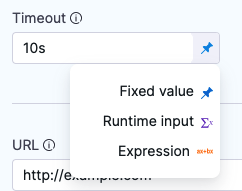

import Tabs from '@theme/Tabs';
import TabItem from '@theme/TabItem';

For most settings in Harness pipelines, you can use [fixed values, runtime inputs, or expressions](./runtime-inputs.md). These options are also sometimes available for other entities, such as connectors and triggers.

Runtime input provides a placeholder with the expectation that you'll define this value at runtime.

For example, if you set the Kubernetes cluster **Namespace** setting to runtime input (`<+input>`), you'll need to provide the **Namespace** value when you run the pipeline.


Runtime input is especially useful for templatizing your pipelines, because runtime inputs can have different values each time the pipeline runs. For example, you can set all Infrastructure settings to runtime input so that users provide relevant dev, QA, or prod values with each run. This way, users don't need to edit the actual pipeline, they just supply the necessary values for that run.

You can also create [input sets and overlays](/docs/platform/pipelines/input-sets) to quickly populate runtime inputs with sets of preconfigured values. You can create input sets for different pipeline use cases, and then select the relevant input set at runtime.

## Use runtime inputs

<Tabs>
  <TabItem value="Visual" label="Visual">

In the Pipeline Studio's Visual Editor, you can use the **Value type selector** to select **Runtime Input**.



In free-text fields, you can directly enter `<+input>` to specify runtime input without changing the value type.

</TabItem>
  <TabItem value="YAML" label="YAML" default>

When writing pipelines in YAML, enter `<+input>` for the value to indicate runtime input.

```yaml
              - step:
                  identifier: Run_1
                  type: Run
                  name: Run_1
                  spec:
                    shell: <+input>
                    command: <+input>
```

</TabItem>
</Tabs>

When you run the pipeline, you're prompted to provide values for any `<+input>`. You can use specific values or [expressions](#expressions).

If you rerun this pipeline, the pipeline uses the same inputs you provided for the initial run.

## Set default values

By default, runtime input accepts virtually any sting input. You can specify a default value to avoid empty values.

<Tabs>
  <TabItem value="Visual" label="Visual">


1. In the Pipeline Studio's Visual Editor, use the **Value type selector** to select **Runtime Input**.

   

2. Select the **Settings** icon next to the field.

   

3. Enter the **Default value**, and select **Submit**.


</TabItem>
  <TabItem value="YAML" label="YAML" default>


When writing pipelines in YAML, specify a default value by appending the `.default()` method to `<+input>`. For example: `<+input>.default(bengaluru)`.

If your default value has a comma, you must escape the value string using the format `\'VALUE\'`. For example: `<+input>.default(\'london,uk\')`.

```yaml
              - step:
                  identifier: Run_1
                  type: Run
                  name: <+input>.default(bengaluru)
                  ...
```

</TabItem>
</Tabs>

### Null values are valid values

When you run a pipeline that includes default values for runtime input, if you provide an expression for a runtime input that resolves to `null`, then the expression **isn't** replaced by the default value.

To avoid unwanted `null` values, consider using a [ternary operator](https://developer.harness.io/kb/continuous-delivery/articles/ternary-operator/).

### Use a JSON object as the default value

You can use a JSON object, such as the JSON-formatted body of a webhook payload, as the default value for runtime input. Here's an example of a default value that uses a JSON object. Note the use of double quotes around the entire expression and slashes to escape commas and double quotes within the object.

```yaml
"<+input>.default('{\"risk\": 100,\"availabilityVsCost\": \"balanced\",\"drainingTimeout\": 120,\"lifetimePeriod\": \"days\",\"fallbackToOd\": true}')"
```

:::info

Harness doesn't support *nested* JSON objects in runtime input. For example, this JSON object *isn't* valid runtime input.

```json
{
  "risk": 100,
  "availabilityVsCost": "balanced",
  "drainingTimeout": 120,
  "lifetimePeriod": "days",
  "fallbackToOd": true,
  "scalingStrategy":
      {
        "terminationPolicy": "default"
      }
}
```

:::

### Default values in templates

You can specify default values in [templates](/docs/platform/templates/template). However, if you want to be able to override these values at runtime, append the `.executionInput()` method.

For example, the following YAML example uses a stage template that includes `<+input>.default(new york).executionInput()`. The default value is `new york`, but it can be changed at runtime.

```yaml
pipeline:
  name: UseStageTemplate
  identifier: UseStageTemplate
  projectIdentifier: default
  orgIdentifier: default
  tags: {}
  stages:
    - stage:
        name: stage1
        identifier: stage1
        template:
          templateRef: stageTempDefault1
          versionLabel: v1
          templateInputs:
            type: Custom
            variables:
              - name: var1
                type: String
                default: ABC
                value: <+input>.default(new york).executionInput()
```

**Harness generally recommends using `executionInput()` when defining default values in templates.** This is due to the way default values behave in templates. Review the following information to determine whether or not to include `executionInput()`.

For any expression or runtime input defined in a template, you can add the default method (`default()`) to it either in the template directly or when using the template in a parent entity (such as a pipeline), but not both.

- When a default value is specified in the template, any parent entities that use it can't change the default value unless:
   - You also provide `.executionInput()` for runtime input, as shown in the above example.
   - A template that uses a variable expression has a fixed value specified for the expression in the parent entity.

   For example, a runtime input like `<+input>.default(default_val)` can't be changed, but `<+input>.default(default_val).executionInput()` can be changed.

- When a default value isn't specified in the template, you can add a default value in the parent entity, and the default value can be different in each parent entity.

  For example, when using a template with runtime input (`<+input>`), you can append the `default()` method to specify a default value in the parent entity, such as `<+input>.default(default_val_in_parent)`.

### Default values can't start with an asterisk

Pipelines fails if a variable's default value starts with `*`. This includes runtime input values. To avoid this wrap the asterisk or value in quotes, such as `"*"`.

## Set allowed values

Use allowed values to provide a fixed range of acceptable values for a runtime input.

<Tabs>
  <TabItem value="Visual" label="Visual">

1. In the Pipeline Studio's Visual Editor, use the **Value type selector** to select **Runtime Input**.

   

2. Select the **Settings** icon next to the field.

   

3. For **Validation**, select **Allowed values**.
4. Enter an allowed value, and then press the **Enter** key.
5. Repeat until you have entered all allowed values.
6. If you also specify a [default value](#default-values), you must include the default value in your allowed values.
7. Select **Submit**.

</TabItem>
  <TabItem value="YAML" label="YAML" default>

When writing pipelines in YAML, define allowed values by appending the `.allowedValues()` method to `<+input>`. For example: `<+input>.allowedValues(bengaluru,newyork)`.

If your values include commas, you must escape the value strings using the format `\'VALUE\'`. For example: `<+input>.allowedValues(\'bengaluru,india\',\'newyork,usa\',\'london,uk\')`.

If you specify allowed values *and* a [default value](#default-values), the default value must be present in the list of allowed values. To specify both an allowed value and a default value, append both the `.default()` and `.allowedValues()` methods to `<+input>`, and make sure the list of allowed values includes the default value. For example: `<+input>.default(london).allowedValues(bengaluru,newyork,london)`.

</TabItem>
</Tabs>

:::info allowed values in JSON

If you use runtime input with allowed values in JSON, use double quotes as necessary to ensure the JSON is valid.

For example, these expressions both resolve to `{x:y}`:

```
<+input>.allowedValues({"x":"y"})
"<+input>.allowedValues({x:y})"
```

If you needed the allowed values to include quotes, such as `{"x": "y"}`, then you need to escape the quotes in the allowed values. For example:

```
"<+input>.allowedValues({\\\"x\\\": \\\"y\\\"})"
```

:::


:::info note

When using `allowedValues` with runtime inputs in array-type fields (e.g., file paths), errors may occur during deployment as the system might not correctly process these inputs.

Fields like paths in ECS Task Definitions and valuesPaths in Kubernetes services do not support runtime inputs in array format. Expressions like `<+input>.allowedValues(<+variable1>, <+variable2>)` can lead to deployment failures

**Workaround:-**
Define a variable (e.g., FILE_PATH_VAR) at the pipeline or service level, assign it a value using `allowedValues`, and reference this variable in the configuration. This approach ensures the input is treated as a string.

**Recommendation:-**
Avoid using `allowedValues` with runtime inputs in list fields and use the suggested workaround to ensure proper functionality

:::

## Allow Multi Selection and Single selection


You can select a **Mode** of selection while creating allowed values in Runtime Input:- 


### Multi Selection

:::note
Currently, multiple selection for runtime inputs is behind the feature flag `PIE_MULTISELECT_AND_COMMA_IN_ALLOWED_VALUES`. Contact [Harness Support](mailto:support@harness.io) to enable the feature. 
:::

You can use Multi Selection if you want to choose one or more values from the list of [allowed values](#set-allowed-values). Multi Selection maps to the `.allowedValues()` functor, and Single Selection maps to the 
`.selectOneFrom()` functor. You can use multiple selection for runtime inputs in pipelines, stages, and shell script variables only. Multiple selection is an extension of allowed values, so you must specify allowed values to use it.

For users who want to migrate to single selection, you can implement 
`.selectOneFrom()` even before the FF `PIE_MULTISELECT_AND_COMMA_IN_ALLOWED_VALUES` is turned on.


### Single Selection

:::note
1. If FF `PIE_MULTISELECT_AND_COMMA_IN_ALLOWED_VALUES`, is turned off, then using Allowed values and Single Selection both have identical behaviour of selecting a single value.
2. If FF `PIE_MULTISELECT_AND_COMMA_IN_ALLOWED_VALUES` is turned on, all the existing Allowed values will turn into **multi-select**. If the user wants to keep them as single select, they must change the option to **Single Selection**.
:::

You can use [**Single Selection Mode**](#allow-multi-selection-and-single-selection), if you want to chose only one value from the list of [allowed values](#set-allowed-values). 


When writing pipelines in YAML, you can define Single Selection in allowed values by appending the `.selectOneFrom()` method to `<+input>`. For example: `<+input>.selectOneFrom(a,b,c)`.

:::important note
When using secrets as runtime inputs and configuring allowed values, the UI will not display an option for single selection. By default, only one value can be selected for a secret during runtime. 
:::


## Supply runtime input during execution

Sometimes you might not know the value for a runtime input at the beginning of the pipeline run. For example:

* Some values depend on the output of previous steps or stages in the pipeline.
* Your pipeline includes an Approval step, and you want to specify the approval groups when the Approval step runs.
* You have a custom stage with a Shell Script step that takes runtime input, and you need to provide the script when that step runs, rather than at the beginning of the entire pipeline.

In these cases, you might need to provide runtime input during pipeline execution.

You must have a role with **Pipeline Execute** [permission](/docs/platform/role-based-access-control/permissions-reference/) to be able to submit runtime inputs during execution.

### Configure execution inputs

You must configure runtime inputs to allow specification during pipeline execution.

<Tabs>
  <TabItem value="Visual" label="Visual">


1. In the Pipeline Studio's Visual Editor, use the **Value type selector** to select **Runtime Input**.

   

2. Select the **Settings** icon next to the field.

   

3. Select **Request input value when stage/step is being executed**.

   

4. Specify allowed values or a default value, if necessary.
5. Select **Submit**.

</TabItem>
  <TabItem value="YAML" label="YAML" default>

When writing pipelines in YAML, append the `executionInput()` method to `<+input>`. For example, `<+input>.executionInput()`.

You can use mid-run input along with [allowed values](#allowed-values) and [default values](#default-values). For example:

* Select mid-run input from a list of allowed values: `<+input>.allowedValues(value1,value2).executionInput()`
* Provide a default value and provide a list of allowed values for mid-run input: `<+input>.allowedValues(value1,value2).default(value1).executionInput()`

</TabItem>
</Tabs>

### Use the default value instead of failing

There is a time limit for mid-run input. Pipelines don't wait indefinitely for mid-run input. If no input is provided before the input time elapses, the pipeline fails.

If you allow mid-run input *and* you specify a default values, you can configure the pipeline to use the default values instead of failing if the input time elapses. To do this:

1. Go to the stage or step with the execution input.
2. Add a [failure strategy](/docs/platform/pipelines/failure-handling/define-a-failure-strategy-on-stages-and-steps).
3. For **On failure of type**, select **Execution-time Inputs Timeout Errors**.
4. Under **Perform Action**, select **Proceed with Default Values**.
To automatically use the default value during such timeouts: 

<!--  -->

<DocImage path={require('./static/execution-time-error-configuration.png')} />

### Use execution input in a script

Use [expressions](#expressions) to reference runtime input from other fields in scripts (the **Command** field). To do this, use an expression that references the field that is configured for execution or runtime input. For example, `<+execution.steps.run1.spec.shell>` references the `shell` setting in the `run1` step. You can include this expression in a `command` to pull that value into the command during pipeline execution.


### Use execution input with approvals

To change the approval group during the pipeline run, edit the **Manual Approval** step and set the **User Group** field to [use execution input](#configure-execution-inputs).
