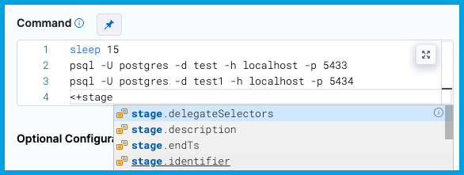

import Tabs from '@theme/Tabs';
import TabItem from '@theme/TabItem';

For most settings in Harness pipelines, you can use fixed values, runtime inputs, or expressions. These options are also sometimes available for other entities, such as connectors and triggers.

<Tabs>
  <TabItem value="Visual" label="Visual">

In the Pipeline Studio's Visual Editor, you can use the **Value type selector** to select **Fixed Values**, **Runtime Input**, or **Expression**.

The **[Expression](#expressions)** option is especially useful, because it enables suggestions for built-in expressions as you type.

In free-text fields, such as **Command**, you can directly enter values using the appropriate syntax, such as `<+input>` for [runtime input](#runtime-inputs), without changing the value type.

</TabItem>
  <TabItem value="YAML" label="YAML" default>

When writing pipelines in YAML, enter the value using the appropriate syntax. For example:

* For fixed values, enter the value directly.
* For runtime input, enter `<+input>`.
* For expressions, enter the expression, such as `<+secrets.getValue("somesecret")>`.

When you type `<+`, Harness provides suggestions for built-in [expressions](#expressions) as you type.

</TabItem>
</Tabs>

## Fixed values

Fixed Values are values that you define when you configure a setting. These values don't change at runtime.

Use fixed values for settings you don't need to change based on the build context, other steps, or runtime operations. For example, you could use a fixed value for your pipeline's [codebase configuration](/docs/continuous-integration/use-ci/codebase-configuration/create-and-configure-a-codebase.md) so that the pipeline always uses the same code repo connector and branch.

## Runtime inputs

Runtime input provides a placeholder with the expectation that you'll define this value at runtime. For example, if you set the Kubernetes cluster **Namespace** setting to runtime input (`<+input>`), you'll need to provide the **Namespace** value when you run the pipeline.

You can customize runtime inputs to have specific allowed values, default values, multi-selection, and more.

For more information, go to [Use runtime input](./runtime-input-usage.md).

## Expressions

Use Harness expressions to reference input, output, and execution variables. These variables represent settings, metadata, and other values that exist in the pipeline before and during execution. These can include environment variables, secrets, [entity identifiers](/docs/platform/references/entity-identifier-reference.md), [user-defined variables](/docs/platform/variables-and-expressions/add-a-variable.md), and more.

At pipeline runtime, Harness replaces the expression with the resolved value.

<Tabs>
  <TabItem value="Visual" label="Visual">

In the Pipeline Studio's Visual Editor, you can use the **Value type selector** to select **Expression**.

Harness provides suggestions for built-in expressions as you type. You can manually trigger the suggestions by placing your cursor after `<+` and pressing `ctrl + space`. These suggestions don't represent all possible expressions.

In free-text fields, such as **Command**, you can directly enter values using the appropriate syntax without changing the value type.

You can continue typing or select the expression from the list of suggestions.

</TabItem>
  <TabItem value="YAML" label="YAML" default>

When writing pipelines in YAML, enter the expression using the appropriate syntax.

When you type `<+`, Harness provides suggestions for built-in expressions as you type. You can manually trigger the suggestions by placing your cursor after `<+` and pressing `ctrl + space`. These suggestions don't represent all possible expressions.

You can continue typing or select the expression from the list of suggestions.

</TabItem>
</Tabs>

For more information, go to:

* [Use Harness expressions](../variables-and-expressions/harness-variables.md)
* [Write expressions using any JSON parser tool](./expression-v2.md)
* [Use Java string methods](./expressions-java-methods.md)
* [Define variables](./add-a-variable.md)
