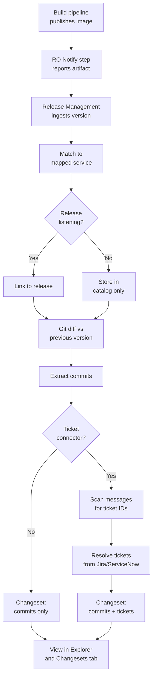
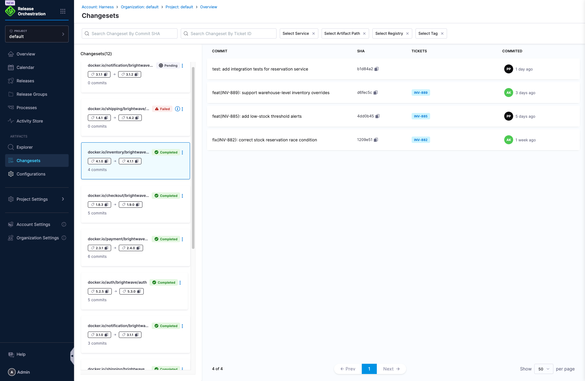
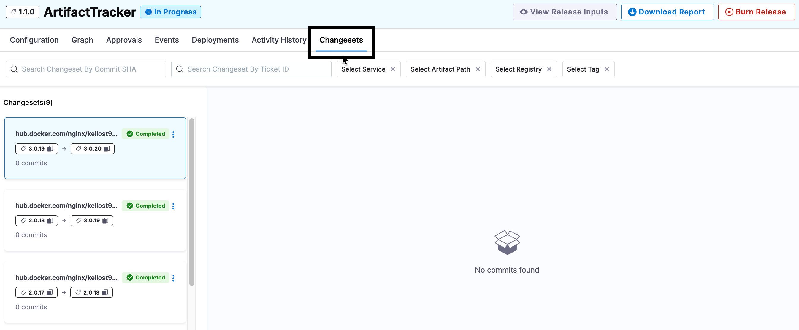

import { Troubleshoot } from '@site/src/components/AdaptiveAIContent';

Artifact Tracker catalogs every container image your pipelines produce and computes a changeset between each artifact version and the previous one. A changeset includes the commits and, optionally, Jira tickets introduced between versions. When you need to know what changed in a release, the changeset shows you without digging through Git history.

This topic walks you through the one-time setup and shows you how to use the day-to-day views once Artifact Tracker is up and running.

:::info Feature availability
Artifact Tracker and Changesets require the following feature flags to be enabled. Contact [Harness Support](mailto:support@harness.io) to enable these flags for your account:
- `RMG_ENABLE_CHANGESET_CONFIGURATION`
- `PIPE_DIRECT_PIPELINES_EXECUTION`
- `RMG_ENABLE_WEBHOOK_QUEUE_SUPPORT`
:::

---

## Before you begin

You need the following connectors configured. You can reuse existing connectors or create new ones.

- **Git connector:** GitHub, GitLab, Bitbucket, Git, or Harness Code connector to clone the repository and diff commits between versions. Go to [Create a Git connector](/docs/platform/connectors/code-repositories/ref-source-repo-provider/git-connector-settings-reference) to create one.
- **Jira or ServiceNow connector:** Links tickets to commits. Go to [Connect to Jira](/docs/platform/connectors/ticketing-systems/connect-to-jira) or [ServiceNow connector settings reference](/docs/platform/connectors/ticketing-systems/connect-to-service-now) to create one.
- **Kubernetes cluster connector:** Runs the pod that performs git diff and ticket lookup. Go to [Kubernetes cluster connector settings reference](/docs/platform/connectors/cloud-providers/ref-cloud-providers/kubernetes-cluster-connector-settings-reference) to create one.
- **Docker registry connector:** Pulls the `alpine` and `alpine/git` images for git diff and ticket lookup. Go to [Docker connector settings reference](/docs/platform/connectors/cloud-providers/ref-cloud-providers/docker-registry-connector-settings-reference) to create one.
- **Project access:** View or Execute permissions on pipelines to view artifact details and changesets. Go to [RBAC in Harness](/docs/platform/role-based-access-control/rbac-in-harness) to configure roles.

---

## How Artifact Tracker works

The following diagram shows how Artifact Tracker captures and processes container images:

Artifact Tracker records every artifact regardless of whether a release is running. Changesets require a Git connector to compute the commit diff. Linking tickets to changesets requires a ticket connector and a regex pattern to extract ticket IDs from commit messages.

---

## Add the RO Notify step to your build pipeline

The RO Notify step is a pipeline step that reports published artifact details to Release Management. This step acts as the bridge between your CI/CD pipelines and Release Orchestration, enabling automatic tracking of every artifact your pipelines produce.

When you use native Harness build and push steps (such as Build and Push to Docker Registry), artifacts produced within the pipeline are **captured automatically** without additional configuration. The RO Notify step detects these artifacts and forwards their metadata to the Artifact Tracker catalog.

The RO Notify step runs immediately after your artifact is published and completes in seconds. It does not modify or interact with the artifact itself. It only reports metadata to Release Management for tracking and changeset computation.

:::note
The RO Notify step is not supported inside a CI stage. If your artifact is published from a CI stage, add a separate Custom stage after it and place the RO Notify step there.
:::

Perform the following steps to add the RO Notify step to your build pipeline:

1. In your build pipeline, click **Add Stage** after the stage that publishes the artifact.
2. Select **Custom** as the stage type, then click **Set Up Stage**.
3. Enter a stage name, such as `Notify Release Management`, then click **Save**.
4. In the **Execution** tab, click **Add Step**.
5. Select **RO Notify** from the step library.
6. Configure the RO Notify step:
   - **Name:** Enter a step name, such as `Report Artifact`.
   - Leave other fields empty if you are using native Harness build and push steps. The step will automatically detect and capture published artifacts.
7. Click **Apply Changes**, then **Save** the pipeline.

:::info Advanced configuration
If you need to override the automatic detection or specify artifacts manually, you can configure:
- **Artifact Path:** The full path to the artifact (for example, `my-org/payment-service`)
- **Artifact Tag:** The specific tag or version (for example, `<+pipeline.sequenceId>` or `1.2.3`)
- **Artifact Registry:** The registry to scope the mapping to a specific registry

These fields are optional and only needed when automatic detection does not capture the artifacts you want to track.
:::

---

## Configure default connectors

Default connectors apply to all mapped services unless overridden at the service mapping level. Connector configuration is available at the project, organization, or account level. The defaults you set on this page are inherited by every mapped service unless overridden.

Perform the following steps to configure default connectors:

1. In Harness, navigate to **Release Orchestration**.
2. In the left navigation, under **Artifacts**, click **Configurations**.
3. Click **Connectors**.
4. Configure the following integrations:

### Git Integration

Configure the Git connector for commit comparison between artifact versions.

Perform the following steps to configure Git integration:

1. Under **Git Integration**, click **Git Provider**.
2. Select **Harness Code Repository** or a third-party Git provider.
3. If you selected a third-party provider, select the **Git Connector** from the dropdown.
4. Click **Save**.

### Ticket Integration

Configure the ticket connector to link Jira or ServiceNow tickets to changesets.

Perform the following steps to configure ticket integration:

1. Under **Ticket Integration**, click **Ticket Connector**.
2. Select your Jira or ServiceNow connector from the dropdown.
3. (Optional) Enter a **Ticket Regex Pattern** if you need a different pattern from the default `[A-Z]+-[0-9]+`. The default pattern matches Jira-style ticket keys such as `RM-123` or `ABC-4567` (one or more uppercase letters, a dash, then one or more digits). Leave blank to use the default.
4. Click **Save**.

### Infrastructure

Configure the Kubernetes cluster connector and namespace where changeset pods run.

Perform the following steps to configure infrastructure:

1. Under **Infrastructure**, select the **Kubernetes Cluster Connector** from the dropdown.
2. Enter the **Namespace** where changeset pods will run.
3. Click **Save**.

### Artifact Registry

Configure the Docker registry connector to pull container images for git diff and ticket lookup.

Perform the following steps to configure the artifact registry:

1. Under **Artifact Registry**, select the **Docker Registry Connector** from the dropdown.
2. Click **Save**.

### Semantic Versioning

Semantic versioning is enabled by default. When enabled, changesets compare semantic versions instead of arrival order.

For example, if `payment-service` has versions `1.0.0` and `2.0.0`, and hotfix `1.0.1` arrives later, the changeset compares `1.0.0` to `1.0.1` instead of `2.0.0` to `1.0.1`.

Perform the following steps to disable semantic versioning:

1. Under **Semantic Versioning**, toggle the setting to **Off**.
2. Click **Save**.

---

## Map your services

Service mappings connect artifact paths to Harness CD services and apply default connector settings. Artifacts that do not match any mapping are still stored in the catalog, but changesets are not computed until you create a mapping.

Perform the following steps to create a service mapping:

1. In the left navigation, under **Artifacts**, click **Configurations**.
2. Click **Service Mappings**.
3. Click **Create Service Mapping**.
4. Configure the mapping:
   - **Artifact Path:** Enter the artifact path, for example `my-org/payment-service`.
   - **Artifact Registry:** (Optional) Select a specific registry to scope the mapping.
   - **Service Ref:** Select the Harness CD service this artifact belongs to.
5. (Optional) Override any default connector settings for this specific mapping:
   - **Git Connector:** Select a different Git connector if this service uses a different repository.
   - **Ticket Connector:** Select a different ticket connector or modify the ticket regex pattern.
   - **Semantic Versioning:** Toggle to enable or disable for this specific service.
6. Click **Save**.

Repeat these steps for each service you want to track.

---

## Link artifacts to releases (optional)

Artifacts are captured in the catalog regardless of this step. Complete this step only if you want to link specific artifact versions to a release.

Perform the following steps to link artifacts to a release:

1. Open the release process where you want to capture artifacts.
2. Add a **Pipeline Queue** activity to the release process.
3. Configure the Pipeline Queue activity to listen for the build pipeline that publishes the artifact.

While the Pipeline Queue activity is running, any matching pipeline execution that includes the RO Notify step automatically links its published artifacts to the release.

If no release is listening, artifacts are still captured in the catalog but are not attached to a specific release.

---

## How artifacts are automatically tracked

After you complete the setup steps, the process runs automatically. When your build pipeline publishes a new image version:

1. The RO Notify step reports the artifact details to Release Management, which records the artifact in the catalog.
2. If a release is listening (from the Link artifacts to releases step) and a service mapping exists (from the Map your services step), the artifact is linked to the release.
3. If a Git connector is configured, Release Management diffs this version against the previous version and lists the commits.
4. If a ticket connector and regex pattern are configured, commit messages are scanned for ticket IDs, which are resolved against Jira or ServiceNow and attached to the changeset.

The first artifact received for a mapping has no previous version to diff against. It becomes the baseline. The next version produces the first changeset.

---

## View artifact catalog and changesets

After setup and pipeline runs complete, view artifacts and changesets.

### View all artifacts

Perform the following steps to view all artifacts:

1. In the left navigation, under **Artifacts**, click **Explorer**.
2. Use the grouping options to filter by service or artifact path.
3. Click on any artifact to view all tags and versions for that artifact.

### View changesets

Perform the following steps to view changesets:

1. In the left navigation, under **Artifacts**, click **Changesets**.
2. Use the filters to search by:
   - Artifact path
   - Commit SHA
   - Ticket ID
3. Click on any changeset to view:
   - Commits introduced between the two versions
   - Linked Jira or ServiceNow tickets
   - Changeset status (Success, Failed, or Running)

### View changesets in a release

Perform the following steps to view changesets in a release:

1. Navigate to the specific release.
2. Click the **Changesets** tab.
3. View all changesets tied to this release, including:
   - Commit lists
   - Linked tickets
   - Changeset status

---

## Manage changesets

Retry failed changesets and edit tags when the baseline version is incorrect.

### Retry a failed changeset

If a changeset fails because of a git clone timeout or Jira being unreachable, perform the following steps to retry:

1. Navigate to **Artifacts** > **Changesets**.
2. Click on the failed changeset.
3. Review the error logs to understand the failure.
4. Click **Retry Changeset** to recompute the changeset.

### Edit changeset tags

If the baseline version is incorrect because an out-of-band hotfix was not captured, perform the following steps to edit tags:

1. Navigate to **Artifacts** > **Changesets**.
2. Click on the changeset you want to edit.
3. Click **Edit Tags**.
4. Update the **From Tag** and **To Tag** tags to the correct versions.
5. Click **Apply**, then click **Retry Changeset** to recompute the diff.

:::note
Editing tags only affects the selected changeset. It does not change how future artifacts resolve their baseline.
:::

---

## Connector configuration and available data

The following table shows what data is available based on the connectors you configure:

| Git connector | Ticket connector | Result |
|---|---|---|
| Not configured | Not configured | Artifact tracked in the catalog only. No changeset. |
| Configured | Not configured | Artifact tracked with changeset showing commits. No ticket links. |
| Configured | Configured | Artifact tracked with changeset showing commits and linked tickets. |
| Not configured | Configured | Artifact tracked only. Tickets cannot be extracted without a commit diff. |

---

## Troubleshooting

<Troubleshoot
  issue="No changeset appears for a new artifact version even though the RO Notify step ran successfully"
  mode="docs"
  fallback="Confirm that a service mapping exists for the artifact path and registry. Navigate to Artifacts > Configurations > Service Mappings and verify the artifact path matches exactly. If a release is required, confirm a Pipeline Queue activity is actively listening for the build pipeline."
/>

<Troubleshoot
  issue="Changeset shows commits but no linked tickets"
  mode="docs"
  fallback="Verify that a ticket connector is configured in Artifacts > Configurations > Connectors > Ticket Integration. Confirm the ticket regex pattern matches the format used in your commit messages. Check that commit messages actually contain ticket IDs. The default regex pattern is [A-Z]+-[0-9]+, which matches Jira-style keys like RM-123."
/>

<Troubleshoot
  issue="Changeset failed with a git clone timeout or connection error"
  mode="docs"
  fallback="Open the changeset and review the error logs. Verify the Git connector has correct credentials and network access. Check that the Kubernetes cluster connector has permissions to create pods in the specified namespace. Retry the changeset after fixing connector permissions or network issues."
/>

<Troubleshoot
  issue="Artifact is tracked but not linked to any release"
  mode="general"
  fallback="Confirm a Pipeline Queue activity is configured in the release process and is actively listening when the RO Notify step runs. Artifacts are still captured in the catalog and can be linked to a release later."
/>

<Troubleshoot
  issue="The RO Notify step fails in a CI stage"
  mode="fallback-only"
  fallback="The RO Notify step is not supported inside a CI stage. Add a separate Custom stage after the CI stage and place the RO Notify step in the Custom stage instead."
/>

---

## Next steps

After configuration, you can:

- Go to [Modeling Releases](/docs/release-orchestration/releases/modeling-releases) to learn how to link artifacts to releases.
- Go to [Release Calendar](/docs/release-orchestration/release-calendar/overview) to visualize releases and artifacts on a calendar view.
- Go to [Release Notifications](/docs/release-orchestration/notifications) to set up Slack alerts for artifact and changeset events.
