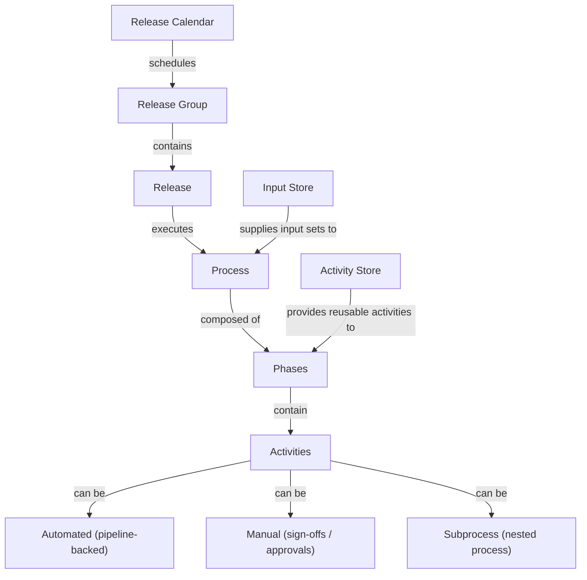

import DocImage from '@site/src/components/DocImage';

Release Orchestration provides a unified framework for modeling, scheduling, automating, and tracking complex software releases across teams, tools, and environments. It orchestrates every step from planning (using Harness AI) through production deployment, feature flag enablement, and monitoring — giving you end-to-end visibility across the entire release lifecycle.

<figure>
<DocImage path={require('../static/overview.png')} title="Click to view full size image" />
<figcaption>The Release Orchestration landing page showing the four core areas: Model Releases, Release Calendar, Processes, and Activity Store.</figcaption>
</figure>

## How the entities fit together

The following diagram shows how the core entities in Release Orchestration relate to each other:



- A [**Process**](/docs/release-orchestration/processes/overview) is a reusable release blueprint made up of [**Phases**](/docs/release-orchestration/phases/phases-overview) and [**Activities**](/docs/release-orchestration/activities/activities-overview).
- Activities come from the [**Activity Store**](/docs/release-orchestration/activities/activity-store) and can be automated, manual, or subprocess-based.
- A [**Release Group**](/docs/release-orchestration/releases/modeling-releases) defines a cadence and contains individual **Releases**, each of which executes a Process.
- The [**Release Calendar**](/docs/release-orchestration/releases/modeling-releases) visualizes all scheduled and in-flight releases.
- The [**Input Store**](/docs/release-orchestration/inputs-and-variables/overview) provides named input sets so the same Process can run with different configurations.

## Why Release Orchestration

Without orchestration, releases that span multiple services, teams, and tools become fragmented. Status lives in spreadsheets, coordination happens over email, and there is no single source of truth for what was deployed, when, or by whom.

Release Orchestration solves this by providing:

- **Structured process modeling:** Define reusable release blueprints ([Processes](/docs/release-orchestration/processes/overview)) composed of [Phases](/docs/release-orchestration/phases/phases-overview) and [Activities](/docs/release-orchestration/activities/activities-overview) instead of ad-hoc checklists.
- **Automated and manual execution:** Automate pipeline-backed steps while retaining manual sign-offs and approvals where governance requires them.
- **End-to-end visibility:** Track activity-level status, phase-level progress, and overall release health in real time.
- **Built-in governance and auditability:** Enforce approvals, capture sign-offs, and maintain a full audit trail linking code to deployment.
- **Scheduled releases:** Use [Release Groups](/docs/release-orchestration/releases/modeling-releases) and the Release Calendar to run releases on a cadence (daily, weekly, monthly, or custom).

<figure>
<DocImage path={require('../static/release-sample.png')} title="Click to view full size image" />
<figcaption>A release execution graph showing phases (Build, Test, Deploy to Staging, UAT) connected by dependency arrows, with activity counts and owner assignments visible on each phase card.</figcaption>
</figure>

## Prerequisites

Before you begin, ensure the following:

- **Feature flags enabled:** The following feature flags must be enabled for your Harness account. Contact [Harness Support](mailto:support@harness.io) to enable them.
  - `RMG_RELEASE_MANAGEMENT_ENABLED` — Enables the Release Management module.
  - `RMG_PROCESS_ENABLED` — Enables Process functionality for creating release blueprints.

- **Module access:** Confirm you have access to the **Release Orchestration** module in Harness.

- **Permissions:** Ensure your user role has permissions to create processes, releases, and activities. Go to **Account Settings** > **Access Control** to verify.

  <figure>
  <DocImage path={require('../static/permissions-pre-req.png')} title="Click to view full size image" />
  <figcaption>The Access Control settings page where you can verify your user role has the required permissions for Release Orchestration.</figcaption>
  </figure>

- **Pipelines (for automated activities):** If you plan to use [Automated Activities](/docs/release-orchestration/activities/activity-types/automated-activities), have at least one Harness pipeline configured. Automated activities encapsulate pipelines, so the pipeline must exist before you can reference it.

- **Phase owners identified:** Identify the owners responsible for each phase of your release (for example, Development, QA, DevOps). Owners are assigned per phase and receive notifications when their input is needed.

## Key concepts

Before walking through the steps, familiarize yourself with the core entities. Each term links to its detailed reference page.

| Entity | Description |
|--------|-------------|
| [**Process**](/docs/release-orchestration/processes/overview) | A reusable release blueprint containing phases, activities, dependencies, and variables. |
| [**Phase**](/docs/release-orchestration/phases/phases-overview) | A logical group of work within a process (e.g., Build, Testing, Deployment). Phases can depend on other phases. |
| [**Activity**](/docs/release-orchestration/activities/activities-overview) | A single unit of work within a phase. Can be [Automated](/docs/release-orchestration/activities/activity-types/automated-activities) (pipeline-backed), [Manual](/docs/release-orchestration/activities/activity-types/manual-activities) (sign-offs/approvals), or a [Subprocess](/docs/release-orchestration/activities/activity-types/subprocess-activities) (nested process). |
| [**Activity Store**](/docs/release-orchestration/activities/activity-store) | A library of reusable activities with pre-configured inputs and outputs. Activities from the store can be added to any process. |
| [**Input Store**](/docs/release-orchestration/inputs-and-variables/overview) | A collection of named input sets for a process. Each input set provides concrete values for process-level, phase-level, and activity-level inputs, allowing you to run the same process with different configurations. |
| [**Release Group**](/docs/release-orchestration/releases/modeling-releases) | A collection of releases executed on a defined cadence. Linked to a process so each release follows the same blueprint. |
| [**Release Calendar**](/docs/release-orchestration/releases/modeling-releases) | A visual calendar of all planned and scheduled releases, helping teams coordinate timing and avoid conflicts. |

For a full glossary, see [Key Concepts](/docs/release-orchestration/overview/key-concepts).

## Step 1: Create a process

A [Process](/docs/release-orchestration/processes/overview) is the blueprint for your release. You can create one from scratch or use Harness AI to generate a starting point.

1. In the Release Orchestration module, open **Processes**.
2. Select **+ New Process** and choose **Create with Harness AI**.
3. Provide a prompt describing your release flow. For example:

   ```text
   Create a process for a multi-service release.
   Include phases for planning and coordination, build, testing/validation,
   feature flag enablement, deployment, monitoring, and rollback/documentation.
   Assign phase owners for Development, QA, and DevOps.
   ```

4. Review the generated process. Harness AI creates [Phases](/docs/release-orchestration/phases/phases-overview) (logical groups of work) with [Activities](/docs/release-orchestration/activities/activities-overview) and assigns owners based on your prompt.
5. Save the process.

For more details on manual process creation, see [Process Modeling](/docs/release-orchestration/processes/process-modeling).

## Step 2: Add activities from the Activity Store

The [Activity Store](/docs/release-orchestration/activities/activity-store) is a library of reusable, pre-configured activities. It contains three types of activities:

- **[Automated Activities](/docs/release-orchestration/activities/activity-types/automated-activities):** Encapsulate a Harness pipeline that runs automatically during execution. Use these for builds, deployments, tests, and any pipeline-driven work.
- **[Manual Activities](/docs/release-orchestration/activities/activity-types/manual-activities):** Require human input during execution — approvals, sign-offs, manual verification steps, or documentation tasks.
- **[Subprocess Activities](/docs/release-orchestration/activities/activity-types/subprocess-activities):** Reference another process within your process, enabling composition and reuse.

To add activities:

1. Open the process you created.
2. Select a phase and choose **Add Activity**.
3. Browse the Activity Store and select the activity you need.
4. For automated activities, select the pipeline to encapsulate and configure its inputs.

## Step 3: Model dependencies

Define the execution order across your process using dependencies:

- **[Phase dependencies](/docs/release-orchestration/phases/phase-dependencies):** Control which phases must complete before others start (e.g., Testing depends on Build).
- **[Activity dependencies](/docs/release-orchestration/activities/activity-dependencies):** Control ordering within or across phases (e.g., a manual approval must complete before a deployment pipeline runs).

Dependencies can model both sequential and parallel execution. For details, see [Parallel vs Sequential Execution](/docs/release-orchestration/execution/parallel-vs-sequential-execution).

## Step 4: Connect the process to releases

1. Open the **Release Calendar**.
2. Create or open a [Release Group](/docs/release-orchestration/releases/modeling-releases) with your desired cadence (e.g., recurring every Thursday, running for two days).
3. Link the release group to the process you created, so each release executes using that blueprint.

<figure>
<DocImage path={require('../static/calendar.png')} title="Click to view full size image" />
<figcaption>The Release Calendar showing a monthly view of scheduled releases across multiple release groups, with each release color-coded by type.</figcaption>
</figure>

## Step 5: Provide inputs and execute

1. From the Release Calendar, open a specific release.
2. Review the linked process and select **Pre-execute** (or let it run at the scheduled time).
3. Select an input set from the [Input Store](/docs/release-orchestration/inputs-and-variables/overview). An **input set** is a named collection of values for all the inputs your process requires (process-level, phase-level, and activity-level). You can create multiple input sets for the same process to run it with different configurations — for example, one input set for staging and another for production.

For more on variables and input configuration, see [Inputs and Variables](/docs/release-orchestration/inputs-and-variables/overview).

## Step 6: Monitor and remediate

During execution, track progress at every level:

- **Activity-level:** Running, succeeded, failed, or on hold.
- **Phase-level:** Overall progress of each phase.
- **Process-level:** End-to-end release status.

If an automated activity fails, you can remediate by choosing **Retry** or **Ignore** to continue execution. For details, see [Error Handling](/docs/release-orchestration/execution/error-handling).

If execution is waiting for a sign-off, complete the [Manual Activity](/docs/release-orchestration/activities/activity-types/manual-activities) by providing the required inputs and approval.

## Next steps

- **[Key Concepts](/docs/release-orchestration/overview/key-concepts):** Full glossary of Release Orchestration entities and terminology.
- **[Process Modeling](/docs/release-orchestration/processes/process-modeling):** Deep dive into building processes manually.
- **[Executing a Release](/docs/release-orchestration/execution/executing-a-release):** Detailed guide on running and monitoring releases.
- **[Multi-Service Release Example](/docs/release-orchestration/examples-and-walkthroughs/multi-service-release-example):** End-to-end walkthrough of a real-world release.
- **[Common Use Cases](/docs/release-orchestration/overview/use-cases):** Patterns for microservice releases, compliance workflows, emergency releases, and more.
