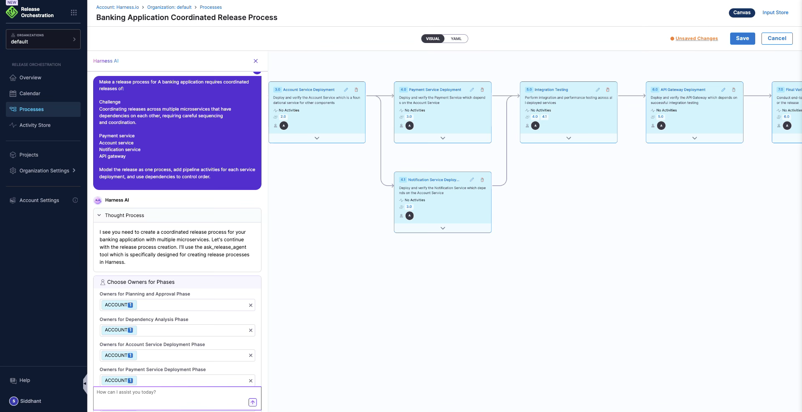
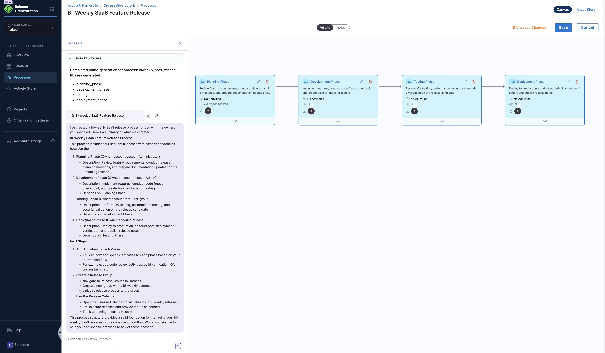

This topic outlines common scenarios where Release Orchestration helps teams model, schedule, and execute releases with clear visibility.

## Micro Service Releases

### Challenge
Coordinating releases across multiple microservices that have dependencies on each other, requiring careful sequencing and coordination.

### Solution
Use a single process with phases, activities, and dependencies to coordinate the release across services.

### Example
A banking application requires coordinated releases of:
- Payment service
- Account service
- Notification service
- API gateway

Model the release as one process, add pipeline activities for each service deployment, and use dependencies to control order.

## Scheduled Releases

### Challenge
Managing recurring releases on a regular cadence (weekly, monthly, quarterly) with consistent processes.

### Solution
Use **release groups** and the **Release Calendar** to model business cadence (for example, weekly releases).

### Example
A SaaS product releases new features every two weeks. Create a release group with a recurring cadence, link it to the process, and open a release from the calendar to pre-execute it and provide inputs.

## Compliance and Audit Requirements

### Challenge
Meeting regulatory requirements for financial services, healthcare, or other regulated industries that require detailed audit trails and compliance controls.

### Solution
Capture approvals/sign-offs using manual activities and use traceability to link what was executed in a release.

### Example
A healthcare application must demonstrate:
- Who approved each release
- When approvals were given
- What changes were included
- Rollback procedures documented

Model a QA sign-off as a manual activity, record sign-off inputs during execution, and use the release execution history as audit evidence.

## Cross-Team Coordination

### Challenge
Coordinating releases that involve multiple teams (development, QA, operations, security) with different schedules and priorities.

### Solution
Assign owners to phases and activities and use notifications to bring the right owners in when input is required.

### Example
A release requires:
- Development team: Code changes
- QA team: Testing and validation
- Security team: Security review
- Operations team: Deployment

Model each group of work as a phase, assign owners, and rely on “on hold / input required” notifications when manual input or sign-off is needed.

## Complex Deployment Pipelines

### Challenge
Managing releases that involve multiple environments, complex validation steps, and conditional logic.

### Solution
Use phase and activity dependencies to model parallel and sequential execution across phases and environments.

### Example
A release process includes:
- Development environment
- Integration testing
- Staging environment
- User acceptance testing
- Production deployment
- Post-production validation

Model each stage as a phase and connect them with dependencies (for example, UAT depends on Staging, Production depends on UAT).

## Emergency Releases

### Challenge
Managing urgent releases (hotfixes, security patches) that need to bypass normal processes while maintaining control and documentation.

### Solution
Use a dedicated process for emergency workflows (for example, fewer phases with explicit manual sign-off).

### Example
A critical security vulnerability requires:
- Immediate assessment
- Fast-track approval
- Emergency deployment
- Post-deployment validation
- Documentation for audit

## Release Rollback

### Challenge
Managing rollback scenarios when releases fail or cause issues, requiring coordinated reversal across multiple systems.

### Solution
Model rollback as phases and activities in your release process so it’s executed consistently when needed.

### Example
A production release causes issues:
- Automatic rollback trigger
- Coordinated rollback across services
- Validation of rollback success
- Root cause analysis

## Release Metrics and Reporting

### Challenge
Tracking release metrics, success rates, and performance across multiple releases to identify improvement opportunities.

### Solution
Use the release execution history and traceability data to understand what ran and how releases performed over time.

### Example
Organizations need to track:
- Release frequency
- Success rates
- Time to production
- Rollback frequency
- Approval cycle times

## Real-World Use Cases

### Coordinated Multi-Service Releases
Orchestrate releases involving multiple microservices, enabling upstream dependencies, each with its own pipeline, ensuring all are deployed in the correct order with required approvals.

### Feature Flag Rollouts
Model the process from feature development to gradual enablement and GA, tracking every step and approval.

### Wave Deployments
Release to risk-taking customers first, then to the broader user base, with full traceability and rollback support.

### Centralized Release Calendar
Track all in-flight and completed releases, with drill-down into phases and activities.

### Incident Response and Rollback
Instantly identify which commits, artifacts, and tests are in a deployment, enabling rapid rollback and root cause analysis.

### Managing the Entire Lifecycle of Software Delivery
Plan the release starting from infrastructure provisioning, building the artifact for the release, validating the build, running security functions, and deploying to production in waves.

## Related Topics

- [What is Release Orchestration](./what-is-release-orchestration.md)
- [Key Concepts](./key-concepts.md)
- [Multi-Service Release Example](../examples-and-walkthroughs/multi-service-release-example.md)

