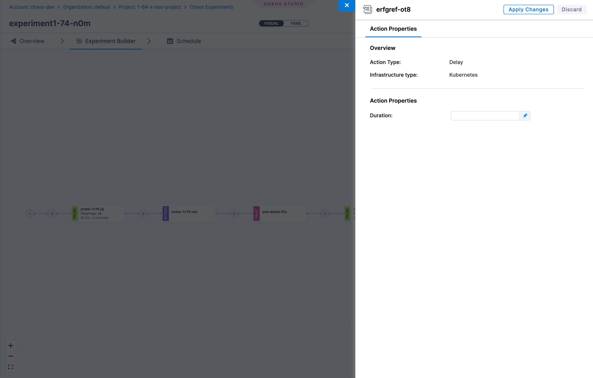

## What are Actions?

**Actions** are operations that can be executed during a chaos experiment to perform specific tasks or operations. Actions allow you to extend the capabilities of your chaos experiments beyond just fault injection by adding custom operations, delays, or scripts that can be executed at specific points during the experiment lifecycle.

Actions can be used to:
- Add delays between different phases of an experiment
- Execute custom scripts for setup, validation, or cleanup
- Perform specific operations that are required for your experiment workflow
- Implement custom logic that is specific to your application or infrastructure

## Types of Actions

Harness Chaos supports the following types of actions:

### 1. Delay Action

The **Delay Action** allows you to introduce a time delay during the experiment execution. This is useful when you need to:
- Wait for systems to stabilize after fault injection
- Create time gaps between different experiment phases
- Allow time for monitoring systems to capture metrics
- Simulate real-world scenarios where operations take time

**Key Features:**
- Configurable delay duration
- Can be placed at any point in the experiment workflow
- Helps in creating realistic experiment scenarios

### 2. Custom Script Action

The **Custom Script Action** allows you to execute custom scripts during the experiment. This provides flexibility to:
- Run custom validation logic
- Perform setup or cleanup operations
- Execute application-specific commands
- Integrate with external systems or APIs

**Key Features:**
- Support for custom script execution
- Flexible scripting capabilities
- Can be used for complex validation scenarios
- Enables integration with external tools and systems

### 3. Container Action

The **Container Action** allows you to execute commands inside a container during the experiment. This provides capabilities to:
- Execute commands in containerized environments
- Perform application-specific operations
- Run validation or diagnostic commands
- Implement custom setup or cleanup operations

**Key Features:**
- Execute commands inside containers
- Support for custom container images
- Flexible command and argument configuration
- Advanced configuration options for Kubernetes environments

## Variables

Variables allow you to define reusable, parameterized values that can be referenced in **Action Properties** during action configuration. This applies to all action types.

Variables are useful when you want to:
- **Reuse values** across multiple action configuration fields without repeating them
- **Inject runtime values** into action properties at experiment execution time
- **Centralize configuration** - update a variable once and have it reflected wherever it is used

### Adding a Variable

When creating or editing an action, navigate to the **Variables** step and click **+ Add Variable**. Each variable has the following fields:

| Field | Description |
|-------|-------------|
| **Type** | Data type of the variable. Supported types: `String`, `Number` |
| **Name** | Identifier used to reference the variable in action properties |
| **Value** | The value assigned to the variable - can be a fixed value or a runtime input |
| **Set variable as required during runtime** | When checked, the variable must be supplied at experiment run time |
| **Description** | Optional description for the variable |

### Value Types

- **Fixed value** - A static value set at action creation time. The value remains constant across experiment runs.
- **Runtime input** - The value is provided at experiment execution time (shown as `<+input>`). Use this when the value may differ between runs.

### Using Variables in Chaos Studio

When you add an action to an experiment in the **Chaos Studio**, the action panel shows a **Variables** tab. Any input variables defined on the action appear here, allowing you to supply or override values for that specific experiment run before applying changes.

## Action Properties

When configuring actions in the Chaos Studio, all configuration fields are available in the **Action Properties** tab. This unified interface provides a streamlined experience by consolidating all action settings in a single location.

The **Action Properties** tab includes:
- **Action-specific settings**: Duration (for Delay actions), Command, Arguments, Environment variables, Custom parameters, and other action type-specific configurations

:::info UI Update (Version 1.77.3+)
All action configuration has been consolidated into the **Action Properties** tab. Previously, some inputs were managed in a separate "Variables" tab. This change simplifies the configuration experience by keeping all action settings together in one place, making it easier to configure and review your action setup.

:::

## Action Configuration

### Infrastructure Type Support

Actions support different infrastructure types:
- **Kubernetes** - Actions can be executed in Kubernetes environments
- **Windows** - Actions can be configured for Windows infrastructure targets

### Action Execution

Actions are executed as part of the experiment workflow and can be:
- **Sequential** - Executed one after another in a defined order
- **Parallel** - Multiple actions can run simultaneously if configured

## Built-in Action Templates

Harness provides pre-built action templates to help you quickly integrate common operations into your chaos experiments. These templates are ready to use and can be customized to fit your specific requirements.

:::note
Currently, built-in templates are available for **Custom Script Actions** targeting **Kubernetes** infrastructure. Templates for other action types and platforms will be added in future releases.
:::

import ChaosFaults from '@site/src/components/ChaosEngineering/ChaosFaults';
import { actionTemplateCategories } from '../../content/actions/action-templates';

<ChaosFaults categories={actionTemplateCategories} />

## Next Steps

- [Create your first experiment with actions](../experiments)
- [Learn about Delay Actions](./delay-action)
- [Learn about Custom Script Actions](./custom-script-action)
- [Learn about Container Actions](./container-action)
- Explore experiment timeline view (see Experiments documentation)
