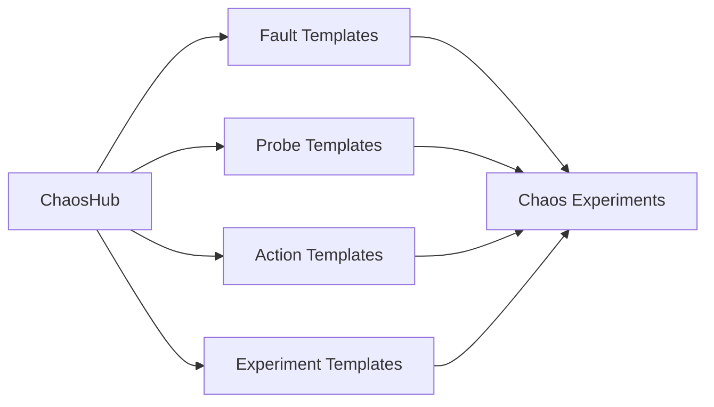
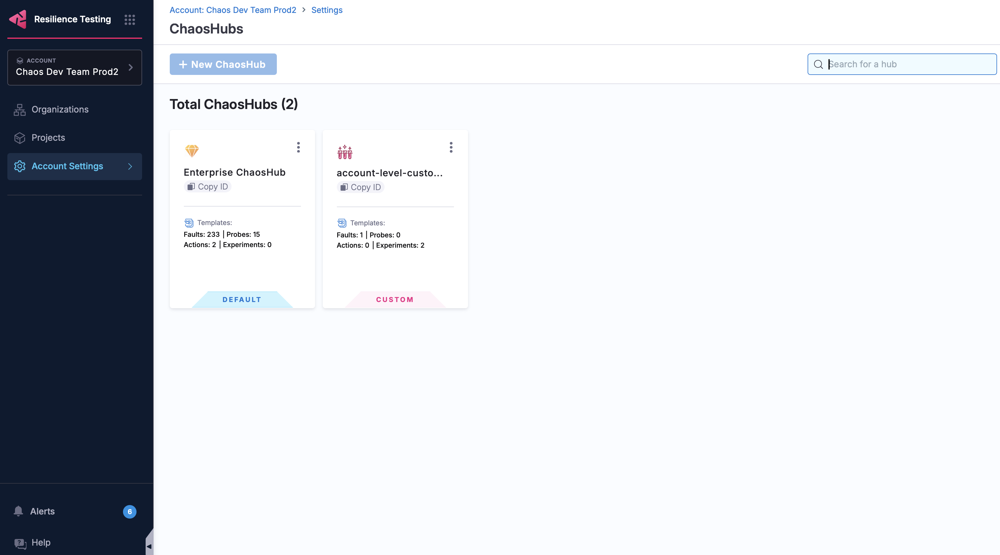
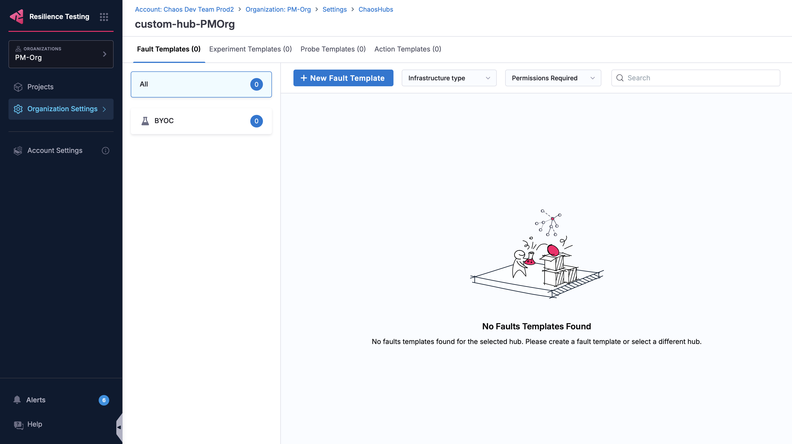

A **ChaosHub** is a centralized library of reusable chaos building blocks (fault templates, probe templates, action templates, and experiment templates) that teams use to assemble chaos experiments consistently across an organization.

Think of it as a package registry for resilience testing: instead of rebuilding the same fault or validation logic for every experiment, you curate proven components once and reuse them everywhere.

## What's inside a ChaosHub

A ChaosHub is the *container*; the reusable components you store in it are the *contents*. You author these components as templates inside a hub, then reference them when you build experiments.

 

 
| Building block | What it is | Learn more |
|----------------|-----------|------------|
| **Fault templates** | Reusable fault definitions that you inject into a target system, such as pod delete or network latency. | [Chaos faults](/docs/chaos-engineering/faults/chaos-faults) |
| **Probe templates** | Reusable validation checks that monitor system health and decide whether an experiment passes or fails. | [Probe templates](/docs/resilience-testing/chaos-testing/probes/probe-templates) |
| **Action templates** | Reusable operations, such as delays or custom scripts, that run during an experiment to handle setup, validation, or cleanup. | [Actions](/docs/resilience-testing/chaos-testing/actions) |
| **Experiment templates** | Complete, pre-configured experiments that you can launch and reuse across projects. | [Templates](/docs/resilience-testing/chaos-testing/templates) |

You create and manage all of these as reusable [Templates](/docs/resilience-testing/chaos-testing/templates), which always live inside a ChaosHub.

## Two Types of ChaosHub

| | Enterprise ChaosHub | Custom ChaosHub |
|---|---------------------|-----------------|
| **Who creates it** | Provided by Harness | Created by you |
| **Availability** | Default hub at the account level | Created at project, organization, or account scope |
| **Contents** | Pre-built with a large catalog of faults plus probe templates and action templates | The templates you author and curate |

### Enterprise ChaosHub

The **Enterprise ChaosHub** is the default hub that Harness provides at the account level. It comes pre-built with a wide catalog of faults along with ready-to-use probe templates and action templates, giving you a head start with proven, battle-tested chaos engineering patterns for various platforms and technologies. Experiment templates are not included by default; you add those yourself.

Go to [Enterprise ChaosHub](/docs/resilience-testing/chaos-testing/chaoshub/enterprise-chaoshub) to browse the full catalog of templates.

### Custom ChaosHubs

Custom ChaosHubs are hubs you create to maintain and share your own fault templates, probe templates, action templates, and experiment templates. Use them to standardize the chaos components your teams rely on and keep them in one curated place. 

In practice, every [template](/docs/resilience-testing/chaos-testing/templates) you author is created and stored inside a custom ChaosHub, so the two go hand in hand.

## ChaosHub scopes

You can create ChaosHubs at three levels, each providing a different level of access and reach:

- **Project**: scoped to a single project, for team-specific needs.
- **Organization**: shared across all projects in an organization.
- **Account**: available across all organizations and projects.

Go to [Manage ChaosHub](/docs/resilience-testing/chaos-testing/chaoshub/manage-chaoshub) to create and manage hubs at each scope.

## Why use a ChaosHub

- **Reuse proven components** instead of rebuilding the same faults, probes, and actions for every experiment.
- **Standardize practices** across teams, with scopes that let you govern what's shared at the project, organization, or account level.
- **Author experiments faster** by assembling them from existing building blocks.
- **Share knowledge** by curating and distributing trusted chaos scenarios across projects and teams.

## Example use cases

### Standardize resilience testing across teams

A platform team curates an organization-level ChaosHub with approved faults (such as pod delete and network latency), a standard "service stays available" probe template, and a golden experiment template. Application teams build experiments from these components, getting consistent, governed chaos testing without writing anything from scratch.

### Reuse a validation across many experiments

You define a probe template that checks a critical health endpoint. Every experiment references the same probe template, so when the check changes, you update it once and every experiment inherits the change.

### Extend an experiment with custom logic

An experiment injects CPU stress and then runs a custom script action template to verify that autoscaling kicked in, all assembled from reusable hub components.

## Next steps

- [Manage ChaosHub](/docs/resilience-testing/chaos-testing/chaoshub/manage-chaoshub): create and manage hubs at each scope.
- [Templates](/docs/resilience-testing/chaos-testing/templates): author fault, probe, action, and experiment templates.
- [Probes](/docs/resilience-testing/chaos-testing/probes) and [Actions](/docs/resilience-testing/chaos-testing/actions): learn about the building blocks in depth.
- [Experiments](/docs/resilience-testing/chaos-testing/experiments): build and run experiments from your hub.
