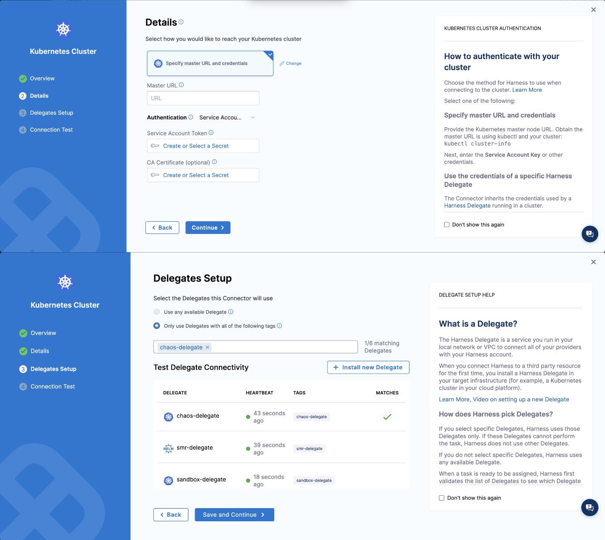
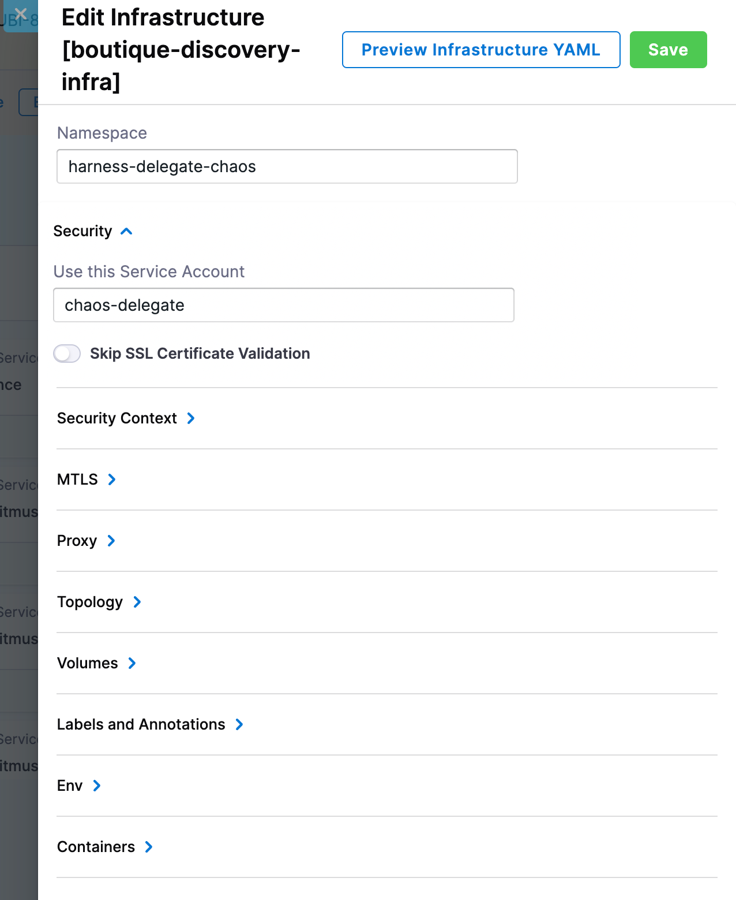

In the centralized delegate approach, **one Harness Delegate** runs on a central infrastructure and orchestrates chaos experiments against **multiple target clusters** through Kubernetes connectors. The Delegate itself does not need to live in the target cluster; instead, the Kubernetes connector's service account holds the chaos permissions.

This is the right pattern when a platform team owns the Delegate and many product teams contribute clusters to test against.


---

## Before you begin

- **The Harness Delegate is already installed** on a central infrastructure (a hub cluster, a management cluster, or any infrastructure with reachability to the target). Go to [Install Delegate](/docs/platform/delegates/install-delegates/overview) if it is not.
- **Standard Delegate image.** If you are pinned to the minimal Delegate image, you need to install `kubectl` and `go-template` first. Go to [Using the minimal Delegate image](/docs/resilience-testing/chaos-testing/infrastructure/kubernetes#using-the-minimal-delegate-image) for the two install options.
- **Network connectivity** between the central infrastructure and every target cluster the Delegate will inject chaos into.
- **`kubectl` access** to the target cluster.
- **A Harness environment** to attach the infrastructure to. Go to [Create an environment](/docs/chaos-engineering/guides/chaos-experiments/create-experiments#create-environment) if you do not have one.

---

## Step 1. Create the service account and chaos RBAC on the target cluster

On the target cluster, apply the **Centralized delegate approach (Delegate outside target cluster)** manifest set from [Cluster permissions → Example RBAC manifests](/docs/resilience-testing/chaos-testing/infrastructure/kubernetes/permissions#example-rbac-manifests). The set contains:

1. A `ServiceAccount` (`chaos-sa`) and a long-lived token `Secret` in a dedicated namespace (`harness-delegate-chaos`).
2. A namespace `Role` and `RoleBinding` so the Delegate can manage chaos runner pods inside that namespace.
3. A `ClusterRole` (`chaos-clusterrole`) with the discovery and chaos permissions the runner needs.
4. Either a `ClusterRoleBinding` (chaos can target any namespace) or per-namespace `RoleBinding`s (chaos can target only onboarded namespaces).

:::tip Keep namespaces consistent
Harness recommends keeping the Delegate namespace, the chaos infrastructure namespace, and the service account namespace identical (`harness-delegate-chaos` in the example). This avoids cross-namespace RBAC surprises.
:::

:::info Pick a binding mode
- **Bind to all namespaces** with a `ClusterRoleBinding`. Easier to manage; less precise.
- **Bind to specific namespaces** with one `RoleBinding` per application namespace. Explicit per-app onboarding.
:::

### Generate the service account token

Fetch the bound token; you will paste it into the Kubernetes connector in the next step.

```bash
kubectl -n harness-delegate-chaos get secret chaos-sa-secret \
  -o jsonpath='{.data.token}' | base64 --decode
```

---

## Step 2. Create the Kubernetes connector

In Harness, create a [Kubernetes Direct Connection connector](/docs/platform/connectors/cloud-providers/ref-cloud-providers/kubernetes-cluster-connector-settings-reference) that authenticates with the service account token from Step 1.

- **Master URL:** run `kubectl cluster-info` on the target cluster and copy the control plane URL.
- **Service account token:** the base64-decoded value from Step 1.



---

## Step 3. Create the Harness infrastructure definition

In Harness, create the chaos infrastructure using the connector from Step 2. Use the **Kubernetes (Harness Infrastructure)** tab under **Resilience Testing → Project Settings → Resilience Testing Infrastructures**. The form fields are identical to the [dedicated delegate Basic install](/docs/resilience-testing/chaos-testing/infrastructure/kubernetes/dedicated-delegate#basic--create-a-kubernetes-infrastructure).

---

## Step 4. Edit the infrastructure to use the chaos namespace and service account

After enabling chaos on the infrastructure, open it and edit it so the chaos runner is launched in `harness-delegate-chaos` (or the namespace you used) with `chaos-sa` as the service account. This ensures experiments run with the bindings from Step 1.



---

## Next steps

- [Cluster permissions](/docs/resilience-testing/chaos-testing/infrastructure/kubernetes/permissions): the full API permission reference for the chaos service account, with copy-paste RBAC manifests.
- [Dedicated delegate approach](/docs/resilience-testing/chaos-testing/infrastructure/kubernetes/dedicated-delegate): if one Delegate per cluster is acceptable.
- [Network configuration](/docs/resilience-testing/chaos-testing/infrastructure/kubernetes/network-config): mTLS and proxy settings for the Delegate and Discovery Agent.
