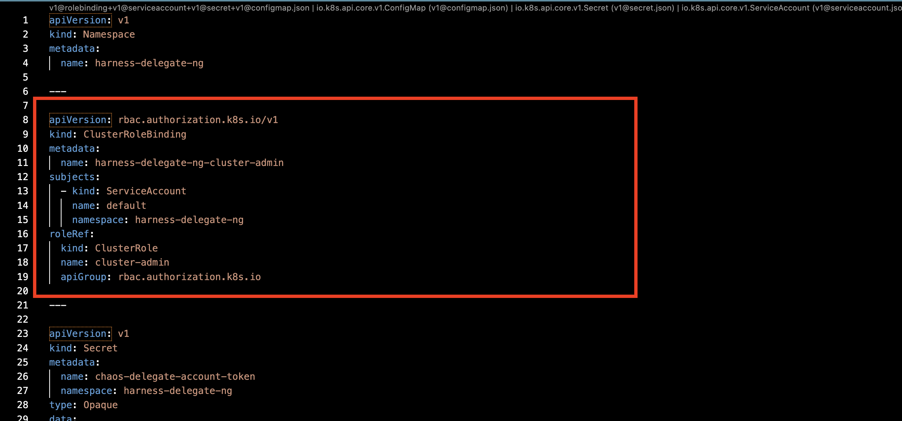
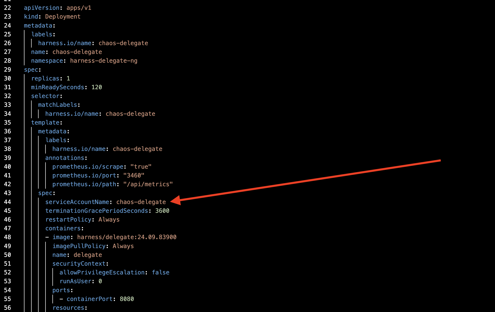
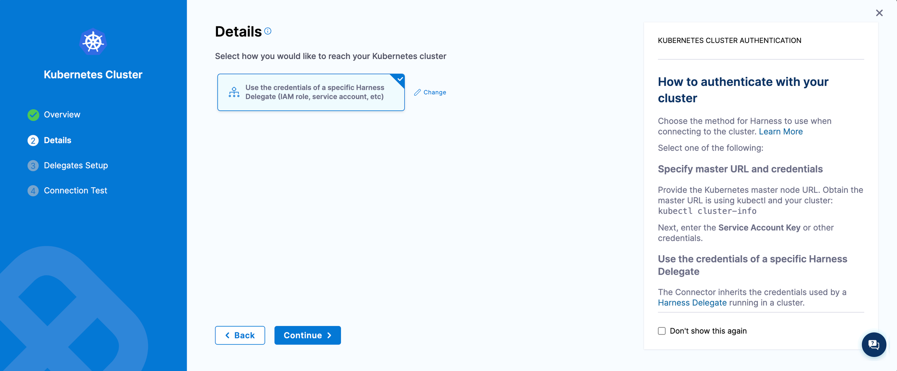
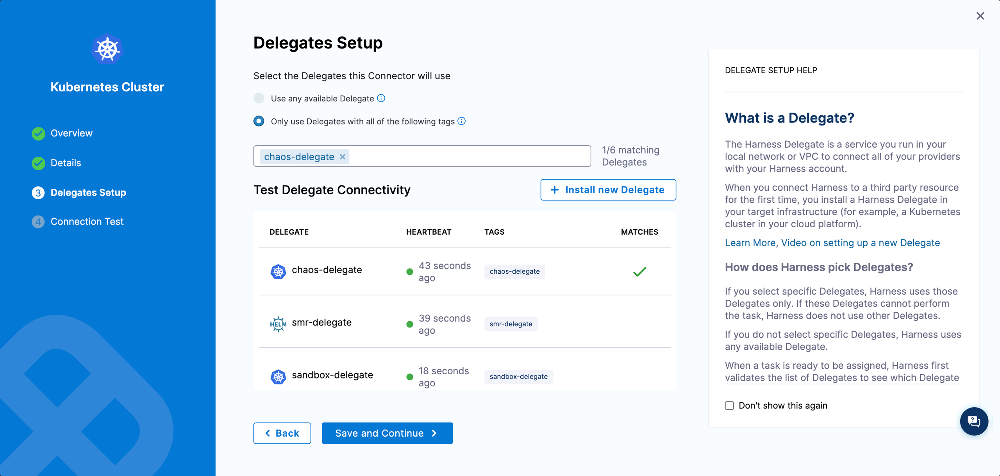
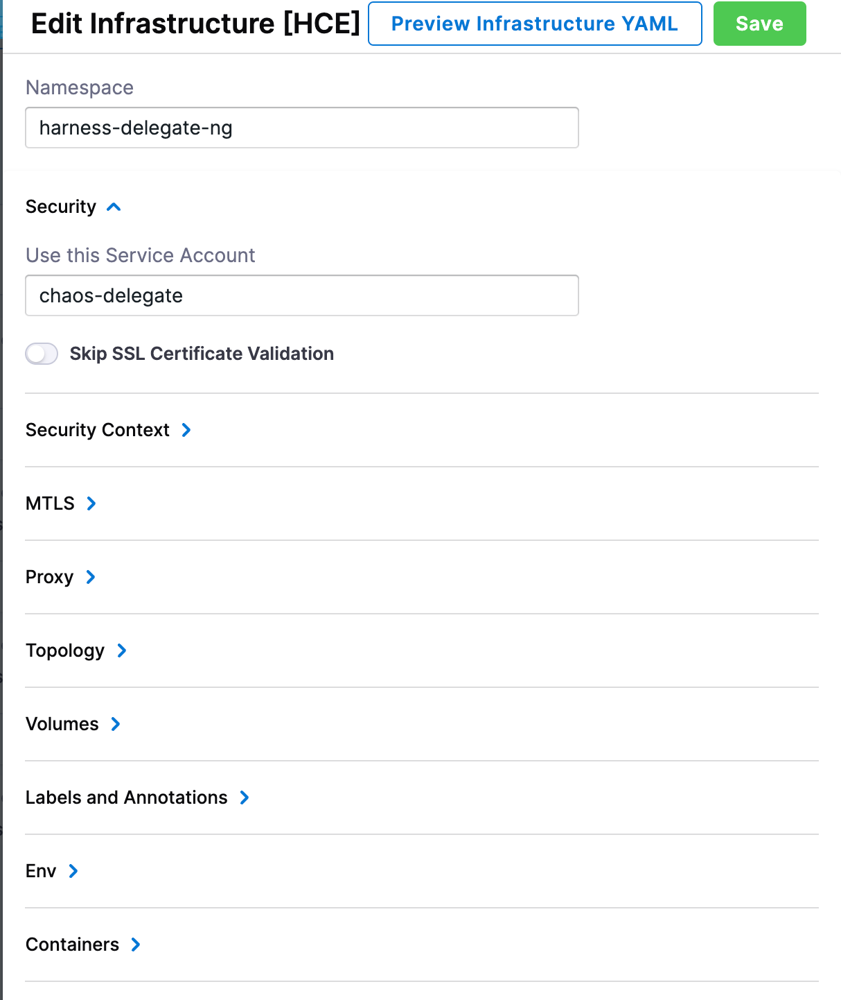

import RedirectIfStandalone from '@site/src/components/DynamicMarkdownSelector/RedirectIfStandalone';

<RedirectIfStandalone label="Limited Permissions" targetPage="/docs/resilience-testing/chaos-testing/infrastructure/kubernetes/dedicated-delegate" />

Use this install when `cluster-admin` is not acceptable on the target cluster. You scope the Delegate to a dedicated namespace, replace the default `ClusterRoleBinding` with a namespace-scoped `Role`, and grant chaos access to only the workloads you plan to inject chaos into through an opt-in `ClusterRole`.

## Step 1. Create a dedicated namespace

Create a dedicated namespace for the Harness Delegate. For example, `harness-delegate-ng`.

```bash
kubectl create ns harness-delegate-ng
```

## Step 2. Remove the cluster role binding from the Delegate manifest

Edit the Delegate Helm values (or YAML manifest) and remove the `ClusterRoleBinding` whose `roleRef.name` is `cluster-admin`. In the default Helm chart this resource is named `<delegate-name>-cluster-admin`. Removing it stops the Delegate from inheriting cluster-wide privileges.



## Step 3. Create a new service account for the Delegate

Create a service account in the dedicated namespace. The Delegate pod will run as this service account.

```yaml
apiVersion: v1
kind: ServiceAccount
metadata:
  name: chaos-delegate
  namespace: harness-delegate-ng
```

## Step 4. Attach the service account to the Delegate

Reference the service account in the Delegate Helm values or manifest.



## Step 5. Apply chaos RBAC

Apply the **Dedicated delegate approach (Delegate in target cluster)** manifest set from [Cluster permissions → Example RBAC manifests](/docs/resilience-testing/chaos-testing/infrastructure/kubernetes/permissions#example-rbac-manifests). The set contains:

1. A namespace `Role` and `RoleBinding` so the Delegate can manage chaos runner pods inside `harness-delegate-ng`.
2. A `ClusterRole` (`chaos-clusterrole`) with the discovery and chaos permissions the runner needs.
3. Either a `ClusterRoleBinding` (chaos can target any namespace) or per-namespace `RoleBinding`s (chaos can target only onboarded namespaces).

The manifests assume `chaos-delegate` as the service account and `harness-delegate-ng` as the namespace. Adjust both if you used different names in Steps 1 and 3.

:::info Pick a binding mode
- **Bind to all namespaces** with a `ClusterRoleBinding`. Easier to manage; less precise.
- **Bind to specific namespaces** with one `RoleBinding` per application namespace. Explicit per-app onboarding.
:::

## Step 6. Create a Kubernetes connector that uses Delegate permissions

In Harness, create a [Kubernetes Direct Connection connector](/docs/platform/connectors/cloud-providers/ref-cloud-providers/kubernetes-cluster-connector-settings-reference) that authenticates via the Delegate's own credentials. The Delegate's service account drives the connection.





## Step 7. Create the Kubernetes infrastructure

Create the chaos infrastructure using the connector from Step 6. The form fields are identical to the [Basic install](#basic--create-a-kubernetes-infrastructure) flow.

## Step 8. Edit the infrastructure to use the dedicated namespace

After saving, open the infrastructure and edit it so the chaos runner is created in `harness-delegate-ng` (the namespace where the Delegate runs) using the `chaos-delegate` service account. This ensures the runner picks up the namespace-scoped `Role` from Step 5.


