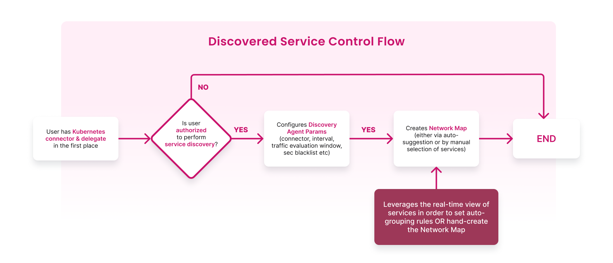
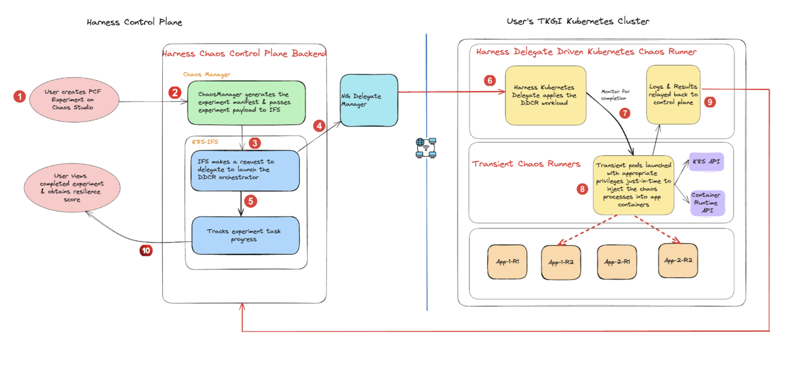

Kubernetes (Harness Infrastructure) runs chaos experiments through the **Harness Delegate**, also known as the **Delegate-Driven Chaos Runner (DDCR)**. The Delegate is already used across Harness modules, so chaos reuses it instead of installing a separate operator.

This page explains what DDCR is, how an experiment executes, the two install approaches, and the resource cost.

---

## What you will learn

- What DDCR is and how it relates to the Harness Delegate.
- How an experiment executes against a target cluster.
- The two ways to deploy the Delegate (dedicated vs centralized) and how to choose between them.
- The CPU and memory profile of every component.

---

## What is DDCR?

DDCR (Delegate-Driven Chaos Runner, also called Delegate-Driven Chaos Infrastructure or DDCI) is a chaos infrastructure type that runs **on top of the Harness Delegate**. There is no separate chaos agent, operator, or set of CRDs to manage. The Delegate orchestrates the chaos runner pods directly, using existing Kubernetes connectors to reach the target cluster.



### What DDCR provides

- **No separate operator.** Reuses the Delegate already deployed for other Harness modules.
- **Automated service discovery.** A transient [discovery agent](/docs/chaos-engineering/guides/service-discovery) maps Kubernetes workloads and the network traffic between them.
- **Application maps.** Auto-create or [guide](/docs/chaos-engineering/guides/application-maps#create-an-application-map) the creation of [application maps](/docs/chaos-engineering/guides/application-maps) so chaos targets a logical app, not raw workloads.
- **Auto-created experiments.** Generate a recommended experiment set per application map.
- **Application-level resilience score** in addition to the per-experiment score.
- **CI/CD adaptability.** Runs out of the same Delegate your pipelines already use.

### How an experiment executes

When you trigger an experiment, the Delegate creates a transient **chaos runner** (DDCI) pod in the configured namespace. The runner then creates short-lived **fault** pods that perform the actual injection (kill processes, drop packets, throttle CPU, etc.). After execution, both the runner and the fault pods are cleaned up.



For the API permissions the runner needs to do this, go to [Cluster permissions](/docs/resilience-testing/chaos-testing/infrastructure/kubernetes/permissions).

---

## Two install approaches

The Delegate that powers the chaos runner can live **inside the target cluster** or **on a separate cluster** that reaches the target through a Kubernetes connector. This is a Delegate install decision, not a chaos infrastructure form field.

| Approach | Where the Delegate runs | When to choose | Doc |
|---|---|---|---|
| **Dedicated delegate** | Inside the target cluster (one Delegate per cluster) | Strongest isolation; simplest single-cluster setup; you control the cluster | [Dedicated delegate approach](/docs/resilience-testing/chaos-testing/infrastructure/kubernetes/dedicated-delegate) |
| **Centralized delegate** | Outside the target cluster, orchestrates many target clusters through Kubernetes connectors | Multi-cluster fleets; central platform team owns the chaos runner | [Centralized delegate approach](/docs/resilience-testing/chaos-testing/infrastructure/kubernetes/centralized-delegate) |

The Dedicated delegate approach itself offers two variants: a **Basic** install that uses the default `cluster-admin` role, and a **Limited Permissions** install that scopes the Delegate to a dedicated namespace with custom RBAC.

:::tip OpenShift targets
OpenShift uses the same DDCR pipeline, plus a Security Context Constraint (SCC) binding and CRI-O fault tunables. Go to [OpenShift](/docs/resilience-testing/chaos-testing/infrastructure/kubernetes/openshift) for the extra setup.
:::

---

## Before you begin

- **Harness Delegate version `24.09.83900` or above.** Earlier versions cannot execute DDCR experiments. Go to [Install Delegate](/docs/platform/delegates/install-delegates/overview) for the platform install steps.
- **A Kubernetes connector.** Go to [Kubernetes connector settings](/docs/platform/connectors/cloud-providers/ref-cloud-providers/kubernetes-cluster-connector-settings-reference) to create one.
- **A Harness environment.** A chaos infrastructure always lives inside an environment. Go to [Create an environment](/docs/chaos-engineering/guides/chaos-experiments/create-experiments#create-environment) if you do not have one.
- **Cluster RBAC for the chaos service account.** Default is `cluster-admin`. To restrict to least privilege, go to [Cluster permissions](/docs/resilience-testing/chaos-testing/infrastructure/kubernetes/permissions) for the `ClusterRole`, `Role`, and binding manifests.

---

## Resource requirements

The Delegate is the only long-running component. Everything else is transient and spun up on demand.

| Component | Lifecycle | Image | CPU request / limit | Memory request / limit |
|---|---|---|---|---|
| **Delegate** | Long-running | `harness/delegate` | 1 (request); no limit | 2Gi / 2Gi |
| **service-discovery-lifecycle-agent** | Transient (per discovery agent / cron) | `harness/service-discovery-collector` | 50m / 200m | 50Mi / 200Mi |
| **sd-cluster** (2 containers: log-watcher + agent) | Transient | `harness/chaos-log-watcher`, `harness/service-discovery-collector` | 50m / 200m (each) | 50Mi / 200Mi (each) |
| **sd-node** (2 containers: log-watcher + agent) | Transient | `harness/chaos-log-watcher`, `harness/service-discovery-collector` | 50m / 200m (each) | 50Mi / 200Mi (each) |
| **DDCI runner** | Transient (per experiment) | `harness/chaos-ddcr` | 50m / 100m | 250Mi / 500Mi (+250Mi ephemeral storage) |
| **Helper pod** (2 containers: log-watcher + fault) | Transient (per fault) | `harness/chaos-log-watcher`, `harness/chaos-ddcr-faults` | Configurable | Configurable |

The **Helper pod** is the pod that executes the actual fault injection (also called the fault pod in some fault references). Its CPU and memory requests and limits are configurable per fault in the experiment YAML; there are no default requests or limits, so set them to match the workload the fault is run against.

:::info Delegate sizing
The Delegate defaults above suit most installs. For heavier workloads, raise the request and limit in the Delegate values file. Transient pods are released after each experiment, so cluster capacity only needs to cover concurrent runs.
:::

---

## Using the minimal Delegate image

Harness publishes two Delegate images:

- **Standard Delegate image** *(recommended)*: ships with `kubectl` and `go-template`, which the chaos runner and discovery agent both need. No extra setup is required.
- **Delegate-minimal image**: lightweight image without `kubectl` or `go-template`. Chaos experimentation and discovery are **not supported out of the box** on this image. If your platform team is standardized on the minimal image, install the two binaries with one of the options below before creating a Kubernetes infrastructure.

:::warning Choose one
Pick one of the two options below. Do not mix them in the same Delegate.
:::

### Option 1: Create a custom Delegate image

Build a Docker image that starts `FROM` the minimal Delegate image and adds `kubectl` and `go-template`. Push it to your container registry and reference it as the Delegate image in your Helm values or Delegate manifest. Use this when your security team requires every image to be scanned and stored internally.

### Option 2: Install the binaries via `INIT_SCRIPT` (recommended)

The Delegate runs the value of the `INIT_SCRIPT` environment variable on startup. Add the snippet below to the Delegate values file (Helm) or to the Deployment manifest:

```yaml
- env:
  - name: INIT_SCRIPT
    value: |
      ##kubectl
      curl -L0 https://app.harness.io/public/shared/tools/kubectl/release/v1.28.7/bin/linux/amd64/kubectl -o kubectl
      chmod +x ./kubectl
      mv kubectl /usr/local/bin/
      ## go-template
      curl -L0 https://app.harness.io/public/shared/tools/go-template/release/v0.4.1/bin/linux/amd64/go-template -o go-template
      chmod +x ./go-template
      mv go-template /usr/local/bin/
```

The Delegate pod runs the script on each restart. Both binaries land in `/usr/local/bin/` and are picked up automatically by the chaos runner.

<details>
<summary>View a complete minimal-Delegate Deployment with `INIT_SCRIPT`</summary>

```yaml
apiVersion: apps/v1
kind: Deployment
metadata:
  labels:
    app.kubernetes.io/instance: minimal-delegate
    app.kubernetes.io/managed-by: Helm
    app.kubernetes.io/name: minimal-delegate
    harness.io/name: minimal-delegate
  name: minimal-delegate
  namespace: harness-delegate-ng
spec:
  replicas: 1
  selector:
    matchLabels:
      app.kubernetes.io/instance: minimal-delegate
      app.kubernetes.io/name: minimal-delegate
  template:
    metadata:
      labels:
        app.kubernetes.io/instance: minimal-delegate
        app.kubernetes.io/name: minimal-delegate
        harness.io/name: minimal-delegate
    spec:
      containers:
      - name: delegate
        image: us-docker.pkg.dev/gar-prod-setup/harness-public/harness/delegate:25.08.86602.minimal
        imagePullPolicy: Always
        env:
        - name: INIT_SCRIPT
          value: |
            ##kubectl
            curl -L0 https://app.harness.io/public/shared/tools/kubectl/release/v1.28.7/bin/linux/amd64/kubectl -o kubectl
            chmod +x ./kubectl
            mv kubectl /usr/local/bin/
            ## go-template
            curl -L0 https://app.harness.io/public/shared/tools/go-template/release/v0.4.1/bin/linux/amd64/go-template -o go-template
            chmod +x ./go-template
            mv go-template /usr/local/bin/
        envFrom:
        - configMapRef:
            name: minimal-delegate
        - secretRef:
            name: minimal-delegate
        ports:
        - containerPort: 8080
          protocol: TCP
        - containerPort: 3460
          name: api
          protocol: TCP
        livenessProbe:
          httpGet:
            path: /api/health
            port: 3460
          initialDelaySeconds: 30
          periodSeconds: 20
        securityContext:
          allowPrivilegeEscalation: false
          runAsUser: 0
      serviceAccount: minimal-delegate
      serviceAccountName: minimal-delegate
      terminationGracePeriodSeconds: 600
```

Replace the `image` tag with the minimal Delegate version your account is on.

</details>

For the underlying platform context, go to [Install minimal Delegate with 3rd-party custom binaries](/docs/platform/delegates/install-delegates/overview#install-minimal-delegate-with-3rd-party-custom-binaries).

---

## Next steps

- [Dedicated delegate approach](/docs/resilience-testing/chaos-testing/infrastructure/kubernetes/dedicated-delegate): install the Delegate inside the target cluster, either with default `cluster-admin` permissions or with a custom least-privilege RBAC.
- [Centralized delegate approach](/docs/resilience-testing/chaos-testing/infrastructure/kubernetes/centralized-delegate): run one Delegate that targets multiple clusters through Kubernetes connectors.
- [OpenShift](/docs/resilience-testing/chaos-testing/infrastructure/kubernetes/openshift): SCC binding and CRI-O fault tunables for OpenShift target clusters.
- [Cluster permissions](/docs/resilience-testing/chaos-testing/infrastructure/kubernetes/permissions): full API permission reference for the chaos service account.
- [Network configuration](/docs/resilience-testing/chaos-testing/infrastructure/kubernetes/network-config): mTLS and Harness Network Proxy (HNP) settings for restricted networks.
