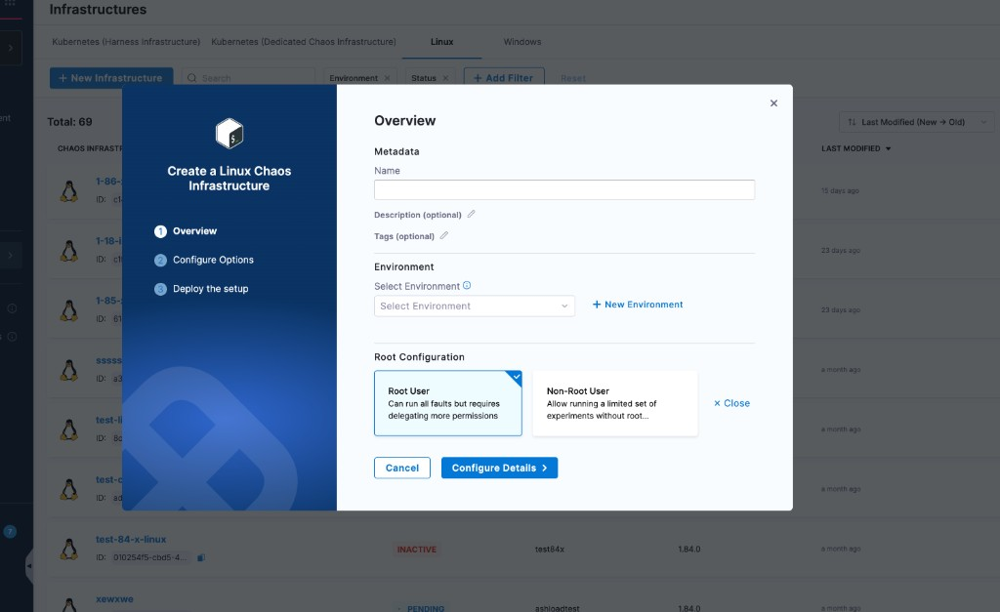
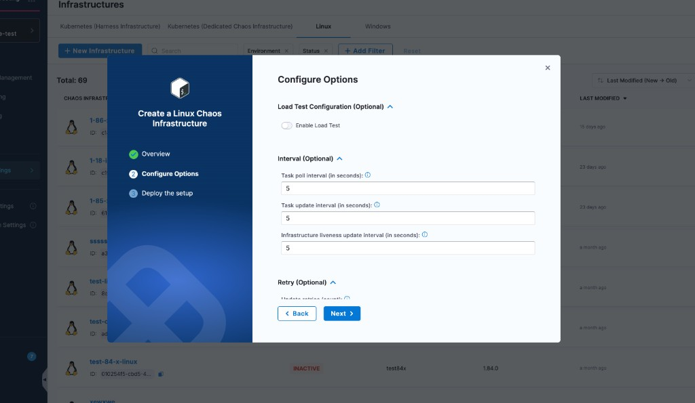
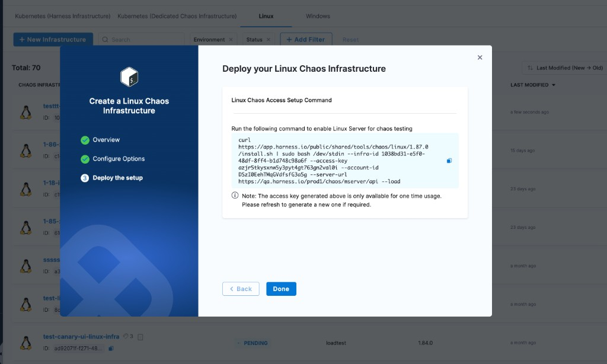

Linux Chaos Infrastructure runs chaos experiments against Linux VMs and Cloud Foundry foundations. It installs as a single binary managed by `systemd`. This page walks through the three-step create wizard, the Root vs Non-Root user choice, and SELinux setup.

---

## Before you begin

- **A Linux host** with `systemd` and the privileges your install requires (root for the **Root User** option; a regular user for **Non-Root User**).
- **A Harness environment** to attach the infrastructure to. Go to [Create an environment](/docs/chaos-engineering/guides/chaos-experiments/create-experiments#create-environment) if you do not have one.
- **SELinux policy module** if your distro enables SELinux by default (CentOS, RHEL, SUSE, Fedora). Go to [Configure SELinux](#configure-selinux) before installing.

---

## Resource requirements

The Linux Chaos Infrastructure runs as a single `systemd`-managed binary. It is idle between experiments and adds fault-specific load only while an experiment is executing.

| Resource | Idle usage on a 2 vCPU / 1 GB reference VM |
|---|---|
| **CPU** | 0.05% |
| **Memory** | 1.5% (≈ 15 MB) |
| **Disk** | 25 MB (binary + config + log directory) |
| **Network bandwidth** | 0.15 KB/s (control-plane poll + heartbeat) |

Reference measurement was taken on a GCP `e2-micro` VM (**2 vCPU**, **1 GB** memory) running **Ubuntu 22.04**.

:::info Host sizing
The agent's idle cost is negligible, so size the host for the workload the agent will inject chaos against, not for the agent itself. During an experiment, plan for the fault to fully consume the resource it targets (for example, a CPU stress fault saturates `WORKERS` cores at `LOAD` percent for `DURATION`).
:::

---

## Create a Linux infrastructure

The new-infrastructure wizard has three steps: **Overview**, **Configure Options**, and **Deploy the setup**.

1. Go to **Resilience Testing → Project Settings → Resilience Testing Infrastructures**.
2. Select the **Linux** tab.
3. Click **+ New Infrastructure**. The **Create a Linux Chaos Infrastructure** wizard opens.

### Step 1. Overview

Set the metadata, pick an environment, and choose the root configuration.



- **Name** (required). Plus optional **Description** and **Tags**.
- **Select Environment** (required). Pick an existing environment or click **+ New Environment**.
- **Root Configuration:**
  - **Root User** *(default)* — Can run **all** Linux faults, but the install command runs as root.
  - **Non-Root User** — Restricts the infrastructure to the subset of faults that do not require root. Go to [Root vs Non-Root user](#root-vs-non-root-user) for the trade-off.

Click **Configure Details** to continue.

### Step 2. Configure Options

Every field on this step is optional. The defaults (5-second intervals, 5 retries, 5 MB / 2-archive log rotation, 30-day experiment log retention) work for most installs. Expand a section only if you need to override a default or set a proxy.



Notes:

- **Retry behavior.** If **Update retries** is exhausted while sending **status**, the fault aborts (errors logged for each attempt) and the result is then attempted. If it is exhausted while sending the **result**, no result is sent, but every attempt is logged.
- **Load Test toggle.** Turn on **Enable Load Test** when the host should also act as a [Load Testing](/docs/resilience-testing/load-testing/get-started) target.
- **Proxy.** For restricted networks, use **HTTP Proxy**, **HTTPS Proxy**, and **No Proxy**. Hover the info icon on each field for the variable it sets.

Click **Next** to continue.

### Step 3. Deploy the setup

The wizard generates a `curl | sudo bash` install command pre-filled with your `infra-id`, `access-key`, `account-id`, and `server-url`.



1. Copy the command.
2. Run it on your Linux host. The installer downloads the binary, writes the config, and starts the `linux-chaos-infrastructure.service` under `systemd`.
3. Click **Done**.

:::warning One-time access key
The access key shown on this screen is single-use. If you do not run the install command before closing the wizard, refresh the page or recreate the infrastructure to generate a new key.
:::

---

## Validate the installation

After the install command runs, Harness takes a few moments to register the infrastructure. Go to **Resilience Testing → Project Settings → Resilience Testing Infrastructures → Linux** and confirm the status is `CONNECTED`.

On the host itself:

```bash
systemctl status linux-chaos-infrastructure.service
```

The service starts on system boot, restarts five seconds after an unexpected stop, and runs as the user chosen in Step 1 (root or your non-root user). Infrastructure logs are written to the directory you configured (default `/var/log/linux-chaos-infrastructure/linux-chaos-infrastructure.log`); per-fault experiment logs sit alongside it and are deleted after **Experiment log file max age** (default 30 days).

Anything other than `active (running)` indicates an issue. Go to [Troubleshoot Resilience Testing](/docs/resilience-testing/resources/troubleshooting) for next steps.

---

## Root vs Non-Root user

The **Root Configuration** choice on Step 1 controls which faults the infrastructure can execute.

| Choice | Fault coverage | Install permissions |
|---|---|---|
| **Root User** *(default)* | All Linux faults | The install command runs with `sudo`; the service runs as root |
| **Non-Root User** | Subset of faults that do not require root (no time chaos, restricted process chaos, no host-level network policies) | The install command runs as a regular user; the service runs as that user |

Pick **Non-Root User** when your environment forbids long-running root processes. Pick **Root User** when you need the full fault catalog.

---

## Configure SELinux

If SELinux is enabled on your distro (CentOS, RHEL, SUSE, Fedora), add a policy module before installing. The module grants the access `timedatectl` needs for the `linux-time-chaos` fault.

<details>
<summary>SELinux policy module setup</summary>

1. Create `timedatectlAllow.te`:

    ```te
    module timedatectlAllow 1.0;

    require {
        type systemd_timedated_t;
        type initrc_t;
        class dbus send_msg;
    }

    #============= systemd_timedated_t ==============
    allow systemd_timedated_t initrc_t:dbus send_msg;
    ```

2. Install the policy-compilation tooling:

    ```bash
    sudo yum install -y policycoreutils-python checkpolicy
    ```

3. Compile the policy module:

    ```bash
    sudo checkmodule -M -m -o timedatectlAllow.mod timedatectlAllow.te
    ```

4. Package the module:

    ```bash
    sudo semodule_package -o timedatectlAllow.pp -m timedatectlAllow.mod
    ```

5. Load it:

    ```bash
    sudo semodule -i timedatectlAllow.pp
    ```

Now run the wizard install command from Step 3 as usual.

</details>

---

## Disable the infrastructure

1. Go to **Resilience Testing → Project Settings → Resilience Testing Infrastructures → Linux**.
2. Click the **⋮** menu next to the infrastructure and select **Disable**.
3. Copy the uninstall command from the modal, run it on the Linux host, and click **Confirm**.

---

## Next steps

- [Upgrade Linux infrastructure](/docs/resilience-testing/chaos-testing/infrastructure/linux/upgrade): apply the latest binary to an existing install.
- [Overview](/docs/resilience-testing/chaos-testing/infrastructure): compare against Kubernetes and Windows infrastructures.
