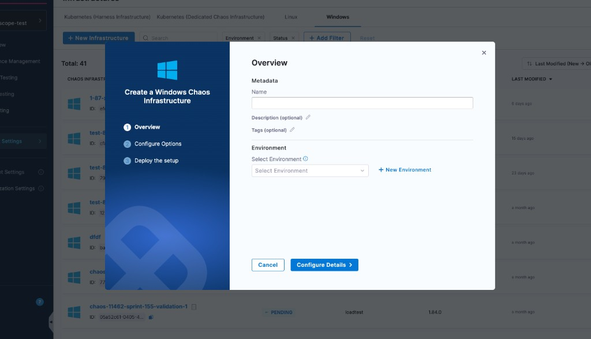
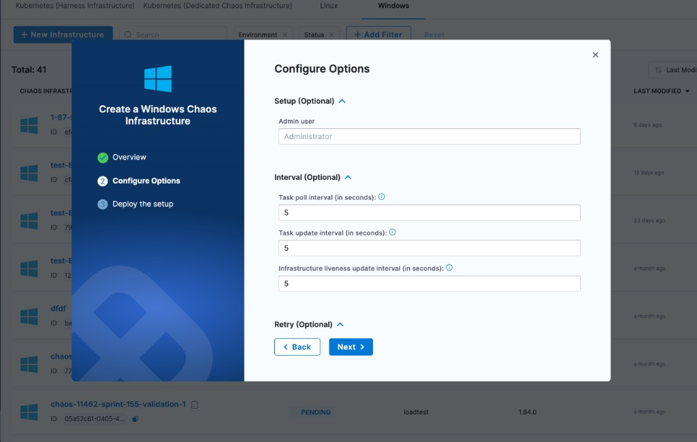
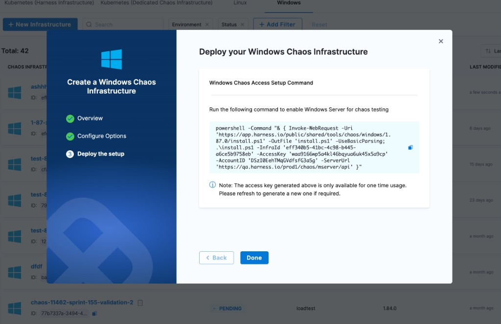

Windows Chaos Infrastructure runs chaos experiments against Windows VMs. The installer registers a single binary as the `WindowsChaosInfrastructure` service on the target VM, which then polls the Harness control plane for experiments.

This page walks through the in-product create wizard, configurable options, and how to validate or disable the infrastructure.

---

## Before you begin

- **A Windows VM** with administrator privileges (or an account that can run the installer as administrator).
- **A Harness environment** to attach the infrastructure to. Go to [Create an environment](/docs/chaos-engineering/guides/chaos-experiments/create-experiments#create-environment) if you do not have one.
- **Windows fault prerequisites.** Go to [Windows fault prerequisites](/docs/chaos-engineering/faults/chaos-faults/windows/prerequisites) for the per-fault setup (passwords, tools, etc.).

---

## Resource requirements

The Windows Chaos Infrastructure runs as the `WindowsChaosInfrastructure` Windows service. It is idle between experiments and adds fault-specific load only while an experiment is executing.

| Resource | Idle usage on a 2 vCPU / 4 GB reference VM |
|---|---|
| **CPU** | ~0.14% average (0–1.5% instantaneous; brief 5s poll spikes) |
| **Memory** | ~15 MB working set (≈ 0.5% of 4 GB) |
| **Disk** | ~45 MB installed (binary + bundled tools); ~60 MB ceiling with log rotation |
| **Network bandwidth** | Minimal (HTTP poll + heartbeat every 5s; no persistent connections) |

Reference measurement was taken on an AWS EC2 `t3.medium` instance (**2 vCPU**, **4 GB** memory) running **Windows Server 2025 Datacenter**.

**Minimum recommended host:** Windows Server 2016+ or Windows 10+ (64-bit) with **50 MB free RAM**, **100 MB free disk**, and outbound HTTPS to the Harness control plane. No inbound ports are required.

:::info Host sizing
The agent's idle cost is negligible, so size the host for the workload the agent will inject chaos against, not for the agent itself. Per concurrent fault, the service adds roughly **+0.7 MB RAM** and **+1.5% CPU** on top of idle; faults that target disk or network may load additional bundled tools (`diskspd`) or kernel drivers (`WinDivert`) for the duration of the experiment.
:::

---

## Create a Windows infrastructure

In Harness, go to **Resilience Testing → Project Settings → Resilience Testing Infrastructures**, switch to the **Windows** tab, and click **+ New Infrastructure**. The create wizard has three steps.

### Step 1. Overview

Enter the infrastructure metadata and pick an environment.

| Field | Required | Notes |
|---|---|---|
| **Name** | Yes | Display name for the infrastructure. |
| **Description** | No | Free-form context. |
| **Tags** | No | Searchable labels. |
| **Environment** | Yes | Pick from the dropdown or click **+ New Environment**. |



Click **Configure Details** to continue.

### Step 2. Configure Options

All options on this step are optional. Defaults work for most setups, expand a section only if you need to change a value.

| Section | Field | Default | Purpose |
|---|---|---|---|
| **Setup** | Admin user | `Administrator` | Administrator used to install and manage the infrastructure. |
| **Interval** | Task poll interval | `5s` | Interval between poll queries for a new experiment. |
| **Interval** | Task update interval | `5s` | Interval between status updates for an active fault. |
| **Interval** | Infrastructure liveness update interval | `5s` | Heartbeat interval to the control plane. |
| **Retry** | Update retries (count) | `5` | Maximum retries before the service treats the call as failed. |
| **Retry** | Update retries interval | `5s` | Wait between status or result retries. |
| **Logs** | Log file max size | `5 MB` | Log file size threshold for rotation. |
| **Logs** | Log file max backups | `2` | Number of rotated log archives to retain. |
| **Logs** | Experiment log file max age | `30 days` | Age after which experiment log files are deleted. |
| **HTTP Proxy** | HTTP Proxy | unset | Proxy URL used to communicate with the control plane. |
| **HTTP Client Timeout** | HTTP Client Timeout | `30s` | Timeout for HTTP calls to the control plane. |



For restricted networks, set **HTTP Proxy** to the proxy URL the VM should use for outbound calls to the Harness control plane.

Click **Next** to continue.

### Step 3. Deploy the setup

Harness generates a PowerShell command that downloads the installer, registers `WindowsChaosInfrastructure` as a service, and connects it to your account.



1. Copy the PowerShell command shown on screen.
2. Open **PowerShell as Administrator** on the target Windows VM.
3. Paste and run the command.
4. Click **Done** in the wizard.

:::tip One-time access key
The access key embedded in the command is single use. If you close the wizard before running the command, reopen the deploy step to generate a new one.
:::

The installer prints output similar to:

```
    Directory: C:\

Mode                 LastWriteTime         Length Name
----                 -------------         ------ ----
d-----          3/7/2024   7:48 AM                HCE
Downloading windows-chaos-infrastructure binary...
Config file created at C:\HCE\config.yaml

    Directory: C:\HCE\Logs

[SC] CreateService SUCCESS
Service created and started successfully.
```

The default install paths are:

- **Binary:** `C:\HCE\windows-chaos-infrastructure.exe`
- **Config:** `C:\HCE\config.yaml`
- **Logs:** `C:\HCE\logs\`

---

## Validate the installation

After running the install command, Harness takes a few moments to register the infrastructure. Go to **Resilience Testing → Project Settings → Resilience Testing Infrastructures → Windows** and confirm the status is `CONNECTED`.

To verify the service on the VM:

1. Open **Task Manager** and switch to **More details**.
2. Find **WindowsChaosInfrastructure** under the **Services** tab. The state should be **Running**.
3. If the state is **Stopped**, right-click the service and select **Start**.

### Logs

Logs are written under the log directory (default `C:\HCE\logs`).

- **Infrastructure logs** capture connectivity, startup, and polling errors. Files are rotated when they reach **Log file max size** (default 5 MB); the most recent **Log file max backups** archives (default 2) are kept.
- **Experiment logs** are written one file per fault, named after the fault's unique name. Each experiment run also creates its own folder with the connectivity logs for that run. Files are deleted after **Experiment log file max age** (default 30 days).

---

## Disable the infrastructure

1. Go to **Resilience Testing → Project Settings → Resilience Testing Infrastructures → Windows**.
2. Click the **⋮** menu next to the infrastructure and select **Disable**.
3. Copy the uninstall command, run it in **PowerShell as Administrator** on the VM, and click **Confirm**.

---

## Next steps

- [Upgrade Windows infrastructure](/docs/resilience-testing/chaos-testing/infrastructure/windows/upgrade): apply the latest binary to an existing install.
- [Windows fault prerequisites](/docs/chaos-engineering/faults/chaos-faults/windows/prerequisites): per-fault setup before running experiments.
- [Overview](/docs/resilience-testing/chaos-testing/infrastructure): compare against the Kubernetes and Linux infrastructure types.
