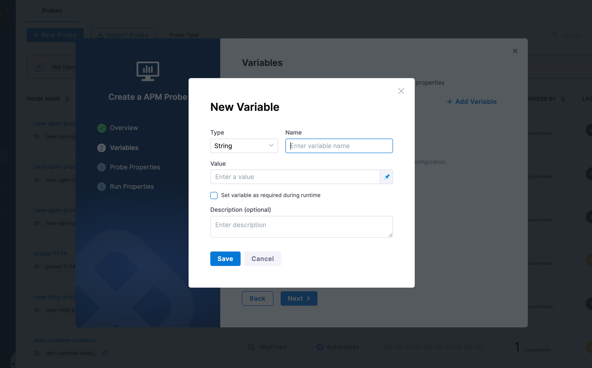
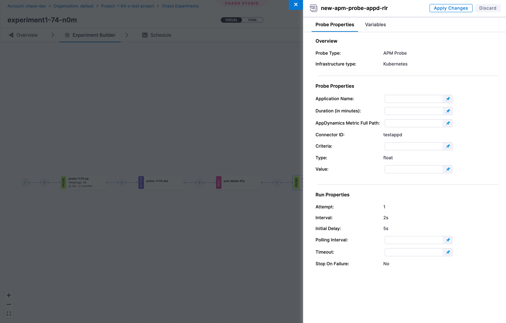

Probes are validation mechanisms that continuously monitor and verify the health and behavior of your system throughout chaos experiments. They act as automated checkpoints that help you:

- **Validate system resilience** - Verify that your applications and infrastructure maintain expected behavior under failure conditions
- **Define success criteria** - Set clear, measurable conditions that determine whether an experiment passes or fails
- **Collect evidence** - Gather real-time data about system state, performance metrics, and application health
- **Automate validation** - Replace manual observation with automated checks that run at specific points during experiments

Probes can query various data sources including HTTP endpoints, command outputs, Kubernetes resources, and APM systems to provide comprehensive visibility into your system's resilience.

:::info Important: Probe Scope Differences
- **Old Chaos Studio**: Probes are scoped to individual faults and execute only during fault injection
- **New Chaos Studio**: Probes operate along the entire experiment lifecycle and can be configured to run before, during, and after the complete experiment execution
:::

## Probe Verification

Probes can be marked as **Verified** to ensure only tested and approved probes are used in production experiments. This governance feature helps teams:

- **Maintain quality standards** - Only allow probes that have been validated and approved by your team
- **Prevent misconfigurations** - Reduce the risk of using untested or incorrectly configured probes in critical experiments
- **Enforce compliance** - Use with [ChaosGuard](./governance/governance-in-execution/govern-run) policies to mandate that only verified probes can be executed

### How to Mark a Probe as Verified

1. Navigate to the **Probes & Actions** section in the Chaos Engineering module
2. Locate the probe you want to verify
3. Click on the three-dot menu (⋮) next to the probe
4. Select **Mark as Verified**

    

Once marked as verified, the probe will display a green checkmark (✓) in the **Verification Status** column. You can then configure ChaosGuard conditions to allow only verified probes in your experiments, adding an extra layer of safety and governance.

:::tip
Combine probe verification with ChaosGuard policies to create a robust governance framework that ensures only approved, tested probes are used in your chaos experiments.
:::

## Variables

Variables allow you to define reusable, parameterized values that can be referenced in **Probe Properties** and **Run Properties** during probe configuration. This is the second step in the probe creation wizard and applies to all probe types.

Variables are useful when you want to:
- **Reuse values** across multiple probe configuration fields without repeating them
- **Inject runtime values** into probe properties at experiment execution time
- **Centralize configuration** - update a variable once and have it reflected wherever it is used

### Adding a Variable

When creating or editing a probe, navigate to the **Variables** step and click **+ Add Variable**. Each variable has the following fields:

| Field | Description |
|-------|-------------|
| **Type** | Data type of the variable. Supported types: `String`, `Number` |
| **Name** | Identifier used to reference the variable in probe/run properties |
| **Value** | The value assigned to the variable - can be a fixed value or a runtime input |
| **Set variable as required during runtime** | When checked, the variable must be supplied at experiment run time |
| **Description** | Optional description for the variable |

### Value Types

- **Fixed value** - A static value set at probe creation time. The value remains constant across experiment runs.
- **Runtime input** - The value is provided at experiment execution time (shown as `<+input>` in the variables list). Use this when the value may differ between runs.

### Using Variables in Chaos Studio

When you add a probe to an experiment in the **Chaos Studio**, the probe panel shows a **Variables** tab alongside **Probe Properties** and **Configuration**. Any input variables defined on the probe appear here, allowing you to supply or override values for that specific experiment run before applying changes.

## Probe Properties

When configuring probes in the Chaos Studio, all configuration fields are available in the **Probe Properties** tab. This unified interface provides a streamlined experience by consolidating all probe settings in a single location.

The **Probe Properties** tab includes:
- **Probe-specific settings**: Application Name, Duration, Metric paths, Timeout values, Polling intervals, Criteria, and other probe type-specific configurations
- **Run Properties**: Attempt, Interval, Initial Delay, Polling Interval, Timeout, Stop On Failure

:::info UI Update (Version 1.77.3+)
All probe configuration has been consolidated into the **Probe Properties** tab. Previously, some inputs were managed in a separate "Variables" tab. This change simplifies the configuration experience by keeping all probe settings together in one place, making it easier to configure and review your probe setup.

:::

## Probe Types

Select the probe type you want to learn more about:

import DynamicMarkdownSelector from '@site/src/components/DynamicMarkdownSelector/DynamicMarkdownSelector';

<DynamicMarkdownSelector
  options={{
    "HTTP Probe": {
      path: "/resilience-testing/content/probes/http-probe.md"
    },
    "Command Probe": {
      path: "/resilience-testing/content/probes/command-probe.md"
    },
    "Prometheus Probe": {
      path: "/resilience-testing/content/probes/prometheus-probe.md"
    },
    "K8S Probe": {
      path: "/resilience-testing/content/probes/k8s-probe.md"
    },
    "Datadog Probe": {
      path: "/resilience-testing/content/probes/datadog-probe.md"
    },
    "Dynatrace Probe": {
      path: "/resilience-testing/content/probes/dynatrace-probe.md"
    },
    "SLO Probe": {
      path: "/resilience-testing/content/probes/slo-probe.md"
    },
    "APM Probe": {
      path: "/resilience-testing/content/probes/apm-probe.md"
    },
    "Container Probe": {
      path: "/resilience-testing/content/probes/container-probe.md"
    }
  }}
  toc={toc}
  disableSort={true}
/>

## Built-in Probe Templates

Harness provides pre-built Command Probe templates to help you quickly validate common scenarios in your chaos experiments. These templates are ready to use and can be customized to fit your specific requirements.

:::note
Currently, built-in templates are available for **Command Probes** targeting **Kubernetes** infrastructure. Templates for other probe types and platforms will be added in future releases.
:::

import ChaosFaults from '@site/src/components/ChaosEngineering/ChaosFaults';
import { probeTemplateCategories } from '../content/probes/probe-templates';

<ChaosFaults categories={probeTemplateCategories} />

## Next Steps
- [Create Chaos Experiments](/docs/resilience-testing/chaos-testing/experiments) - Build experiments with probes for validation

