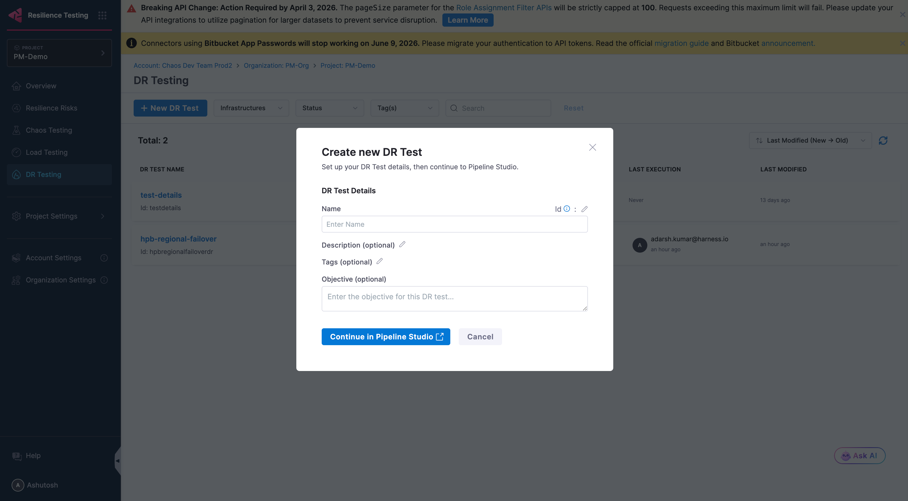
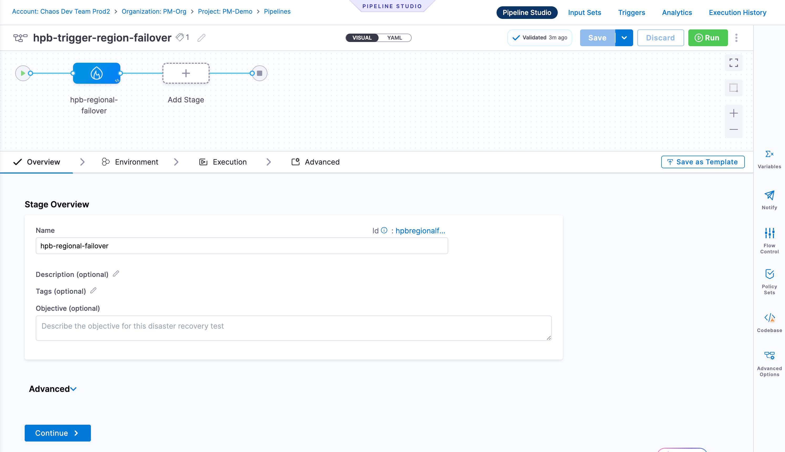

Disaster Recovery (DR) Testing validates that your systems can recover from catastrophic failures. Each DR test is a Harness pipeline stage, giving you the full power of Pipeline Studio to orchestrate failover, validation, and notification steps in a repeatable, auditable workflow.

<DocVideo src="https://youtu.be/hGOcf5t9KY0" />

:::info Feature Flag
DR Testing is currently behind a feature flag (`CHAOS_DR_TESTING_ENABLED`). Contact your Harness sales representative to get it enabled for your account.
:::

## Prerequisites

- Access to the Harness Resilience Testing module
- A Harness environment configured in your project
- A **Kubernetes Chaos Infrastructure** connected to the cluster where your target application runs (required for Chaos Fault and Chaos Probe steps)
- Appropriate permissions to create pipelines

## Create your first DR test

1. Navigate to **Resilience Testing** > **DR Testing**
2. Click **+ New DR Test**

The **DR Testing** list shows all DR tests in the project with their Recent Executions, Last Execution status, and Last Modified timestamp.

### Step 1: DR Test Details

In the **Create new DR Test** dialog, fill in:

| Field | Description |
|---|---|
| **Name** | A descriptive name for the DR test |
| **Id** | Auto-generated from the name. Editable via the pencil icon. |
| **Description** | (Optional) Details about the disaster scenario being tested |
| **Tags** | (Optional) Labels to organize tests |
| **Objective** | (Optional) The goal or success criteria for this DR test |

Click **Continue in Pipeline Studio** to open the pipeline stage editor.

### Step 2: Configure the Pipeline Stage

Each DR test is a stage in a Harness pipeline. Pipeline Studio has four tabs: **Overview**, **Environment**, **Execution**, and **Advanced**.

#### Overview Tab

The stage overview is pre-populated from the DR test details you entered. You can edit:

- **Name** and **Id**
- **Description**, **Tags**, and **Objective**

The **Advanced** section within Overview lets you configure:

- **Timeout**: Maximum time the stage is allowed to run (format: `w/d/h/m/s`)
- **Stage Variables**: Key-value variables scoped to this stage, available in steps via expressions

Click **Continue** to proceed to the Environment tab.

#### Environment Tab

The Environment tab has a **Configuration** section:

- **Specify Environment**: Select an existing environment from the dropdown or click **+ New Environment** to create one
- **Specify Infrastructure**: Select the Chaos Infrastructure that connects to your target cluster, or click **+ New Infrastructure** to create one. This is the Kubernetes infrastructure where Chaos Fault and Chaos Probe steps will execute.

Below Configuration, the **Failure Strategy** section defines what happens when the stage encounters an error:

- **On failure of type**: Select one or more failure types to handle:
  - Authentication Errors, Connectivity Errors, Timeout Errors, Authorization Errors
  - Verification Failures, Delegate Provisioning Errors, Unknown Errors
  - Policy Evaluation Failures, Execution-time Inputs Timeout Errors
  - Approval Rejection, Delegate Restart, User Marked Failure
  - Or check **All Errors** to catch everything
- **Perform Action**: Choose how to respond to the failure:
  - **Rollback Pipeline**, **Retry Step**, **Abort**, **Mark As Failure**, **Rollback Stage**

Click **Continue** to proceed to the Execution tab.

#### Execution Tab

The Execution tab is where you build the actual DR workflow. The canvas starts empty with an **Add Step** (+) node.

Click **+** to open the Step Library. Under the **Disaster Recovery** category, three step types are available:

| Step Type | Description |
|---|---|
| **Chaos Probe** | Validates the health of a Kubernetes workload (e.g., checks if pods are running). Use before and after a fault to verify baseline state and recovery. |
| **Chaos Fault** | Injects a failure into the target system (e.g., pod-delete, network-loss, CPU stress). Simulates the disaster scenario. |
| **Chaos Action** | Executes a predefined chaos action from your Resilience Testing module. |

##### Chaos Probe step fields

| Field | Description |
|---|---|
| **Select Chaos Infrastructure** | The Kubernetes infrastructure to run the probe against |
| **Chaos Probe** | Select a predefined probe (e.g., `default-pod-level-probe`) |
| **Duration** | How long the probe runs (e.g., `1m`) |

Runtime Inputs for `default-pod-level-probe`:

| Input | Description | Example |
|---|---|---|
| **TARGET_NAMES** | Name of the workload to validate | `frontend` |
| **TARGET_NAMESPACE** | Kubernetes namespace of the target | `boutique` |
| **TARGET_KIND** | Kubernetes resource kind | `Deployment` |

##### Chaos Fault step fields

| Field | Description |
|---|---|
| **Select Chaos Infrastructure** | The Kubernetes infrastructure to inject the fault on |
| **Chaos Fault** | Select a fault type (e.g., `pod-delete`, `pod-network-loss`) |

Steps can be connected sequentially or in parallel depending on your recovery procedure. You can also add standard Harness steps (shell scripts, HTTP calls, approvals, notifications) alongside DR steps.

#### Advanced Tab

The Advanced tab provides stage-level controls:

**Delegate Selector** (optional): Pin this stage to run on a specific Harness Delegate by adding selector tags.

**Conditional Execution**: Control when the stage runs:
- If the pipeline executes successfully up to this point (default)
- If the previous pipeline or stage fails
- Always
- Or define a custom **JEXL condition** expression

**Looping Strategy**: Run the stage multiple times using one of three strategies:
- **Matrix**: Run across combinations of variables
- **Repeat**: Run a fixed number of times
- **Parallelism**: Run iterations in parallel

**Failure Strategy** (step-level): Defines failure handling for steps within the stage. Supports the same failure types as the Environment tab. Available actions at this level:
- Manual Intervention, Ignore Failure, Retry Step, Mark As Success, Abort
- Proceed with Default Values, Mark As Failure, Rollback Pipeline

### Step 3: Save and Run

1. Click **Save** to persist the pipeline
2. Click **Run** to execute the DR test immediately
3. Monitor real-time execution progress in Pipeline Studio
4. Review full execution history under **Execution History**

## Next Steps

- [Pipeline Stage Reference](./pipeline-stage-reference): Complete field reference for all pipeline stage options
- [Concepts](./concepts): Understand RTO, RPO, environments, and failure strategies
- [Chaos Testing](../chaos-testing/get-started): Combine DR testing with chaos experiments
