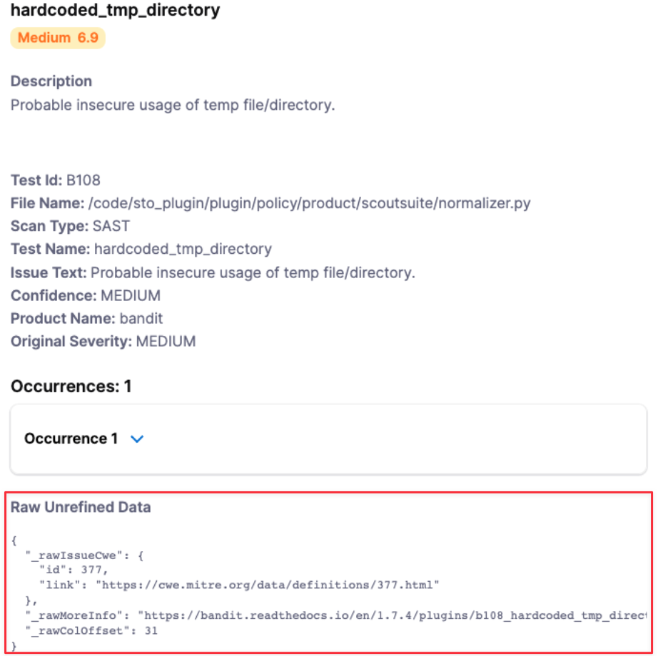

import Tabs from '@theme/Tabs';
import TabItem from '@theme/TabItem';

You can ingest custom issues from any scanning tool. STO supports a generic JSON format for ingesting data from unsupported scanners that cannot publish to SARIF.

### Important notes for importing data from unsupported scanners into STO

- This workflow is intended for scanners that have no supported integration in STO. Harness recommends that you always use the documented workflow for supported scanners. For a list of all STO-supported scanners, go to [What's supported](/docs/security-testing-orchestration/whats-supported/sto-deployments) and click **Harness STO scanner support** to expand.

- [SARIF](https://docs.oasis-open.org/sarif/sarif/v2.1.0/sarif-v2.1.0.html) is an open data format supported by many scan tools. If your scanner supports this format, publish your results to SARIF. For more information, go to [Ingest SARIF results](/docs/security-testing-orchestration/custom-scanning/ingest-sarif-data).

- For STO to ingest your scan results, the ingestion file must match the [JSON format](#json-data-format-reference) specified below.

### Required steps to ingest data from unsupported scanners into STO

1. Add a shared path such as `/shared/scan_results` to the stage. Go to **Overview** > **Shared Paths** in the visual editor, or add it to the YAML like this:  
  
   ```yaml
         - stage:
         spec:
            sharedPaths:
               - /shared/scan_results
   ```

2. Generate your issues data in the [required JSON format](#jaon-data-format-reference) described below and then save it in the shared folder.  
  You might want to set up a Run step to generate your scans automatically whenever the pipeline runs. Go to [Ingest Scan Results into an STO Pipeline](../get-started/key-concepts/ingest-scan-results-into-an-sto-pipeline.md) for an example.

3. Add a **Custom Ingest** step and configure the scanner to ingest the results of the scan. For information about how to configure this step, go to [Custom Ingest settings reference](/docs/security-testing-orchestration/custom-scanning/custom-ingest-reference).


###  JSON data format reference

The following example illustrates the required format for your data:

```yaml
{  
   "meta":{  
      "key":[  
         "issueName",  
         "fileName"  
      ],  
      "subproduct":"MyCustomScanner"  
   },  
   "issues":[  
      {  
         "subproduct":"MyCustomScanTool",  
         "issueName":"Cross Site Scripting",  
         "issueDescription":"Lorem ipsum...",  
         "fileName":"homepage-jobs.php",  
         "remediationSteps":"Fix me fast.",  
         "risk":"high",  
         "severity":8,  
         "status":"open",  
         "referenceIdentifiers":[  
            {  
               "type":"cwe",  
               "id":"79"  
            }  
         ]  
      }  
   ]  
}
```

The basic schema includes a `“meta”` section, which requires the following: 

* `“key”`

   The name of the attribute used to deduplicate multiple occurrences of an issue. In the example data file above, `"key"` = `"issueName"`. Thus if the data includes multiple occurrences of an issue with the same `"issueName"`, the pipeline combines these occurrences into one issue. The resulting issue includes a list of all occurrences and the data for each individual occurrence.
   
   The key used for deduplication must be a Harness field. Do not try to deduplicate based on non-Harness fields. 

* `“subproduct”` 

   The scan tool name to apply to the overall issue. 
   
The full JSON takes the form:


```json
"meta":   
     { ... },   
     "issues": [   
        { "issue-1" : "data" },   
        { "issue-2" : "data" },  
        { "issue-3" : "data" }  
}
```


#### Required fields for Harness STO JSON schema

|  |  |  |
| --- | --- | --- |
| **Name** | **Format** | **Description** |
| `issueName` | String | Name of vulnerability, license issue, compliance issue, etc. |
| `issueDescription` | String (long) | Description of vulnerability, license issue, compliance issue, etc. |
| `subProduct` | String | The scan tool name to apply to the individual occurrence of the issue. |
| `severity` | Float | CVSS 3.0 score (a number from 1.0-10.0) |

#### Recommended fields for Harness STO JSON schema

|  |  |  |
| --- | --- | --- |
| **Name** | **Format** | **Description** |
| `confidence` | Float | Derived from the tool output. |
| `cvss` | String (long) | Derived from the tool output. |
| `fileName` | String | Recommended to assist in triaging errors (if present). |
| `host` | String | Recommended to assist in triaging errors (if present). |
| `ip` | String | Recommended to assist in triaging errors (if present). |
| `issueType` | String | Type of issue (e.g. vulnerability, license issue, compliance issue, etc.) |
| `lineNumber` | String | Recommended to assist in triaging errors (if present). |
| `link` | String | Recommended to assist in triaging errors (if present). |
| `port` | Integer | Recommended to assist in triaging errors (if present). |
| `product` | String | Logical metadata field that can be used for tracking of product(s). |
| `project` | String | Logical metadata field that can be used for tracking of project(s) |
| `remediationSteps` | String (long) | Remediation instructions, often provided by the scan tool. |
| `scanSeverity` | String | The severity as reported by the scan tool. |
| `scanStatus` | String | Recommended for measuring scan duration and status. |
| `tags` | String | Logical metadata tags, which can be leveraged to describe asset owners, teams, business units, etc. |
| `url` | String | Recommended to assist in triaging errors (if present). |

#### Optional fields for Harness STO JSON schema

|  |  |  |
| --- | --- | --- |
| **Name** | **Format** | **Description** |
| `author` | String | Logical metadata field designed to track the owner of the scan result. |
| `effort` | String (long) | Logical metadata field designed to gauge the required effort to remediate a vulnerability. |
| `exploitabilityScore` | Float | Derived from the tool output. |
| `imageLayerId` | String | Metadata field to track image layer ID from containers. |
| `imageNamespace` | String | Logical metadata field. |
| `impactScore` | String | Derived from the tool output. |
| `libraryName` | String | Derived from the tool output. |
| `license` | String | Derived from the tool output. |
| `linesOfCodeImpacted` | String | Recommended to assist in triaging errors (if present). |
| `referenceIdentifiers` | Array | An array of Vulnerability identifiers, such as `cve`, `cwe`, etc. Here's an example. Note that the `type` value must be lowercase. &#13; `“referenceIdentifiers”: [     {“type” : “cve”,“id” : “79”},     {"type" : "cwe", "id" : "83"}]`  |


##### Custom fields for Harness STO JSON schema

You can add custom fields to an issue. The only restriction is that you cannot use any of the [reserved keywords](#reserved-keywords) listed above. To include raw, unrefined data, add the prefix "`_raw`" to the field name. For example, you can add the following "`_raw`" fields to an issue:


```
{  
   "testName":"hardcode_tmp_directory",  
     ......  
   "referenceIdentifiers":[  
      {  
         "type":"cwe",  
         "id":"79"  
      }  
    ],  
   "_rawIssueCwe": {  
     "id" : 377,  
     "link" : "https://cwe.mitre.org/data.definitions/377.html"  
   },  
   "_rawMoreInfo" : "https://bandit.readthedocs.io/en/1.7.4/plugins/b108_hardcoded_tmp_directory.html",  
   "_rawColOffset":31  
}
```
The custom fields will get grouped together at the end of the issue details like this:



#### Reserved keywords for Harness STO JSON schema

The following keywords are reserved and cannot be used in your JSON file:

* `alertRulesets`
* `customerId`
* `discoveryIssueId`
* `discoveryRunTime`
* `discoveryTimespan`
* `ignore`
* `ignoreRulesets`
* `jobId`
* `policyId`
* `policyName`
* `refinementVersion`
* `remediationRunTime`
* `remediationTimespan`
* `runTime`
* `scenarioId`
* `severityCode`
* `target`
* `targetId`

## Pipeline example for ingesting data from an unsupported schema into STO

The following pipeline shows an end-to-end ingestion workflow. The pipeline consist of a Security stage with two steps:

1. A Run step that generates a JSON data file `/shared/scan_results/example.json` in the format described above.

2. A Custom Ingest step that ingests and normalizes the data from `/shared/scan_results/example.json`. 


```yaml
pipeline:
  projectIdentifier: myProject
  orgIdentifier: default
  tags: {}
  stages:
    - stage:
        name: custom-scan-stage
        identifier: customscanstage
        type: SecurityTests
        spec:
          cloneCodebase: false
          execution:
            steps:
              - step:
                  type: Run
                  name: generate-scan-data
                  identifier: Run_1
                  spec:
                    connectorRef: CONTAINER_IMAGE_REGISTRY_CONNECTOR
                    image: alpine:latest
                    shell: Sh
                    command: |-
                      cat <<EOF >> /shared/scan_results/example.json
                      {  
                         "meta":{  
                            "key":[  
                               "issueName",  
                               "fileName"  
                            ],  
                            "subproduct":"MyCustomScanner"  
                         },  
                         "issues":[  
                            {  
                               "subproduct":"MyCustomScanTool",  
                               "issueName":"Cross Site Scripting",  
                               "issueDescription":"Lorem ipsum...",  
                               "fileName":"homepage-jobs.php",  
                               "remediationSteps":"Fix me fast.",  
                               "risk":"high",  
                               "severity":8,  
                               "status":"open",  
                               "referenceIdentifiers":[  
                                  {  
                                     "type":"cwe",  
                                     "id":"79"  
                                  }  
                               ]  
                            }  
                         ]  
                      }
                      EOF
                      ls /shared/scan_results
                      cat /shared/scan_results/example.json
              - step:
                  type: CustomIngest
                  name: ingest-scan-data
                  identifier: CustomIngest_1
                  spec:
                    mode: ingestion
                    config: default
                    target:
                      name: external-scanner-test
                      type: repository
                      variant: main
                    advanced:
                      log:
                        level: info
                    ingestion:
                      file: /shared/scan_results/example.json
          sharedPaths:
            - /shared/scan_results
          caching:
            enabled: false
            paths: []
          platform:
            os: Linux
            arch: Amd64
          runtime:
            type: Cloud
            spec: {}
  identifier: custom_ingestion_JSON_test
  name: custom ingestion JSON test
```

## jq filters

You can use `jq` filters to transform scanner results into the format needed for ingestion. Find the specific filter for your scanner below. Save this filter to a file (e.g., `my_filter.jq`). Then, process the scan results by passing the filter file and the results file to `jq` like this:

```Bash
jq -f my_filter.jq scanner_output.json > formatted_results.json
```

This command uses the filter to generate the correctly formatted output.

<Tabs>
<TabItem value="Crowdstrike_Falcon" label="Crowdstrike Falcon" default>

```json
{
  "meta": {
    "subproduct": "CrowdStrike Falcon",
    "key": ["issueName"]
  },
  "issues": [
    .Vulnerabilities[] | {
      "subproduct": "CrowdStrike Falcon",
      "issueName": .Vulnerability.CVEID?,
      "issueDescription": .Vulnerability.Details.description?,
      "fileName": "\(.ImageInfo.Repository?):\(.ImageInfo.Tag?)",
      "remediationSteps": (
        if .Vulnerability.FixedVersions? != null and (.Vulnerability.FixedVersions? | length) > 0 then
          "Upgrade to: " + (.Vulnerability.FixedVersions? | join(", "))
        else
          null
        end
      ),
      "risk": .Vulnerability.Details.severity?,
      "severity": (.Vulnerability.Details.cvss_v3_score.base_score? | tonumber? // null),
      "status": "open",
      "referenceIdentifiers": [
        {
          "type": "cve",
          "id": .Vulnerability.CVEID?
        }
      ]
    }
  ]
}
```

</TabItem>
<TabItem value="mend_vs_sca" label="Mend v3 SCA">

```json
{
  meta: {
    key: [
      "issueName",
      "fileName"
    ],
    subproduct: "mend v3 sca"
  },
  issues: (
    [
      .. |
      select(type == "object" and .vulnerabilities? != null) |
      .vulnerabilities[] |
      {
        subproduct: "mend v3 sca",
        issueName: .name,
        issueDescription: (if .description then .description else "No description provided" end),
        fileName: (input_filename // "unknown"),
        remediationSteps: (.topFix.fixResolution // "No remediation steps provided"),
        risk: (
          if .severity == "HIGH" or .severity == "CRITICAL" then "high"
          elif .severity == "MEDIUM" then "medium"
          else "low"
          end
        ),
        severity: (
          if .score then .score
          elif .severity == "CRITICAL" then 9
          elif .severity == "HIGH" then 7
          elif .severity == "MEDIUM" then 5
          else 3
          end
        ),
        status: "open",
        referenceIdentifiers: [
          {
            type: (if (.name | startswith("CVE-")) then "cve"
                  elif (.name | startswith("CWE-")) then "cwe"
                  else "other" end),
            id: (if (.name | startswith("CVE-")) then (.name | .[4:])
                elif (.name | startswith("CWE-")) then (.name | .[4:])
                else .name end)
          }
        ]
      }
    ] | unique_by(.issueName + .fileName)
  )
}
```

</TabItem>
<TabItem value="mend_vs_sast" label="Mend v3 SAST">

```json
def get_reference_identifiers(issue_type):
  [
    (if issue_type.cwe != null and issue_type.cwe.url != "" then [{type: "cwe", id: (issue_type.cwe.url | split("/")[-1] | split(".")[0])}] else [] end),
    (issue_type.references // [] | map({type: "reference", id: .}) | map(select(.id != ""))),
    (if issue_type.pcidss != null and issue_type.pcidss.title != "" then [{type: "pcidss", id: issue_type.pcidss.title}] else [] end),
    (if issue_type.nist != null and issue_type.nist.url != "" then [{type: "nist", id: issue_type.nist.url}] else [] end),
    (if issue_type.hipaa != null and issue_type.hipaa.title != "" then [{type: "hipaa", id: issue_type.hipaa.title}] else [] end),
    (if issue_type.hitrust != null and issue_type.hitrust.title != "" then [{type: "hitrust", id: issue_type.hitrust.title}] else [] end),
    (if issue_type.owasp != null and issue_type.owasp.url != "" then [{type: "owasp", id: issue_type.owasp.url}] else [] end),
    (if issue_type.owasp2021 != null and issue_type.owasp2021.url != "" then [{type: "owasp2021", id: issue_type.owasp2021.url}] else [] end),
    (if issue_type.capec != null and issue_type.capec.url != "" then [{type: "capec", id: issue_type.capec.url}] else [] end),
    (if issue_type.sansTop25 != null and issue_type.sansTop25.title != "" then [{type: "sansTop25", id: issue_type.sansTop25}] else [] end)
  ] | add;

def transform_issue(language; issue):
  {
    subproduct: language,
    issueName: issue.type.name,
    issueDescription: issue.type.description,
    fileName: (issue.Findings // [] | map(.sharedStep.File) | .[0] // "Unknown"),
    remediationSteps: (issue.type.recommendation | join("; ")),
    risk: issue.type.risk | ascii_downcase,
    severity: (issue.type.risk | ascii_downcase |
      if . == "high" then 8
      elif . == "medium" then 5
      elif . == "low" then 2
      else 0 end),
    status: (issue.status // "open"),
    referenceIdentifiers: get_reference_identifiers(issue.type)
  };

{
  meta: {
    key: ["issueName", "fileName"],
    subproduct: "mend v3 SAST"
  },
  issues: [
    .[] | .results[] | . as $outer |
    $outer.results[] | transform_issue($outer.language; .)
  ]
}
```

</TabItem>
</Tabs>
