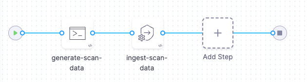

import Tabs from '@theme/Tabs';
import TabItem from '@theme/TabItem';
import DocImage from '@site/src/components/DocImage';

You can ingest custom issues from any scanning tool. STO supports a generic JSON format for ingesting data from unsupported scanners that cannot publish to SARIF.

### Important notes for importing data from unsupported scanners into STO

- This workflow is intended for scanners that have no supported integration in STO. Harness recommends that you always use the documented workflow for supported scanners. For a list of all STO-supported scanners, go to [What's supported](/docs/security-testing-orchestration/whats-supported/sto-deployments) and click **Harness STO scanner support** to expand.

- [SARIF](https://docs.oasis-open.org/sarif/sarif/v2.1.0/sarif-v2.1.0.html) is an open data format supported by many scan tools. If your scanner supports this format, publish your results to SARIF. For more information, go to [Ingest SARIF results](/docs/security-testing-orchestration/custom-scanning/ingest-sarif-data).

- For STO to ingest your scan results, the ingestion file must match the [JSON format](#json-data-format-reference) specified below.

### Required steps to ingest data from unsupported scanners into STO

1. Add a shared path such as `/shared/scan_results` to the stage. Go to **Overview** > **Shared Paths** in the visual editor, or add it to the YAML like this:  
  
   ```yaml
         - stage:
         spec:
            sharedPaths:
               - /shared/scan_results
   ```

2. Generate your issues data in the [required JSON format](#jaon-data-format-reference) described below and then save it in the shared folder.  
  You might want to set up a Run step to generate your scans automatically whenever the pipeline runs. Go to [Ingest Scan Results into an STO Pipeline](/docs/security-testing-orchestration/key-concepts/ingest-scan-results-into-an-sto-pipeline) for an example.

3. Add a **Custom Ingest** step and configure the scanner to ingest the results of the scan. For information about how to configure this step, go to [Custom Ingest settings reference](/docs/security-testing-orchestration/custom-scanning/custom-ingest-reference).


###  JSON data format reference

The following example illustrates the required format for your data. This comprehensive example shows all supported fields:

```json
{
    "meta": {
        "key": ["issueName"],
        "subproduct": "MyCustomScanner"
    },
    "issues": [
        {
            "issueType": "SAST",
            "issueName": "Complete Example Issue",
            "issueDescription": "This is a comprehensive example showing every possible field in the RefinedIssue class.",
            "subproduct": "MyCustomScanner",
            "referenceIdentifiers": [
                {
                    "type": "cve",
                    "id": "2023-12345"
                },
                {
                    "type": "cwe",
                    "id": "79"
                },
                {
                    "type": "ghsa",
                    "id": "xxxx-yyyy-zzzz"
                }
            ],
            "cvssVector": "CVSS:3.1/AV:N/AC:L/PR:N/UI:R/S:C/C:L/I:L/A:N",
            "cvssVersion": "CVSS v3.1",
            "cvss": 6.1,
            "baseScore": 6.1,
            "exploitabilityScore": 2.8,
            "impactScore": 2.7,
            "epss": 0.45,
            "confidence": "High",
            "effort": "Medium",
            "originalSeverity": "High",
            "severity": 8.0,
            "remediationSteps": "Fix me fast by applying the latest security patch.",
            "referenceUrls": "https://example.com/advisory,https://nvd.nist.gov/vuln/detail/CVE-2023-12345",
            "fileName": "homepage-jobs.php",
            "lineNumber": 127,
            "endLine": 130,
            "startCol": 8,
            "linesOfCodeImpacted": 4,
            "codeSnippet": "```php\necho $_GET['input'];\n// More vulnerable code here\n```",
            "libraryName": "vulnerable-lib",
            "licenseName": "MIT",
            "currentVersion": "1.2.3",
            "upgradeVersion": "1.2.4",
            "author": "Library Author",
            "fixAvailable": true,
            "imageRegistry": "docker.io/mycompany/webapp",
            "imageTag": "v2.1.0",
            "dockerManifestDigest": "sha256:abcdef1234567890abcdef1234567890abcdef1234567890abcdef1234567890",
            "dockerIndexDigest": "sha256:1234567890abcdef1234567890abcdef1234567890abcdef1234567890abcdef",
            "imageLayerId": "sha256:layer1234567890abcdef",
            "host": "https://api.example.com",
            "ip": "192.0.2.100",
            "port": 8443,
            "path": "/api/v1/users",
            "method": "POST",
            "project": "MyProjectName",
            "_raw": {
                "scannerVersion": "2.5.1",
                "ruleId": "CUSTOM-001",
                "customMetric": 42,
                "tags": ["security", "injection", "web"],
                "anyOtherField": "Scanners can include any additional custom data here"
            }
        }
    ]
}
```

:::note
- The `issueType` field can be one of: `SAST`, `DAST`, `SCA`, `IAC`, `SECRET`, `MISCONFIG`, `BUG_SMELLS`, `CODE_SMELLS`, `CODE_COVERAGE`, `EXTERNAL_POLICY`.
:::

The basic schema includes a `“meta”` section, which requires the following: 

* `“key”`

   The name of the attribute used to deduplicate multiple occurrences of an issue. In the example data file above, `"key"` = `"issueName"`. Thus if the data includes multiple occurrences of an issue with the same `"issueName"`, the pipeline combines these occurrences into one issue. The resulting issue includes a list of all occurrences and the data for each individual occurrence.
   
   The key used for deduplication must be a Harness field. Do not try to deduplicate based on non-Harness fields. 

* `“subproduct”` 

   The scan tool name to apply to the overall issue. The product will be "Custom", so specifying a subproduct like "MyScanner" will display as "Custom - MyScanner" in the Harness UI (in scanner dropdowns, etc.). 
   
The full JSON takes the form:


```json
"meta":   
     { ... },   
     "issues": [   
        { "issue-1" : "data" },   
        { "issue-2" : "data" },  
        { "issue-3" : "data" }  
}
```


#### Required fields

|  |  |  |
| --- | --- | --- |
| **Name** | **Format** | **Description** |
| `issueName` | String | Name of vulnerability, license issue, compliance issue, etc. |
| `issueDescription` | String (long) | Description of vulnerability, license issue, compliance issue, etc. Supports Markdown formatting, which will be rendered in the Harness UI. |
| `subProduct` | String | The scan tool name to apply to the individual occurrence of the issue. Displays as "Custom - [subProduct]" in the Harness UI. |
| `severity` | Float | CVSS 3.0 score (a number from 1.0-10.0). |

#### Other supported fields

|  |  |  |
| --- | --- | --- |
| **Name** | **Format** | **Description** |
| `issueType` | String | Type of issue. Valid values: `SAST`, `DAST`, `SCA`, `IAC`, `SECRET`, `MISCONFIG`, `BUG_SMELLS`, `CODE_SMELLS`, `CODE_COVERAGE`, `EXTERNAL_POLICY`. |
| `referenceIdentifiers` | Array | An array of vulnerability identifiers, such as `cve`, `cwe`, `ghsa`, etc. Note that the `type` value must be lowercase. Example: `"referenceIdentifiers": [{"type": "cve", "id": "2023-12345"}, {"type": "cwe", "id": "79"}]` |
| `remediationSteps` | String (long) | Remediation instructions, often provided by the scan tool. |
| `referenceUrls` | String | Comma-separated list of reference URLs for the vulnerability. |
| `cvss` | Float | The CVSS score value. |
| `cvssVector` | String | The full CVSS vector string. Example: `"CVSS:3.1/AV:N/AC:L/PR:N/UI:R/S:C/C:L/I:L/A:N"` |
| `cvssVersion` | String | The CVSS version used. Example: `"CVSS v3.1"` |
| `baseScore` | Float | The CVSS base score. |
| `exploitabilityScore` | Float | The CVSS exploitability sub-score. |
| `impactScore` | Float | The CVSS impact sub-score. |
| `epss` | Float | The Exploit Prediction Scoring System (EPSS) score (0.0-1.0). |
| `originalSeverity` | String | The original severity as reported by the scanner. Example: `High`, `Medium`, `Low`, `Critical`. |
| `confidence` | String | Confidence level of the finding. Example: `High`, `Medium`, `Low`. |
| `effort` | String | The estimated effort required to remediate. Example: `Low`, `Medium`, `High`. |
| `fileName` | String | The file where the issue was found. |
| `lineNumber` | Integer | The starting line number of the issue. |
| `endLine` | Integer | The ending line number of the issue. |
| `startCol` | Integer | The starting column number of the issue. |
| `linesOfCodeImpacted` | Integer | The number of lines of code affected by the issue. |
| `codeSnippet` | String | A code snippet showing the vulnerable code. Supports Markdown code blocks. |
| `libraryName` | String | The name of the vulnerable library or dependency. |
| `currentVersion` | String | The current version of the vulnerable library. |
| `upgradeVersion` | String | The recommended version to upgrade to for remediation. |
| `fixAvailable` | Boolean | Indicates whether a fix is available for the vulnerability. |
| `licenseName` | String | The license of the library. Example: `MIT`, `Apache-2.0`. |
| `author` | String | The author or maintainer of the library. |
| `imageRegistry` | String | The container image registry and repository. Example: `docker.io/mycompany/webapp` |
| `imageTag` | String | The container image tag. Example: `v2.1.0` |
| `dockerManifestDigest` | String | The SHA256 digest of the Docker manifest. |
| `dockerIndexDigest` | String | The SHA256 digest of the Docker index. |
| `imageLayerId` | String | The ID of the image layer where the issue was found. |
| `imageNamespace` | String | Logical metadata field for image namespace. |
| `host` | String | The target host URL. Example: `https://api.example.com` |
| `ip` | String | The target IP address. |
| `port` | Integer | The target port number. |
| `path` | String | The URL path where the issue was found. Example: `/api/v1/users` |
| `method` | String | The HTTP method used. Example: `GET`, `POST`, `PUT`, `DELETE`. |
| `url` | String | The full URL where the issue was found. |
| `project` | String | Logical metadata field that can be used for tracking of project(s). |
| `product` | String | Logical metadata field that can be used for tracking of product(s). |
| `scanSeverity` | String | The severity as reported by the scan tool. |
| `scanStatus` | String | Recommended for measuring scan duration and status. |
| `tags` | String | Logical metadata tags for describing asset owners, teams, business units, etc. |
| `link` | String | A link to additional information about the issue. |

#### Custom fields

You can add custom fields to an issue to include scanner specific data that isn't covered by the standard fields. There are two approaches:

**Option 1: Use the `_raw` object**

You can include a `_raw` object in your issue to store any additional custom data. This is the recommended approach for grouping related custom fields:

```json
{
    "issueName": "Example Issue",
    "issueDescription": "Description here...",
    "_raw": {
        "scannerVersion": "2.5.1",
        "ruleId": "CUSTOM-001",
        "customMetric": 42,
        "tags": ["security", "injection", "web"],
        "anyOtherField": "Scanners can include any additional custom data here"
    }
}
```

**Option 2: Use `_raw` prefix for individual fields**

Alternatively, you can add the prefix `_raw` to individual field names:

```json
{  
   "issueName": "hardcode_tmp_directory",  
   "referenceIdentifiers": [  
      {  
         "type": "cwe",  
         "id": "79"  
      }  
    ],  
   "_rawIssueCwe": {  
     "id": 377,  
     "link": "https://cwe.mitre.org/data.definitions/377.html"  
   },  
   "_rawMoreInfo": "https://bandit.readthedocs.io/en/1.7.4/plugins/b108_hardcoded_tmp_directory.html",  
   "_rawColOffset": 31  
}
```

:::note
You cannot use any of the **Reserved keywords** for custom field names.
:::

The custom fields will get grouped together at the end of the issue details like this:

<DocImage path={require('./static/ingesting-issues-from-other-scanners-01.png')} width="50%" height="50%" />

#### Reserved keywords for Harness STO JSON schema

The following keywords are reserved and cannot be used in your JSON file:

* `alertRulesets`
* `customerId`
* `discoveryIssueId`
* `discoveryRunTime`
* `discoveryTimespan`
* `ignore`
* `ignoreRulesets`
* `jobId`
* `policyId`
* `policyName`
* `refinementVersion`
* `remediationRunTime`
* `remediationTimespan`
* `runTime`
* `scenarioId`
* `severityCode`
* `target`
* `targetId`

## Pipeline example for ingesting data from an unsupported schema into STO

The following pipeline shows an end-to-end ingestion workflow. The pipeline consist of a Security stage with two steps:

1. A Run step that generates a JSON data file `/shared/scan_results/example.json` in the format described above.

2. A Custom Ingest step that ingests and normalizes the data from `/shared/scan_results/example.json`. 



```yaml
pipeline:
  projectIdentifier: myProject
  orgIdentifier: default
  tags: {}
  stages:
    - stage:
        name: custom-scan-stage
        identifier: customscanstage
        type: SecurityTests
        spec:
          cloneCodebase: false
          execution:
            steps:
              - step:
                  type: Run
                  name: generate-scan-data
                  identifier: Run_1
                  spec:
                    connectorRef: CONTAINER_IMAGE_REGISTRY_CONNECTOR
                    image: alpine:latest
                    shell: Sh
                    command: |-
                      cat <<EOF >> /shared/scan_results/example.json
                      {  
                         "meta":{  
                            "key":[  
                               "issueName"
                            ],  
                            "subproduct":"MyCustomScanner"  
                         },  
                         "issues":[  
                            {  
                               "subproduct":"MyCustomScanTool",  
                               "issueName":"Cross Site Scripting",  
                               "issueDescription":"Lorem ipsum...",  
                               "fileName":"homepage-jobs.php",  
                               "remediationSteps":"Fix me fast.",  
                               "risk":"high",  
                               "severity":8,  
                               "status":"open",  
                               "referenceIdentifiers":[  
                                  {  
                                     "type":"cwe",  
                                     "id":"79"  
                                  }  
                               ]  
                            }  
                         ]  
                      }
                      EOF
                      ls /shared/scan_results
                      cat /shared/scan_results/example.json
              - step:
                  type: CustomIngest
                  name: ingest-scan-data
                  identifier: CustomIngest_1
                  spec:
                    mode: ingestion
                    config: default
                    target:
                      name: external-scanner-test
                      type: repository
                      variant: main
                    advanced:
                      log:
                        level: info
                    ingestion:
                      file: /shared/scan_results/example.json
          sharedPaths:
            - /shared/scan_results
          caching:
            enabled: false
            paths: []
          platform:
            os: Linux
            arch: Amd64
          runtime:
            type: Cloud
            spec: {}
  identifier: custom_ingestion_JSON_test
  name: custom ingestion JSON test
```

## jq filters

You can use `jq` filters to transform scanner results into the format needed for ingestion. Find the specific filter for your scanner below. Save this filter to a file (e.g., `my_filter.jq`). Then, process the scan results by passing the filter file and the results file to `jq` like this:

```Bash
jq -f my_filter.jq scanner_output.json > formatted_results.json
```

This command uses the filter to generate the correctly formatted output.

<Tabs>
<TabItem value="Crowdstrike_Falcon" label="Crowdstrike Falcon" default>

```json
{
  "meta": {
    "subproduct": "CrowdStrike Falcon",
    "key": ["issueName"]
  },
  "issues": [
    .Vulnerabilities[] | {
      "subproduct": "CrowdStrike Falcon",
      "issueName": .Vulnerability.CVEID?,
      "issueDescription": .Vulnerability.Details.description?,
      "fileName": "\(.ImageInfo.Repository?):\(.ImageInfo.Tag?)",
      "remediationSteps": (
        if .Vulnerability.FixedVersions? != null and (.Vulnerability.FixedVersions? | length) > 0 then
          "Upgrade to: " + (.Vulnerability.FixedVersions? | join(", "))
        else
          null
        end
      ),
      "risk": .Vulnerability.Details.severity?,
      "severity": (.Vulnerability.Details.cvss_v3_score.base_score? | tonumber? // null),
      "status": "open",
      "referenceIdentifiers": [
        {
          "type": "cve",
          "id": .Vulnerability.CVEID?
        }
      ]
    }
  ]
}
```

</TabItem>
<TabItem value="mend_vs_sca" label="Mend v3 SCA">

```json
{
  meta: {
    key: [
      "issueName"
    ],
    subproduct: "mend v3 sca"
  },
  issues: (
    [
      .. |
      select(type == "object" and .vulnerabilities? != null) |
      .vulnerabilities[] |
      {
        subproduct: "mend v3 sca",
        issueName: .name,
        issueDescription: (if .description then .description else "No description provided" end),
        fileName: (input_filename // "unknown"),
        remediationSteps: (.topFix.fixResolution // "No remediation steps provided"),
        risk: (
          if .severity == "HIGH" or .severity == "CRITICAL" then "high"
          elif .severity == "MEDIUM" then "medium"
          else "low"
          end
        ),
        severity: (
          if .score then .score
          elif .severity == "CRITICAL" then 9
          elif .severity == "HIGH" then 7
          elif .severity == "MEDIUM" then 5
          else 3
          end
        ),
        status: (issue.status // "open"),
        referenceIdentifiers: [
          {
            type: (if (.name | startswith("CVE-")) then "cve"
                  elif (.name | startswith("CWE-")) then "cwe"
                  else "other" end),
            id: (if (.name | startswith("CVE-")) then (.name | .[4:])
                elif (.name | startswith("CWE-")) then (.name | .[4:])
                else .name end)
          }
        ]
      }
    ] | unique_by(.issueName + .fileName)
  )
}
```

</TabItem>
<TabItem value="mend_vs_sast" label="Mend v3 SAST">

```json
def get_reference_identifiers(issue_type):
  [
    (if issue_type.cwe != null and issue_type.cwe.url != "" then [{type: "cwe", id: (issue_type.cwe.url | split("/")[-1] | split(".")[0])}] else [] end),
    (issue_type.references // [] | map({type: "reference", id: .}) | map(select(.id != ""))),
    (if issue_type.pcidss != null and issue_type.pcidss.title != "" then [{type: "pcidss", id: issue_type.pcidss.title}] else [] end),
    (if issue_type.nist != null and issue_type.nist.url != "" then [{type: "nist", id: issue_type.nist.url}] else [] end),
    (if issue_type.hipaa != null and issue_type.hipaa.title != "" then [{type: "hipaa", id: issue_type.hipaa.title}] else [] end),
    (if issue_type.hitrust != null and issue_type.hitrust.title != "" then [{type: "hitrust", id: issue_type.hitrust.title}] else [] end),
    (if issue_type.owasp != null and issue_type.owasp.url != "" then [{type: "owasp", id: issue_type.owasp.url}] else [] end),
    (if issue_type.owasp2021 != null and issue_type.owasp2021.url != "" then [{type: "owasp2021", id: issue_type.owasp2021.url}] else [] end),
    (if issue_type.capec != null and issue_type.capec.url != "" then [{type: "capec", id: issue_type.capec.url}] else [] end),
    (if issue_type.sansTop25 != null and issue_type.sansTop25.title != "" then [{type: "sansTop25", id: issue_type.sansTop25}] else [] end)
  ] | add;

def transform_issue(language; issue):
  {
    subproduct: language,
    issueName: issue.type.name,
    issueDescription: issue.type.description,
    fileName: (issue.Findings // [] | map(.sharedStep.File) | .[0] // "Unknown"),
    remediationSteps: (issue.type.recommendation | join("; ")),
    risk: issue.type.risk | ascii_downcase,
    severity: (issue.type.risk | ascii_downcase |
      if . == "high" then 8
      elif . == "medium" then 5
      elif . == "low" then 2
      else 0 end),
    status: (issue.status // "open"),
    referenceIdentifiers: get_reference_identifiers(issue.type)
  };

{
  meta: {
    key: ["issueName"],
    subproduct: "mend v3 SAST"
  },
  issues: [
    .[] | .results[] | . as $outer |
    $outer.results[] | transform_issue($outer.language; .)
  ]
}
```

</TabItem>
</Tabs>
