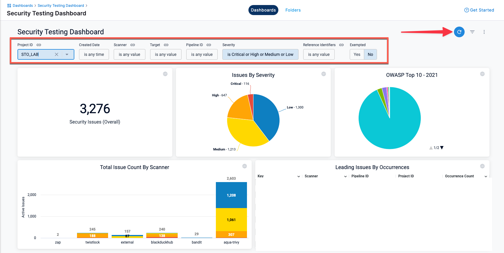

To open the Security Testing Dashboard, open the view selector (top left in the Harness workspace). Select **Dashboards** and then **Security Testing**. This dashboard enables you to view, navigate, discover, and investigate detected vulnerabilities in your organization.

This dashboard includes a set of filters for drilling down into specific issues by project, creation date, scanner, target, pipeline, severity, and so on. You can drill down to a set of relevant issues and then click on a pie slice, chart element, or other UI element to view details on the relevant issues.

You can view the following information in this dashboard:

- Total unique targets, vulnerable targets, total issues, and issues by severity
- Total issue count by scanner
- **Issue Overview** table
- **Leading Issues by Occurrences** table
- Open issues over time
- New issue detections over time
- Remediations over time. An issue has a status of Remediated if it was found in the baseline but not the scanned variant.

:::note important notes
- This dashboard requires an Enterprise account.
- This dashboard shows only results for targets that have baselines defined. You should [define a baseline for every target](/docs/security-testing-orchestration/get-started/key-concepts/targets-and-baselines) in your project. 
- You must click **Update** (top right) to apply the filter after you configure it.
- To view details for an issue from the search results, click the pipeline name or ID and choose **View in Harness Platform**. 

   

<!-- - The **Created Date** menu has several non-working options: `is null`, `is not null`, and `matches a user attribute`. This is a known issue that Harness is working to address.

-->

:::

<figure>

<figcaption>Security Testing Dashboard -- filters and Refresh button</figcaption>
</figure>

