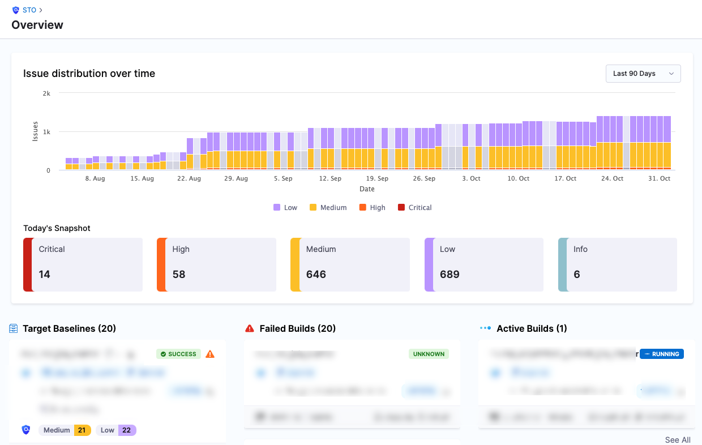

To see all target baselines in the project, go to the left menu and select **Security Testing Orchestration** > **Overview**. This dashboard enables you to see all detected issues in your `main` branches, `latest` images, and other target baselines.

Why you should define a baseline for every target

import StoWhyDefineBaselines from '/docs/security-testing-orchestration/get-started/shared/_why-define-baselines.md';

<StoWhyDefineBaselines />

<figure>

<figcaption>STO Overview</figcaption>
</figure>

This view has has the following components:

* **Issue distribution over time** — Shows the daily distribution of all detected baseline issues by severity.
	+ In this context, "daily" means from midnight GMT to midnight GMT.
	+ The STO deduplicates issues with the same root cause. Suppose codebase A (main branch) and codebase B (main branch) contain the same vulnerability inherited from the same open-source library. In this case, STO combines them into one issue.
* **Today's Snapshot** — Shows all issues detected in the most recent scans of each target baseline in the project.
	+ Suppose the most recent baseline scans ran this morning (codebase A), last week (image B), and two weeks ago (host C). In this case, the snapshot values are based on all baseline issues detected in all three scans.
* **Target Baselines** — Shows the most recent scan for each target baseline in the project.
* **Failed Builds** — Shows the most recent failed builds that included scans of target baselines.
* **Active Builds** — Shows active builds that include scans of target baselines.

:::info

 To see detected issues in a non-baseline variant, such as a feature or developer branch, go to a pipeline execution where the variant was scanned and then go to [**Security Tests**](/docs/security-testing-orchestration/dashboards/view-scan-results).

:::