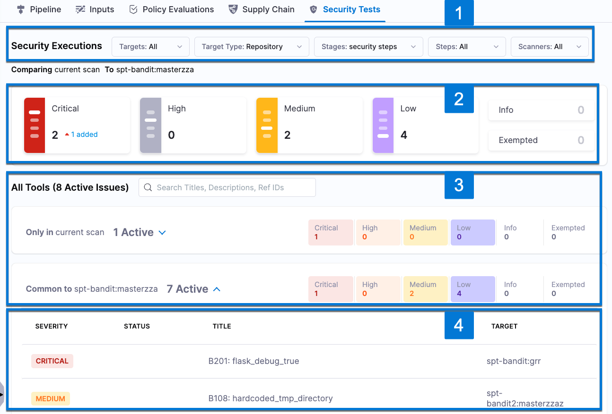

In the **Security Testing Orchestration** left-hand menu, go to **Executions**. Then go to the pipeline execution and select **Security Tests**. This tab enables you to navigate, analyze, and remediate all issues detected by the pipeline execution. 

The following steps describe the general workflow:

1. (_Optional_) Set the **Security Execution** to filter issues based on target, type, stage, step, or scanner.

   These filters are useful for pipelines that run multiple scans. You can hide irrelevant issues and focus only issues of interest. Filtering on a specific target can make it easier to compare results with previous scans of that target. 

2. Select the [severity](/docs/security-testing-orchestration/get-started/key-concepts/severities) tiles to filter issues by severity. You can also show or hide issues with exemptions.  

3. Drill down to the relevant issues list to view the issues found in the scan:

    - **Only in \<_target_>:\<_variant_>** Issues only found in the scanned variant.

    - **Common to \<_target_>:\<_baseline_>** Issues also found in the target baseline.

    - **Common to previous scan** 
      - Issues also found in the previous scan (if the scanned target has no baseline), OR
      - Issues also found in the previous scan of the baseline (if the scanned variant is the baseline).

    <!-- **Common to previous / baseline scan** Issues also found in both the previous scan of the specified variant AND the previous scan of the baseline. -->

    - **Remediated** An issue has a status of Remediated if it was found in the baseline but not the scanned variant. 
      
      <DocImage path={require('./static/remediated-issue.png')} width="60%" height="60%" />

      :::note important notes

      - For best results in STO, every target should have a baseline defined. For more information, go to [Targets, baselines, and variants in STO](/docs/security-testing-orchestration/get-started/key-concepts/targets-and-baselines).

      - The **Security Tests** UI categorizes issues as **Only in \<_target_>:\<_variant_>** and **Remediated** by comparing the scanned variant against the baseline specified when the scan was run. This might be different from the baseline currently specified for the target. Baselines can change automatically when a pipeline uses [dynamic baselines](/docs/security-testing-orchestration/use-sto/set-up-sto-pipelines/set-up-baselines#specify-dynamic-baselines-using-regular-expressions) based on regular expressions.

      :::

3. To investigate an issue in detail, click the issue in the list to open **Issue Details** (right). 

4. The **Issue Details** pane includes known details and remediation steps for the detected issue. Note that this pane shows details for all occurrences of the detected issue, so scan down to ensure that you see all occurrences. 

   You can also do the following:

   - [Create a Jira ticket](/docs/security-testing-orchestration/jira-integrations) for the issue.

   - Request an [exemption](/docs/security-testing-orchestration/exemptions/exemption-workflows) so that pipeline executions can proceed even if the issue is detected.

   - Fix the issue using [AI-enhanced remediation steps](/docs/security-testing-orchestration/remediations/ai-based-remediations).

