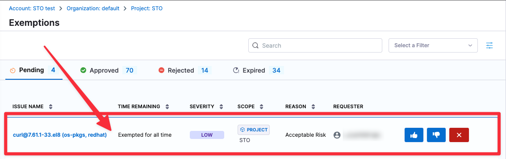
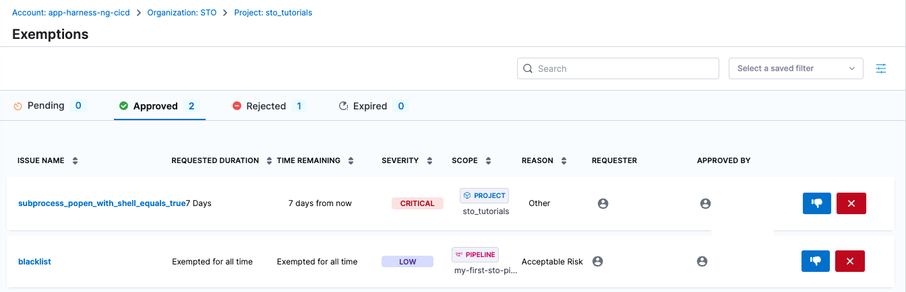

STO’s exemption workflows help developers raise exemption windows with product security teams for shipping software with vulnerabilities. Developers can request exemptions for specific vulnerabilities to allow their build pipelines to proceed even if these vulnerabilities are detected.

:::note 
[Security Testing Developers](/docs/security-testing-orchestration/get-started/onboarding-guide#add-security-testing-roles) and [Security Testing SecOps](/docs/security-testing-orchestration/get-started/onboarding-guide#add-security-testing-roles) users can request exemptions, but only Security Testing SecOps users can approve them.
::: 

## When exemptions are useful

Here are some reasons wny your organization might want to exempt an issue:

- Your organization has practices in place to mitigate the security risks of the issue.
- The issue is in compliance with your organization's acceptable use policies.
- The security risk is low and remediation would require too much effort or expense.
- The scanner detects an issue but it is, in fact, a false positive.
- You need to exempt an issue so you can deploy a hotfix. In this case, you can request a temporary exemption that expires within your organization's SLA for fixing security issues.
- There are currently no known fixes or remediation steps available for the detected vulnerability. You might want to enable [Harness AI Development Assistant (AIDA™)](/docs/security-testing-orchestration/remediations/ai-based-remediations) to help you remediate your issues using AI.

import request_exemption from '../use-sto/static/request-exemption.png'
import open_exemption_details from '../use-sto/static/open-exemption-details.png'
import baseline_not_defined from '../use-sto/static/exemption-workflows-no-baseline-defined.png'

## What happens when an STO exemption gets approved

To see the list of pending exemptions, select **Exemptions** in the left menu. Each exemption corresponds to one vulnerability. If a scan detects a vulnerability with an active exemption, the pipeline proceeds even if the vulnerability matches the failure criteria for the step.

## Important notes for exemptions in STO

This topic assumes that you have the following:

* An STO pipeline as described in [Set up Harness for STO](../get-started/onboarding-guide.md).
* The scan step has failure criteria specified.

  STO supports two methods for specifying failure criteria: 

   - [Fail on Severity](/docs/security-testing-orchestration/get-started/key-concepts/fail-pipelines-by-severity)  Every scan step has a Fail on Severity setting that fails the step if the scan detects any issues with the specified severity or higher. 

   - [OPA policies](/docs/security-testing-orchestration/policies/create-opa-policies) You can use Harness Policy as Code to write and enforce policies based on severity, reference ID, title, CVE age, STO output variables, and number of occurrences.

* At least one successful build with a set of detected security issues. 
* Security Testing Developer or [Security Testing SecOps](/docs/security-testing-orchestration/get-started/onboarding-guide#add-security-testing-roles)  user permissions are required to [request exemptions](#request-an-sto-exemption).
* Only Security Testing SecOps users can [review, approve, reject,](#review-an-sto-exemption) and [update](#good-practice-review-and-update-sto-exemptions-periodically) exemptions.  

## Request an STO exemption

1. Select **Executions** (left menu) and then go to a successful build.  

2. Select **Security Tests** and then do the following:

   1. Select the issue you want to exempt.  The **Issue Details** pane opens on the right. 
   2. Select **Request Exemption**.

      

   3. In **Request Exemption for Issue**, specify:
      1. **Where do you want this issue to be Exempted?** 

         Select **This Pipeline** unless you know it's safe to exempt the issue everywhere in the project.

      2. **For how long?** 

         In general, you should select the shortest practical time window for your exemption. 

      3. **Reason this issue should be exempted** 

         Select one of the following reasons and provide any additional information for the [Security Testing SecOps](/docs/security-testing-orchestration/get-started/onboarding-guide#add-security-testing-roles)  approver:

         * **Compensating controls** — Your organization has infrastructure and policies in place to mitigate the security risks of this vulnerability. 

           For example, suppose a scan detects a vulnerability with a specific service. This vulnerability might be mitigated because:

           - The service is behind a firewall that requires authorized access, or

           - The network may have host- or network-based intrusion prevention systems in place.

         * **Acceptable use** — The scanner identified this practice as a vulnerability, but this practice is acceptable based on your organization's security guidelines. For example, anonymous FTP access may be a deliberate practice and not a vulnerability.

         * **Acceptable risk** — The security risk of this vulnerability is low and remediation would require too much effort or expense: 

           - Applying a specific patch for a vulnerability might prevent a service from functioning. 

           - The vulnerability is minimal and the remediation would require too much time, money, or resources.

         * **False positives** — The scanner identifies this as a vulnerability but it is, in fact, a false positive. Requesting an exemption based on approval from a Qualified Security Assessor (QSA) or Approved Scanning Vendor (ASV). 

         * **Fix unavailable** — There are currently no known fixes or remediation steps available for the detected vulnerability. 

         * **Other**

      4. **Further description the reason this issue should be exempted** 

         It is good practice to provide enough information for the reviewer to determine that this exemption is safe.

      4. **URL Reference** 

         Paste the link you copied in the previous request, or add a different link that provides information about the specific issue you want the pipeline to ignore. If your repo already addresses the issue, for example, you can include a link to the relevant code.

   5. Click **Create Request**.

      

3. Send an email or Slack to your [Security Testing SecOps](/docs/security-testing-orchestration/get-started/onboarding-guide#add-security-testing-roles)  reviewer with the URL to the Security Tests page with the relevant issue selected.

## Approve, reject, or cancel an STO exemption

:::note

This workflow requires [Security Testing SecOps](/docs/security-testing-orchestration/get-started/onboarding-guide#add-security-testing-roles)  user permissions.

:::

1. You should receive an email or Slack from a developer that includes a URL to the relevant issue. Go to the URL provided.
 
   The URL should point to a Security Tests page in Harness with the issue selected in the **Issue Details** pane on the right. If the relevant issue isn't visible, notify the developer. 

2. Select **Exemptions** (left menu) > **Pending** and then select the pending exemption to view the exemption details.

   

3. Review the exemption request. The **Issue Details** pane includes a high-level summary of the issue, links to relevant documentation, and a list of all locations in the scanned object where the issue was detected. 

    :::note

    - The **Issue Details** pane is comprehensive, but might not include all the information you need. You might want to research the issue further before you approve the request.

    - Consider the **Requested Duration** for the exemption request. When you approve a request, the exemption remains active only for the specified time window (for example, 7 days from the approval time). 

    - It is good practice to [define a baseline for every target](/docs/security-testing-orchestration/get-started/key-concepts/targets-and-baselines#every-target-needs-a-baseline). If the target does not have a baseline defined, you won't see any exemption details. Instead, you will see a link to define the target baseline. 

       

    :::

 4. Select one of the following:
 
    - **Approve** The request is approved. This issue will not block future pipeline executions for the requested duration (see **Time Remaining** in the **Approved** table).
    - **Reject** The request moves to the **Rejected** table, where a [Security Testing SecOps](/docs/security-testing-orchestration/get-started/onboarding-guide#add-security-testing-roles)  user can approve it later if appropriate. 
    - **Cancel** The request is cancelled and removed from the exemption list. If a user wants an exemption for the issue, they must file a new request. 

     

      You can control whether users can approve or reject their own exemption requests. This setting can be managed by enabling or disabling the **Users can approve their own exemptions** option. Find this setting under **Exemption settings** on the **Default settings** page. This is available in the project, organization and account level settings.
      :::note
      This setting is behind the feature flag `STO_EXEMPTION_SETTING`. Contact [Harness Support](mailto:support@harness.io) to enable this setting.
      :::

 

## Good practice: Review and update STO exemptions periodically

:::note

These workflows require [Security Testing SecOps](/docs/security-testing-orchestration/get-started/onboarding-guide#add-security-testing-roles) user permissions.

:::

It is good practice for a [Security Testing SecOps](/docs/security-testing-orchestration/get-started/onboarding-guide#add-security-testing-roles) user in your organization to review all exemptions periodically and update the status of individual exemptions as needed. 

To review all exemptions, select **Security Testing Orchestration** > **Exemptions** in the left menu. This page shows the high-level information for all pending, approved, rejected, and expired exemptions. 

You can view the **Time Remaining** for approved exemptions and **Requested Duration** for pending, rejected, and expired exemptions. 

SecOps users can do the following in this page:

* Reject pending and approved exemptions
* Approve pending and rejected exemptions
* Re-open expired exemptions
* Cancel (delete) pending, approved, rejected, or expired exemptions

   
