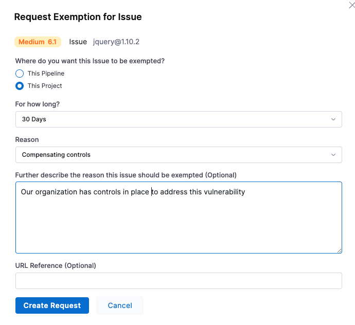

import request_exemption from '../use-sto/static/request-exemption.png'
import open_exemption_details from '../use-sto/static/open-exemption-details.png'
import baseline_not_defined from '../use-sto/static/exemption-workflows-no-baseline-defined.png'

## Request an STO exemption

1. Select **Executions** (left menu) and then go to a successful build.  

2. Select **Security Tests** and then do the following:

   1. Select the issue you want to exempt.  The **Issue Details** pane opens on the right. 
   2. Select **Request Exemption**.

      

   3. In **Request Exemption for Issue**, specify:
      1. **Where do you want this issue to be Exempted?** 

         Select **This Pipeline** unless you know it's safe to exempt the issue everywhere in the project.

      2. **For how long?** 

         In general, you should select the shortest practical time window for your exemption. 

      3. **Reason this issue should be exempted** 

         Select one of the following reasons and provide any additional information for the [Security Testing SecOps](/docs/security-testing-orchestration/get-started/onboarding-guide#add-security-testing-roles)  approver:

         * **Compensating controls** — Your organization has infrastructure and policies in place to mitigate the security risks of this vulnerability. 

           For example, suppose a scan detects a vulnerability with a specific service. This vulnerability might be mitigated because:

           - The service is behind a firewall that requires authorized access, or

           - The network may have host- or network-based intrusion prevention systems in place.

         * **Acceptable use** — The scanner identified this practice as a vulnerability, but this practice is acceptable based on your organization's security guidelines. For example, anonymous FTP access may be a deliberate practice and not a vulnerability.

         * **Acceptable risk** — The security risk of this vulnerability is low and remediation would require too much effort or expense: 

           - Applying a specific patch for a vulnerability might prevent a service from functioning. 

           - The vulnerability is minimal and the remediation would require too much time, money, or resources.

         * **False positives** — The scanner identifies this as a vulnerability but it is, in fact, a false positive. Requesting an exemption based on approval from a Qualified Security Assessor (QSA) or Approved Scanning Vendor (ASV). 

         * **Fix unavailable** — There are currently no known fixes or remediation steps available for the detected vulnerability. 

         * **Other**

      4. **Further description the reason this issue should be exempted** 

         It is good practice to provide enough information for the reviewer to determine that this exemption is safe.

      4. **URL Reference** 

         Paste the link you copied in the previous request, or add a different link that provides information about the specific issue you want the pipeline to ignore. If your repo already addresses the issue, for example, you can include a link to the relevant code.

   5. Click **Create Request**.

      

3. Send an email or Slack to your [Security Testing SecOps](/docs/security-testing-orchestration/get-started/onboarding-guide#add-security-testing-roles)  reviewer with the URL to the Security Tests page with the relevant issue selected.

