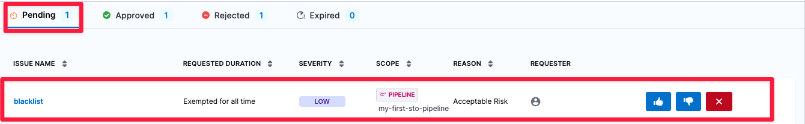
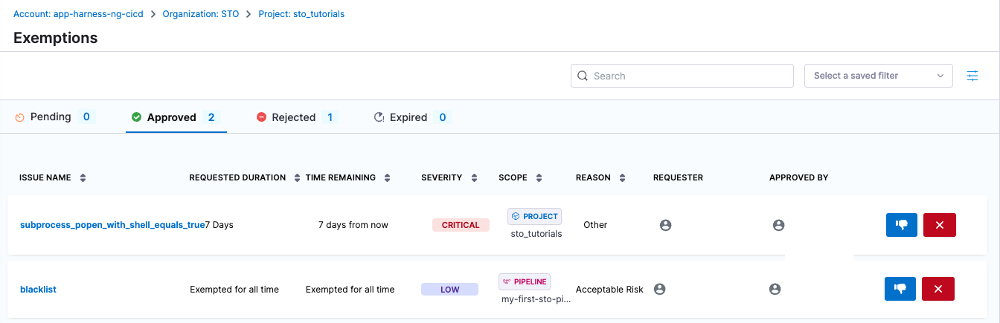
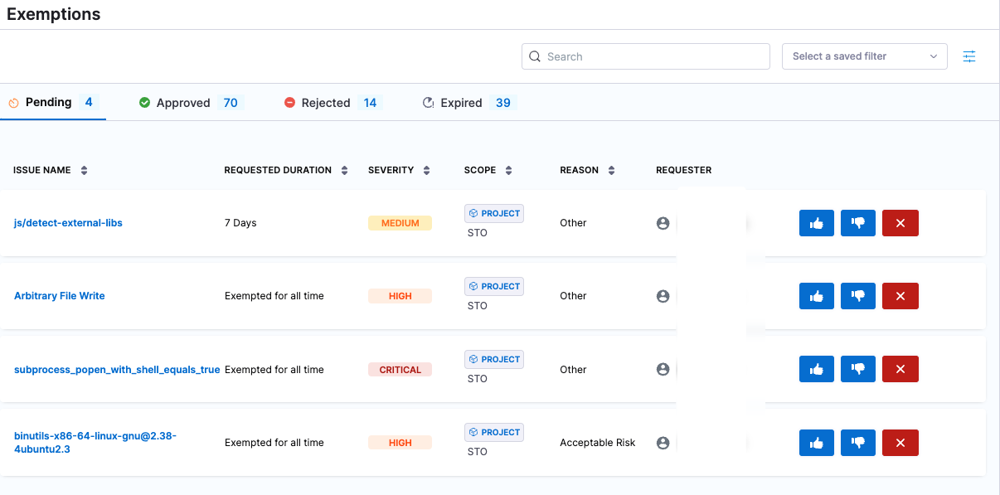

import request_exemption from '../use-sto/static/request-exemption.png'
import open_exemption_details from '../use-sto/static/open-exemption-details.png'
import baseline_not_defined from '../use-sto/static/exemption-workflows-no-baseline-defined.png'

When an [issue exemption request](./exemption-workflows) is submitted, it goes through a defined lifecycle. The available actions to address these requests include **Approving**, **Rejecting**, or **Cancelling**. The exemption lifecycle consists of the following stages:

:::note
Users with role `Security Testing SecOps` can approve or manage the issue exemption requests.
:::

1. **Pending:**  
   - The request is newly created and awaits review.  
   - At this stage, users can choose to approve, reject, or cancel the request.

2. **Approved:**  
   - The request has been reviewed and accepted.  
   - The issue is temporarily or permanently exempt from further action based on the exemption details.

3. **Rejected:**
   - The request has been reviewed and denied.  
   - The issue remains active, and the pipeline continues to enforce security policies as if no exemption was requested. 
4. **Expired:**  
   - The exemption period has elapsed, or the exemption has been invalidated.  
   - Once expired, the issue returns to its original active state unless a new exemption is requested.

<DocImage path={require('./static/exemption-lifecycle.png')} width="50%" height="50%" title="Click to view full size image" />

### Actions
Here are the actions that can be performed on an issue exemption request.
- **Approve:** Accept the request and apply the exemption.  
- **Reject:** Decline the request and maintain the issue status.  
- **Cancel:** Close the request before any decision is made.

## Approve, reject, or cancel an STO exemption

:::note

This workflow requires [Security Testing SecOps](/docs/security-testing-orchestration/get-started/onboarding-guide#add-security-testing-roles)  user permissions.

:::

1. You should receive an email or Slack from a developer that includes a URL to the relevant issue. Go to the URL provided.
 
   The URL should point to a Security Tests page in Harness with the issue selected in the **Issue Details** pane on the right. If the relevant issue isn't visible, notify the developer. 

2. Select **Exemptions** (left menu) > **Pending** and then select the pending exemption to view the exemption details.

   

3. Review the exemption request. The **Issue Details** pane includes a high-level summary of the issue, links to relevant documentation, and a list of all locations in the scanned object where the issue was detected. 

    :::note

    - The **Issue Details** pane is comprehensive, but might not include all the information you need. You might want to research the issue further before you approve the request.

    - Consider the **Requested Duration** for the exemption request. When you approve a request, the exemption remains active only for the specified time window (for example, 7 days from the approval time). 

    - It is good practice to [define a baseline for every target](/docs/security-testing-orchestration/get-started/key-concepts/targets-and-baselines#every-target-needs-a-baseline). If the target does not have a baseline defined, you won't see any exemption details. Instead, you will see a link to define the target baseline. 

       

    :::

 4. Select one of the following:
 
    - **Approve** The request is approved. This issue will not block future pipeline executions for the requested duration (see **Time Remaining** in the **Approved** table).
    - **Reject** The request moves to the **Rejected** table, where a [Security Testing SecOps](/docs/security-testing-orchestration/get-started/onboarding-guide#add-security-testing-roles)  user can approve it later if appropriate. 
    - **Cancel** The request is cancelled and removed from the exemption list. If a user wants an exemption for the issue, they must file a new request. 

     

      You can control whether users can approve or reject their own exemption requests. This setting can be managed by enabling or disabling the **Users can approve their own exemptions** option. Find this setting under **Exemption settings** on the **Default settings** page. This is available in the project, organization and account level settings.
      :::note
      This setting is behind the feature flag `STO_EXEMPTION_SETTING`. Contact [Harness Support](mailto:support@harness.io) to enable this setting.
      :::

 

## Good practice: Review and update STO exemptions periodically

:::note

These workflows require [Security Testing SecOps](/docs/security-testing-orchestration/get-started/onboarding-guide#add-security-testing-roles) user permissions.

:::

It is good practice for a [Security Testing SecOps](/docs/security-testing-orchestration/get-started/onboarding-guide#add-security-testing-roles) user in your organization to review all exemptions periodically and update the status of individual exemptions as needed. 

To review all exemptions, select **Security Testing Orchestration** > **Exemptions** in the left menu. This page shows the high-level information for all pending, approved, rejected, and expired exemptions. 

You can view the **Time Remaining** for approved exemptions and **Requested Duration** for pending, rejected, and expired exemptions. 

SecOps users can do the following in this page:

* Reject pending and approved exemptions
* Approve pending and rejected exemptions
* Re-open expired exemptions
* Cancel (delete) pending, approved, rejected, or expired exemptions

   
