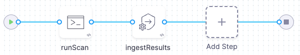

In an *ingestion scan*, you configure a step to ingest scan results from a data file. The pipeline then analyzes, deduplicates, and displays the results. Ingestion scans might require more work to set up then orchestration scans, but they also support a wide variety of use cases. Ingestion scans enable you to:

- Ingest results from scanners that don't currently have integrations with Harness STO.
- Ingest results from scans that ran in a previous step or stage, or outside the pipeline entirely.
- Ingest results from custom scans with advanced settings that address specific security requirements.

To ingest scan results from outside a Security step, you set up your pipeline as follows:

1. A Run step saves scan results to a shared folder. The step might run the scan locally, download results from an external source, or copy results from another location in the workspace into the shared folder.

2. A [Security or Security Tests step](/docs/security-testing-orchestration/sto-techref-category/security-step-settings-reference#security-steps-and-scanner-templates-in-sto) ingests the results from the shared folder. Then it analyzes, deduplicates, and displays the results.

For a complete list of supported scanners, go to [Harness STO scanner support](/docs/security-testing-orchestration/sto-techref-category/security-step-settings-reference#harness-sto-scanner-support).

## Example workflows

Here are some example ingestion-only workflows that target specific use cases:

- [SAST code scans using Semgrep](/docs/security-testing-orchestration/sto-techref-category/semgrep/sast-scan-semgrep)
- [Run STO scans using GitHub Action and Drone Plugin steps](/docs/security-testing-orchestration/use-sto/set-up-sto-pipelines/run-scans-using-github-actions)
- [Example workflow: Ingest SARIF data from a Checkmarx GitHub Action scan](/docs/security-testing-orchestration/sto-techref-category/checkmarx-scanner-reference#example-workflow-ingest-sarif-data-from-a-checkmarx-github-action-scan)
- [Create a build-scan-push pipeline (STO only)](/docs/security-testing-orchestration/use-sto/set-up-sto-pipelines/build-scan-push-workflows/build-scan-push-sto-only)

## See also

- [Ingest SARIF scan results into STO](/docs/security-testing-orchestration/custom-scanning/ingest-sarif-data)
- [Ingest Results from unsupported scanners](../../custom-scanning/ingesting-issues-from-other-scanners.md)
- [Harness STO scanner support](/docs/security-testing-orchestration/sto-techref-category/security-step-settings-reference#harness-sto-scanner-support)
