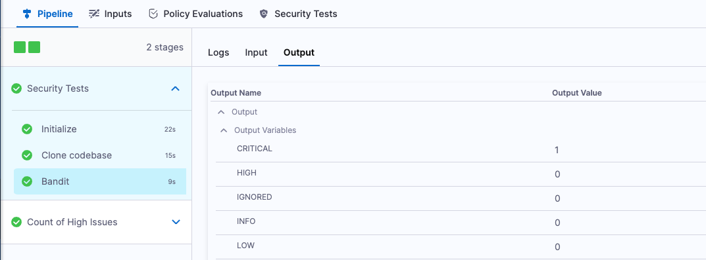

```mdx-code-block
import StoConceptOutputVariables from '../shared/_output-variables.md';
```

<StoConceptOutputVariables />

To view the output variables for a scan, go to the Pipeline Execution page, select the scan step, and click **Output**. 



:::note
If a scan step fails because the [Fail on Severity](./fail-pipelines-by-severity.md) threshold was reached, the build results do not include any output variables. 
:::

For information about how severity levels are calculated, go to [Severities](./severities.md).