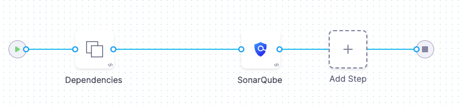

STO supports three scan modes to ingest scan results into a pipeline:

- [Orchestration scans](#orchestration-workflows-in-sto)
- [Ingestion scans](#ingestion-only-workflows-in-sto)
- [Extraction scans](#extraction-workflows-in-sto)

### Orchestration scans in STO

In an *orchestration scan*, you scan a target and ingest the results in one step. This is the easiest workflow to implement and is good for running scans with default settings.

For more information, go to [Run an Orchestration Scan in an STO Pipeline](./run-an-orchestrated-scan-in-sto.md).

### Ingestion scans in STO

In an *ingestion scan*, you configure a step to ingest scan results from a data file. You can generate your scan data in a previous step of the pipeline, or download your data from an outside source. Ingestion scans provide the most flexibility and robustness, but might require more work to set up.

An ingestion scan requires at least two steps:

1. A Run step saves the scan data to a shared folder. 
2. A Security or Security Tests step ingests the data from the shared folder.

For more information, go to [Ingest Scan Results into an STO Pipeline](/docs/security-testing-orchestration/get-started/key-concepts/ingest-scan-results-into-an-sto-pipeline.md). 

### Extraction scans in STO

*Extraction scans* are useful when you're working with SaaS-based scanners such as [SonarQube](/docs/security-testing-orchestration/sto-techref-category/sonarqube-sonar-scanner-reference) and [Burp Enterprise](/docs/security-testing-orchestration/sto-techref-category/burp-scanner-reference), where you can extract scan results from an API endpoint. 

For more information, go to [Extraction mode for SaaS scan tools](/docs/security-testing-orchestration/get-started/key-concepts/extraction-scans).