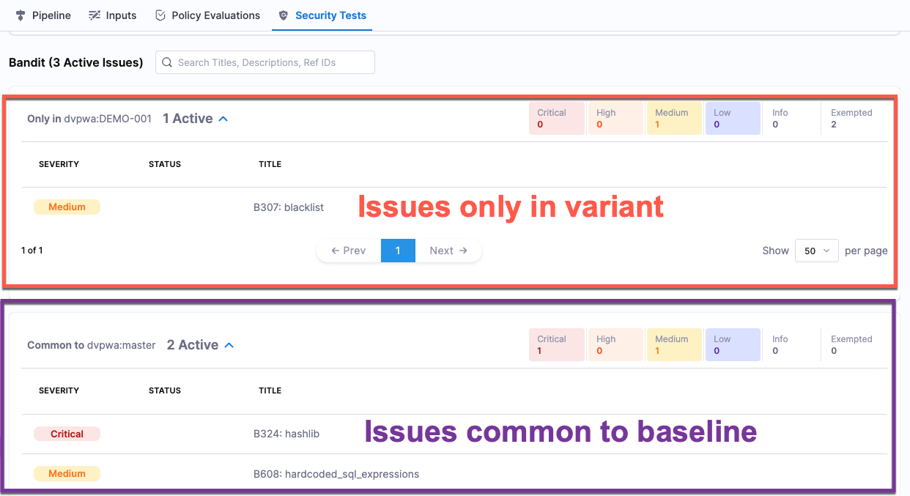

This topic discusses the following STO topics:
- [Targets](#targets)
- [Variants](#variants)
- [Baselines](#baselines)
- [Where was an issue detected: in the variant, in the baseline, or both?](#where-was-an-issue-detected-in-the-variant-in-the-baseline-or-both)
- [Every target needs a baseline](#every-target-needs-a-baseline)

### Targets

import StoConceptTargets from '../shared/_targets.md';

<StoConceptTargets />

<figure>

<figcaption>Test Targets page</figcaption>
</figure>

### Variants

import StoConceptVariants from '/docs/security-testing-orchestration/get-started/shared/_variants.md';

<StoConceptVariants />

### Baselines

import StoConceptBaselines from '/docs/security-testing-orchestration/get-started/shared/_baselines.md';

<StoConceptBaselines />

### Is an issue unique to the variant or common to the baseline? 

Every STO pipeline execution has a [Security Tests tab](/docs/security-testing-orchestration/dashboards/view-scan-results) with separate lists of issues that make it easy to determine

- Issues only in the variant.
- Issues common to the variant and the baseline.

If you scanned the baseline, or the baseline isn't defined, you'll see
  - New issues only in the current scan (first list).
  - Old issues common to the previous scan (second list). 

<figure>

<figcaption>New and common issues in Security Tests tab</figcaption>
</figure>

### Every target needs a baseline

import StoWhyDefineBaselines from '/docs/security-testing-orchestration/get-started/shared/_why-define-baselines.md';

<StoWhyDefineBaselines />

