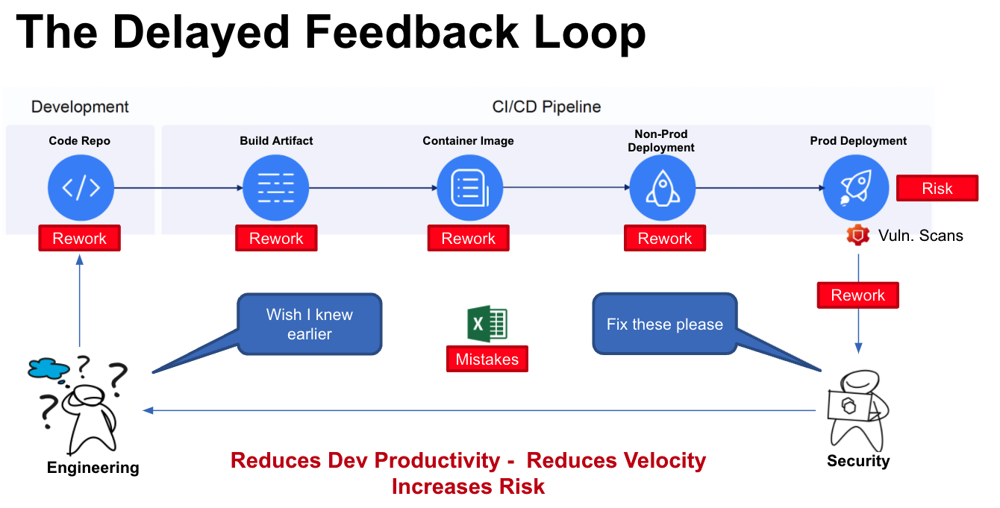
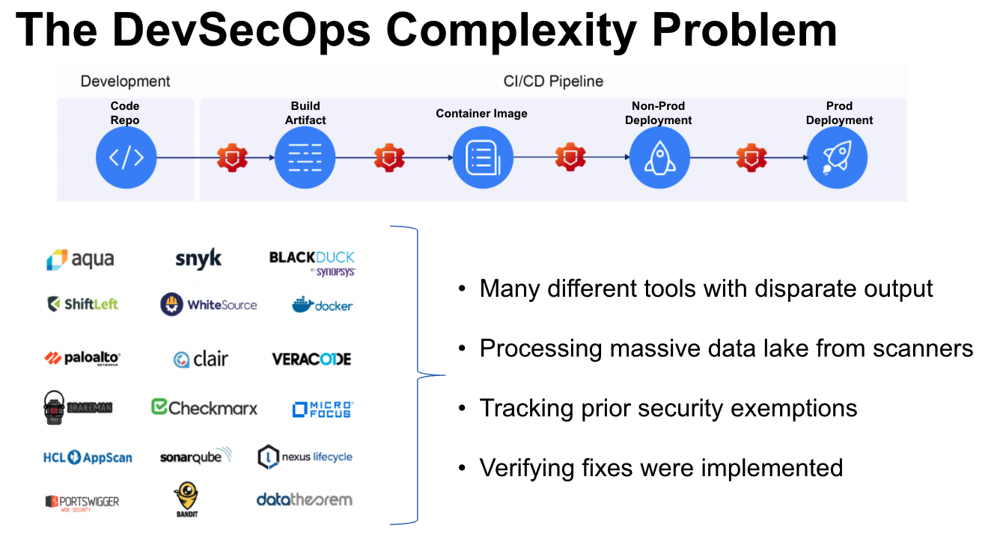
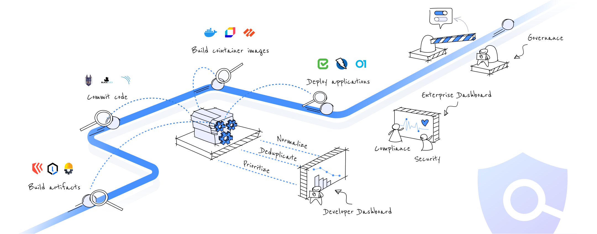
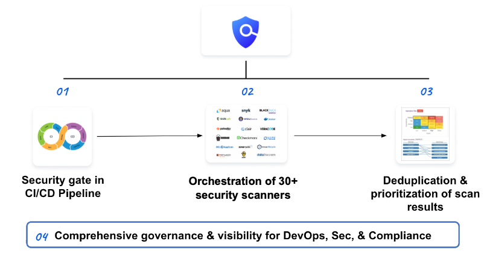

Companies perform security testing to avoid introducing vulnerabilities into the products their customers depend on. If a customer catches the security issue instead of the company, trust is lost.

Harness Security Testing Orchestration (STO) enables DevOps teams to shift-left security testing. STO orchestrates scanning, intelligently deduplicates scanner output, prioritizes remediations, and enforces governance in your Harness pipelines. STO puts scanning directly into your pipelines to ensure that vulnerabilities are caught and fixed before your products are ever released.

This topic describes the security scanning problems facing developers and how STO provides the solutions they need.

## Common scanning problems

Many current security testing practices have the following issues:

* **Mostly manual and standalone:** Scanners are run individually on parts of a release manually, instead of integrated into the Pipeline and run automatically.
* **Too slow or delayed:** Identifying vulnerabilities is often done after the vulnerabilities are released.
* **Siloed visibility:** Multiple tools for different types of scans reduces the overall visibility into your product's vulnerabilities.
* **Inconsistent Governance:** Developers don't have guidance and governance to help them decide where scans should be in their release process.
* **Not integrated with CI/CD:** Scans happen outside of the Pipeline instead of acting as gate checks.

### Delayed feedback loop

Current security testing is challenging for DevOps teams because most security testing is done right before code has reached production. This is a delayed feedback loop.

<!-- 

-->

All of the release stages where security testing could have been applied are past, and fixing the issue requires reworking each stage.

Developers need to move forward, but by the time the security testing feedback arrives it could be days or weeks later and they have to stop current work and fix it.

### SDLC complexity problem

Building software, from raw code to development to deployment, is too complex because there are many tools for so many types of scanning, and the outputs from all these tools are disparate. There is no uniform data format or language.

<!-- 

-->

Consequently, developers don't have a deduplicated and prioritized list of vulnerabilities to remedy.

Your software teams must normalize all the output, track exemptions, and verifying fixes. This all requires synchronization between DevOps and security teams; it also takes a lot of time and labor away from other work.

In addition, DevOps and security teams need to act on the information provided from security testing, but ensuring that these are the only vulnerabilities is challenging.

## Harness Security Testing Orchestration (STO) solution

Harness STO enables DevOps and security teams to shift-left security testing:

* **Test:** Test code, OSS libraries, containers, and live apps with popular security scanners as part of the CI/CD Pipeline. Harness orchestrates the scanners to ensure that scanning is timely and easy to apply.
* **Remediate:** Repair security vulnerabilities by empowering developers with a prioritized list that is intelligently deduplicated across all scanners. Harness provides dashboards with clear security vulnerabilities identified.
* **Govern:** Use governance policies and real-time security dashboards for ensuring critical security issues never make it to production. You can apply [Harness existing OPA policy governance](/docs/platform/governance/policy-as-code/harness-governance-overview) to enforce your security testing practices.

With Harness STO, you are scanning at any stage in the CI/CD Pipeline, and providing developers with deduplicated and prioritized vulnerabilities.

<!--

-->

<!--
### Quick Summary

The following 1min video provides a quick summary of STO:

-->

## STO features

Harness STO automatically aggregates, normalizes, and deduplicates data to identify vulnerabilities across all your scanners. You don't need any other Harness modules to use STO. 

You can also include STO features in CI and CD workflows. You can set up your Pipelines to scan repos, images, and artifacts, and then fail the pipeline automatically if any "show-stopper" vulnerabilities are detected.

These workflows are covered in [Your first STO pipeline](/docs/security-testing-orchestration/get-started/your-first-sto-pipeline).

Now let's apply these features to common use cases:

<table>
    <tr>
        <th>Use Cases</th>
        <th>Shift Left Security Testing To CI/CD Pipeline</th>
        <th>Developer-first Remediation</th>
        <th>Governance, Dashboards, and Reports</th>
    </tr>
    <tr>
        <th>Features</th>
        <td  valign="top">
            <ul>
              <li>STO built into Harness CI/CD Pipelines</li>
              <li>STO standalone stage added to Harness CD</li>
              <li>STO standalone stage initiated from any CI/CD stage</li>
            </ul>
        </td>
        <td valign="top">
            <ul>
              <li>Deduplication and prioritization across all scanners</li>
              <li>Categorization of new vs. existing vulnerabilities (with/without exemptions)</li>
            </ul>
        </td>
        <td  valign="top">
            <ul>
              <li>Pipeline design and deployment governance</li>
              <li>Audit trails for scan execution, approvals, and policy enforcement</li>
              <li>Enterprise dashboards and reports</li>
            </ul>
        </td>
    </tr>
</table>

## Scanner coverage

For a list of supported scanners, see [Scanners supported by STO](/docs/security-testing-orchestration/sto-techref-category/security-step-settings-reference#scanners-supported-by-sto). 

## Try Harness STO

Check out the [STO tutorials](/docs/security-testing-orchestration/get-started/tutorials) and get started running [your first STO pipeline](/docs/security-testing-orchestration/get-started/your-first-sto-pipeline) today!
