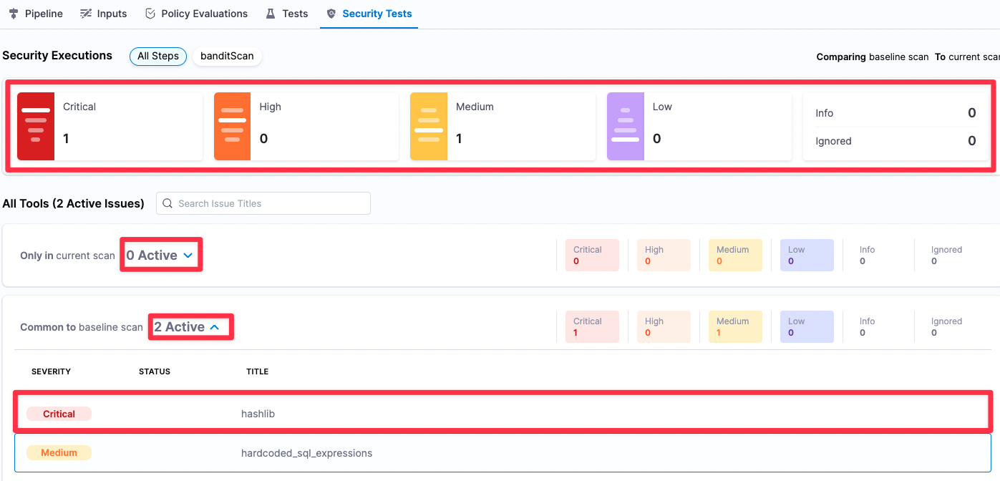

<CTABanner
  buttonText="Learn More"
  title="Continue your learning journey."
  tagline="Take a Security Testing Orchestration certification today!"
  link="/university/sto"
  closable={true}
  target="_self"
/>

This tutorial shows you how to use the Harness Security Testing Orchestration (STO) module to perform code security scanning in a Harness pipeline. You'll set up a pipeline with one scanner, run scans, analyze the results, and learn about the key features of STO.

:::info Prerequisites

In addition to a Harness account, this tutorial requires the following:

- A Harness account and STO module license.
- You need to have a [Security Testing Developer or SecOps role](/docs/security-testing-orchestration/get-started/onboarding-guide/#add-security-testing-roles) assigned to your user profile.
- You also need a GitHub account and a [connector](/docs/security-testing-orchestration/get-started/onboarding-guide/#create-a-codebase-connector) to your GitHub account.
  This tutorial uses an [example codebase on GitHub](https://github.com/williamwissemann/dvpwa) that contains known vulnerabilities.

:::

## Objectives

You'll learn how to:

1. Run the pipeline and analyze the security issues found by the scanner.
2. Select a baseline for your test targets and use the baseline to identify "shift-left" issues in a downstream branch only vs. "shift-right" issues also found in the baseline branch.
3. View issue details in the Harness UI and use these details to pinpoint and resolve issues in your code.
4. Set up a scan step to fail automatically if it detects an issue with the specified severity or higher.
5. Request an exemption ("ignore rule") for a specific issue.
6. Approve the exemption. Once approved, the exemption won't fail the pipeline even if it equals or exceeds the severity threshold.

<details open>
<summary> Review: what's supported in Harness STO</summary>

Go to [What's supported in Harness STO](/docs/security-testing-orchestration/whats-supported) for information about all supported STO features, infrastructures, and third-party scanners.

</details>

## Developer workflow

You're a developer, working in various development branches and merging your code updates. You want to make sure you don't introduce any new vulnerabilities when you merge your code into the upstream branch. Using STO, you can scan your repo automatically and then use the results to pinpoint and fix your vulnerabilties before you merge.

### Set up your codebase

This tutorial uses <a href="https://bandit.readthedocs.io/en/latest/">Bandit</a> to scan the target repository <a href="https://github.com/williamwissemann/dvpwa">https://github.com/williamwissemann/dvpwa</a> (specified in the <a  href="/docs/continuous-integration/use-ci/codebase-configuration/create-and-configure-a-codebase/">Codebase</a> for this pipeline).

1. Fork the following example repository into your GitHub account. This is a Python repo with known vulnerabilities: https://github.com/williamwissemann/dvpwa.

2. If you don't have a Harness connector to your GitHub account, do the following:

   1. In your Harness project, select **Project Setup** > **Connectors**.
   2. Select **New Connector**, then select **Code Repositories** > **GitHub**.
   3. Set the [GitHub connector settings](/docs/platform/connectors/code-repositories/ref-source-repo-provider/git-hub-connector-settings-reference) as appropriate.
      - Use **Account** for the [URL type](/docs/platform/connectors/code-repositories/ref-source-repo-provider/git-hub-connector-settings-reference/#url-type).
      - This tutorial uses Harness Cloud, so select **Connect through Harness Platform** when prompted for the connectivity mode.

### Set up your pipeline

import add_stage from './static/your-first-pipeline/add-security-tests-stage.png'

Do the following:

1. Select **Security Testing Orchestration** (left menu, top) > **Pipelines** > **Create a Pipeline**. Enter a name and click **Start**.

2. In the new pipeline, select **Add stage** > **Security**.

3. Set up your stage as follows:

   1. Enter a **Stage Name**.

   2. In **Select Git Provider**, select your GitHub connector.

   3. In **Repository Name**, click the value type selector (tack button) and select **Runtime Input**. You'll specify the repo to scan when you run the pipeline.

      

4. Go to **Infrastructure** and select **Cloud**, **Linux**, and **AMD64** for the infrastructure, OS, and architecture.

   You can also use a Kubernetes or Docker build infrastructure, but these require additional work to set up. For more information, go to [Set up a build infrastructure for STO](/docs/security-testing-orchestration/get-started/onboarding-guide#set-up-a-build-infrastructure-for-sto).

### Add a Bandit scan step

<details open>
<summary> Key concept: scan targets and variants</summary>

Every STO scan has a specific [target name and variant](/docs/security-testing-orchestration/get-started/key-concepts/targets-and-baselines).

- The name specifies the repository, image, or instance to scan.
- The variant specifies the codebase branch, image tag, app version, or other variant. 

</details>

import set_up_harness_26 from './static/your-first-pipeline/configure-bandit-step.png'

import Tabs from '@theme/Tabs';
import TabItem from '@theme/TabItem';

<Tabs>
  <TabItem value="Visual" label="Visual" default>

1. In the Pipeline Studio, go to **Execution** and add a **Bandit** step to your pipeline.

2. Configure the step as follows:

   1. Scan Mode = **Orchestration**

      Indicates that this is an [orchestrated scan](/docs/security-testing-orchestration/get-started/key-concepts/sto-workflows-overview) that runs the scan and ingests the results in one step.

   2. Target name — Click the value-type selector (tack button to the right of the input field) and select **Runtime input**. You'll specify this and other values when you run the pipeline.

   3. Variant — Select **Runtime input** as the value type.

      Every STO scan has a [target variant](/docs/security-testing-orchestration/get-started/key-concepts/targets-and-baselines) that specifies the branch, tag, or other variant to scan.

</TabItem>
  <TabItem value="YAML" label="YAML">

Add a `Bandit` step to your `SecurityTests` stage and configure it as follows. 

- `type:` [`Bandit`](/docs/security-testing-orchestration/sto-techref-category/bandit-scanner-reference)
- `name:` A name for the step.
- `identifier:` A unique step ID.
- `spec :`
  - `mode :` [`orchestration`](/docs/security-testing-orchestration/get-started/key-concepts/sto-workflows-overview) In orchestrated mode, the step runs the scan and ingests the results in one step.
  - `config: default`
    - `target : `
      - `name : <+input>`
      - `type : repository`
      - `variant : <+input>` You will specify the [target name and variant](/docs/security-testing-orchestration/get-started/key-concepts/targets-and-baselines) when you run the pipeline.
        When scanning a repository, you will generally use the repository name and branch for these fields.
    - `advanced : `
      - `log :`
        - `level : info`

Here's a YAML example:

```yaml
steps:
  - step:
      type: Bandit
      name: bandit_scan_orchestrated
      identifier: bandit_scan_orchestrated
      spec:
        mode: orchestration
        config: default
        target:
          name: <+input>
          type: repository
          variant: <+input>
        advanced:
          log:
            level: info
```

</TabItem>
</Tabs>

<!-- details>
<summary> Key concept: Custom Scan steps and scanner-specific steps</summary>

The Step Library includes a [Custom Scan](/docs/security-testing-orchestration/sto-techref-category/custom-scan-reference) step for setting up scanners: open the step and configure the scan as a set of key/value pairs under **Settings**.

The Step Library also includes scanner-specific steps for popular scanners such as Bandit, OWASP, Snyk, Grype, and SonarQube. These steps have preconfigured options that greatly simplify the process of setting up a scan.

In the Bandit step, for example, the **Scan Configuration** and **Target Type** fields are read-only because each option supports one option. If a scanner supports multiple target types, such as repositories and container images, **Target Type** is editable and the menu is pre-populated with the supported target types.

</details -->

### Scan the repo and analyze the results

Now that you've set up the pipeline, you can run a scan and view the detected issues.

1. Select **Save**, and then select **Run**.
2. In Run Pipeline, configure the run as follows:

   1. Under Codebase:
      - Repository name : **dvpwa**
      - Branch name : **master**
   2. Under Stage:
      - Target name : **dvpwa** (= the repo name)
      - Target variant : **master** (= the branch name)

   :::tip

   - [Input sets](/docs/platform/pipelines/input-sets) make it easy to re-run a pipeline with a specific set of runtime inputs. To save your runtime settings to an input set, select **Save as New Input** on the bottom right.

   :::

3. Run the pipeline. When the execution finishes, select **Security Tests**.

This tab shows the issues that the scanner found in the test target, categorized by severity. You can filter issues using the severity buttons, expand/collapse the issue lists, and click on an issue to view details.

In this case the scanner found found two issues, one critical and one medium, in the master branch.



### Set the baseline

<details open>
<summary> Key concept: baselines</summary>

A _target baseline_ identifies the "prod" variant of the target, such as the `main` branch or the `latest` tag. Defining a baseline makes it easy to distinguish between “shift-right” issues in production targets and “shift-left” issues in downstream variants.

Note the following:

- Harness strongly recommends that you <a href="/docs/security-testing-orchestration/use-sto/set-up-sto-pipelines/set-up-baselines">specify a baseline for every target</a>.

- You can specify target baselines using regular expressions as well as fixed strings. Regular expressions are useful when the "prod" variant updates with each new release.

</details>

import set_baseline from './static/your-first-pipeline/set-baseline.png'

As a developer, you want to ensure that you don't introduce any new issues when you merge into your upstream branch. To do this, you create a baseline for your test target and compare your scans against the baseline.

1. Select **Security Test Orchestration** > **Test Targets**.
2. Go to the target in the table and select **branch : **master\*\*.

  


### Compare baseline vs. downstream issues

Suppose you're developing a new feature. You're working in a `DEMO-001` branch that's downstream from the `master` branch. As a developer, you want to fix any "shift-left" issues in your downstream branch _before_ you merge into the baseline.

First, you want to see if your branch has any security issues that aren't in the `master` branch.

- Run the pipeline again with **DEMO-001** as the target variant.
- When the pipeline finishes, go to the **Security Tests** tab.

DEMO-001 has 5 security issues: 2 critical, 2 medium, 1 low. Note that 3 of these issues are in the DEMO-001 branch only and 2 are common to both DEMO-001 and master.


### Fix vulnerabilities

<details open>
<summary>Key Concept: Issues and occurrences</summary>  
When Harness processes the security issues identified in a scan, it deduplicates the results. <i>Deduplication</i> is the aggregation of multiple occurrences with the same root cause into one issue.

Note the following as you troubleshoot and fix your security issues:

- Each security issue you see in the **Security Tests** page is unique and requires its own resolution.
- A single issue might have multiple occurrences throughout the target. To remediate an issue, you must fix all occurrences of that issue.

</details>

The Issue Details pane has useful information for troubleshooting your security vulnerabilities.

1. Expand one of the issue lists (for the baseline or the downstream branch) and select an issue. The Issue Details pane opens.


    + The severity score **9.5** is based on the [NIST Common Vulnerability Scoring System](https://nvd.nist.gov/vuln-metrics/cvss) (CVSS) version 3.0:
    	- None 0.0
    	- Low 0.1 - 3.9
    	- Medium 4.0 - 6.9
    	- High 7.0 - 8.9
    	- Critical 9.0 - 10.0
    + The **Occurrences List** shows all occurrences of this specific issue in the test target.

2. Select the Reference Identifier link (for example, [CWE-78](https://cwe.mitre.org/data/definitions/78.html)).

   **Issue Details** includes specific information about each vulnerability. In this case, you can view detailed information about the issue in the Common Weakness Enumeration database, a community-developed list of software and hardware weakness types.

3. Examine the **Occurrences** list for this issue. (You might need to scroll down in the pane.) Here you can find additional details about each individual occurrence of the issue. Note that, to eliminate this vulnerability from the repo, you need to fix multiple occurrences:

   

<details open>
<summary>Key Concept: Issue details are derived from the external scanner</summary>

Many of the details you see for each issue are derived from the external scanner. These details can differ, depending on the scan tool you're using. In this tutorial we're using Bandit, which is a free, open-source scan tool. In general, paid scanners provide more extensive details (such as remediation steps) than free ones.

Here's an example of a container image vulnerability detected by a paid version of Snyk:


</details>

### New feature: AI-enhanced remediation

Harness AIDA™ uses state-of-the-art AI technology to streamline the process of triaging and fixing security vulnerabilities. Harness AIDA is based on large, well-trained language models. It learns continuously based on feedback and the latest public knowledge. Optionally, you can regenerate advice with additional context and thereby optimize your results.

For more information, go to [Fix issues using AI-enhanced remediation steps](/docs/security-testing-orchestration/remediations/ai-based-remediations).

### Fail pipelines on severity

<details open>
<summary> Key concept: fail_on_severity</summary>

Every STO scan step has a `fail_on_severity` setting. If any vulnerability with the specified severity or higher is found, the pipeline fails.

It is good practice to set `fail_on_severity` in every scan step in an integrated pipeline.

</details>

1. In the Pipeline Studio, open the **Bandit** step.
2. Set **Fail on Severity** to **Critical**.
3. Select **Apply Changes**, save the updated pipeline, and run the pipeline again with the **DEMO-001** branch.

   

The pipeline now fails because the Bandit step is now configured to fail on any critical vulnerability. The last log message in the Bandit step log is:

```
Exited with message: fail_on_severity is set to critical and that threshold was reached.
```

## Developer/Secops workflow: exemptions for specific issues

import account_user_settings from './static/your-first-pipeline/go-to-account-user-settings.png'
import return_to_project from './static/your-first-pipeline/switch-from-account-to-project.png'
import confirm_secops_role from './static/your-first-pipeline/confirm-secops-role.png'
import request_exemption from './static/your-first-pipeline/request-exemption.png'
import request_exemption_details from './static/your-first-pipeline/request-exemption-details.png'
import approve_exemption_requests from './static/your-first-pipeline/approve-exemption-requests.png'
import exempted_button_in_security_tests from './static/your-first-pipeline/exempted-button-in-security-tests.png'
import cancel_exemption_requests from './static/your-first-pipeline/cancel-exemption-requests.png'

<details open>
<summary> Key concept: Exemptions, requests, and approvals</summary>

You can exempt known issues from `fail_on_severity` so that they don't stop the pipeline even when a scan detects them. The following steps outline the workflow:

1. A developer requests an exemption for a specific issue and forwards the request to a SecOps user.

2. The SecOps user approves the request or rejects it. Developer users can request exemptions, but only SecOps users can approve them.

3. If the exemption is approved, and a future scan detects the exempted issue, the pipeline execution will not fail even if the issue meets the `fail_on_severity` threshold.

</details>

In this section, you'll create an exemption as a developer and then approve it as a SecOps user. (In many real-world scenarios, two separate people will be performing the workflow.)

1. Make sure that you have the SecOps role assigned to yourself:

   1. Select the account link (left-most breadcrumb at the top). Then go to **Account Settings** (left menu) and select **Access Control**.

     


   2. In the **Users** table, select your user profile.
   3. Under Role Bindings, select **+Manage Role**.
   4. Make sure that you have the **Security Testing SecOps** role assigned to yourself.

     


2. Go back to your project: Select your STO account in the left menu, then select **Project**, and then select the project with your STO pipeline.

  
  


3. In the left navigation, select **Executions** and then select the last successful build you ran _before_ the failed build.

In the following step, you'll create an exemption for each of the two critical issues found: `subprocess_popen_with_shell_equals_true` (only in the current scan) and `hashlib` (common to the baseline scan).

3. In the **Security Tests** tab, do the following steps for each critical issue:

   1. Select the critical issue in the issues table (bottom left) to open **Issue Details**.
   2. Select **Request Exemption**.

     
     
    
   3. In **Request Exemption for Issue**, configure the exemption request as follows:
   	 
     1. Where do you want this issue to be exempted? **This pipeline** 
   	
     2. For how long? **7 Days** 
   	
     3. Reason this issue should be exempted: **Other**

   4. Further describe the reason this issue should be exempted: **Tutorial example pipeline, not for use in QA or Prod environments**

   5. Select **Create Request**.

      

4. Select **Exemptions** in the left menu.

5. In the Security Review page, select the "thumbs-up" buttons to approve both exemptions. These exemptions now move from **Pending** to **Approved**.

   

6. Go back to your pipeline and run another build with the **DEMO-001** branch. When the build finishes, go to the **Security Tests** page.

7. Select **Exempted** (far right, under **Security Executions**). Note that this button, like the Critical, High, and other buttons, acts as a toggle to show and hide specific issues in the issues table. If you select and unselect **Exempted**, the exempted issues switch between visible and hidden.

   

8. Select **Exemptions** in the left menu. Then select **Approved** to show the exemptions you created and approved.
9. Select the Delete (**X**) buttons on the right to delete both exemptions.

   


## Congratulations!

In this tutorial, you've learned how to:

1. Set up a scanner
2. Create a baseline
3. Analyze scan results
4. Use the data collected by STO to pinpoint and fix vulnerabilities _before_ you merge your code updates.
5. Configure `fail_on_severity` to fail a pipeline execution if a scan detects a vulnerability with the specified severity or higher.
6. Request a exemption for a specific vulnerability (if you're a developer) and approve an exemption (if you're a SecOps person).

## Next steps

You've now learned the core STO features and workflows. Here are the next steps you can take.

### Add steps or stages for CI/CD workflows

You know how to implement pipelines when scanners detect security issues, and how to create Ignore Rules for specific issues. Once you set up your Security Test steps, baselines, and exemptions, you can add more stages and steps to implement your CI/CD workflows.

For some examples of integrated workflows, go to:

- [(STO license) Create a build-scan-push pipeline](/docs/security-testing-orchestration/use-sto/set-up-sto-pipelines/build-scan-push-workflows/build-scan-push-sto-only)

- [(STO/CI licenses) Create a build-scan-push pipeline](/docs/security-testing-orchestration/use-sto/set-up-sto-pipelines/build-scan-push-workflows/build-scan-push-sto-ci)

### Add more scanner steps

STO supports an extensive set of external scanners for repos, images, and artifacts. Go to [What's supported](/docs/security-testing-orchestration/whats-supported).

### Add governance policies

You can use the [Harness Policy Engine](/docs/platform/governance/policy-as-code/harness-governance-overview) to create policies based on the [Open Policy Agent (OPA)](https://www.openpolicyagent.org/) standard. For example, you can create a rule like the following to ensure that all pipelines include a Security stage.

```
package pipeline_required

# Deny pipelines that are missing required steps
deny[sprintf("CI stage '%s' is missing required step '%s'", [stage.name, existing_steps])] {
     stage = input.pipeline.stages[i].stage                                # Find all stages ...
     stage.type == "CI"                                                    # ... that are CI stages
     existing_steps := [ s | s = stage.spec.execution.steps[_].step.type ] # ... and create a list of all step types in use
     required_step := required_steps[_]                                    # For each required step ...
     not contains(existing_steps, required_step)                           # ... check if it's present in the existing steps
}

# steps that must be present in every CI stage - try to create a CI stage without a Security Test step to see the policy fail
required_steps = ["Security"]

contains(arr, elem) {
    arr[_] = elem
}
```

### Add failure strategies to a CI/CD stage

You can implement [Failure Strategies](/docs/platform/pipelines/failure-handling/define-a-failure-strategy-on-stages-and-steps) to bypass the failure policies in previous security steps. One use case for this would be to enable manual interventions when a Security Test step generates a failure. You can set up a workflow like this:

1. A Build step is downstream from the Security Test step. It has a failure strategy that's set to run on [All Errors](/docs/platform/pipelines/failure-handling/define-a-failure-strategy-on-stages-and-steps/#error-types).
2. The scanner detects issues and the Security Test step generates an error.
3. The Failure Strategy in the Build step initiates a 30-minute pause before proceeding.
4. The developer and security team evaluate the issues and then abort the pipeline execution or allow it to proceed.

## YAML pipeline example

Here's an example of the pipeline you created in this tutorial. If you copy this example, replace the placeholder values with appropriate values for your project, organization, and connectors.

```yaml
pipeline:
  name: your-first-pipeline-v2
  identifier: yourfirstpipelinev2
  projectIdentifier: YOUR_HARNESS_PROJECT_ID
  orgIdentifier: YOUR_HARNESS_ORGANIZATION_ID
  tags: {}
  stages:
    - stage:
        name: bandit_repo_scan
        identifier: bandit_repo_scan
        description: ""
        type: SecurityTests
        spec:
          cloneCodebase: true
          platform:
            os: Linux
            arch: Amd64
          runtime:
            type: Cloud
            spec: {}
          execution:
            steps:
              - step:
                  type: Bandit
                  name: bandit_repo_scan
                  identifier: bandit_repo_scan
                  spec:
                    mode: orchestration
                    config: default
                    target:
                      name: <+input>
                      type: repository
                      variant: <+input>
                    advanced:
                      log:
                        level: info
                      fail_on_severity: critical
  properties:
    ci:
      codebase:
        connectorRef: YOUR_CODEBASE_CONNECTOR_ID
        repoName: <+input>
        build: <+input>
```

<!--

#### Integrated STO/CI Workflow Example

The following pipeline extends the example workflow described above. After it scans the repo, it builds a container image, scans the image, and fails the pipeline if the image scan fails. The [YAML](#integrated-workflow-yaml) of this pipeline is provided below.


This pipeline works as follows:

1. The **SecurityTestStage** consists of the following steps:

    1. **backgroundDinD** runs Docker-in-Docker as a background service. This is required to scan the container image.
    2. **banditScan** scans a GitHub repo used to build the container image.
    In this case, `fail_on_severity` is set to `high`.
    3. **buildAndPush_PRIVATE** builds a local container image from the repository and pushes it to a private registry.
    3. The **aquaTrivyScan** step uses the open-source tool [**Aqua Trivy**](/docs/security-testing-orchestration/sto-techref-category/aqua-trivy-scanner-reference) to scan the local image. It has `fail_on_severity` set to `high`.
    4. If the container image has no issues with high or critical severity, **buildAndPush_PUBLIC** pushes the image to a public registry.

2. The **sendEmail** stage includes an step that sends an email if the previous stage succeeded.

After the pipeline executes, you can view all issues from all scanners in the **Security Tests** tab, and also filter the issue list by scanner.


#### Integrated Workflow YAML

Here's the YAML of the integrated workflow example we examined in this tutorial.

<details>
<summary>Integrated Workflow YAML</summary>


``` yaml
pipeline:
  projectIdentifier: YOUR_HARNESS_PROJECT_ID
  orgIdentifier: foobar
  tags: {}
  properties:
    ci:
      codebase:
        connectorRef: YOUR_CODEBASE_CONNECTOR_ID
        repoName: dvpwa
        build: <+input>
  stages:
    - stage:
        name: securityTestStage
        identifier: securityTestStage
        type: CI
        spec:
          cloneCodebase: true
          sharedPaths:
            - /var/run
          infrastructure:
            type: KubernetesDirect
            spec:
              connectorRef: YOUR_K8S_DELEGATE_CONNECTOR
              namespace: harness-delegate-ng
              automountServiceAccountToken: true
              nodeSelector: {}
              harnessImageConnectorRef: account.harnessImage
              os: Linux
          execution:
            steps:
              - step:
                  type: Background
                  name: backgroundDinD
                  identifier: Background_1
                  spec:
                    connectorRef: account.harnessImage
                    image: docker:dind
                    shell: Sh
                    privileged: true
              - step:
                  type: Bandit
                  name: banditScan
                  identifier: Bandit_1
                  spec:
                    mode: orchestration
                    config: default
                    target:
                      name: dvpwa
                      type: repository
                      variant: " <+codebase.branch> "
                    advanced:
                      log:
                        level: info
                      fail_on_severity: high
                  failureStrategies:
                    - onFailure:
                        errors:
                          - AllErrors
                        action:
                          type: Ignore
              - step:
                  type: BuildAndPushDockerRegistry
                  name: buildAndPush_PRIVATE
                  identifier: BuildAndPushDockerRegistry_1
                  spec:
                    connectorRef: YOUR_IMAGE_REGISTRY_CONNECTOR
                    repo: foobar/sto-tutorial-test-private
                    tags:
                      - <+pipeline.sequenceId>
              - step:
                  type: AquaTrivy
                  name: aquaTrivyScan
                  identifier: AquaTrivy_1
                  spec:
                    mode: orchestration
                    config: default
                    target:
                      name: sto-tutorial-test-private
                      type: container
                      variant: <+pipeline.sequenceId>
                    advanced:
                      log:
                        level: info
                      fail_on_severity: high
                    privileged: true
                    image:
                      type: docker_v2
                      name: foobar/sto-tutorial-test-private
                      tag: <+pipeline.sequenceId>
              - step:
                  type: BuildAndPushDockerRegistry
                  name: buildAndPush_PUBLIC
                  identifier: buildAndPush_PUBLIC
                  spec:
                    connectorRef: YOUR_IMAGE_REGISTRY_CONNECTOR
                    repo: foobar/sto-tutorial-test
                    tags:
                      - <+pipeline.sequenceId>
        variables: []
    - stage:
        name: sendEmail
        identifier: sendEmail
        description: ""
        type: Custom
        spec:
          execution:
            steps:
              - step:
                  type: Email
                  name: Email_1
                  identifier: Email_1
                  spec:
                    to: my.email@myorg.org
                    cc: ""
                    subject: NEW IMAGE! Scan results for <+pipeline.name>
                    body: "STO scan of <+pipeline.name> found the following issues:  <br> --------------------------------------------------------------<br> Bandit repo scan:<br>              Critical : <+pipeline.stages.securityTestStage.spec.execution.steps.Bandit_1.output.outputVariables.CRITICAL> <br>              New Critical : <+pipeline.stages.securityTestStage.spec.execution.steps.Bandit_1.output.outputVariables.NEW_CRITICAL> <br>              High: <+pipeline.stages.securityTestStage.spec.execution.steps.Bandit_1.output.outputVariables.HIGH> <br>              New High: <+pipeline.stages.securityTestStage.spec.execution.steps.Bandit_1.output.outputVariables.NEW_HIGH> <br>              Medium: <+pipeline.stages.securityTestStage.spec.execution.steps.Bandit_1.output.outputVariables.MEDIUM> <br>              New Medium: <+pipeline.stages.securityTestStage.spec.execution.steps.Bandit_1.output.outputVariables.NEW_MEDIUM> <br>  --------------------------------------------------------------<br> Aqua Trivy image scan:<br>              Critical : <+pipeline.stages.securityTestStage.spec.execution.steps.AquaTrivy_1.output.outputVariables.CRITICAL> <br>              New Critical : <+pipeline.stages.securityTestStage.spec.execution.steps.AquaTrivy_1.output.outputVariables.NEW_CRITICAL> <br>              High: <+pipeline.stages.securityTestStage.spec.execution.steps.AquaTrivy_1.output.outputVariables.HIGH> <br>              New High: <+pipeline.stages.securityTestStage.spec.execution.steps.AquaTrivy_1.output.outputVariables.NEW_HIGH> <br>              Medium: <+pipeline.stages.securityTestStage.spec.execution.steps.AquaTrivy_1.output.outputVariables.MEDIUM> <br>              New Medium: <+pipeline.stages.securityTestStage.spec.execution.steps.AquaTrivy_1.output.outputVariables.NEW_MEDIUM> <br>                See https://app.harness.io/ng/#/account/MY_ACCOUNT_ID/sto/orgs/default/"
                  timeout: 10m
        tags: {}
  identifier: tutorial4integratedstoci
  name: 2023-tutorial-4-integrated-sto-ci


```
</details>

-->
