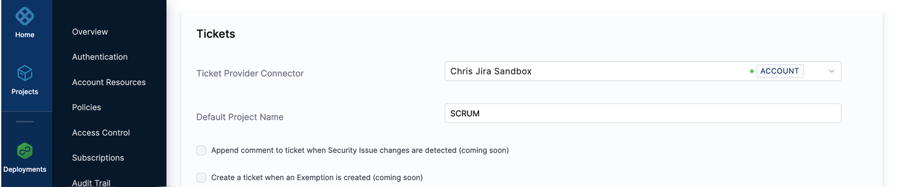
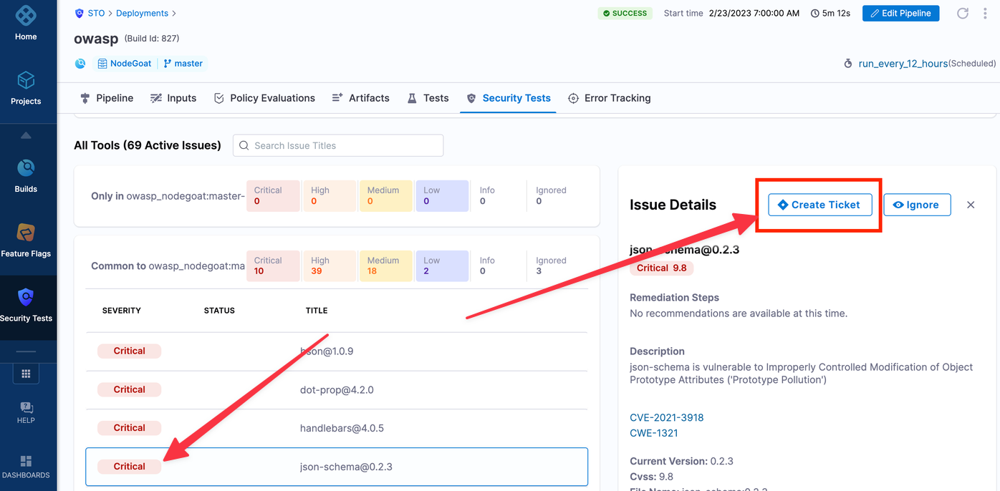

import create_ticket from './use-sto/static/jira-integration-02-create-ticket.png'
import ticket_num from './use-sto/static/jira-integration-03-ticket-num-in-issue-details.png'
import issue_link from './use-sto/static/jira-integration-04-link-in-jira-ticket.png'
import ticket_summary from './use-sto/static/jira-integration-05-ticket-summary.png'

You can set up STO to create Jira tickets for issues detected by STO scans. This topic describes how to set up this integration.

:::note
* This feature is not supported in Self-Managed Enterprise Edition.
* This feature is supported for both [Security Testing Developer and Security Testing SecOps](/docs/platform/role-based-access-control/add-manage-roles/#module-specific-roles) roles.  
:::

:::warning
This integration has a separate setup path that is unrelated to other Jira-related integrations in Harness pipelines. To open Jira tickets for security findings in STO, you must set up the integration as documented below. You cannot use other Jira workflows to create Jira tickets in STO. For example, you cannot integrate Jira with STO using Custom steps with Jira Create or other related steps.
:::

## Set up the STO/Jira integration

1. Create an API key for your Jira account. For more information, go to [Manage API tokens for your Atlassian account](https://support.atlassian.com/atlassian-account/docs/manage-api-tokens-for-your-atlassian-account/) in the Atlassian documentation.

2. Create a Jira connector as described in [Connect to Jira](/docs/platform/connectors/ticketing-systems/connect-to-jira/). 
    * Create your connector at the Account level.
    * Create a [text secret](/docs/platform/secrets/add-use-text-secrets) for your Atlassian API key. You must use the Harness Secret Manager to store this key. Don't use an external secret store, such as Vault.

3. Go to **Account Settings** &gt; **External Tickets** and select the following: 
   
    1. The Jira connector you just created.
 
    2. The default Jira project where you want to create your tickets. (You can select a different project when you create a ticket.)

       

## Create a Jira ticket from an STO issue

:::note
You can only create Jira tickets for targets that have baselines specified. For more information, go to [Targets, baselines, and variants in STO](/docs/security-testing-orchestration/get-started/key-concepts/targets-and-baselines).
:::

1. Go to the **Pipeline Execution** &gt; **Security Tests** page with the detected issue. 

2. Click on the issue to select it. Then click **Create Ticket**. 

   

3. In **Create Ticket in Jira**, set the options as follows:

    1. **Scope** Create a ticket for all occurrences of the issue in the current target (**This target**), or create a ticket for all occurrences of the issue across all targets in the project (**This project**).

    2. **Jira Project** The Jira project for the ticket. The drop-down includes all Jira projects available via the Jira Connector.

    3. **Issue Type** The Jira issue type for this ticket. 

    4. **Title** The Jira issue title. 

    5. **Notes** Any notes you want to add to the ticket.

       
       
      
4. Click **Create**. The Jira connector sends the request to the Jira API and Jira creates the ticket. 

The following happens when you create a Jira ticket: 

   * The Issue Details pane replaces the **Create Ticket** button with the Jira issue number and status.
       
      
      
      

   * The Jira issue includes a link back to the detected issue in the STO UI.
     
      
      
      

   * The Jira link points back to a **Ticket Summary** that shows all detected issues tracked by the ticket.
        
      
      
      

