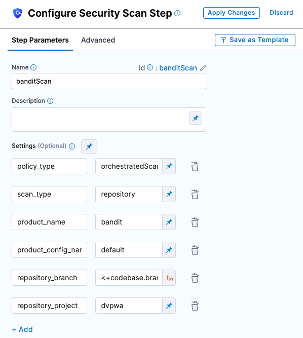

This tutorial shows you how to use the Harness Security Testing Orchestration (STO) module to perform code security scanning in a Harness Pipeline. You'll set up a Pipeline with one scanner, run scans, analyze the results, and learn the key features of STO.

This tutorial covers standalone or "audit-only" workflows that don't require any other Harness components. In [Tutorial 2](40-sto-tutorial-2-integrated-sto-ci-cd-workflows.md), you'll learn how to integrate STO into Harness CI and CD workflows and protect your repos, containers, and artifacts from vulnerabilities automatically.

## Objectives

You'll learn how to:

1. Run the Pipeline and analyze the security issues found by the scanner.
2. Create a baseline for your test targets and use the baseline to identify new issues in a development branch vs. inherited issues in the baseline.
3. View issue details in the Harness UI and use these details to pinpoint and resolve issues in your code.

## Before You Begin

You must perform all the required steps in [Set Up Harness for STO](20-set-up-harness-for-sto.md). This topic describes how to do the following:

1. Install a delegate in a Kubernetes cluster.
2. Create connectors to your Git and DockerHub repos
3. Create a pipeline with a Docker-in-Docker service and a Security step that runs a Bandit scan on a repo.
4. Add an STO Stage to a Pipeline.
5. Add a scanner to your Stage, configure it, and define the target to scan.

You will use a clone of this pipeline in these tutorials.

### Review: Ingestion Workflows

STO supports three different workflows to ingest scan results into a pipeline:

* [Orchestrated workflows](../use-sto/run-an-orchestrated-scan-in-sto.md) — A Security step runs a scan with predefined settings and ingests the results. This tutorial illustrates an orchestrated workflow.  
This is the simplest method to implement. STO supports orchestrated scans for Trivy, Bandit, SonarQube, and other popular tools.
* [Ingestion-Only workflows](../use-sto/ingesting-issues-from-other-scanners.md) — Run a scan in a Run step, or outside the pipeline, and save in a shared folder. A Security step then ingests the results.  
This provides the most flexibility. You can ingest results from highly targeted scan that address specific use case. You can also ingest results from scanners that currently have no STO integration.
* Data-Load workflows — A Security step downloads and ingests results from an external scanner.  
This workflow is supported for scanners that provide methods for transferring data programmatically.

### Review: Scanner Coverage

See **Security Testing Orchestration** in [Supported Platforms and Technologies](../../getting-started/supported-platforms-and-technologies.md).

### Stand-Alone STO Workflows

You're a developer, working in various development branches and merging your code updates. You want to make sure you don't introduce any new vulnerabilities when you merge your code into a target branch. Using STO, you can scan your repo automatically and then use the results to pinpoint and fix your vulnerabilties before you do any merge.

This Pipeline has only one scanner but you can easily add more later. For the list of supported scanners, see [Security Step Settings Reference](../sto-techref-category/security-step-settings-reference.md).

## Clone your STO base pipeline

1. Go to the project with the [base STO pipeline](20-set-up-harness-for-sto.md#create-an-sto-pipeline) project.
2. Click the top-right menu, choose **Clone**, and save the new pipeline as **STO Tutorial 1**.

   

## Scan Step Configuration

Let's look at the bandit step to see how it's configured.

1. In your new pipeline, go to **securityTestStage** and open the banditScan step.
   
2. Let's review the settings.

|  |  |  |
| --- | --- | --- |
| **Setting** | **Value** | **Description** |
| policy\_type | orchestratedScan | Indicates that this is an orchestrated scan as opposed to a ingestion-only or data-upload scan. |
| scan\_type | repository | Indicates that this is a repo scan. A repo scan has certain requirements, which are provided in the **repository\_\*** settings. |
| repository\_project | dvpwa | Name of the repo project. |
| repository\_branch | <+codebase.branch> | This Harness expression resolves to the branch selected in the Codebase (the default branch). |
| product\_name | bandit | The name of the scan tool. |
| product\_config\_name | bandit-default | The config to use with the tool. |

## Viewing Security Test Results

**Key Concept: Test Targets**  
Every instance of a scanner has a specific *target*, which is the object it is set up to scan. It might be a repo, a container, or an instance. This pipeline uses the [Bandit](https://bandit.readthedocs.io/en/latest/) scanner. In this pipeline, the scanner's target is the repo <https://github.com/williamwissemann/dvpwa> (specified in the Codebase for this pipeline).Now that you've set up the pipeline, you can run a scan and view the detected issues.

1. Click **Save**, and then click **Run**.
2. Select **Git Branch**, enter **master** for the branch name, and then click **Run Pipeline**.
3. When the pipeline finishes, click the **Security Tests** tab to see the dashboard.

The **Security Tests** tab shows the issues that the scanner found in the test target, categorized by severity. The scanner found two issues, one critical and one medium, in the master branch.

## Setting Baselines

**Key Concept: Baseline**  
A *baseline* is a specific instance of a test target and the security issues in that instance. It is the object that you are looking to update, such as the target branch or an image with a specific tag.  
  
As a developer, you want to ensure that your merge or update doesn't introduce any new issues. To do this, you create a baseline for your test target and compare your scans against the baseline.

1. Click **Security Tests** (left menu), then **Test Targets** (second-from-left menu).
2. For the **dvpwa** target, click **Baseline for Comparison** and select **branch :** **master** in the pulldown menu.
   

## Fixing Vulnerabilities

**Key Concept: Deduplication**  
When Harness processes the security issues identified in a scan, it deduplicates the results. *Deduplication* is the aggregation of multiple occurrences with the same root cause into one issue. This means that each security issue you see in the **Security Tests** page is unique and requires its own resolution.

Suppose you're developing a new feature. You create a new branch DEMO-001 from the master branch. You want to see if your branch has any security issues that aren't in master.

* Run your pipeline again with **DEMO-001** as the branch name.
* When the pipeline finishes, go to the **Security** **Tests** tab.

Your branch has 5 new security issues: 2 critical, 2 medium, 1 low. Note that 3 of these issues are in the DEMO-001 branch only and 2 are in both DEMO-001 and master.

**Key Concept: To troubleshoot an issue, go to Issue Details**  
The Issue Details pane has the information you need to troubleshoot and fix your security vulnerabilities.

* In the Issues table (bottom left), click the row for the critical issue **subprocess\_popen\_with\_shell\_equals\_true**. The Issue Details pane opens.

  

	+ The **Severity Score** is based on the [NIST Common Vulnerability Scoring System](https://nvd.nist.gov/vuln-metrics/cvss) (CVSS) version 3.0:
		- None 0.0
		- Low 0.1 - 3.9
		- Medium 4.0 - 6.9
		- High 7.0 - 8.9
		- Critical 9.0 - 10.0
	+ The **Occurrences List** shows all occurrences of this specific issue in the test target.
* Examine the Occurrences List for this issue. Note that, to eliminate this vulnerability from the repo, you can need to fix multiple occurrences in multiple files:
	+ **Occurrence 1:** Line 39 in `/code/sqli/dao/review.py`
	+ **Occurrence 2:** Line 26 in `/code/sqli/dao/course.py`
	+ etc.

## Congratulations!

In this tutorial you've learned how to set up a scanner, create a baseline, analyze scan results, and use the data collected by STO to pinpoint and fix vulnerabilities *before* you merge your code updates.

Proceed to [Tutorial 2](40-sto-tutorial-2-integrated-sto-ci-cd-workflows.md) to learn how you can use STO to protect repos, images, and artifacts from vulnerabilities automatically.

## See Also

* [STO Ingestion Workflows](../use-sto/sto-workflows-overview.md)
* [Run an Orchestrated Scan in an STO Pipeline](../use-sto/run-an-orchestrated-scan-in-sto.md)
* [Ingest Scan Results into an STO Pipeline](../use-sto/run-an-orchestrated-scan-in-sto.md)
* [Security Step Settings Reference](../sto-techref-category/security-step-settings-reference.md)

