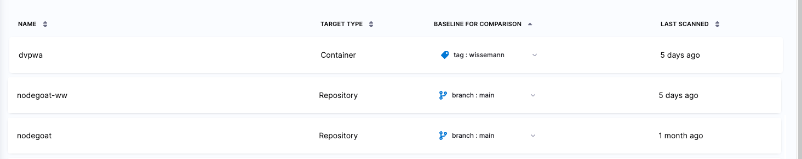

```mdx-code-block
import StoConceptTargets from '../shared/_targets.md';
```

<StoConceptTargets />

<figure>



<figcaption>Test Targets page</figcaption>
</figure>


```mdx-code-block
import StoConceptBaselines from '/docs/security-testing-orchestration/onboard-sto/shared/_baselines.md';
```

<StoConceptBaselines />


```mdx-code-block
import StoWhyDefineBaselines from '/docs/security-testing-orchestration/onboard-sto/shared/_why-define-baselines.md';
```

<StoWhyDefineBaselines />


You can easily identify new vs. common issues in the results for each scan.

<figure>


<figcaption>New and common issues in Security Tests tab</figcaption>
</figure>