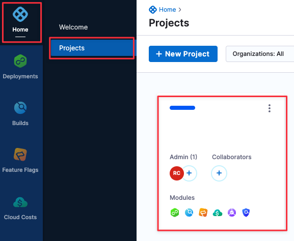

```mdx-code-block
import set_up_harness_19 from './static/set-up-harness-for-sto-19.png'
import set_up_harness_20 from './static/set-up-harness-for-sto-20.png'
import set_up_harness_21 from './static/set-up-harness-for-sto-21.png'
import set_up_harness_22 from './static/set-up-harness-for-sto-22.png'
import set_up_harness_23 from './static/set-up-harness-for-sto-23.png'
import set_up_harness_24 from './static/set-up-harness-for-sto-24.png'
import set_up_harness_25 from './static/set-up-harness-for-sto-25.png'
```

This topic describes the steps you need to do to set up STO in your pipeline.

The entire setup workflow should take about 30 minutes.

## STO Requirements

Make sure you meet the following requirements before you perform [STO Setup Procedures](#sto-setup-procedures) steps described below.

### External Requirements

Before you start setting up Harness, make sure you have the following:

* Git account and Personal Access Token — If you are scanning a repo, you need an account and access token with the Git provider.
* Docker Hub account — STO uses Docker-in-Docker to run scans. The Pipeline needs to pull the **docker:dind** image from Docker Hub.
* [Kubernetes cluster](#install-the-harness-delegate) — Infrastructure for running builds.

### Harness User Requirements

* To set up STO, you need Administrative privileges at the Account level (Account Admin role). It is not enough to have Administrative privileges at the Project level (Project Admin role).
* Developers need a Security Testing Developer role to run tests and view results.
* Security Operations staff need a Security Testing SecOps role to run tests, view results, and approve security exemptions.

### Harness Account Requirements

Harness recommends you create the following resources at the Account level. This enables you to use them across all projects and pipelines in the account.

* Harness delegate — Required to run builds in your Kubernetes infrastructure.
* Secret for Git access credentials — Required to set up a codebase connector.
* Git codebase connector — Required if you want to scan a codebase in your pipeline.
* Docker Hub connector — Required to download images needed to run the pipeline.

### Harness Pipeline Requirements

* To run security scans, the pipeline requires a Background step that runs a Docker-in-Docker service.

## STO Setup Procedures

The following sections describe the workflow for setting up STO. Once you complete this workflow, you'll have the build infrastructure and connectors required to build a pipeline and run security scans. You'll also have an STO-enabled pipeline that you can clone and configure based on your security requirements.

### Add Security Testing roles

Harness includes two RBAC roles specifically for STO users:

* **Developer** role — Permissions needed for developer workflows. These workflows are described in [Tutorial 1](/tutorials/security-tests/standalone-pipeline).
* **SecOps** role — Permissions needed for Security Operations staff. This role includes all Developer permissions and also allows users to approve security exemptions (Ignore rules). These workflows are covered in [Tutorial 2](/tutorials/security-tests/cicd-integrated-pipeline).

:::note
You need Administrative privileges at the Account level (Account Admin role) to assign these roles.
:::

<details>
  <summary>Assign Security Testing Roles: Default Workflow</summary>


1. Click **Account Settings** (left menu) > **Access Control**.
2. In the **Users** table, click the user profile.
3. Under Role Bindings, click **+Role**.
4. Assign the **Security Testing Developer** role or the **Security Testing SecOps** role to the user profile.


</details>

### Install the Harness Delegate

You need a Kubernetes cluster for Harness to use for the Harness Delegate and as the Security Testing Orchestration scanning infrastructure.

<details>
  <summary>Harness Delegate Requirements</summary>

* Number of pods: 3 (two pods for the Harness Delegate, the remaining pod for scanning infrastructure).
* Machine type: 4vCPU.
* Memory: 16GB RAM. The scanning infrastructure and Delegate requirements are low but the remaining memory is for Kubernetes, the Docker container, and other default services.
* Networking: outbound HTTPS for the Harness connection, and to connect to Docker Hub. Allow TCP port 22 for SSH.
* Namespace: when you install the Harness Delegate, it will create the **harness-delegate-ng** namespace. You'll use the same namespace for the scanning infrastructure.
* A Kubernetes service account with permission to create entities in the target namespace is required. The set of permissions should include **list**, **get**, **create**, and **delete permissions**. In general, the **cluster-admin** role or a namespace *admin* permission is enough. For more information, go to [User-Facing Roles](https://kubernetes.io/docs/reference/access-authn-authz/rbac/#user-facing-roles) from Kubernetes.

:::note
Google Kubernetes Engine (GKE) [Autopilot](https://cloud.google.com/kubernetes-engine/docs/concepts/autopilot-overview) is not supported at this time.
:::

</details>

To set up the build infrastructure, you add a connector to your Kubernetes cluster and install a Harness delegate.

<details>
  <summary>Install the Delegate: Default Workflow</summary>

<ol>
	<li>Click <strong>Account Settings</strong> &gt; <strong>Account Resources</strong> &gt; <strong>Connector</strong>, then <strong>New Connector</strong>.</li>
	<li>Under Cloud Providers, choose <strong>Kubernetes cluster</strong>.</li>
	<li>Enter the following settings in the wizard.<ol>
			<li>In Overview, Name = <strong>STO delegate</strong></li>
			<li>In Details, click <strong>Use the credentials of a specific Harness Delegate</strong>.<br/>If you already have a Delegate set up in your Harness account, you can use the <strong>Specify master URL and credentials</strong> option.<br/>This workflow assumes you are new to Harness.</li>
			<li>Delegate setup: Click <strong>Install new Delegate</strong>.</li>
			<li>Delegate type: click <strong>Kubernetes</strong>.</li>
			<li>Kubernetes setup:<br/>You might need to scroll up/down to set all options.<ul>
					<li><strong>Delegate Name:</strong> sto.</li>
					<li><strong>Delegate Size:</strong> Small.</li>
					<li><strong>What installer do you want to use?</strong> Kubernetes</li>
					<li><strong>Delegate permissions:</strong> Install Delegate with cluster-wide read/write access</li>
					<li><strong>Delegate Configurations:</strong> Primary Configuration</li>
					<li><strong>Delegate Tokens:</strong> default_token</li>
				</ul>
			</li>
			<li>Download the YAML file.</li>
			<li>In a terminal, navigate to the location of the file.</li>
			<li>In the same Terminal, log into your cluster and run the following:<br/><code>kubectl apply -f harness-delegate.yml</code><br/>Once you apply the YAML file, you&#39;ll see an output like this:<pre>% kubectl apply -f harness-delegate.yml<br/>namespace/harness-delegate-ng created<br/>clusterrolebinding.rbac.authorization.k8s.io/harness-delegate-ng-cluster-admin created<br/>secret/sto-proxy created<br/>statefulset.apps/sto created<br/>service/delegate-service created</pre>In the Harness Delegate setup, you'll see the Delegate register with Harness. This might take a few minutes.<div class="note-callout">If you encounter errors, ensure your cluster can connect outbound to <strong>app.harness.io</strong>. See <a href="https://developer.harness.io/docs/platform/references/whitelist-harness-domains-and-ips">Allowlist Harness Domains and IPs</a>.</div>
			</li>
		</ol>
	</li>
	<li>Click <strong>Done</strong> to close the delegate wizard and return to the connector setup.</li>
	<li>In <strong>Delegates Setup</strong>, select <strong>Only use Delegates with all of the following tags</strong>, select the new delegate, and then click <strong>Save and Continue</strong>.</li>
	<li>In <strong>Connection Test</strong>, wait for &#34;Verification successful&#34; and then click <strong>Finish</strong>.</li>
</ol>

  
</details>


### Create secrets for your Git and DockerHub access credentials

Harness includes a built-in Secrets Manager that enables you to store encrypted secrets, such as access keys, and use them in your Harness account. Secrets are always stored in encrypted form and are not accessible by Harness. Only the delegate, which runs in your infrastructure, can access them.

In this step, you'll create a secret for your GitHub and DockerHub access tokens. Then you'll use the secret when you set up the connector to your GitHub repo.

<details>
  <summary>Create a Secret for your GitHub Access Token: Default Workflow</summary>

1. In your Github account, a [GitHub Personal Access Token](https://docs.github.com/en/authentication/keeping-your-account-and-data-secure/creating-a-personal-access-token) that has the following scopes:
	* repo
	* admin:repo\_hook
	* user
2. Go to **Account Settings** > **Account Resources** and click **Secrets**.
3. Click **New Secret** > **Text**.

  
  
4. Specify the **Secret Name** and **Secret Value** (your GitHub access token). It's good practice to indicate the scope of the secret in the name, as shown in this example.
    
    
    
5. Repeat this procedure to create a secret for your [DockerHub access token](https://docs.docker.com/docker-hub/access-tokens/).

</details>


### Create a Docker Hub connector

A Docker Hub connector is required to run a Docker-in-Docker service as described in [Set up the Security Tests stage](#set-up-security-tests-stage) below. It is also required for any pipeline that scans or uploads a built image.

<details>
  <summary>Create a Docker Hub Connector: Default Workflow</summary>


1. If you want to upload images to your Docker Hub repo, you'll need an access token. To do this:
	1. Create a token: log in to your Docker Hub account and go to <https://hub.docker.com/settings/security>.
	2. [Create a secret](#create-a-secret) for your token.
2. Go to the **Account Settings** > **Account Resources** page and select **Connectors**.
3. Click **New Connector**. Under Artifact Repositories, click **Docker Registry**.
4. In the connector setup wizard, specify the following:
	1. Docker Registry URL = **https://index.docker.io/v2/**
	2. Provider Type = **DockerHub**
	3. Username = Your Docker Hub username
	4. Password = The secret you created for your Docker Hub access token.
5. In Delegates Setup, select **Use any available Delegate** and then click **Save and Continue**.
6. Wait for "Verification successful" and then click **Finish**.

</details>

### Create a Codebase Connector

You'll need a GitHub Connector to do the [STO Tutorials](/tutorials/security-tests/standalone-pipeline). 

You also need a Git repo connector for any STO pipeline that scans a codebase. You can create connectors for codebases in <!-- [AWS CodeCommit](https://harness.helpdocs.io/article/jed9he2i45), --> [Azure](/docs/platform/Connectors/Cloud-providers/add-a-microsoft-azure-connector), [Bitbucket](/docs/platform/Connectors/Code-Repositories/ref-source-repo-provider/bitbucket-connector-settings-reference), [Git](/docs/platform/Connectors/Code-Repositories/ref-source-repo-provider/git-connector-settings-reference) (platform-agnostic), [GitHub](/docs/platform/Connectors/Code-Repositories/ref-source-repo-provider/git-hub-connector-settings-reference), and [GitLab](/docs/platform/Connectors/Code-Repositories/ref-source-repo-provider/git-lab-connector-settings-reference).

To do the STO tutorials, point the connector at the following repo: <https://github.com/williamwissemann/dvpwa>

<details>
  <summary>Create a Codebase Connector: Default Workflow</summary>

1. Go to the **Account Settings** > **Account Resources** page and click **Connectors**.
2. Under Code Repositories, choose **GitHub**.
3. Specify the following in the setup wizard:
	1. Overview:  
	Name = **GitHub STO tutorial**.
	2. Details:  
	**URL Type:** Repository  
	**Connection Type:** HTTP  
	**GitHub Repository URL:** https://github.com/williamwissemann/dvpwa
	3. Credentials:  
	**Username:** Your GitHub username.  
	**Personal Access Token:** Your [GitHub Personal Access Token secret](#create-secrets-for-your-git-and-dockerhub-access-credentials).  
	**Enable API Access:** Select this checkbox and select the same secret.
	4. Connect to the provider:  
	Click **Connect through Harness Platform**.
4. When you're done, click **Save and Continue**. Harness will test the connection and credentials. Click **Finish**.

</details>

### Create a base pipeline for STO

The following procedure creates a pipeline with the STO functionality required to run scans on your repos, images, and instances. Once you set up this pipeline, you can clone it to a new pipeline and update the pipeline to set up your scans. This workflow is described in [STO Tutorial 1](/tutorials/security-tests/nodejs-firstscan/sto-standalone-workflows.

#### Add a Security Test stage

1. In the Pipeline Studio, click **Home** > **Projects** and choose the project where you want to create the pipeline.

  <!-- import set-up-harness-19 from './static/set-up-harness-for-sto-19.png' -->

  ```mdx-code-block
  
  ```

  <!--   -->
	 
2. Under Modules, choose **Security Tests**.

  ```mdx-code-block
   
  ```
	 
3. In Create New Pipeline:
	1. Click **Pipelines** > **New Pipeline**.
	2. In Create new Pipeline > Name, enter **sto-pipeline-base**.
	3. Click **Start**.
	
  ```mdx-code-block
   
  ```
		 
4. In About your Stage:
	1. Click **Add Stage** and then select **Security Tests**.
	2. Stage Name = **securityTestStage**
	3. Connector = The connector you created in [Create a Codebase Connector](#create-a-codebase-connector).
	4. Click **Set Up Stage**.
	
  ```mdx-code-block
   
  ```


#### Set up the Security Tests stage

1. In the **Overview** tab, under **Shared Paths**, click **Add** and enter the path `/var/run`.

  ```mdx-code-block
   
  ```
	 
2. In the **Infrastructure** tab, specify the following:
	1. The infrastructure where you want your builds to run = **Kubernetes**
	2. Kubernetes Cluster = The delegate you created in [Install the delegate](#install-the-harness-delegate).
	3. Namespace = `harness-delegate-ng`
	4. OS = `Linux`
	
  ```mdx-code-block
   
  ```
		 
#### Add a Docker-in-Docker background service		 

In the **Execution** tab, do the following:

1. Click **Add Step** and then choose **Background**.
2. Configure the Background step as follows:
2. Dependency Name = `dind`
3. Container Registry = The image connector you specified in [Create a Docker Hub connector](#create-a-docker-hub-connector).
4. Image = `docker:dind`
5. Under Optional Configuration, select the **Privileged** checkbox.
   
    ```mdx-code-block
     
    ```

#### Add a Security Step

1. In the Execution tab, click **Add Step** and select **Security**.
2. Configure the step as follows:
	1. Name = **banditScan**
	2. `policy_type` = **`orchestratedScan`**
	3. `scan_type` = **`repository`**
	4. `product_name` = `**bandit**`
	5. `product_config_name` = **`default`**
	6. `repository_branch` = **`<+codebase.branch>`**
	7. `repository_project` = **`dvpwa`**
3. Apply your changes, return to the Stage, and **Save** the pipeline.
  
	

### Run the pipeline (*optional*)

1. Click **Run**.
2. Select Git Branch, enter **master** for the branch name, and then click **Run Pipeline**.
3. When the pipeline finishes, click the **Security Tests** tab to see the dashboard.

### Congratulations!

You now have the build infrastructure, connectors, and pipeline required to build a pipeline and run security scans. You can simply clone the pipeline you just created and configure new pipelines based on your security requirements.


