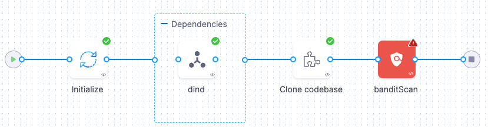
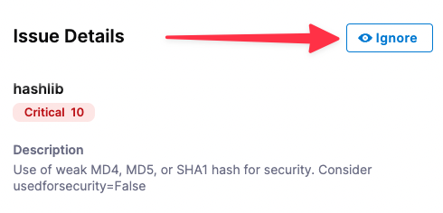
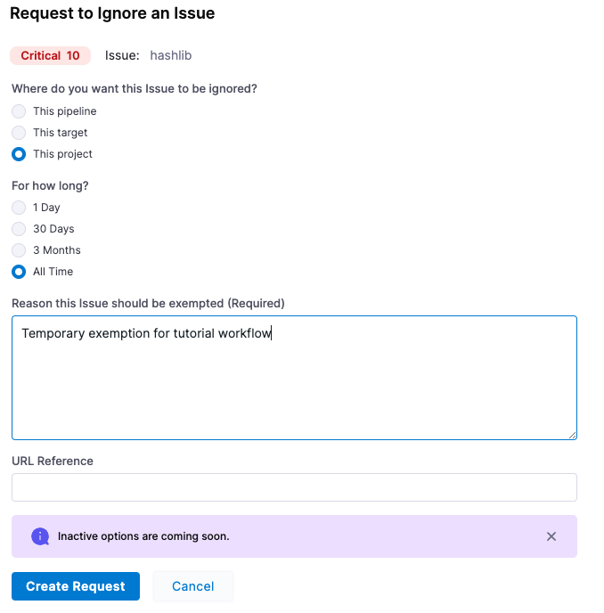
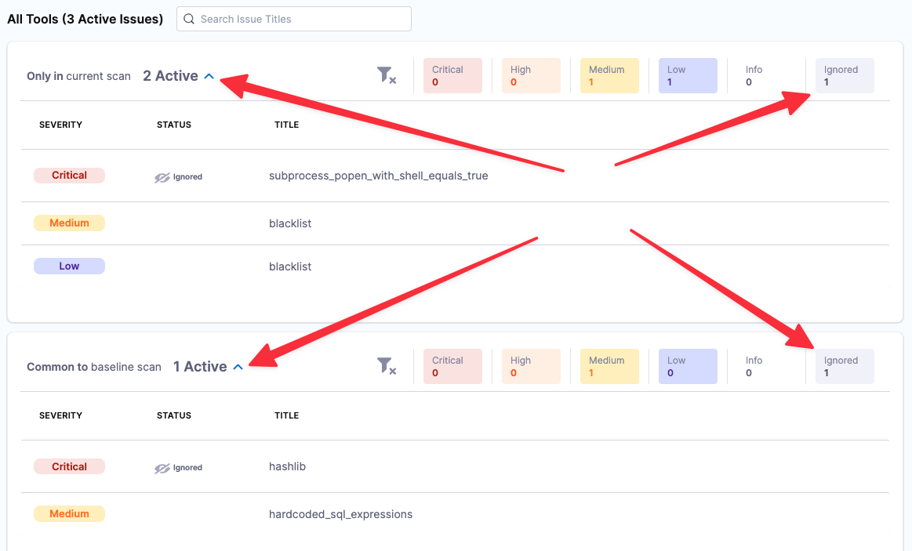
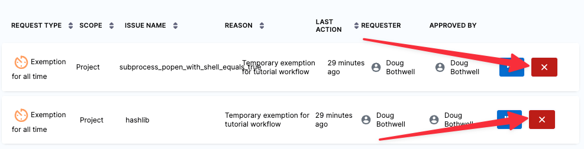
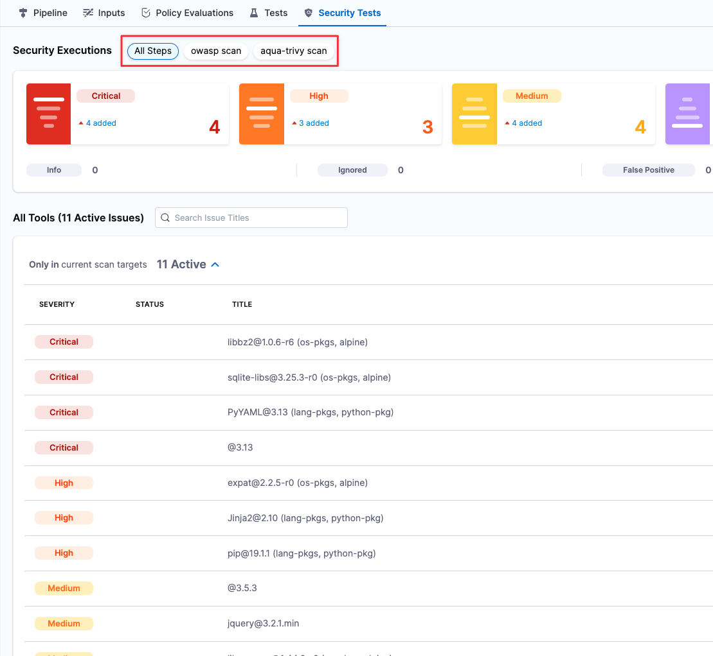

This tutorial builds on the [previous tutorial](tutorial-1-standalone-workflows.md). You need to complete Tutorial 1 first.

The Pipeline you created in Tutorial 1 is an example of a stand-alone STO workflow. It scans a test target and reports on the vulnerabilities, but doesn't do anything else.

In this section, you'll learn how to integrate STO functionality into CI and CD Pipelines. The core benefit of STO in an integrated Pipeline is to fail the Pipeline if a scanner finds any "show-stopper" vulnerabilities. The following sections describe the different failure strategies you can implement.

For the list of supported scanners, see [Security Step Settings Reference](../sto-techref-category/security-step-settings-reference.md).

### Review: Ingestion Workflows

STO supports three different workflows to ingest scan results into a pipeline:

* [Orchestrated workflows](#orchestrated_workflows) — A Security step runs a scan with predefined settings and ingests the results.
* [Ingestion-Only workflows](#ingestion-only-workflows) — Run a scan in a Run step, or outside the pipeline, and save in a shared folder. A Security step then ingests the results.
* [Data-Load workflows](#data-load-workflows) — A Security step downloads and ingests results from an external scanner.

### Fail Pipelines on Severity

**Key Concept: Fail on Severity**  
Every Security Step supports a `fail_on_severity` setting. If any vulnerability with the specified severity or higher is found, the Pipeline fails. It is good practice to include this setting in every Security Step in an integrated Pipeline.

1. In the Pipeline Studio, open the **STO Tutorial 1** pipeline > **SecurityTestStage** stage > **banditScan** step.
2. Under **Settings**, add the following: `fail_on_severity` = `CRITICAL`
3. Click **Apply Changes**, save the updated pipeline, and run a new build with the **DEMO-001** branch.

   

The pipeline now fails because the bandit step is now configured to fail on any vulnerability with a severity of low or higher. The last log message in the bandit step log is:
```
Exited with message: fail_on_severity is set to CRITICAL and that threshold was reached.
```

### Exemptions for Specific Issues

**Key Concept: Issue Exemptions**  
In some cases, developers might want to create "ignore rules" that override the `fail_on_severity` setting. If an issue is marked as Ignored, it will not fail the Pipeline. Developer users cannot create Ignore Rules; only SecOps users have this permission.

Harness provides two pre-defined roles for STO:

* **Developer** role — Permissions needed for developer workflows. These workflows are described in [Tutorial 1](tutorial-1-standalone-workflows.md). A Developer can set up security pipelines, run scans, and view results. A Developer can also request (but not approve) Ignore rules for specific issues.
* **SecOps** role — Permissions needed for Security Operations staff. This role includes all Developer permissions. In addition, SecOps users can approve Ignore rules. These workflows are covered in [Tutorial 2](sto-tutorial-2-integrated-sto-ci-cd-workflows.md).

In this section, you'll create an Ignore rule and approve it as SecOps user. In many real-world scenarios, two separate people will be performing the workflow: a developer creates an Ignore Rule, but the rule isn't active until a SecOps person approves it.

1. Make sure that you have the SecOps role assigned to yourself:
	1. Click **Account Settings** (left menu) > **Access Control**.
	2. In the **Users** table, click your user profile.
	3. Under Role Bindings, click **+Role**.
	4. Make sure that you have the **Security Testing SecOps** role assigned to yourself.
  
     
     
2. Go to the Security Tests page for the build you ran previously: In the Pipeline studio, click **Execution History** (top right) and then click the last successful build you ran before the failed build.  

  In the following step, you will create an Ignore request for each of the two critical issues found: `subprocess_popen_with_shell_equals_true` (only in the current scan) and `haslib` (common to the baseline scan).

3. In the **Security Tests** tab, do the following steps for each of the two critical issues:
	1. Click in the row to open the **Issue Details** pane.
	2. Click the **Ignore** button.
  
     
     
	3. In the **Request to Ignore an Issue** popup, configure the Ignore request as follows:
		1. Where do you want this issue to be ignored? **This pipeline** (*if available*)
		2. For how long? **1 Day** (*if available*)
		3. Reason this issue should be exempted: **Temporary exemption for tutorial workflow**
		4. Click **Create Request**.
    
       
       
4. Click **Security Tests** (left menu) and then **Security Review** (second-from-left menu).
5. In the Security Review page, click the "thumbs-up" buttons to approve both exemptions.

   
   
6. Go back to your pipeline and run another build with the **DEMO-001** branch. When the build finishes, go to the **Security Tests** page.
7. In the issues table (bottom), each section has a set of show/hide buttons for different issue types: Critical, High, Medium. Low, and Info. Note that each section now includes an **Ignored** button. Also note that the ignored issues are hidden by default.

   

8. Click the **Ignored** buttons (right) and the expand/contract buttons (left) so that both ignored issues are visible.

   

9. Go to **Security Tests** > **Security Review**. Then click **Approved** to show the Ignore rules you created and approved.
10. Click the Delete (**X**) buttons on the right to delete both rules.

    

### Next Steps

You've now learned the core STO features and workflows. Here are the next steps you can take.

#### Add More Scanner Steps

STO supports an extensive set of external scanners for repos, images, and artifacts. See [Security Steps Reference](../sto-techref-category/security-step-settings-reference.md).

#### Add Steps or Stages for CI/CD Workflows

You know how to implement Pipelines when scanners detect security issues, and how to create Ignore Rules for specific issues. Once you set up your Security Steps, Baselines, and Ignore Rules, you can add more Stages and Steps to implement your CI/CD workflows.

#### Add Governance Policies

You can use the [Harness Policy Engine](../../platform/14_Policy-as-code/harness-governance-overview.md) to create policies based on the [Open Policy Agent (OPA)](https://www.openpolicyagent.org/) standard. For example, you could create a rule like the following to ensure that all Pipelines include a Security Stage.


```
package pipeline_required  
  
# Deny pipelines that are missing required steps  
deny[sprintf("CI stage '%s' is missing required step '%s'", [stage.name, existing_steps])] {   
     stage = input.pipeline.stages[i].stage                                # Find all stages ...   
     stage.type == "CI"                                                    # ... that are CI Stages  
     existing_steps := [ s | s = stage.spec.execution.steps[_].step.type ] # ... and create a list of all step types in use   
     required_step := required_steps[_]                                    # For each required step ...   
     not contains(existing_steps, required_step)                           # ... check if it's present in the existing steps  
}  
  
# Steps that must be present in every CI Stage - try to create a CI Stage without a Security Step to see the policy fail  
required_steps = ["Security"]  
  
contains(arr, elem) {   
    arr[_] = elem  
}
```
#### Add Failure Strategies to a CI/CD Stage

You can implement [Failure Strategies](../../platform/8_Pipelines/define-a-failure-strategy-on-stages-and-steps.md) to bypass the failure policies in previous Security steps. One use case for this would be to enable manual interventions when a Security Step generates a failure. You could set up a workflow like this:

1. A Build Step is downstream from the Security Step. It has a Failure Strategy that's set to run on [All Errors](../../platform/8_Pipelines/w_pipeline-steps-reference/step-failure-strategy-settings.md#error-types).
2. The scanner detects issues and the Security Step generates an error.
3. The Failure Strategy in the Build Step initiates a 30-minute pause before proceeding.
4. The developer and security team evaluate the issues and then abort the Pipeline or allow it to proceed.

### Integrated STO/CI Workflow Example

The following Pipeline provides a simple example of how you can implement STO into a CI workflow. This is an expanded version of the standalone STO Stage we have been working with. The [YAML](#integrated-workflow-yaml) of this pipeline is provided below.


This Pipeline works as follows:

1. The **owasp scan** step has `fail_on_severity` set to `HIGH`. It scans the **master** branch of the [dvpwa](https://github.com/anxolerd/dvpwa) repo and detects one Critical issue, which results in an error.
2. The **Build Image** step is set up to build (but not push) an image from the dvpwa repo. It has a Failure Strategy that responds to the error from owasp as follows:
	1. Pauses the pipeline and waits for you to choose what to do. You examine the detected issues and decide if you want to proceed.
	2. If you don't choose to proceed after 20 minutes, the pipeline aborts.
3. If you click Proceed, the **Build Image** step builds an image from the repo.
4. The **aqua-trivy** step also has `fail_on_severity` set to `HIGH`. It scans the resulting image, detects issues with high and critical severities and generates an error, which causes the pipeline to fail.

You can view all issues from all scanners in the **Security Tests** tab, and also filter the issue list by scanner.



### Congratulations!

In this tutorial, you learned how to:

1. Add a STO Security stage to your Harness Pipelines.
2. Configure Security steps for different security scanners: one for code scanning and one for container scanning.
3. Run a Pipeline and scan its codebase and the container image.
4. View the normalized and deduplicated security results in the Security dashboard.

### Integrated Workflow YAML

Here's the YAML of the integrated workflow example we examined in this tutorial.

<details>
  <summary>Integrated Workflow YAML</summary>


```
pipeline:  
    name: quickstart-integrated-pipeline  
    identifier: quickstartintegratedpipeline  
    projectIdentifier: STO  
    orgIdentifier: default  
    tags: {}  
    properties:  
        ci:  
            codebase:  
                connectorRef: $CODEBASE_CONNECTOR  
                build: <+input>  
    stages:  
        - stage:  
              name: Docker Build and Scan  
              identifier: Docker_Build_and_Scan  
              type: CI  
              spec:  
                  cloneCodebase: true  
                  infrastructure:  
                      type: KubernetesDirect  
                      spec:  
                          connectorRef: $K8S_CONNECTOR  
                          namespace: harness-delegate-ng  
                          automountServiceAccountToken: true  
                          nodeSelector: {}  
                          os: Linux  
                  sharedPaths:  
                      - /var/run  
                  serviceDependencies:  
                      - identifier: dind  
                        name: dind  
                        type: Service  
                        spec:  
                            connectorRef: $DOCKER_CONNECTOR  
                            image: docker:dind  
                            privileged: true  
                            entrypoint:  
                                - dockerd-entrypoint.sh  
                  execution:  
                      steps:  
                          - step:  
                                type: Security  
                                name: owasp scan  
                                identifier: owasp_scan  
                                spec:  
                                    privileged: true  
                                    settings:  
                                        policy_type: orchestratedScan  
                                        scan_type: repository  
                                        repository_project: nodegoat  
                                        repository_branch: <+codebase.branch>  
                                        product_name: owasp  
                                        product_config_name: default  
                                        fail_on_severity: HIGH  
                                    imagePullPolicy: Always  
                                failureStrategies:  
                                    - onFailure:  
                                          errors:  
                                              - AllErrors  
                                          action:  
                                              type: Ignore  
                          - step:  
                                type: Run  
                                name: Build Image  
                                identifier: Build_Docker_Image  
                                spec:  
                                    connectorRef: $DOCKER_CONNECTOR  
                                    image: docker:latest  
                                    shell: Sh  
                                    command: |-  
                                        docker build .  -f Dockerfile.app -t nodegoat:local  
                                    privileged: true  
                                when:  
                                    stageStatus: All  
                                failureStrategies:  
                                    - onFailure:  
                                          errors:  
                                              - AllErrors  
                                          action:  
                                              type: ManualIntervention  
                                              spec:  
                                                  timeout: 20m  
                                                  onTimeout:  
                                                      action:  
                                                          type: Abort  
                          - step:  
                                type: Security  
                                name: aqua-trivy scan  
                                identifier: aqua_trivy_scan  
                                spec:  
                                    privileged: true  
                                    settings:  
                                        product_name: aqua-trivy  
                                        product_config_name: aqua-trivy  
                                        policy_type: orchestratedScan  
                                        scan_type: container  
                                        container_type: local_image  
                                        container_domain: docker.io  
                                        container_project: nodegoat  
                                        container_tag: local  
                                        fail_on_severity: HIGH  
                                    imagePullPolicy: Always  
                                failureStrategies: []  

```
</details>


### See Also

* [STO Ingestion Workflows](../use-sto/sto-workflows-overview.md)
* [Run an Orchestrated Scan in an STO Pipeline](../use-sto/run-an-orchestrated-scan-in-sto.md)
* [Ingest Scan Results into an STO Pipeline](../use-sto/run-an-orchestrated-scan-in-sto.md)
* [Security Step Settings Reference](../sto-techref-category/security-step-settings-reference.md)

