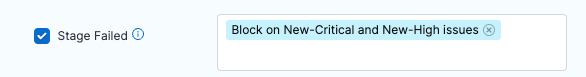

You can use [Harness Policy as Code](/docs/platform/governance/policy-as-code/harness-governance-overview) to write and enforce policies against your [security tests](/docs/security-testing-orchestration/dashboards/view-scan-results), and to stop your pipelines if a security test has any issues that violate those policies. 

You can use Harness Policy as Code to enforce policies such as:

- A security test cannot include any issues in a list of severities such as Critical or New Critical.

- A security test cannot include any issues for CVEs past a certain age, for example no critical-severity CVEs more than three years old.

- A security test cannot include any issues in a list of titles such as `libsqlite3` or `javascript.express.security.audit`.

- A security test cannot include any more than 75 occurrences of TAR-related issues (issue title matches regex `".*tar.*"`). 

- A security test cannot include any issues in a list of reference IDs such as CWE-78 or CVE-2023-52138.

## Important notes

- This topic assumes that you have a basic knowledge of the following:

  - Governance policies and how to implement them: 
    - [Harness Policy as Code overview](/docs/platform/governance/policy-as-code/harness-governance-overview)
    - [Harness Policy As Code quickstart](/docs/platform/governance/policy-as-code/harness-governance-quickstart)
    - [Open Policy Agent (OPA)](https://www.openpolicyagent.org/)
  - [Severity scores and levels in STO](/docs/security-testing-orchestration/get-started/key-concepts/severities)


## Security Test policy samples

import SecurityTestsPolicySamples from '/docs/security-testing-orchestration/use-sto/shared/security-tests-policy-samples.md';

<SecurityTestsPolicySamples />


## Workflow description

The following steps describes the end-to-end workflow:

1. [Create your policies](#create-a-new-security-tests-opa-policy) using [Security test policy samples](#security-tests-policy-samples).

2. Create a [policy set](#create-a-policy-set) with the policies you want to enforce.

3. [Enforce the policy set](#enforce-the-policy-in-your-scan-step) in your scan step.


### Create a new Security Tests OPA policy

1. You can create policies at the account or the project scope. Go to your account or project, then select **Security and Governance** > **Policies**.

2. Select **Policies** (top right) and then **New Policy**. 

3. Select a **Security Tests** policy from the [**Policy samples**](#security-tests-policy-samples) library. 

   <DocImage path={require('./static/opa-01-select-policy-sample.png')} width="50%" height="50%" title="Select policy sample" />

4. Select **Use this sample** (bottom). This copies the entire policy sample to the edit pane (left).

   <DocImage path={require('./static/opa-02-use-this-sample.png')} width="50%" height="50%" title="Select policy sample" />

5. Configure the policy as needed. In this example, the policy excludes vulnerabilities with a severity of Critical. 

   <DocImage path={require('./static/opa-03-configure-policy.png')} width="50%" height="50%" title="Select policy sample" />

6. Test your policy to verify that it works as intended.

   Each policy sample includes a set of test data that you can use. In the **Testing Terminal**, examine the test data and edit it as needed. Then click **Test** to verify the results.

   It is good practice to test both a Success and Failure case for your policy. The following example illustrates this workflow.

   In this example, the policy denies on reference ID CWE-1230. In this case, you would do the following:

   1. Search the test results for the string `1230`. In this case, the ID is not found. 

       <DocImage path={require('./static/opa-05-test-policy-search-for-id.png')} width="50%" height="50%" title="Select policy sample" />

   2. Click **Test**. The test succeeds.

       <DocImage path={require('./static/opa-06-test-policy-succeeded.png')} width="50%" height="50%" title="Select policy sample" />

   3. Search the test results for the string `cwe` and edit an entry so it matches the reference ID.

       <DocImage path={require('./static/opa-07-edit-test-data-for-matching-cwe.png')} width="50%" height="50%" title="Select policy sample" />

   4. Click **Test** again. The test fails because the data includes the specified CWE.

       <DocImage path={require('./static/opa-08-test-failed.png')} width="50%" height="50%" title="Select policy sample" />

7. Once you're satisfied that the policy works as intended, save it.


### Create a policy set

A [policy set](/docs/platform/governance/policy-as-code/harness-governance-overview#harness-policy-set) is a collection of one or more policies. You combine policies into a set and then include it in a scan step. 

1. Go to **Security and Governance** > **Policies**. Then click **Policy Sets** (top right) and then **New Policy Set**. 

2. Click **New Policy Set**. The Policy Set wizard appears.

3. Overview:

    1. Name — Enter a descriptive name such as **myorg/myimage policies**.

    2. Entity type this policy applies to = **Security Tests**

    3. On what event should the policy be set to = **On Step** 
   
       These settings allow you to apply the member policies to a specific step, which you'll define below. 

4. Policy evaluation criteria: 
 
   1. Click **Add Policy**.
    
   2. Select the policy you just created and set the pull-down to **Error and Exit**. This is the action to take if any policies in the set are violated. 

      <DocImage path={require('./static/opa-09-add-policy-to-policy-set.png')} width="50%" height="50%" title="Select policy sample" />

   3. Click **Apply** to add the policy to the set, then **Finish** to close the Policy Set wizard.

5. :exclamation: In the **Policy Sets** page, enable  **Enforced** for your new policy set.
   
      <DocImage path={require('./static/opa-10-enable-enforced.png')} width="50%" height="50%" title="Select policy sample" />


### Enforce the policy in your scan step

Now you can set up your scan step to stop builds automatically when the policy gets violated. 

1. Go to the scan step and click **Advanced**. 

2. Under **Policy Enforcement**, click **Add/Modify Policy Set** and add the policy set you just created.

3. Click **Apply Changes** and then save the updated pipeline. 

   <DocImage path={require('./static/opa-11-add-policy-set-to-scan-step.png')} width="50%" height="50%" title="Select policy sample" />


### Set up email notifications for pipeline failures

You have a Policy that fails the pipeline based on an OPA policy. Now you can configure the stage to send an email notification automatically whenever the pipeline fails. 

1. Click **Notifications** (right-side menu). The New Notification wizard appears.

2. Set up the notification as follows:

     1. Overview page —  Enter a notification name such as **Pipeline failed -- NEW_CRITICAL or NEW_HIGH issues detected**.

     2. Pipeline Events page  —  Select **Stage Failed** for the event that triggers the notification. Then select the stage that has the Policy step you just created.

        

     3. Notification Method page  — Specify **Email** for the method and specify the recipient emails. 


## YAML pipeline example

The following pipeline that can generate two different notifications. If the code scan detects any CRITICAL or NEW_CRITICAL issues, it sends an automated email like this:

```
"STO scan of sto-notification-example found the following issues:
Critical : 1
New Critical : 0
High: 0
New High: 0
Medium: 0
New Medium: 0
See https://app.harness.io/ng/#/account/XXXXXXXXXXXXXXXXXXXXXX/sto/orgs/default/"
```

If the scan finds any NEW_CRITICAL or NEW_HIGH issues, it stops the pipeline execution and sends an email like this: 

```
Stage Block_on_New_Critical_and_New_High_issues failed in pipeline stonotifyexample_-_v3
triggered by D*** B******
Started on Fri Apr 07 14:53:34 GMT 2023 and StageFailed on Fri Apr 07 14:53:36 GMT 2023
Execution URL  https://app.harness.io/ng/#/account/XXXXXXXXXXXXXXXXXXXXXX/sto/orgs/default/projects/myProject/pipelines/stonotifyexample_-_v3/executions/XXXXXXXXXXXXXXXXXXXXXX/pipeline
2s
```

Here's the full pipeline. Note that the policy and policy set are referenced, but not defined, in the pipeline itself.

```yaml
pipeline:
  name: sto-notification-example
  identifier: stonotifyexample
  projectIdentifier: default
  orgIdentifier: default
  tags: {}
  properties:
    ci:
      codebase:
        connectorRef: YOUR_CODE_REPO_CONNECTOR_ID
        build: <+input>
  stages:
    - stage:
        name: banditScanStage
        identifier: banditScanStage
        description: ""
        type: SecurityTests
        spec:
          cloneCodebase: true
          execution:
            steps:
              - step:
                  type: Bandit
                  name: Bandit_1
                  identifier: Bandit_1
                  spec:
                    mode: orchestration
                    config: default
                    target:
                      name: dvpwaScanStep-v3
                      type: repository
                      variant: <+codebase.branch>
                    advanced:
                      log:
                        level: info
          infrastructure:
            type: KubernetesDirect
            spec:
              connectorRef: YOUR_KUBERNETES_CLUSTER_CONNECTOR_ID
              namespace: YOUR_NAMESPACE
              automountServiceAccountToken: true
              nodeSelector: {}
              os: Linux
    - stage:
        name: Block on New-Critical and New-High issues
        identifier: Block_on_New_Critical_and_New_High_issues
        description: ""
        type: Custom
        spec:
          execution:
            steps:
              - step:
                  type: Email
                  name: emailOnNotification
                  identifier: Email_1
                  spec:
                    to: john.smithh@myorg.org
                    cc: ""
                    subject: "STO ALERT: Critical issues found in <+pipeline.name>"
                    body: |-
                      "STO scan of <+pipeline.name> found the following issues: <br> 
                       Critical : <+pipeline.stages.banditScanStage.spec.execution.steps.Bandit_1.output.outputVariables.CRITICAL> <br>
                       New Critical : <+pipeline.stages.banditScanStage.spec.execution.steps.Bandit_1.output.outputVariables.NEW_CRITICAL> <br>
                       High: <+pipeline.stages.banditScanStage.spec.execution.steps.Bandit_1.output.outputVariables.HIGH> &#10; <br>
                       New High: <+pipeline.stages.banditScanStage.spec.execution.steps.Bandit_1.output.outputVariables.NEW_HIGH> <br>
                       Medium: <+pipeline.stages.banditScanStage.spec.execution.steps.Bandit_1.output.outputVariables.MEDIUM> <br>
                       New Medium: <+pipeline.stages.banditScanStage.spec.execution.steps.Bandit_1.output.outputVariables.NEW_MEDIUM>  <br>
                       See https://app.harness.io/ng/#/account/MY_ACCOUNT_ID/sto/orgs/default/"
                  timeout: 1d
                  when:
                    stageStatus: All
                    condition: <+pipeline.stages.banditScanStage.spec.execution.steps.Bandit_1.output.outputVariables.NEW_CRITICAL> > 0 || <+pipeline.stages.banditScanStage.spec.execution.steps.Bandit_1.output.outputVariables.CRITICAL> > 0
              - step:
                  type: Policy
                  name: Policy_1
                  identifier: Policy_1
                  spec:
                    policySets:
                      - account.Security_Set_Block_on_Issue_Severity
                    type: Custom
                    policySpec:
                      payload: |-
                        {
                        "NEW_CRITICAL": <+pipeline.stages.banditScanStage.spec.execution.steps.Bandit_1.output.outputVariables.NEW_CRITICAL>, 
                        "NEW_HIGH": <+pipeline.stages.banditScanStage.spec.execution.steps.Bandit_1.output.outputVariables.NEW_HIGH>
                        }
                  timeout: 10m
                  failureStrategies: []
        tags: {}
  notificationRules:
    - name: example sto test
      identifier: example_sto_test
      pipelineEvents:
        - type: StageFailed
          forStages:
            - Block_on_Critical_and_High_issues
      notificationMethod:
        type: Email
        spec:
          userGroups: []
          recipients:
            - john.smithh@myorg.org
      enabled: true

```
