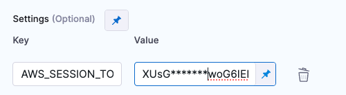

<DocsTag  text="Artifact scanners" backgroundColor= "#cbe2f9" textColor="#0b5cad" link="/docs/security-testing-orchestration/sto-techref-category/security-step-settings-reference#artifact-scanners"  />
<DocsTag  text="Extraction" backgroundColor= "#e3cbf9" textColor="#5c0bad" link="/docs/security-testing-orchestration/get-started/key-concepts/extraction-scans" />
 
 

You can scan your container images and extract scan results from [Amazon Elastic Container Registry (ECR)](https://docs.aws.amazon.com/AmazonECR/latest/userguide/what-is-ecr.html). 

## Important notes for running AWS ECR scans in STO

- You need to run the scan step with root access if either of the following apply:

  - You need to run a [Docker-in-Docker background service](/docs/security-testing-orchestration/sto-techref-category/security-step-settings-reference/#configuring-docker-in-docker-dind-for-your-pipeline).

  - You need to add trusted certificates to your scan images at runtime. 

- You can set up your STO scan images and pipelines to run scans as non-root and establish trust for your own proxies using custom certificates. For more information, go to [Configure STO to Download Images from a Private Registry](/docs/security-testing-orchestration/use-sto/set-up-sto-pipelines/download-images-from-private-registry).

import StoMoreInfo from '/docs/security-testing-orchestration/sto-techref-category/shared/_more-information.md';

<StoMoreInfo />

## AWS ECR step settings for STO scans

The recommended workflow is to add an AWS ECR step to a Security or Build stage and then configure it as described below.  

### Scan

#### Scan Mode

import StoSettingScanModeDataLoad from './shared/step_palette/scan/mode/_extraction.md';
import StoSettingScanModeIngest from './shared/step_palette/scan/mode/_ingestion.md';

<!-- StoSettingScanMode / -->
<StoSettingScanModeDataLoad />
<!-- StoSettingScanModeIngest / -->

#### Scan Configuration

import StoSettingProductConfigName from './shared/step_palette/scan/_config-name.md';

<StoSettingProductConfigName />

### Target

#### Type

import StoSettingScanTypeCont from './shared/step_palette/target/type/_image.md';

<StoSettingScanTypeCont />

#### Target and Variant Detection  

import StoSettingScanTypeAutodetectContainer from './shared/step_palette/target/auto-detect/_container-image.md';
import StoSettingScanTypeAutodetectNote from './shared/step_palette/target/auto-detect/_note.md';

<StoSettingScanTypeAutodetectContainer/>
<StoSettingScanTypeAutodetectNote/>

#### Name 

import StoSettingTargetName from './shared/step_palette/target/_name.md';

<StoSettingTargetName />

#### Variant

import StoSettingTargetVariant from './shared/step_palette/target/_variant.md';

<StoSettingTargetVariant  />

### Container image

#### Type  (_orchestration_)

import StoSettingImageType from './shared/step_palette/image/_type.md';

<StoSettingImageType />

#### Domain (_extraction_)

import StoSettingImageDomain from './shared/step_palette/image/_domain.md';

<StoSettingImageDomain />

#### Name

import StoSettingImageName from './shared/step_palette/image/_name.md';

<StoSettingImageName />

#### Tag

import StoSettingImageTag from './shared/step_palette/image/_tag.md';

<StoSettingImageTag />

#### Region  

import StoSettingImageRegion from './shared/step_palette/image/_region.md';

<StoSettingImageRegion />

### Authentication

#### Access ID (_orchestration_)

import StoSettingAuthAccessID from './shared/step_palette/auth/_access-id.md';

<StoSettingAuthAccessID />

#### Access Token

import StoSettingAuthAccessToken from './shared/step_palette/auth/_access-token.md';

<StoSettingAuthAccessToken />

#### Session Token

If you need to specify a session token, add it using the key `AWS_SESSION_TOKEN` under **Settings**.

#### Access Region

The AWS region of the image to scan. 

<!-- 
### Ingestion

#### Ingestion File

import StoSettingIngestionFile from './shared/step_palette/ingest/_file.md';

<StoSettingIngestionFile  />

-->

### Log Level

import StoSettingLogLevel from './shared/step_palette/all/_log-level.md';

<StoSettingLogLevel />

### Fail on Severity

import StoSettingFailOnSeverity from './shared/step_palette/all/_fail-on-severity.md';

<StoSettingFailOnSeverity />

### Additional Configuration

import ScannerRefAdditionalConfigs from './shared/_additional-config.md';

<ScannerRefAdditionalConfigs />

### Advanced settings

import ScannerRefAdvancedSettings from './shared/_advanced-settings.md';

<ScannerRefAdvancedSettings />

## Proxy settings

import ProxySettings from '/docs/security-testing-orchestration/sto-techref-category/shared/proxy-settings.md';

<ProxySettings />