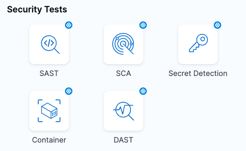

Use this step to add a Zed Attack Proxy (ZAP) scan to detect vulnerabilities in your application instances. A built-in step enables you to add scans quickly and with minimal configuration. These steps use scanners that are free to STO users and are ready to run as soon as you add them to your pipeline.

:::note notes

- This step is currently behind the feature flag `STO_ONE_CLICK`. Contact [Harness Support](mailto:support@harness.io) to enable it.

- Currently only [Zed Attack Proxy (ZAP)](/docs/security-testing-orchestration/sto-techref-category/zap-scanner-reference) scans are available for this step. 

- You must specify the [application domain](/docs/security-testing-orchestration/sto-techref-category/zap-scanner-reference#domain) that you want to scan before you can add the step.

- The step detects your [target and variant](/docs/security-testing-orchestration/sto-techref-category/zap-scanner-reference#target-and-variant-detectionn) automatically.

- All other settings such as **Log Level** and **Fail on Severity** are set to their defaults. 

- You can configure the ZAP step after you add it to your pipeline, but this is optional. 

:::