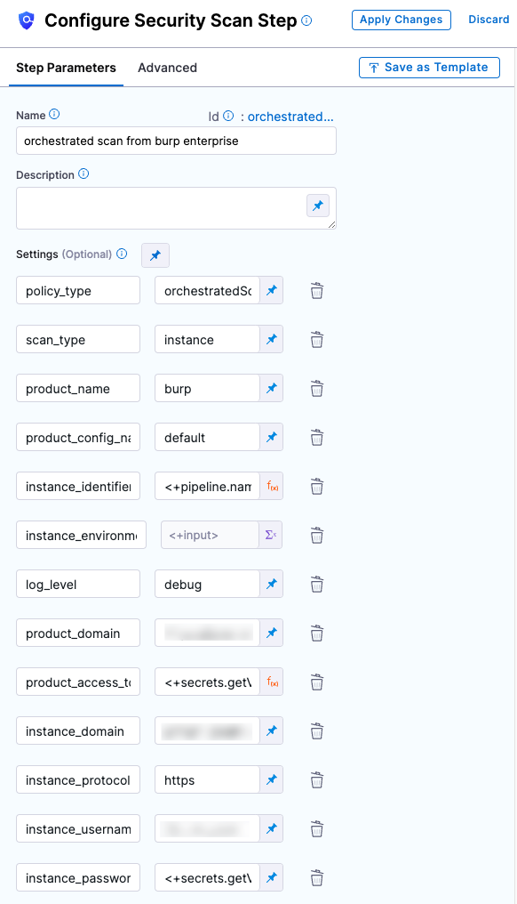
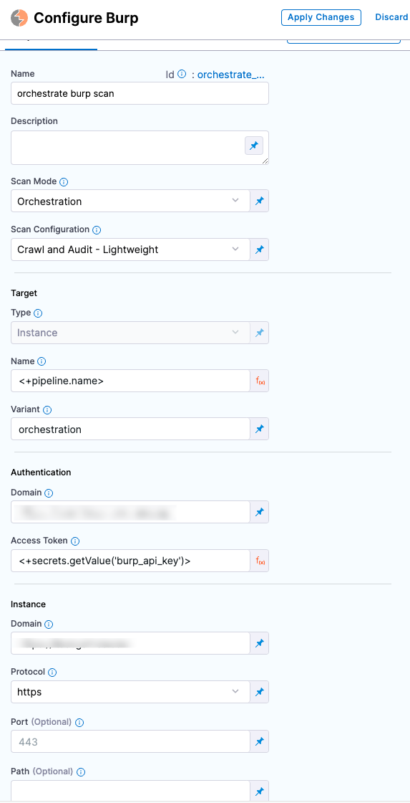

You can scan your application instances automatically using [Burp Enterprise](https://portswigger.net/burp/enterprise). 

To set up a Burp scan:

1. Create a CI Build or Security Tests stage,
2. Add a [Burp](#burp-step-configuration) or a [Security](#security-step-settings-deprecated)
3. Configure the step as specified in the following sections. 

<details><summary>Burp scan configuration in Security step</summary>



</details>

## Before you begin


### Root access requirements 

```mdx-code-block
import StoRootRequirements from '/docs/security-testing-orchestration/sto-techref-category/shared/root-access-requirements.md';
```

<StoRootRequirements />

## Burp step configuration

:::note
Currently, this feature is behind the Feature Flag `STO_STEP_PALETTE_BURP_ENTERPRISE`. Contact [Harness Support](mailto:support@harness.io) to enable the feature.
:::

<details><summary>Orchestrated scan in a Burp scanner template</summary>



</details>

### Scan settings

#### Scan Mode

```mdx-code-block
import StoSettingScanMode from './shared/step_palette/_sto-ref-ui-scan-mode.md';
import StoSettingScanModeOrch from './shared/step_palette/_sto-ref-ui-scan-mode-00-orchestrated.md';
import StoSettingScanModeIngest from './shared/step_palette/_sto-ref-ui-scan-mode-02-ingestonly.md';
```

<StoSettingScanMode />
<StoSettingScanModeOrch />
<StoSettingScanModeIngest />

<a name="scan-config"></a>

#### Scan Configuration

```mdx-code-block
import StoSettingProductConfigName from './shared/step_palette/_sto-ref-ui-product-config-name.md';
```

<StoSettingProductConfigName />

The following configurations are available for Orchestrated scans. These are [built-in configurations](https://portswigger.net/burp/documentation/scanner/scan-configurations/burp-scanner-built-in-configs) provided by Burp Enterprise.  
-  `Default` This is the same as the `Crawl and Audit - Lightweight` built-in configuration.
-  `Never stop Crawl due to application errors`
-  `Never stop audit due to application errors`
-  `Minimize false positives`
-  `Minimize false negatives`
-  `Crawl strategy most complete`
-  `Crawl strategy more complete`
-  `Crawl strategy fastest`
-  `Crawl strategy faster`
-  `Crawl limit 60 minutes`
-  `Crawl limit 30 minutes`
-  `Crawl limit 10 minutes`
-  `Crawl and audit lightweight`
-  `Crawl and audit fast`
-  `Crawl and audit deep`
-  `Crawl and audit balanced`
-  `Audit coverage thorough`
-  `Audit coverage maximum`
-  `Audit checks medium active`
-  `Audit checks light active`
-  `Audit checks critical issues only`
-  `Audit checks all except time based detection methods`
-  `Audit checks all except java script analysis`

### Target settings

:::note

Make sure that you give unique, descriptive names for the target and variant. This makes navigating your scan results in the STO UI much easier. 

:::

##### Type

```mdx-code-block
import StoSettingScanTypeInst     from './shared/step_palette/_sto-ref-ui-scan-type-02-instance.md';
```

<a name="scan-type"></a>
<StoSettingScanTypeInst />

<a name="target-name"></a>

#### Name 

```mdx-code-block
import StoSettingProductID from './shared/step_palette/_sto-ref-ui-prod-id.md';
```

<StoSettingProductID />

<a name="target-variant"></a>

#### Variant

```mdx-code-block
import StoSettingTargetVariant from './shared/step_palette/_sto-ref-ui-target-variant.md';
```

<StoSettingTargetVariant  />

:::note

Make sure that you give unique, descriptive names for the target and variant. This makes navigating your scan results in the STO UI much easier. 

:::


### Authentication settings

#### Domain 

Domain of the application instance to scan. Example: `https://myapp.io/portal/us`

#### Access Token

The access token used to log in to a specific product in the scanner. This is required for some scans. In most cases, this is a password or an API key. 

You should create a Harness text secret with your encrypted token and reference the secret using the format `<+secrets.getValue("project.container-access-id")>`. For more information, go to [Add and Reference Text Secrets](/docs/platform/Secrets/add-use-text-secrets).

### Scan Tool

Use this setting to specify a specific scan to ingest. If this is not specified, the pipeline ingests the most recent scan. 

### Instance settings

<!-- ============================================================================= -->
<a name="instance-domain"></a>

#### Domain

```mdx-code-block
import StoSettingInstanceDomain from './shared/step_palette/_sto-ref-ui-instance-domain.md';
```
<StoSettingInstanceDomain />

<!-- ============================================================================= -->
<a name="instance-protocol"></a>

#### Protocol

```mdx-code-block
import StoSettingInstanceProtocol from './shared/step_palette/_sto-ref-ui-instance-protocol.md';
```

<StoSettingInstanceProtocol />

<!-- ============================================================================= -->
<a name="instance-port"></a>

#### Port

```mdx-code-block
import StoSettingInstancePort from './shared/step_palette/_sto-ref-ui-instance-port.md';
```

<StoSettingInstancePort />

<!-- ============================================================================= -->
<a name="instance-path"></a>

#### Path

```mdx-code-block
import StoSettingInstancePath from './shared/step_palette/_sto-ref-ui-instance-path.md';
```

<StoSettingInstancePath />

#### Username

Username to log in to the instance you want to scan.


#### Password

The access token to log in to the instance you want to scan. In most cases, this is a password or an API key. 

You should create a Harness text secret with your encrypted token and reference the secret using the format `<+secrets.getValue("project.container-access-id")>`. For more information, go to [Add and Reference Text Secrets](/docs/platform/Secrets/add-use-text-secrets).


### Ingestion File

```mdx-code-block
import StoSettingIngestionFile from './shared/step_palette/_sto-ref-ui-ingestion-file.md';
```

<StoSettingIngestionFile  />

## Security step settings (_deprecated_)

#### Docker-in-Docker requirements

```mdx-code-block
import StoDinDRequirements from '/docs/security-testing-orchestration/sto-techref-category/shared/dind-bg-step.md';
```

<StoDinDRequirements />


#### Target and variant

```mdx-code-block
import StoLegacyTargetAndVariant  from './shared/legacy/_sto-ref-legacy-target-and-variant.md';
```

<StoLegacyTargetAndVariant />

#### Burp scan settings

* `product_name` = `burp`
* [`scan_type`](/docs/security-testing-orchestration/sto-techref-category/security-step-settings-reference#scanner-categories) = `instance`
* [`policy_type`](/docs/security-testing-orchestration/sto-techref-category/security-step-settings-reference#data-ingestion-methods) = `orchestratedScan`, `dataLoad`, or `ingestionOnly`
* `product_config_name`
	+ The following configurations are available. These are [built-in configurations](https://portswigger.net/burp/documentation/scanner/scan-configurations/burp-scanner-built-in-configs) provided by Burp Enterprise.  
	    -  `default` This is the same as the `Crawl and Audit - Lightweight` built-in configuration.
		-  `never-stop-crawl-due-to-application-errors`
		-  `never-stop-audit-due-to-application-errors`
		-  `minimize-false-positives`
		-  `minimize-false-negatives`
		-  `crawl-strategy-most-complete`
		-  `crawl-strategy-more-complete`
		-  `crawl-strategy-fastest`
		-  `crawl-strategy-faster`
		-  `crawl-limit-60-minutes`
		-  `crawl-limit-30-minutes`
		-  `crawl-limit-10-minutes`
		-  `crawl-and-audit-lightweight`
		-  `crawl-and-audit-fast`
		-  `crawl-and-audit-deep`
		-  `crawl-and-audit-balanced`
		-  `audit-coverage-thorough`
		-  `audit-coverage-maximum`
		-  `audit-checks-medium-active`
		-  `audit-checks-light-active`
		-  `audit-checks-critical-issues-only`
		-  `audit-checks-all-except-time-based-detection-methods`
		-  `audit-checks-all-except-java-script-analysis`
* `fail_on_severity` - See [Fail on Severity](#fail-on-severity).


#### Instance scan settings

```mdx-code-block
import StoLegacyInstance from './shared/legacy/_sto-ref-legacy-instance.md';
```

<StoLegacyInstance />

#### Orchestration scan settings

```mdx-code-block
import StoLegacyOrch from './shared/legacy/_sto-ref-legacy-orchestrated.md';
```

<StoLegacyOrch />

#### Dataload scan settings

The following settings are required for Security steps where the `policy_type` is `dataLoad`.

* `product_site_id` The Burp enterprise site identifier.

* `product_domain` Domain of the application instance to scan. Example: `https://myapp.io/portal/us`

   You need to specify either the `product_site_id` or the `product_domain`.

*  `product_scan_id` Use this setting to specify a specific scan to ingest. If this is not specified, the pipeline will ingest the most recent scan. 

* `product_access_token` The access token used to log in to a specific product in the scanner. This is required for some scans. In most cases this is a password or an API key. 

  You should create a Harness text secret with your encrypted token and reference the secret using the format `<+secrets.getValue("project.container-access-id")>`. For more information, go to [Add and Reference Text Secrets](/docs/platform/Secrets/add-use-text-secrets).

#### Ingestion file

```mdx-code-block
import StoLegacyIngest from './shared/legacy/_sto-ref-legacy-ingest.md';
```

<StoLegacyIngest />

#### Fail on Severity

```mdx-code-block
import StoSettingFailOnSeverity from './shared/step_palette/_sto-ref-ui-fail-on-severity.md';
```
<StoSettingFailOnSeverity />
