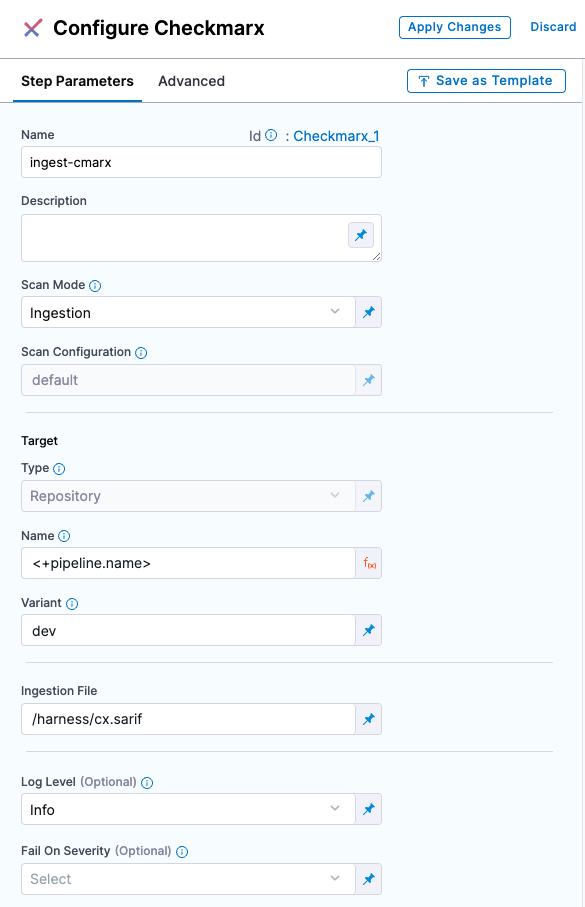
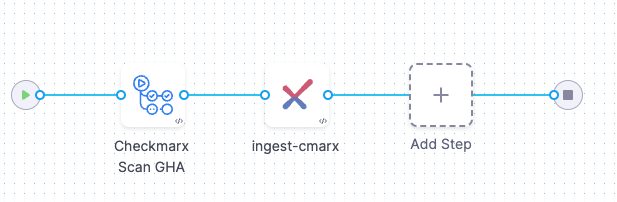

You can scan your repositories using Checkmarx. Harness STO supports the following workflows:
* Ingestion workflows for all Checkmarx One services (including SAST and SCA) that can publish scan results in SARIF format.
* Orchestration, Extraction, and Ingestion workflows for Checkmarx SAST and Checkmarx SCA scans.

## Before you begin

### Docker-in-Docker requirements

```mdx-code-block
import StoDinDRequirements from '/docs/security-testing-orchestration/sto-techref-category/shared/dind-bg-step.md';
```

<StoDinDRequirements />

### Root access requirements

```mdx-code-block
import StoRootRequirements from '/docs/security-testing-orchestration/sto-techref-category/shared/root-access-requirements.md';
```

<StoRootRequirements />

## Checkmarx step configuration

The recommended workflow is add a Checkmarx step to a Security Tests or CI Build stage and then configure it as described below. You can also configure Checkmarx scans programmatically by copying, pasting, and editing the [YAML definition](#yaml-configuration). 


```mdx-code-block
import StoScannerStepNotes from './shared/step_palette/_sto-palette-notes.md';
```

<StoScannerStepNotes />

<details>
    <summary>Scanner Template example</summary>

 

</details>

### Scan settings


<a name="scan-mode"></a>

#### Scan Mode

```mdx-code-block
import StoSettingScanMode from './shared/step_palette/_sto-ref-ui-scan-mode.md';
import StoSettingScanModeOrch from './shared/step_palette//_sto-ref-ui-scan-mode-00-orchestrated.md';
import StoSettingScanModeData from './shared/step_palette/_sto-ref-ui-scan-mode-01-dataload.md';
import StoSettingScanModeIngest from './shared/step_palette/_sto-ref-ui-scan-mode-02-ingestonly.md';
```

<StoSettingScanMode />
<StoSettingScanModeOrch />
<StoSettingScanModeData />
<StoSettingScanModeIngest />


#### Scan Configuration

```mdx-code-block
import StoSettingProductConfigName from './shared/step_palette/_sto-ref-ui-product-config-name.md';
```

<StoSettingProductConfigName />


### Target

#### Type

```mdx-code-block
import StoSettingScanTypeRepo     from './shared/step_palette/_sto-ref-ui-scan-type-00-repo.md';
```

<StoSettingScanTypeRepo />

#### Name 

```mdx-code-block
import StoSettingProductID from './shared/step_palette/_sto-ref-ui-prod-id.md';
```

<StoSettingProductID />

<a name="target-variant"></a>

#### Variant

```mdx-code-block
import StoSettingTargetVariant from './shared/step_palette/_sto-ref-ui-target-variant.md';
```

<StoSettingTargetVariant  />

#### Workspace

```mdx-code-block
import StoSettingTargetWorkspace from './shared/step_palette/_sto-ref-ui-target-workspace.md';
```

<StoSettingTargetWorkspace  />


### Ingestion File

```mdx-code-block
import StoSettingIngestionFile from './shared/step_palette/_sto-ref-ui-ingestion-file.md';
```

<StoSettingIngestionFile  />


### Authentication

<!-- ============================================================================= -->
<a name="auth-domain"></a>

#### Domain


```mdx-code-block
import StoSettingAuthDomain from './shared/step_palette/_sto-ref-ui-auth-domain.md';
```

<StoSettingAuthDomain />

<!-- ============================================================================= -->
<a name="auth-enforce-ssl"></a>

#### Enforce SSL

```mdx-code-block
import StoSettingProductSSL from './shared/step_palette/_sto-ref-ui-auth-ssl.md';
```

<StoSettingProductSSL />

<!-- 

#### API Version

```mdx-code-block
import StoSettingApiVersion from './shared/step_palette/_sto-ref-ui-auth-api-version.md';
```

<StoSettingApiVersion />


<a name="auth-type"></a>

#### Type

```mdx-code-block
import StoSettingAuthType from './shared/step_palette/_sto-ref-ui-auth-type.md';
```

<StoSettingAuthType />

-->

#### Access ID

```mdx-code-block
import StoSettingAuthAccessID from './shared/step_palette/_sto-ref-ui-auth-access-id.md';
```

<StoSettingAuthAccessID />


#### Access Token

```mdx-code-block
import StoSettingAuthAccessToken from './shared/step_palette/_sto-ref-ui-auth-access-token.md';
```

<StoSettingAuthAccessToken />

### Scan Tool

<!-- ============================================================================= -->

#### Team Name

The Checkmarx team name. Use the format `/<`*`server-name`*`>/<`*`team-name`*`>` — for example, `/server1.myorg.org/devOpsEast`.


#### Project Name

```mdx-code-block
import StoSettingToolProjectName from './shared/step_palette/_sto-ref-ui-tool-project-name.md';
```

<StoSettingToolProjectName />

<!-- ============================================================================= -->


### Log Level, CLI flags, and Fail on Severity

<a name="log-level"></a>

#### Log Level

```mdx-code-block
import StoSettingLogLevel from './shared/step_palette/_sto-ref-ui-log-level.md';
```

<StoSettingLogLevel />

<a name="cli-flags"></a>

#### Additional CLI flags

You can use this field to run the [Checkmarx plugin](https://checkmarx.com/resource/documents/en/34965-8152-running-scans-from-the-cli.html) with specific command-line arguments. To run an incremental scan, for example, specify `tool_args` = `-incremental`.  

### Running incremental scans with Checkmarx

In some cases, you might want to run an incremental rather than a full scan with Checkmarx due to time or licensing limits.  An incremental scan evaluates only new or changed code in a merge or pull request. Incremental scans are faster than full scans, but become less accurate over time. 

:::note 
Consider carefully when to run incremental vs. full scans. See [When should I use Incremental Scans vs Full Scans in CxSAST?](https://support.checkmarx.com/s/article/When-should-I-use-an#:~:text=An%20incremental%20scan%20is%20a,interface%2C%20Cx%20plugins%20and%20CLI) in the Checkmarx documentation.
:::

<a name="fail-on-severity"></a>

#### Fail on Severity

```mdx-code-block
import StoSettingFailOnSeverity from './shared/step_palette/_sto-ref-ui-fail-on-severity.md';
```
<StoSettingFailOnSeverity />


### Settings

You can use this field to provide environment variables to be used during the execution of the step. As an exemple, if you need to access your Checkmarx server through a proxy, you can add this setting: 

* key = `JAVA_TOOL_OPTIONS`
* value = `-DproxySet=true -Dhttp.proxyHost=MY_PROXY_ADDRESS -Dhttp.proxyPort=MY_PROXY_PORT`

Replace `MY_PROXY_ADDRESS` with your proxy address or proxy FQDN, and `MY_PROXY_PORT` with your proxy port.
If you want to go through an HTTPS proxy, replace `-Dhttp` with `-Dhttps`.


### Additional Configuration

In the **Additional Configuration** settings, you can use the following options:

* [Privileged](/docs/continuous-integration/use-ci/manage-dependencies/background-step-settings#privileged)
* [Image Pull Policy](/docs/continuous-integration/use-ci/manage-dependencies/background-step-settings#image-pull-policy)
* [Run as User](/docs/continuous-integration/use-ci/manage-dependencies/background-step-settings#run-as-user)
* [Set Container Resources](/docs/continuous-integration/use-ci/manage-dependencies/background-step-settings#set-container-resources)


### Advanced settings

In the **Advanced** settings, you can use the following options:

* [Conditional Execution](/docs/platform/pipelines/w_pipeline-steps-reference/step-skip-condition-settings/)
* [Failure Strategy](/docs/platform/pipelines/w_pipeline-steps-reference/step-failure-strategy-settings/)
* [Looping Strategy](/docs/platform/pipelines/looping-strategies-matrix-repeat-and-parallelism/)
* [Policy Enforcement](/docs/platform/Governance/Policy-as-code/harness-governance-overview)


## Security step configuration (_deprecated_)


You can set up any supported scanner using a Security step: create a CI Build or Security Tests stage, add a Security step, and then add the `setting:value` pairs as specified below.


#### Target and variant

```mdx-code-block
import StoLegacyTargetAndVariant  from './shared/legacy/_sto-ref-legacy-target-and-variant.md';
```

<StoLegacyTargetAndVariant />

#### Checkmarx scan settings

* `product_name` = `checkmarx`
* [`scan_type`](/docs/security-testing-orchestration/sto-techref-category/security-step-settings-reference#scanner-categories) = `repository`
* [`policy_type`](/docs/security-testing-orchestration/sto-techref-category/security-step-settings-reference#data-ingestion-methods) = `orchestratedScan`, `dataLoad`, or `ingestionOnly`
* When [`policy_type`](/docs/security-testing-orchestration/sto-techref-category/security-step-settings-reference#data-ingestion-methods) is set to `orchestratedScan` or `dataLoad`:
	+ `product_domain`
	+ `product_access_id`
	+ `product_access_token` = The account password
	+ `product_team_name` = `/<`*`server-name`*`>/<`*`team-name`*`>` for example, `/server1.myorg.org/devOpsEast`
	+ `product_project_name`
* `product_config_name` = `default`
* When [`policy_type`](/docs/security-testing-orchestration/sto-techref-category/security-step-settings-reference#data-ingestion-methods) is set to `orchestratedScan`
* `fail_on_severity` - See [Fail on Severity](#fail-on-severity).
+ `tool_args`
	   You can use this field to run the [Checkmarx plugin](https://checkmarx.com/resource/documents/en/34965-8152-running-scans-from-the-cli.html) with specific command-line arguments. To run an incremental scan, for example, specify `tool_args` = `-incremental`. For more information, go to [Running incremental scans with Checkmarx](#running-incremental-scans-with-checkmarx). 

#### Ingestion file

```mdx-code-block
import StoLegacyIngest from './shared/legacy/_sto-ref-legacy-ingest.md';
```

<StoLegacyIngest />

## Example workflow: Ingest SARIF data from a Checkmarx GitHub Action scan

The following pipeline example illustrates an ingestion workflow. It consists of two steps:

* An Action step scans a code repo using a Checkmarx GitHub Action and export the scan results to a SARIF data file.
* A Checkmarx step that ingests the SARIF data.



```yaml
pipeline:
  projectIdentifier: STO
  orgIdentifier: default
  tags: {}
  properties:
    ci:
      codebase:
        connectorRef: NodeGoat_Harness_Hosted
        repoName: https://github.com/OWASP/NodeGoat
        build: <+input>
  stages:
    - stage:
        name: CheckmarxSCA
        identifier: checkmarxone
        type: CI
        spec:
          cloneCodebase: true
          execution:
            steps:
              - step:
                  type: Action
                  name: Checkmarx Scan GHA
                  identifier: CxFlow
                  spec:
                    uses: checkmarx-ts/checkmarx-cxflow-github-action@v1.6
                    with:
                      project: SampleProject
                      team: /CxServer/nzsouth
                      scanners: sca
                      checkmarx_url: <+secrets.getValue("my-checkmarx-url")>
                      checkmarx_username: zeronorth
                      checkmarx_password:  <+secrets.getValue("my-checkmarx-password")>
                      checkmarx_client_secret: <+secrets.getValue("my-checkmarx-client-secret")>
                      sca_username: harness
                      sca_password:  <+secrets.getValue("my-sca-passeword")>
                      sca_tenant: cxIntegrations
                      break_build: false
              - step:
                  type: Checkmarx
                  name: ingest-cmarx
                  identifier: Checkmarx_1
                  spec:
                    mode: ingestion
                    config: default
                    target:
                      name: <+pipeline.name>
                      type: repository
                      variant: dev
                    advanced:
                      log:
                        level: debug
                    runAsUser: "1001"
                    ingestion:
                      file: /harness/cx.sarif
          platform:
            os: Linux
            arch: Amd64
          runtime:
            type: Cloud
            spec: {}
          sharedPaths:
            - /shared/customer_artifacts/
  identifier: CheckmarxGitAction
  name: CheckmarxGitAction

```
