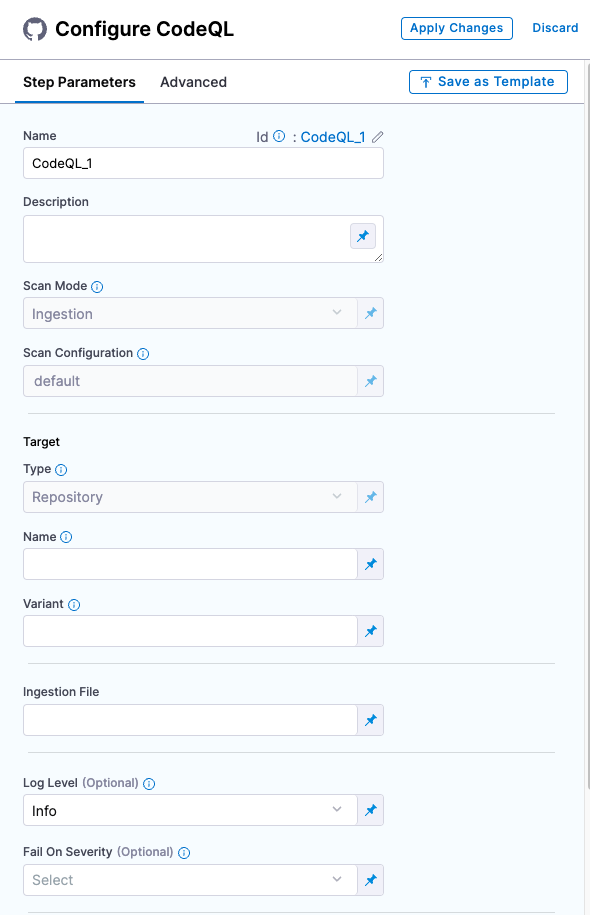
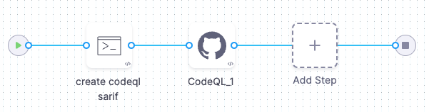

<!-- hiding this topic until the integration is ready to GA -->

You can scan your code repositories using [CodeQL](https://codeql.github.com/), an analysis engine used by developers to automate security checks, and by security researchers to perform variant analysis. 

The following steps outline the basic workflow:

1. Run a CodeQL scan, either externally or as part of a Run step, and publish the results to SARIF.

2. Add the SARIF data to your pipeline. If you ran the scan outside the pipeline, do the following:

   1. In the stage where you ingest the results, go to **Overview** > **Shared Paths** and create a folder under `/shared` such as `/shared/customer_artifacts`.

   2. Use a Run step to add your scan results to the shared folder.

2. Use a [CodeQL](#codeql-step-configuration) step to ingest the results. 

   
This topic includes an [end-to-end YAML pipeline](#yaml-pipeline-example) that illustrates this workflow. 

## Before you begin

<!-- 
### Docker-in-Docker requirements

```mdx-code-block
import StoDinDRequirements from '/docs/security-testing-orchestration/sto-techref-category/shared/dind-bg-step.md';
```

<StoDinDRequirements />

### Root access requirements

```mdx-code-block
import StoRootRequirements from '/docs/security-testing-orchestration/sto-techref-category/shared/root-access-requirements.md';
```

<StoRootRequirements />

-->

### Root access requirements

You need to run the scan step with root access if you need to add trusted certificates to your scan images at runtime. 

:::note

You can set up your STO scan images and pipelines to run scans as non-root and establish trust for your own proxies using self-signed certificates. For more information, go to [Configure STO to Download Images from a Private Registry](/docs/security-testing-orchestration/use-sto/set-up-sto-pipelines/download-images-from-private-registry).

:::

## CodeQL step configuration

The recommended workflow is to add a CodeQL step to a Security Tests or CI Build stage and then configure it as described below. You can also configure CodeQL scans programmatically by copying, pasting, and editing the [YAML definition](#yaml-configuration). 

```mdx-code-block
import StoScannerStepNotes from './shared/step_palette/_sto-palette-notes.md';
```

<StoScannerStepNotes />

<details>
    <summary>CodeQL Step Palette</summary>

 

</details>


### Scan Mode

```mdx-code-block
import StoSettingScanModeIngest from './shared/step_palette/_sto-ref-ui-scan-mode-02-ingestonly.md';
```

<StoSettingScanModeIngest />


### Scan Configuration

```mdx-code-block
import StoSettingProductConfigName from './shared/step_palette/_sto-ref-ui-product-config-name.md';
```

<StoSettingProductConfigName />


### Target


#### Type

```mdx-code-block
import StoSettingScanTypeRepo from './shared/step_palette/_sto-ref-ui-scan-type-00-repo.md';
```


<StoSettingScanTypeRepo />

#### Name 

```mdx-code-block
import StoSettingProductID from './shared/step_palette/_sto-ref-ui-prod-id.md';
```

<StoSettingProductID />

#### Variant

```mdx-code-block
import StoSettingTargetVariant from './shared/step_palette/_sto-ref-ui-target-variant.md';
```

<StoSettingTargetVariant  />


### Ingestion file

```mdx-code-block
import StoSettingIngestionFile from './shared/step_palette/_sto-ref-ui-ingestion-file.md';
```

<StoSettingIngestionFile  />


### Log Level, CLI flags, and Fail on Severity

<a name="log-level"></a>

#### Log Level

```mdx-code-block
import StoSettingLogLevel from './shared/step_palette/_sto-ref-ui-log-level.md';
```

<StoSettingLogLevel />

<a name="cli-flags"></a>

#### Additional CLI flags

```mdx-code-block
import StoSettingCliFlags from './shared/step_palette/_sto-ref-ui-cli-flags.md';
```

<StoSettingCliFlags />

<a name="fail-on-severity"></a>


#### Fail on Severity

```mdx-code-block
import StoSettingFailOnSeverity from './shared/step_palette/_sto-ref-ui-fail-on-severity.md';
```
<StoSettingFailOnSeverity />

### Settings

You can add a `tool_args` setting to run the [CodeQL scanner binary](https://codeql.github.com/docs/) with specific command-line arguments. <!-- For example, you can skip certain tests using  `-skip` followed by a list of test IDs: `tool_args` = `-skip testID_1, testID_3, testID_5` -->


### Additional Configuration

In the **Additional Configuration** settings, you can use the following options:

* [Privileged](/docs/continuous-integration/use-ci/manage-dependencies/background-step-settings#privileged)
* [Image Pull Policy](/docs/continuous-integration/use-ci/manage-dependencies/background-step-settings#image-pull-policy)
* [Run as User](/docs/continuous-integration/use-ci/manage-dependencies/background-step-settings#run-as-user)
* [Set Container Resources](/docs/continuous-integration/use-ci/manage-dependencies/background-step-settings#set-container-resources)


### Advanced settings

In the **Advanced** settings, you can use the following options:

* [Conditional Execution](/docs/platform/pipelines/w_pipeline-steps-reference/step-skip-condition-settings/)
* [Failure Strategy](/docs/platform/pipelines/w_pipeline-steps-reference/step-failure-strategy-settings/)
* [Looping Strategy](/docs/platform/pipelines/looping-strategies-matrix-repeat-and-parallelism/)
* [Policy Enforcement](/docs/platform/Governance/Policy-as-code/harness-governance-overview)


<!-- yaml pipeline example ----------------------------------------------------------------------------- -->


## CodeQL pipeline example

The following pipeline example is an ingestion workflow. It consists of two steps.  A Run step installs CodeQL, scans the repository defined in the Codebase object, and publishes the scan results to a SARIF file. A CodeQL step then ingests the SARIF file. 



```yaml

pipeline:
  projectIdentifier: STO
  orgIdentifier: default
  tags: {}
  stages:
    - stage:
        name: ingestion
        identifier: ingestion
        type: SecurityTests
        spec:
          cloneCodebase: false
          infrastructure:
            type: KubernetesDirect
            spec:
              connectorRef: my-harness-delegate
              namespace: harness-delegate-ng
              automountServiceAccountToken: true
              nodeSelector: {}
              os: Linux
          execution:
            steps:
              - step:
                  type: Run
                  name: create codeql sarif
                  identifier: create_codeql_sarif
                  spec:
                    connectorRef: DockerHub
                    image: alpine
                    shell: Sh
                    command: |-
                      pwd
                      echo '{
                          "$schema": "",
                          "version": "sarif-2.1.0",
                          "runs": [
                            {
                              "tool": {
                                "driver": {
                                  "name": "CodeQL",
                                  "version": "2.5.7",
                                  "semanticVersion": "2.5.7+1234567890",
                                  "informationUri": "https://github.com/github/codeql",
                                  "properties": {
                                    "analysisTarget": "myproject",
                                    "analysisTimestamp": "2023-04-03T14:00:00Z",
                                    "analysisDuration": 120000,
                                    "query": "detect-external-libs.ql",
                                    "queryUrl": "https://github.com/github/codeql/blob/master/javascript/ql/src/semmle/javascript/Security/CWE/CWE-094/ExternalLibraries.ql"
                                  }
                                }
                              },
                              "results": [
                                {
                                  "ruleId": "js/detect-external-libs",
                                  "message": {
                                    "text": "The following external libraries were found: jQuery, Lodash"
                                  },
                                  "locations": [
                                    {
                                      "physicalLocation": {
                                        "artifactLocation": {
                                          "uri": "/path/to/myproject/js/script.js"
                                        },
                                        "region": {
                                          "startLine": 10,
                                          "startColumn": 1,
                                          "endLine": 10,
                                          "endColumn": 15
                                        }
                                      }
                                    }
                                  ],
                                  "level": "warning",
                                  "properties": {
                                    "severity": "high",
                                    "confidence": "medium"
                                  }
                                }
                              ]
                            }
                          ]
                        }'> codeql.sarif
                      ls
              - step:
                  type: CodeQL
                  name: CodeQL_1
                  identifier: CodeQL_1
                  spec:
                    mode: ingestion
                    config: default
                    target:
                      name: login_microservice
                      type: repository
                      variant: my_hotfix_branch
                    advanced:
                      log:
                        level: info
                      fail_on_severity: critical
                    ingestion:
                      file: /harness/codeql.sarif
          sharedPaths:
            - /var/run
            - /shared/customer_artifacts/
  identifier: codeql_ingestion
  name: codeql ingestion 

```

<StoSettingYAMLexample />

<!-- END yaml pipeline example ----------------------------------------------------------------------------- -->

