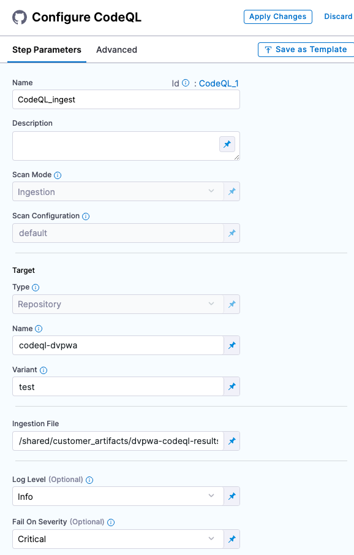

You can scan your code repositories using [CodeQL](https://codeql.github.com/), an analysis engine used by developers to automate security checks, and by security researchers to perform variant analysis. 


<!-- START step-palette-config ----------------------------------------------------------------------------- -->

## CodeQL step configuration

The recommended workflow is to add a CodeQL step to a Security Tests or CI Build stage and then configure it as described below. You can also configure CodeQL scans programmatically by copying, pasting, and editing the [YAML definition](#yaml-configuration). 

```mdx-code-block
import StoScannerStepNotes from './shared/step_palette/_sto-palette-notes.md';
```

<StoScannerStepNotes />

<details>
    <summary>Step Palette</summary>

 

</details>


### Scan Mode

```mdx-code-block
import StoSettingScanModeIngest from './shared/step_palette/_sto-ref-ui-scan-mode-02-ingestonly.md';
```


<StoSettingScanModeIngest />

<!-- ============================================================================= -->
<a name="scan-config"></a>

### Scan Configuration

```mdx-code-block
import StoSettingProductConfigName from './shared/step_palette/_sto-ref-ui-product-config-name.md';
```

<StoSettingProductConfigName />


### Target


<!-- ============================================================================= -->
<a name="target-type"></a>

#### Type

```mdx-code-block
import StoSettingScanTypeRepo from './shared/step_palette/_sto-ref-ui-scan-type-00-repo.md';
```


<StoSettingScanTypeRepo />


<!-- ============================================================================= -->
<a name="target-name"></a>

#### Name 

```mdx-code-block
import StoSettingProductID from './shared/step_palette/_sto-ref-ui-prod-id.md';
```

<StoSettingProductID />

<!-- ============================================================================= -->
<a name="target-variant"></a>

#### Variant

```mdx-code-block
import StoSettingTargetVariant from './shared/step_palette/_sto-ref-ui-target-variant.md';
```

<StoSettingTargetVariant  />

<!-- ============================================================================= -->
<a name="target-workspace"></a>

#### Workspace (_repository_)

```mdx-code-block
import StoSettingTargetWorkspace from './shared/step_palette/_sto-ref-ui-target-workspace.md';
```

<StoSettingTargetWorkspace  />


### Ingestion File

```mdx-code-block
import StoSettingIngestionFile from './shared/step_palette/_sto-ref-ui-ingestion-file.md';
```

<StoSettingIngestionFile  />


### Log Level, CLI flags, and Fail on Severity

<a name="log-level"></a>

#### Log Level

```mdx-code-block
import StoSettingLogLevel from './shared/step_palette/_sto-ref-ui-log-level.md';
```

<StoSettingLogLevel />

<a name="cli-flags"></a>

#### Additional CLI flags

```mdx-code-block
import StoSettingCliFlags from './shared/step_palette/_sto-ref-ui-cli-flags.md';
```

<StoSettingCliFlags />

<a name="fail-on-severity"></a>


#### Fail on Severity

```mdx-code-block
import StoSettingFailOnSeverity from './shared/step_palette/_sto-ref-ui-fail-on-severity.md';
```
<StoSettingFailOnSeverity />

### Settings

You can add a `tool_args` setting to run the [CodeQL scanner binary](https://pypi.org/project/CodeQL/1.0.1/) with specific command-line arguments. For example, you can skip certain tests using  `-skip` followed by a list of test IDs: `tool_args` = `-skip testID_1, testID_3, testID_5`


### Additional Configuration

In the **Additional Configuration** settings, you can use the following options:

* [Privileged](/docs/continuous-integration/use-ci/manage-dependencies/background-step-settings#privileged)
* [Image Pull Policy](/docs/continuous-integration/use-ci/manage-dependencies/background-step-settings#image-pull-policy)
* [Run as User](/docs/continuous-integration/use-ci/manage-dependencies/background-step-settings#run-as-user)
* [Set Container Resources](/docs/continuous-integration/use-ci/manage-dependencies/background-step-settings#set-container-resources)


### Advanced settings

In the **Advanced** settings, you can use the following options:

* [Conditional Execution](/docs/platform/pipelines/w_pipeline-steps-reference/step-skip-condition-settings/)
* [Failure Strategy](/docs/platform/pipelines/w_pipeline-steps-reference/step-failure-strategy-settings/)
* [Looping Strategy](/docs/platform/pipelines/looping-strategies-matrix-repeat-and-parallelism/)
* [Policy Enforcement](/docs/platform/Governance/Policy-as-code/harness-governance-overview)

<!-- END step-palette-config ----------------------------------------------------------------------------- -->


## Security step configuration (_deprecated_)
 

<details><summary>Set up a CodeQL scan in a Security step</summary>

You can set up a Security step with [CodeQL](https://CodeQL.readthedocs.io/en/latest/) to find common security issues in your Python code.


#### Scan policy types

STO supports the following policy\_type settings for CodeQL:

* `orchestratedScan`  — A Security step in the pipeline runs the scan and ingests the results. This is the easiest to set up and supports scans with default or predefined settings.
* `ingestionOnly` — Run the scan in a Run step, or outside the pipeline, and then ingest the results. This is useful for advanced workflows that address specific security needs. See [Ingest scan results into an STO pipeline](/docs/security-testing-orchestration/use-sto/orchestrate-and-ingest/ingest-scan-results-into-an-sto-pipeline).

#### Required Settings

* `product_name` = `CodeQL`
* `scan_type` = `repository`
* `product_config_name` = `default` — Run a CodeQL scan with the default settings.
* `repository_project` — The repository name. If you want to scan `https://github.com/my-github-account/codebaseAlpha`, for example, you would set this to `codebaseAlpha`.
* `repository_branch` — This tells CodeQL the Git branch to scan. You can specify a hardcoded string or use the runtime variable [`<+codebase.branch>`](/docs/continuous-integration/use-ci/codebase-configuration/built-in-cie-codebase-variables-reference#manual-branch-build-expressions). This sets the branch based on the user input or trigger payload at runtime.
* `fail_on_severity` - See [Fail on Severity](#fail-on-severity).

```mdx-code-block
import StoLegacyIngest from './shared/legacy/_sto-ref-legacy-ingest.md';
```

<StoLegacyIngest />

</details>


## YAML configuration

```mdx-code-block
import StoSettingYAMLexample from './shared/step_palette/_sto-ref-yaml-example.md';
```

<StoSettingYAMLexample />


