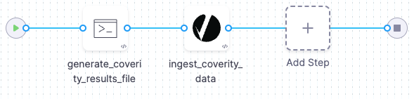

<DocsTag  text="Code repo scanners" backgroundColor= "#cbe2f9" textColor="#0b5cad"  link="/docs/security-testing-orchestration/sto-techref-category/security-step-settings-reference#code-repo-scanners"  />
<DocsTag  text="Ingestion" backgroundColor= "#e3cbf9" textColor="#5c0bad" link="/docs/security-testing-orchestration/get-started/key-concepts/ingest-scan-results-into-an-sto-pipeline" />
<br/>
<br/>

You can ingest scan results from [Coverity Scan](https://scan.coverity.com/) into Harness STO. 

## Important notes for running Coverity scans in STO

### Root access requirements


import StoRootRequirements from '/docs/security-testing-orchestration/sto-techref-category/shared/root-access-requirements.md';


<StoRootRequirements />

### For more information


import StoMoreInfo from '/docs/security-testing-orchestration/sto-techref-category/shared/_more-information.md';


<StoMoreInfo />


## Coverity step configuration

The following steps outline the recommended workflow:

1. Add a Build or Security stage to your pipeline.

2. Add a Run step to upload your Coverity scan results to the pipeline workspace. 

3. Add a Coverity step after the Run step and then configure it as described below.


### Scan


<a name="scan-mode"></a>

#### Scan Mode

import StoSettingScanMode from './shared/step_palette/scan/_type.md';
import StoSettingScanModeIngest from './shared/step_palette/scan/mode/_ingestion.md';

<StoSettingScanModeIngest />


#### Scan Configuration

import StoSettingProductConfigName from './shared/step_palette/scan/_config-name.md';

<StoSettingProductConfigName />


### Target


#### Type

import StoSettingScanType from './shared/step_palette/scan/_type.md';
import StoSettingScanTypeRepo     from './shared/step_palette/target/type/_repo.md';

<StoSettingScanType />
<StoSettingScanTypeRepo />


#### Target and variant detection 

import StoSettingScanTypeAutodetectRepo from './shared/step_palette/target/auto-detect/_code-repo.md';
import StoSettingScanTypeAutodetectNote from './shared/step_palette/target/auto-detect/_note.md';

<StoSettingScanTypeAutodetectRepo/>
<StoSettingScanTypeAutodetectNote/>


#### Name 

import StoSettingTargetName from './shared/step_palette/target/_name.md';


<StoSettingTargetName />

<a name="target-variant"></a>

#### Variant


import StoSettingTargetVariant from './shared/step_palette/target/_variant.md';


<StoSettingTargetVariant  />

<!-- 
#### Workspace (_repository_)


import StoSettingTargetWorkspace from './shared/step_palette/target/_workspace.md';


<StoSettingTargetWorkspace  />

-->

### Ingestion File


import StoSettingIngestionFile from './shared/step_palette/ingest/_file.md';


<StoSettingIngestionFile  /> 

<!--   Log Level, CLI flags, and Fail on Severity ------------------------------------------------------------------------------------------------- -->


<a name="log-level"></a>

### Log Level


import StoSettingLogLevel from './shared/step_palette/all/_log-level.md';


<StoSettingLogLevel />


### Fail on Severity


import StoSettingFailOnSeverity from './shared/step_palette/all/_fail-on-severity.md';


<StoSettingFailOnSeverity />


### Additional Configuration

In the **Additional Configuration** settings, you can use the following options:

* [Privileged](/docs/continuous-integration/use-ci/manage-dependencies/background-step-settings#privileged)
* [Image Pull Policy](/docs/continuous-integration/use-ci/manage-dependencies/background-step-settings#image-pull-policy)
* [Run as User](/docs/continuous-integration/use-ci/manage-dependencies/background-step-settings#run-as-user)
* [Set Container Resources](/docs/continuous-integration/use-ci/manage-dependencies/background-step-settings#set-container-resources)


### Advanced settings

In the **Advanced** settings, you can use the following options:

* [Conditional Execution](/docs/platform/pipelines/step-skip-condition-settings)
* [Failure Strategy](/docs/platform/pipelines/failure-handling/define-a-failure-strategy-on-stages-and-steps)
* [Looping Strategy](/docs/platform/pipelines/looping-strategies/looping-strategies-matrix-repeat-and-parallelism)
* [Policy Enforcement](/docs/platform/governance/policy-as-code/harness-governance-overview)

## YAML pipeline example

The following pipeline example illustrates an ingestion workflow. It consists of two steps:

* A Run step that generates a simple Coverity data file.
* A Coverity step that ingests the XML data.




```yaml
pipeline:
  name: coverity-example
  identifier: coverityexample
  projectIdentifier: STO
  orgIdentifier: default
  tags: {}
  stages:
    - stage:
        name: coverity-ingest
        identifier: coverityingest
        description: ""
        type: SecurityTests
        spec:
          cloneCodebase: false
          platform:
            os: Linux
            arch: Amd64
          runtime:
            type: Cloud
            spec: {}
          execution:
            steps:
              - step:
                  type: Run
                  name: generate_coverity_results_file
                  identifier: Run_1
                  spec:
                    shell: Sh
                    command: |-
                      cat <<EOF >> coverity-results.xml
                      <?xml version='1.0' encoding='UTF-8'?><!--Document generated on Wed Jun 28 15:27:21 GMT 2023-->
                      <cov:exportedProjectDefects xmlns:cov="http://coverity.com">
                          <cov:mergedDefect cid="153368" type="Resource leak" impact="High" status="New" firstDetected="10/24/15" owner="Unassigned" classification="Unclassified" severity="High" action="Undecided" displayComponent="Other" category="Resource leaks" file="/webgoat-container/src/main/java/org/owasp/webgoat/session/UserDatabase.java" function="UserDatabase.getUsers" checker="RESOURCE_LEAK" occurrenceCount="1" cwe="404" externalReference="" issueKind="Various" Language="Java" LineNumber="132" Score=""/>
                          <cov:mergedDefect cid="59180" type="Explicit null dereferenced" impact="Medium" status="New" firstDetected="09/20/14" owner="Unassigned" classification="Unclassified" severity="Medium" action="Undecided" displayComponent="Other" category="Null pointer dereferences" file="/webgoat-container/src/main/java/org/owasp/webgoat/session/WebgoatProperties.java" function="WebgoatProperties.main" checker="FORWARD_NULL" occurrenceCount="1" cwe="476" externalReference="" issueKind="Quality" Language="Java" LineNumber="143" Score=""/>
                      </cov:exportedProjectDefects>
                      EOF
              - step:
                  type: Coverity
                  name: ingest_coverity_data
                  identifier: ingest_coverity_data
                  spec:
                    mode: ingestion
                    config: default
                    target:
                      type: repository
                      name: coverity-test
                      variant: test
                    advanced:
                      log:
                        level: info
                    ingestion:
                      file: coverity-results.xml

```
