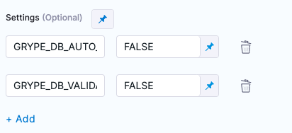

This topic describes how to set up Anchore Grype in an air-gapped. It is provided as a supplement to [Offline and air-gapped environments](https://github.com/anchore/grype#offline-and-air-gapped-environments) in the Grype documentation. 

## Important notes

To run Grype scans in an air-gapped environment, you need the following:

- A private registry or local file server for your local container images, Grype databases, support files, and other artifacts. You need a local web server so that you can request artifacts via HTTPS.

  Documentation about setting up a private registry is outside the scope of this topic. For more information, go to the documentation for the registry tool you want to use. One popular tool for airgapped environments is JFrog Artifactory; [this blog post](https://jfrog.com/blog/using-artifactory-with-an-air-gap/) provides a comprehensive overview. 

  <!-- TBD any other external tools we want to mention? I googled around for information about the other artifact repositories we support...Bamboo, Azure Artifacts, Nexus, etc....but didn't find a lot of info about running these tools in airgapped environments  -->

- After you set up your registry, you need to load local copies your Harness container images. For more information, go to [Configure STO to Download Images from a Private Registry](/docs/security-testing-orchestration/use-sto/set-up-sto-pipelines/download-images-from-private-registry).

- Set up Grype per [Offline and air-gapped environments](https://github.com/anchore/grype#offline-and-air-gapped-environments) in the Grype documentation. 

## Initial setup

Grype maintains a database of known vulnerabilities and uses this database to detect issues when it scans a target. By default, Grype downloads the latest database from a public URL when it runs a scan. If the local database is stale, the scan fails.  

The Grype container image provided by Harness includes the latest database at the time the image was build. As part of the initial setup, you will configure Grype to use the local database and override (temporarily) the default stable-database check.

1. Install the Grype scanner in your airgapped environment. For more information, go to [Installation](https://github.com/anchore/grype#installation) in the Grype documentation.  

2. Add a CI Build or Security Tests stage to your Harness pipeline.

3. Set up a [Grype step](/docs/security-testing-orchestration/sto-techref-category/grype/grype-scanner-reference) in the stage. 

4. Add the following settings to the Grype step:

   1. `GRYPE_DB_AUTO_UPDATE` = `FALSE` Disables downloading a new database.
   2. `GRYPE_DB_VALIDATE_AGE` = `FALSE` Disables the staleness check for the database.

   

5. Run the pipeline and confirm that the local Grype scanner runs correctly.

## Production setup

1. To run Grype in a production environment, you need to set up a mechanism to transfer the latest Grype vulnerability database to your local environment. The following steps outline the basic workflow.

   1. Install the Grype scanner in an online environment. You need this to download the latest databases from Grype. 
      For more information, go to [Installation](https://github.com/anchore/grype#installation) in the Grype documentation.  
   
   2. Add a copy of the latest Grype database to your local registry: 
      1. Request the current list of databases from the Grype server (_online CLI_): `grype db list`  
      2. Download the latest archive and transfer it to your local registry.    
   
   3. Set up a copy of `listing.json` in your local registry. This file specifies the local Grype databases available for running scans.
      1. Download a copy of the [`listing.json`](https://github.com/anchore/grype/blob/main/grype/db/test-fixtures/listing.json) and upload it to your local registry.  
      2. Delete the `2` entry and update the `1` entry with the  `"built"`, `"url"`, and `"checksum"` of your local database.  
   
   4. Add this setting to your Grype step: 

      `GRYPE_DB_UPDATE_URL` = The URL to the `listing.json` in your local registry, for example `http://my-local-registry:<PORT_NUMBER>/grype-dbs/listing.json`

      When you run a scan with this setup, Grype uses the most recent database specified in `listing.json`.

   5. Run the pipeline again and verify that the Grype step runs as intended.     

2. Before your Grype step is "production-ready," you need to configure the Grype scanner to check the database build time and fail the scan if the database is out of date. To enable the staleness check, set the following settings in the Grype step as follows:

   1. `GRYPE_DB_VALIDATE_AGE` = `TRUE` Enables the staleness check for the database. (You added this setting as part of the [initial setup](#initial-setup).)
   2. `GRYPE_DB_MAX_ALLOWED_BUILT_AGE` = The maximum allowable age of a database before it is considered stale and the Grype scan fails. Specify the age using [golang's time duration syntax](https://pkg.go.dev/time#ParseDuration). Valid examples include `24h` (one day) and `120h` (five days). 

   <!-- TBD how often does Grype update these databases? Is there a "good" time window we can specify as a default? -->

## Update the database (ongoing)

When you run Grype in an air-gapped environment, you must update the database regularly to ensure that your scans check for the most up-to-date vulnerabilities. 

To update your system to use the latest database:

   1. Add a copy of the latest Grype database to your local registry: 
      1. Request the current list of databases from the Grype server (_online CLI_): `grype db list`  
      2. Download the latest archive and transfer it to your local registry.
   2. Update the `listing.json` file in your local registry: add a new entry for the new database and update it with the `"built"`, `"url"`, and `"checksum"` values of your new database.  
 
